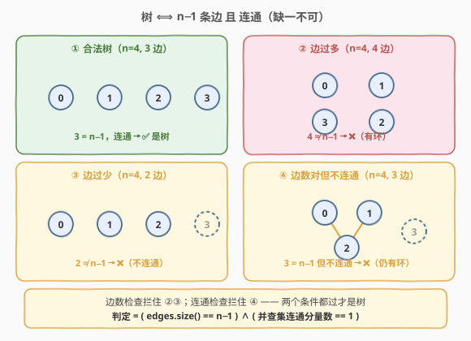
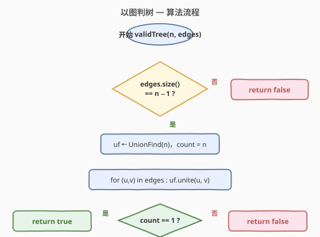
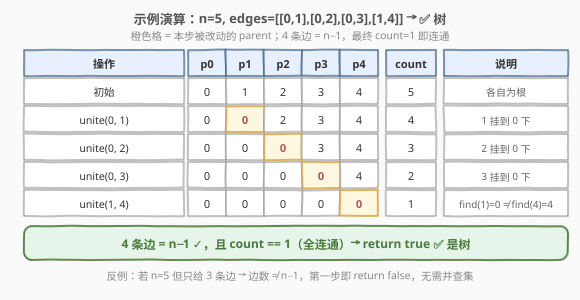

# 以图判树

- **题目名称**：以图判树
- **链接**：[261. 以图判树](https://leetcode.cn/problems/graph-valid-tree/)
- **难度**：中等
- **标签**：并查集、图、树、深度优先搜索

## 1. 题目概述

给你 `n` 个节点，编号从 `0` 到 `n - 1`，以及一个无向边列表 `edges`（其中 `edges[i] = [ai, bi]` 表示节点 `ai` 与 `bi` 之间有一条无向边）。请判断这些边能否构成一棵**合法的树**。若能返回 `true`，否则返回 `false`。

> 回顾：一棵树是**连通且无环**的无向图。等价地，`n` 个节点的树恰有 `n − 1` 条边，且**任意两点之间恰有一条路径**。

**示例 1**：

```text
输入：n = 5, edges = [[0,1],[0,2],[0,3],[1,4]]
输出：true
解释：5 个节点 4 条边，整体连通且无环，构成一棵以 0 为根的合法树。
```

**示例 2**：

```text
输入：n = 5, edges = [[0,1],[1,2],[2,3],[1,3],[1,4]]
输出：false
解释：边 (1,3) 与已有路径 1→2→3 形成环 1—2—3—1，故不是树。
```

**约束条件**：

- `0 <= n <= 2000`
- `0 <= edges.length <= 5000`
- `edges[i].length == 2`
- `0 <= ai, bi < n`
- `ai != bi`
- 无重复边

---

## 2. 解题思路

### 2.1 暴力思路

直接按定义三选一验证「连通 + 无环」：建邻接表后做一次 DFS 判连通（一次遍历能否访问全部 `n` 个节点），同时用「`n` 个节点、访问过程中遇到已访问的非父节点即成环」判环。时间 $O(n + |E|)$，空间 $O(n + |E|)$。能过，但**没有提炼出「树 = 边数 + 连通」这条最干净的判定**——下面用并查集把两个条件一次性刻画出来。

### 2.2 核心观察：树 ⟺ n−1 条边 且 连通



`n` 个节点的无向图是树，当且仅当**同时**满足：

1. **边数恰为 $n − 1$**（必要条件：连通图至少需 $n−1$ 条边，无环图至多 $n−1$ 条边）；
2. **图是连通的**（即只有一个连通分量）。

这两个条件互为补充，缺一不可：

- 边数 $\ne n−1$：要么边太少（必不连通），要么边太多（必有环）——**第一步边数检查即可一票否决**；
- 边数 $= n−1$ 但不连通：边被「堆」在某个分量里形成环，孤立分量却缺边——**必须再查连通性**才能识破。

> 💡 关键直觉：当边数恰好 $n−1$ 时，「连通」与「无环」**二选一成立即可推得另一个**——连通的 $n−1$ 边图必无环，无环的 $n−1$ 边图必连通。所以只需验证「边数 $= n−1$」+「连通」两点，无需单独判环。这与 [684. 冗余连接](../0601-0700/684_冗余连接.md) 的「加边时两端已同根即成环」是同一套并查集模板的两种用法：684 抓**冲突边**，本题数**连通分量**。

并查集天然适合「数连通分量」：初始 `count = n`，每次成功 `unite` 两点就 `count −−`，最终 `count == 1` 即整图连通。模板与 [547. 省份数量](../0501-0600/547_省份数量.md) 完全一致。

> ⚠️ 边界 `n = 0`：空图按定义算作一棵空树，本题约束下 `n = 0` 时 `edges` 也为空，`edges.size() == n − 1` 即 `0 == −1` 不成立会误判为 `false`。需单独处理 `n == 0` 返回 `true`（或视题目约定；多数实现把 `n ≤ 0` 视作空树）。

### 2.3 算法流程图



### 2.4 示例演算



以 `n = 5, edges = [[0,1],[0,2],[0,3],[1,4]]` 为例：

- 第一步：`edges.size() == 4 == n − 1` ✓，通过边数检查，进入连通性判定。
- 初始化 `parent = [0,1,2,3,4]`，`count = 5`。
- `unite(0,1)`：`find(0)=0`、`find(1)=1`，不同根 → `parent[1]=0`，`count=4`。
- `unite(0,2)`：`find(2)=2` ≠ `find(0)=0` → `parent[2]=0`，`count=3`。
- `unite(0,3)`：`find(3)=3` ≠ `0` → `parent[3]=0`，`count=2`。
- `unite(1,4)`：`find(1)=0`（沿 `parent[1]` 上溯到根 0）、`find(4)=4`，不同根 → `parent[4]=0`，`count=1`。
- 最终 `count == 1` → 全图连通 → 返回 `true`。

四条边把五个节点全串到根 0 下，无环也无孤立分量，是合法树。

---

## 3. 参考代码

### C++（边数检查 + 并查集判连通）

```cpp
class UnionFind {
  public:
    vector<int> parent;
    vector<int> rank_;
    int count;

    UnionFind(int n) : count(n) {
        parent.resize(n);
        rank_.assign(n, 0);
        for (int i = 0; i < n; i++) parent[i] = i;
    }

    int find(int x) {
        if (parent[x] != x) parent[x] = find(parent[x]);   // 路径压缩
        return parent[x];
    }

    void unite(int x, int y) {
        int rx = find(x), ry = find(y);
        if (rx == ry) return;                               // 已同根，跳过
        if (rank_[rx] < rank_[ry]) parent[rx] = ry;        // 按秩合并
        else if (rank_[rx] > rank_[ry]) parent[ry] = rx;
        else { parent[ry] = rx; rank_[rx]++; }
        count--;                                            // 成功合并，分量数 -1
    }
};

class Solution {
  public:
    bool validTree(int n, vector<vector<int>>& edges) {
        if (n == 0) return true;                           // 空图视作空树
        if ((int)edges.size() != n - 1) return false;      // 必要条件：树恰有 n-1 条边
        UnionFind uf(n);
        for (auto& e : edges) uf.unite(e[0], e[1]);
        return uf.count == 1;                              // n-1 边 + 连通 = 无环 = 树
    }
};
```

### Python（边数检查 + 并查集判连通）

```python
class Solution:
    def validTree(self, n: int, edges: List[List[int]]) -> bool:
        if n == 0:
            return True
        if len(edges) != n - 1:                            # 必要条件：树恰有 n-1 条边
            return False
        parent = list(range(n))
        rank_ = [0] * n
        count = n

        def find(x):
            while parent[x] != x:
                parent[x] = parent[parent[x]]              # 隔代压缩
                x = parent[x]
            return x

        for u, v in edges:
            ru, rv = find(u), find(v)
            if ru == rv:
                continue                                   # 已同根，跳过
            if rank_[ru] < rank_[rv]:
                parent[ru] = rv
            elif rank_[ru] > rank_[rv]:
                parent[rv] = ru
            else:
                parent[rv] = ru
                rank_[ru] += 1
            count -= 1                                     # 成功合并，分量数 -1
        return count == 1                                  # n-1 边 + 连通 = 无环 = 树
```

---

## 4. 复杂度分析

| 维度 | 复杂度 | 说明 |
|------|--------|------|
| 时间复杂度 | $O(n + |\text{edges}| \, \alpha(n))$ | 边数检查 $O(1)$；并查集处理 $|\text{edges}|$ 条边，每条两次 `find` + 至多一次 `union`，均摊 $O(\alpha(n))$ |
| 空间复杂度 | $O(n)$ | `parent` 与 `rank` 数组各 $O(n)$ |

> 💡 本题 $|\text{edges}| = n − 1$（通过边数检查后），故总时间实际为 $O(n \, \alpha(n))$，$\alpha(n) \le 5$ 视作常数即 $O(n)$。边数检查让「边数 $\ne n−1$」的用例在 $O(1)$ 内直接淘汰，无需建并查集。

---

## 5. 扩展：纯并查集判环 + 连通（不做边数预检）

去掉边数预检，让并查集同时扛「判环」与「判连通」两职：逐条 `unite`，若某条边两端**已同根**说明成环 → 直接 `return false`；全部加完后查 `count == 1` 判连通。这是 684（抓冲突边）与 547（数分量）两套用法的合体，更通用但多做了无用功（边数 $\ne n−1$ 时仍要扫完所有边）。

```cpp
class Solution {
  public:
    bool validTree(int n, vector<vector<int>>& edges) {
        if (n == 0) return true;
        vector<int> parent(n), rank_(n, 0);
        int count = n;
        for (int i = 0; i < n; i++) parent[i] = i;
        function<int(int)> find = [&](int x) {
            if (parent[x] != x) parent[x] = find(parent[x]);
            return parent[x];
        };
        for (auto& e : edges) {
            int ru = find(e[0]), rv = find(e[1]);
            if (ru == rv) return false;                    // 加边时已同根 → 成环
            if (rank_[ru] < rank_[rv]) parent[ru] = rv;
            else if (rank_[ru] > rank_[rv]) parent[rv] = ru;
            else { parent[rv] = ru; rank_[ru]++; }
            count--;
        }
        return count == 1;                                 // 全连通才是一棵树
    }
};
```

> ⚠️ 注意纯并查集版**不能省去最后的 `count == 1`**：若图断成多个无环分量（边数 $< n−1$），全程不会触发「已同根」的环判定，必须靠连通分量数收口——这正是「边数检查版」用 `edges.size() != n − 1` 提前挡掉的同一类反例。两种写法等价，只是分工不同：一个把「边数」交给 $O(1)$ 检查、把「连通」交给并查集；另一个把「无环」与「连通」都交给并查集。

---

## 6. 面试要点

1. **为什么「边数 == n−1 且连通」就一定是树？**

   - 连通图至少需 $n−1$ 条边，无环图至多 $n−1$ 条边。当边数恰好 $n−1$ 时，「连通」与「无环」互为充要：连通的 $n−1$ 边图不可能再含环（环会多出一条边），无环的 $n−1$ 边图不可能不连通（不连通意味着某分量边数不足，总数会 $< n−1$）。所以两个条件一加即得树，无需单独判环。

2. **边数预检相比纯并查集有什么好处？**

   - 一是 $O(1)$ 淘汰掉「边数 $\ne n−1$」的大量反例，省去建并查集的开销；二是把问题拆成「必要条件 + 充分补足」两层，逻辑更清晰——边数管「无环」的下界与上界，并查集只负责确认「连通」。两者结果完全等价。

3. **为什么并查集的 `count` 要在 `unite` 成功时 `−−`，而不是最后数 `parent[i] == i`？**

   - 路径压缩后 `parent[i] == i` 的仍是根，数根也正确；但维护 `count` 在每次成功合并时减一，最后直接返回，省一次 $O(n)$ 扫描，且语义清晰（「合并一次少一个分量」）。与 547 的写法一致。

4. **`n = 0` 为什么要单独返回 `true`？**

   - 空图按定义是一棵空树，但 `edges.size() == n − 1` 即 `0 == −1` 会误判为 `false`。这是「用减法做边界检查」常见的 off-by-one 陷阱，单独兜底最稳妥。

5. **本题与 684 冗余连接、547 省份数量的并查集用法有何异同？**

   - 三者共用同一套 `find` + `unite` + 路径压缩 + 按秩合并模板。区别在**用法**：547 数成功合并次数得**连通分量数**；684 捕获**第一次 `unite` 失败**（已同根）定位冗余边；261 把两者合一——先靠边数挡掉「无环」反例，再用分量数确认「连通」。模板复用是并查集题的核心收益。

---

## 7. 同类练习题

- [547. 省份数量](https://leetcode.cn/problems/number-of-provinces/)（[题解](../0501-0600/547_省份数量.md)）：同一并查集模板数连通分量，是本题连通性判定的母题
- [684. 冗余连接](https://leetcode.cn/problems/redundant-connection/)（[题解](../0601-0700/684_冗余连接.md)）：并查集加边判环，`unite` 失败即冗余边，与本题「无环」判定对照
- [1319. 连通网络的操作次数](https://leetcode.cn/problems/number-of-operations-to-make-network-connected/)：并查集数连通分量，求最少冗余线缆数使其连通成树
- [323. 无向图中连通分量的数目](https://leetcode.cn/problems/number-of-connected-components-in-an-undirected-graph/)：本题的「只数分量、不判树」版本，并查集直接返回 `count`
- [1361. 验证二叉树](https://leetcode.cn/problems/validate-binary-tree-nodes/)：把无向图换成「左儿子/右儿子」的有根树判定，需额外校验每个节点入度 ≤ 1 且单根，是本题的有向变体
