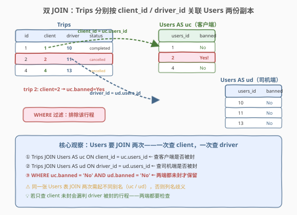
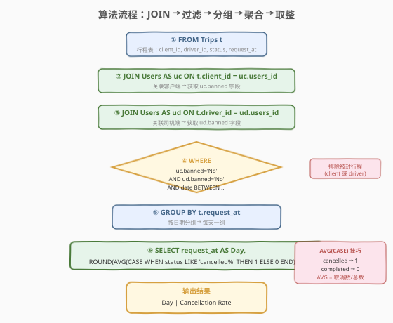
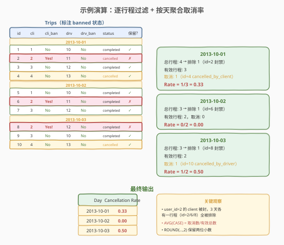

# 行程和用户

- **题目名称**：行程和用户
- **链接**：[262. 行程和用户](https://leetcode.cn/problems/trips-and-users/)
- **难度**：困难
- **标签**：SQL、多表 JOIN、聚合、CASE WHEN

## 1. 题目概述

给定 `Trips`（行程）和 `Users`（用户）两张表，编写 SQL 查询，找出 **2013-10-01 至 2013-10-03** 期间，**客户端和司机端均未被封禁** 的行程中，每天的 **取消率**（取消行程数 / 有效行程总数），结果保留两位小数。

**表结构**：

```text
Table: Trips
+-------------+----------+
| Column Name | Type     |
+-------------+----------+
| id          | int      |  ← 主键
| client_id   | int      |  ← 外键 → Users.users_id
| driver_id   | int      |  ← 外键 → Users.users_id
| city_id     | int      |
| status      | enum     |  ← ('completed','cancelled_by_driver','cancelled_by_client')
| request_at  | varchar  |  ← 日期字符串 'YYYY-MM-DD'
+-------------+----------+

Table: Users
+-------------+----------+
| Column Name | Type     |
+-------------+----------+
| users_id    | int      |  ← 主键
| banned      | enum     |  ← ('Yes','No')
| role        | enum     |  ← ('client','driver','partner')
+-------------+----------+
```

> 💡 **关键约束**：`client_id` 和 `driver_id` 都是指向 `Users.users_id` 的外键——**同一张 Users 表要被关联两次**，一次查客户端封禁状态，一次查司机端封禁状态。只有**两端都未封禁**（`banned = 'No'`）的行程才计入分母。

**示例 1**：

```text
输入：
Trips 表:
+----+-----------+-----------+---------+---------------------+------------+
| id | client_id | driver_id | city_id | status              | request_at |
+----+-----------+-----------+---------+---------------------+------------+
| 1  | 1         | 10        | 1       | completed           | 2013-10-01 |
| 2  | 2         | 11        | 1       | cancelled_by_driver | 2013-10-01 |
| 3  | 3         | 12        | 6       | completed           | 2013-10-01 |
| 4  | 4         | 13        | 6       | cancelled_by_client | 2013-10-01 |
| 5  | 1         | 10        | 1       | completed           | 2013-10-02 |
| 6  | 2         | 11        | 6       | completed           | 2013-10-02 |
| 7  | 3         | 12        | 6       | completed           | 2013-10-02 |
| 8  | 2         | 12        | 12      | completed           | 2013-10-03 |
| 9  | 3         | 10        | 12      | completed           | 2013-10-03 |
| 10 | 4         | 13        | 12      | cancelled_by_driver | 2013-10-03 |
+----+-----------+-----------+---------+---------------------+------------+
Users 表:
+----------+--------+--------+
| users_id | banned | role   |
+----------+--------+--------+
| 1        | No     | client |
| 2        | Yes    | client |  ← 被封禁！
| 3        | No     | client |
| 4        | No     | client |
| 10       | No     | driver |
| 11       | No     | driver |
| 12       | No     | driver |
| 13       | No     | driver |
+----------+--------+--------+
输出：
+------------+-------------------+
| Day        | Cancellation Rate |
+------------+-------------------+
| 2013-10-01 | 0.33              |
| 2013-10-02 | 0.00              |
| 2013-10-03 | 0.50              |
+------------+-------------------+
```

**解释**：

- **2013-10-01**：共 4 条行程，其中 id=2 的 client（user_id=2）被封禁 → 排除。剩余 3 条有效行程中 1 条取消（id=4），取消率 = 1/3 = 0.33
- **2013-10-02**：共 3 条行程，其中 id=6 的 client（user_id=2）被封禁 → 排除。剩余 2 条有效行程中 0 条取消，取消率 = 0/2 = 0.00
- **2013-10-03**：共 3 条行程，其中 id=8 的 client（user_id=2）被封禁 → 排除。剩余 2 条有效行程中 1 条取消（id=10），取消率 = 1/2 = 0.50

**约束条件**：

- `id` / `users_id` 为各自表的主键
- `client_id` 和 `driver_id` 是指向 `Users.users_id` 的外键
- `status` 枚举值：`completed`、`cancelled_by_driver`、`cancelled_by_client`
- `banned` 枚举值：`Yes`、`No`
- 只输出至少有一条有效行程的日期

> 💡 本题是 SQL **多表 JOIN + 条件聚合**的经典 Hard 题。核心难点有二：① 同一张 `Users` 表要 JOIN **两次**（client 一次、driver 一次），需起不同别名；② 用 `AVG(CASE WHEN ...)` 把"取消数 / 总数"优雅地压缩成一次聚合。

---

## 2. 解题思路

### 2.1 暴力思路：逐行扫描

最直觉的做法是用过程式语言逐行扫描 `Trips`：对每条行程，查 `Users` 表确认 client 和 driver 是否被封禁，若都未封禁则计入当天统计。但**纯 SQL 没有循环语句**——SQL 的思维是"集合操作"，需要把"行间关联"转换为"表连接"。

> ⚠️ 本题的实质是：① 用 JOIN 把 `Users` 的 `banned` 字段"搬运"到 `Trips` 的每一行上（client 一列、driver 一列）；② 用 `WHERE` 过滤掉任一端被封的行程；③ 用 `GROUP BY` 按天分组后做条件聚合。

### 2.2 核心观察：Users 要 JOIN 两次 + AVG(CASE) 一步算取消率



**关键洞察 1——双 JOIN**：

`Trips` 表的 `client_id` 和 `driver_id` 都指向 `Users.users_id`。要同时获取 client 和 driver 的 `banned` 状态，必须把 `Users` 表 JOIN **两次**，分别起别名 `uc`（client 端）和 `ud`（driver 端）：

$$\text{Trips} \bowtie_{\text{client\_id = uc.users\_id}} \text{Users}_{uc} \bowtie_{\text{driver\_id = ud.users\_id}} \text{Users}_{ud}$$

- `JOIN Users AS uc ON t.client_id = uc.users_id`：把 client 的 `banned` 字段附加到每条行程
- `JOIN Users AS ud ON t.driver_id = ud.users_id`：把 driver 的 `banned` 字段附加到每条行程
- `WHERE uc.banned = 'No' AND ud.banned = 'No'`：两端都未封才保留

> ⚠️ **为何不能只 JOIN 一次？** 若只 JOIN 一次 `Users`，只能查到 client 或 driver 其中一端的封禁状态，无法同时过滤两端。同一张表 JOIN 多次时**必须起不同别名**（`uc` / `ud`），否则 `banned` 列名歧义，SQL 引擎无法区分是 client 还是 driver 的。

**关键洞察 2——AVG(CASE) 一步算取消率**：

取消率 = 取消数 / 总数。常规写法是 `SUM(CASE WHEN cancelled THEN 1 ELSE 0 END) / COUNT(*)`，但 `AVG(CASE WHEN cancelled THEN 1 ELSE 0 END)` 更简洁——把"取消"映射为 1、"完成"映射为 0，`AVG` 天然就是"1 的占比"即取消率：

$$\text{Cancellation Rate} = \frac{\sum \mathbb{1}[\text{cancelled}]}{N} = \text{AVG}\big(\mathbb{1}[\text{cancelled}]\big)$$

### 2.3 算法流程图



### 2.4 示例演算

以示例数据为例，逐行程标注 banned 状态后过滤，再按天聚合取消率：



| 日期 | 总行程 | 排除（client 封禁） | 有效行程 | 取消数 | 取消率 |
|------|--------|---------------------|----------|--------|--------|
| 2013-10-01 | 4 | 1（id=2, user_id=2） | 3 | 1（id=4） | 1/3 = 0.33 |
| 2013-10-02 | 3 | 1（id=6, user_id=2） | 2 | 0 | 0/2 = 0.00 |
| 2013-10-03 | 3 | 1（id=8, user_id=2） | 2 | 1（id=10） | 1/2 = 0.50 |

> 💡 **user_id=2 是唯一的被封禁 client**，三天的行程 id=2/6/8 都因它被排除。注意 id=2 本身是 `cancelled_by_driver`——虽然被排除的原因是 client 被封而非 status，但它如果不被排除也会计入取消数。过滤优先于聚合：**先 WHERE 再 GROUP BY**。

---

## 3. 参考代码

### SQL（解法 A：双 JOIN + AVG(CASE)，推荐）

```sql
SELECT 
    t.request_at AS Day,
    ROUND(
        AVG(CASE WHEN t.status LIKE 'cancelled%' THEN 1 ELSE 0 END),
        2
    ) AS `Cancellation Rate`
FROM Trips t
JOIN Users uc ON t.client_id = uc.users_id
JOIN Users ud ON t.driver_id = ud.users_id
WHERE uc.banned = 'No' 
  AND ud.banned = 'No'
  AND t.request_at BETWEEN '2013-10-01' AND '2013-10-03'
GROUP BY t.request_at;
```

> 💡 **写法要点**：
> - **双 JOIN**：`Trips` 分别按 `client_id`、`driver_id` 关联 `Users` 两份副本 `uc` / `ud`，把两端的 `banned` 字段都搬上行。
> - **AVG(CASE)**：`cancelled` → 1、`completed` → 0，`AVG` 天然就是"1 的占比" = 取消率，比 `SUM/COUNT` 更简洁。
> - **`LIKE 'cancelled%'`**：同时匹配 `cancelled_by_driver` 和 `cancelled_by_client`。等价写法：`status IN ('cancelled_by_driver', 'cancelled_by_client')` 或 `status != 'completed'`。
> - **反引号**：列名 `Cancellation Rate` 含空格，MySQL 中需用 `` ` `` 包裹。
> - **INNER JOIN 天然过滤**：若某 `client_id` 在 `Users` 中不存在（外键完整性破坏），INNER JOIN 会自动排除该行。

### SQL（解法 B：双 JOIN + SUM/COUNT，显式写法）

```sql
SELECT 
    t.request_at AS Day,
    ROUND(
        SUM(CASE WHEN t.status LIKE 'cancelled%' THEN 1 ELSE 0 END) / COUNT(*),
        2
    ) AS `Cancellation Rate`
FROM Trips t
JOIN Users uc ON t.client_id = uc.users_id
JOIN Users ud ON t.driver_id = ud.users_id
WHERE uc.banned = 'No' 
  AND ud.banned = 'No'
  AND t.request_at BETWEEN '2013-10-01' AND '2013-10-03'
GROUP BY t.request_at;
```

> 💡 与解法 A 等价，只是把 `AVG(CASE...)` 拆成 `SUM(CASE...) / COUNT(*)`，语义更直白。MySQL 中 `SUM(DECIMAL) / COUNT(BIGINT)` 返回 DECIMAL，不会发生整数截断。若数据库有整数除法陷阱（如 PostgreSQL 的 `int / int = int`），需 `CAST` 或乘 `1.0`。

### SQL（解法 C：NOT IN 子查询，免 JOIN）

```sql
SELECT 
    request_at AS Day,
    ROUND(
        AVG(CASE WHEN status LIKE 'cancelled%' THEN 1 ELSE 0 END),
        2
    ) AS `Cancellation Rate`
FROM Trips
WHERE client_id NOT IN (SELECT users_id FROM Users WHERE banned = 'Yes')
  AND driver_id NOT IN (SELECT users_id FROM Users WHERE banned = 'Yes')
  AND request_at BETWEEN '2013-10-01' AND '2013-10-03'
GROUP BY request_at;
```

> 💡 不用 JOIN，改用 `NOT IN` 子查询排除被封禁的 user_id。语义清晰——"client 和 driver 都不在封禁名单中"。但子查询可能执行多次，性能通常不如 JOIN。注意 `NOT IN` 的 NULL 陷阱：若子查询结果含 `NULL`，`x NOT IN (1, NULL)` 恒为 `UNKNOWN`，会过滤掉所有行（详见第 5 节）。本题 `users_id` 是主键非空，无此问题。

### Python（pandas）

```python
import pandas as pd

def trips_and_users(trips: pd.DataFrame, users: pd.DataFrame) -> pd.DataFrame:
    banned_ids = set(users[users['banned'] == 'Yes']['users_id'])
    mask = (
        ~trips['client_id'].isin(banned_ids) &
        ~trips['driver_id'].isin(banned_ids) &
        trips['request_at'].between('2013-10-01', '2013-10-03')
    )
    valid = trips[mask].copy()
    valid['cancelled'] = valid['status'].str.startswith('cancelled').astype(int)
    result = (
        valid.groupby('request_at')['cancelled']
        .mean()
        .round(2)
        .reset_index()
    )
    result.columns = ['Day', 'Cancellation Rate']
    return result
```

> 💡 **pandas 对照**：`isin(banned_ids)` 对应 SQL 的 `NOT IN (SELECT ... WHERE banned='Yes')`；`~` 取反对应 `NOT`；`str.startswith('cancelled')` 对应 `LIKE 'cancelled%'`；`groupby + mean` 对应 `GROUP BY + AVG`；`round(2)` 对应 `ROUND(..., 2)`。

---

## 4. 复杂度分析

| 维度 | 复杂度 | 说明 |
|------|--------|------|
| **时间（解法 A/B 双 JOIN）** | $O(n)$ | $n$ = Trips 行数。两次 JOIN 在 `users_id` 有索引时为 $O(n)$（嵌套循环连接 + 索引查找）；`GROUP BY` 排序 $O(n \log n)$，若 `request_at` 有索引可降为 $O(n)$ |
| **时间（解法 C NOT IN）** | $O(n \times m)$ | $m$ = 被封禁用户数。子查询结果集小但每行 Trips 需检查两次 `NOT IN`，最坏 $O(n \times m)$；若子查询被优化为半连接（Semi-Join）则降为 $O(n)$ |
| **空间** | $O(n)$ | JOIN 中间结果集 + GROUP BY 排序缓冲区 |

> ⚠️ SQL 复杂度取决于**执行计划**：JOIN 在有索引时近似 $O(n)$，无索引退化为 $O(n^2)$（Nested Loop）。面试中说明"双 JOIN 依赖 `users_id` 索引、`GROUP BY` 需排序"即可。生产环境应在 `Users.users_id`（主键，天然有索引）和 `Trips.client_id` / `driver_id` 上建索引。

---

## 5. 扩展

### 5.1 NOT IN 的 NULL 陷阱

解法 C 用了 `NOT IN (SELECT users_id FROM Users WHERE banned = 'Yes')`。SQL 三值逻辑中，`x NOT IN (a, b, NULL)` 等价于 `x != a AND x != b AND x != NULL`，而 `x != NULL` 恒为 `UNKNOWN`，导致整个表达式为 `UNKNOWN`，**所有行都被过滤**。

本题 `users_id` 是主键、非空，子查询结果不含 `NULL`，所以安全。但若列可能为 `NULL`，应改用 `NOT EXISTS`：

```sql
WHERE NOT EXISTS (
    SELECT 1 FROM Users u 
    WHERE u.users_id = Trips.client_id AND u.banned = 'Yes'
)
```

> 💡 `NOT EXISTS` 不受 NULL 影响——它只判断子查询是否返回行，不做值比较。是 `NOT IN` 的安全替代品。

### 5.2 INNER JOIN vs LEFT JOIN 的天然过滤

本题用 INNER JOIN，若某 `client_id` 在 `Users` 中不存在（外键完整性破坏），该行自动被排除。若改用 LEFT JOIN，则需手动处理 `NULL`：

```sql
-- LEFT JOIN 版（需额外判 NULL）
SELECT t.request_at AS Day,
       ROUND(AVG(CASE WHEN t.status LIKE 'cancelled%' THEN 1 ELSE 0 END), 2) AS `Cancellation Rate`
FROM Trips t
LEFT JOIN Users uc ON t.client_id = uc.users_id
LEFT JOIN Users ud ON t.driver_id = ud.users_id
WHERE (uc.banned = 'No' OR uc.banned IS NULL)
  AND (ud.banned = 'No' OR ud.banned IS NULL)
  AND t.request_at BETWEEN '2013-10-01' AND '2013-10-03'
GROUP BY t.request_at;
```

> 💡 INNER JOIN 的 WHERE 条件 `banned = 'No'` 自动过滤掉 `NULL`（`NULL = 'No'` 为 `UNKNOWN`），比 LEFT JOIN 更简洁。本题外键完整，INNER JOIN 是正确选择。

### 5.3 request_at 为 varchar 的日期处理

`request_at` 是 `varchar(50)` 而非 `DATE` 类型。`BETWEEN '2013-10-01' AND '2013-10-03'` 依赖**字符串字典序**——`'YYYY-MM-DD'` 格式恰好使字典序等于日期序，所以比较结果正确。但若日期格式不统一（如 `'2013-10-1'` 缺前导零），字典序会失效。

生产环境应使用 `DATE` 类型或 `STR_TO_DATE` 转换：

```sql
WHERE STR_TO_DATE(t.request_at, '%Y-%m-%d') BETWEEN '2013-10-01' AND '2013-10-03'
```

> 💡 LeetCode 测试数据格式统一（`'YYYY-MM-DD'`），直接字符串 `BETWEEN` 即可。面试中提及"varchar 日期依赖格式统一、生产应用 DATE 类型"是加分项。

---

## 6. 面试要点

1. **为什么 Users 要 JOIN 两次？**

   - `Trips.client_id` 和 `Trips.driver_id` 都是指向 `Users.users_id` 的外键。要同时获取 client 和 driver 的 `banned` 状态，必须把 `Users` 关联两次，分别起别名 `uc`（client 端）和 `ud`（driver 端）。若只 JOIN 一次，只能查到一端的封禁状态，无法保证"两端都未封禁"。

2. **AVG(CASE WHEN ...) 为什么等于取消率？**

   - `CASE WHEN status LIKE 'cancelled%' THEN 1 ELSE 0 END` 把"取消"映射为 1、"完成"映射为 0。`AVG` 对这列 0/1 求均值 = "1 的占比" = 取消数 / 总数 = 取消率。比 `SUM / COUNT` 更简洁，且 `ROUND(AVG(...), 2)` 一步到位。

3. **`LIKE 'cancelled%'` 有哪些等价写法？**

   - 三种等价写法：① `status LIKE 'cancelled%'`（前缀匹配，最简洁）；② `status IN ('cancelled_by_driver', 'cancelled_by_client')`（显式列举，最严谨）；③ `status != 'completed'`（反向排除，依赖枚举只有三值）。面试中选哪种看个人偏好，能说出三种并对比即可。

4. **如果某天所有行程都被排除（无有效行程），结果会出现该天吗？**

   - 不会。`GROUP BY` 只对 `WHERE` 过滤后的行分组，若某天无有效行则该天不在结果中。这符合题目"至少有一条行程"的要求。若需要补零输出所有日期，需用日历表 `LEFT JOIN` 后 `COALESCE(rate, 0)`。

5. **双 JOIN 和 NOT IN 子查询哪个更好？**

   - 双 JOIN 通常更优：优化器可利用 `users_id` 主键索引做 $O(n)$ 的嵌套循环连接，且只需扫描一次 `Users`。`NOT IN` 子查询可能执行多次，且受 NULL 陷阱影响。但 `NOT EXISTS` 子查询可被优化为 Semi-Join，性能与 JOIN 相当。面试中能说出"JOIN 利用索引、NOT IN 有 NULL 陷阱、NOT EXISTS 是安全替代"为佳。

> 💡 **一句话总结**：262 是 SQL **多表 JOIN + 条件聚合**的 Hard 母题。核心套路：① 同一表 JOIN 两次起不同别名（uc/ud）查两端状态；② `WHERE` 两端都 `banned='No'`；③ `AVG(CASE WHEN cancelled THEN 1 ELSE 0 END)` 一步算取消率。记住"双 JOIN + AVG(CASE)"这个组合，所有"多角色过滤 + 比率统计"类 SQL 题都能套用。

---

## 7. 同类练习题

- [180. 连续出现的数字](https://leetcode.cn/problems/consecutive-numbers/)：SQL 自连接母题，把"连续三行"拍扁成"一行三列"，与本题的双 JOIN 共享"同一表关联多次"的思想
- [185. 部门工资前三高的所有员工](https://leetcode.cn/problems/department-top-three-salaries/)：SQL 多表 JOIN（Employee × Department）+ `DENSE_RANK` 窗口函数，与本题共享多表 JOIN + 聚合的骨架
- [183. 从不订购的客户](https://leetcode.cn/problems/customers-who-never-order/)：SQL LEFT JOIN 找不匹配行，是本题 INNER JOIN "天然过滤"的反面——一个用 JOIN 排除，一个用 JOIN 找空
- [197. 上升的温度](https://leetcode.cn/problems/rising-temperature/)：SQL 自连接 + 日期比较（`DATEDIFF`），行间关联的经典题，与本题的 JOIN 思路一脉相承
- [602. 好友申请 II：谁有最多的好友](https://leetcode.cn/problems/friend-requests-ii-who-has-the-most-friends/)：SQL 多表 JOIN + 聚合（UNION 合并 requester/accepter 两列后 GROUP BY），与本题的"多角色同表"思想类似
