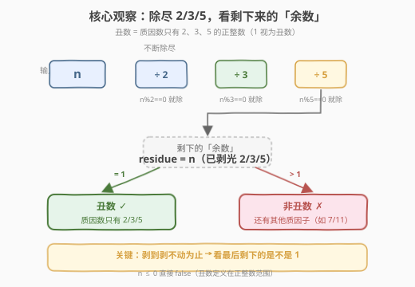
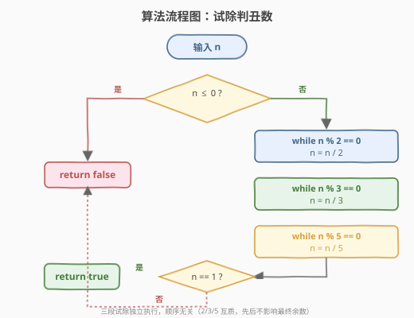
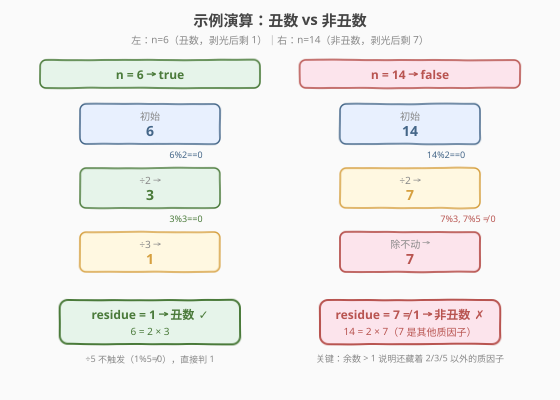

# LeetCode 丑数 题解

## 1. 题目概述

- **标题 / 题号**：丑数（#263，easy）
- **链接**：https://leetcode.cn/problems/ugly-number/
- **难度**：简单
- **标签**：数学

**题意**：**丑数**就是只包含质因数 `2`、`3`、`5` 的**正整数**。给定一个整数 `n`，判断它是否为丑数。是则返回 `true`，否则返回 `false`。注意 `1` 视为丑数（它没有任何质因数）。

**示例 1**：

```text
输入：n = 6
输出：true
解释：6 = 2 × 3，质因数只有 2 和 3，是丑数。
```

**示例 2**：

```text
输入：n = 1
输出：true
解释：1 没有质因数，按约定视为丑数。
```

**示例 3**：

```text
输入：n = 14
输出：false
解释：14 = 2 × 7，7 不在 {2, 3, 5} 中，不是丑数。
```

**约束**：

- $-2^{31} \le n \le 2^{31} - 1$

> 💡 这道题是 [264. 丑数 II](./264_丑数II.md) 的**反向基础**——264 题「生成」第 n 个丑数（三指针多路归并），本题只需「**判定**」单个数是不是丑数。判定只需把 `n` 里所有的 `2/3/5` 因子**剥光**，看剩下的「余数」是不是 `1`：是 `1` 则质因数只有 2/3/5（丑数），否则还藏着别的质因子（非丑数）。

## 2. 解题思路

### 2.1 暴力思路：质因数分解

最直觉的做法是对 `n` 做**完整质因数分解**：从 `2` 开始逐个试除到 $\sqrt{n}$，收集所有质因子，再判断质因子集合是否 $\subseteq \{2, 3, 5\}$。

> ⚠️ 问题：完整分解要试除到 $\sqrt{n}$，对 $n \le 2^{31}-1$ 来说 $\sqrt{n} \approx 46341$，常数偏大；而且我们**根本不关心**其他质因子具体是谁，只关心「有没有」。把 `2/3/5` 剥光后看余数即可，无需完整分解。

### 2.2 核心观察：剥光 2/3/5，看余数是否为 1

**丑数的等价定义**：不断用 `2`、`3`、`5` 去整除 `n`（只要还能整除就除），**剥到剥不动为止**，若最后剩下的「余数」`residue == 1`，则 `n` 的质因数只有 2/3/5（丑数）；若 `residue > 1`，则 `residue` 本身就是一个不在 `{2,3,5}` 中的质因子（非丑数）。



**为什么剥光后剩下的 residue 要么是 1、要么是一个「别的」质数？**

- 设 `n` 的质因数分解为 $n = 2^a \cdot 3^b \cdot 5^c \cdot q$，其中 $q$ 不含因子 2/3/5。
- 不断除尽 2/3/5 后，剩下的就是 $q$。
- 若 $q = 1$ → 质因数只有 2/3/5 → 丑数。
- 若 $q > 1$ → $q$ 含有 2/3/5 以外的质因子 → 非丑数。（$q$ 不一定是单个质数，可能是若干「别的」质数的乘积，如 `n = 14` 时 $q = 7$，`n = 154 = 2×7×11` 时 $q = 77$。）

> 💡 **顺序无关性**：`2`、`3`、`5` 两两互质，先除谁后除谁都不影响最终 `residue`。所以三段 `while` 可以任意排列，结果一致。

**边界**：$n \le 0$ 时直接返回 `false`——丑数定义在**正整数**范围内，非正数无质因数分解可言。$n = 1$ 时三段 `while` 都不执行，`residue = 1`，返回 `true`，与「1 视为丑数」的约定吻合。

### 2.3 算法流程图



三段 `while` 顺序执行：先剥 2、再剥 3、最后剥 5，剥不动了判 `n == 1`。

### 2.4 示例演算

以 `n = 6`（丑数）与 `n = 14`（非丑数）对比，展示剥因子过程：



| 步骤 | n=6（丑数） | n=14（非丑数） |
|------|------------|---------------|
| 初始 | 6 | 14 |
| ÷2（6%2==0 / 14%2==0） | 6→3 | 14→7 |
| ÷3（3%3==0 / 7%3≠0） | 3→1 | 7（除不动） |
| ÷5（1%5≠0 / 7%5≠0） | 1（除不动） | 7（除不动） |
| residue | **1** → 丑数 ✓ | **7** → 非丑数 ✗ |

`n = 6` 剥光后剩 `1`，质因数只有 2/3 → 丑数；`n = 14` 剥光 2 后剩 `7`，`7` 不能被 3 或 5 整除，`residue = 7 \ne 1` → 非丑数，且 `7` 正是那个「别的」质因子。

> 💡 **n = 1 怎么走？** 三段 `while` 条件 `1 % 2 / 1 % 3 / 1 % 5` 都不为 0，循环体一次也不执行，`residue = 1`，返回 `true`。这就是为什么 `1` 天然是丑数——它没有任何质因子，「剥光」后还是自己。

## 3. 参考代码

### C++

```cpp
class Solution {
  public:
    bool isUgly(int n) {
        if (n <= 0) return false;          // 丑数定义在正整数范围
        while (n % 2 == 0) n /= 2;         // 剥光因子 2
        while (n % 3 == 0) n /= 3;         // 剥光因子 3
        while (n % 5 == 0) n /= 5;         // 剥光因子 5
        return n == 1;                     // 剩 1 → 丑数；剩别的 → 有其他质因子
    }
};
```

### Python

```python
class Solution:
    def isUgly(self, n: int) -> bool:
        if n <= 0:
            return False
        for p in (2, 3, 5):
            while n % p == 0:
                n //= p
        return n == 1
```

> 💡 **Python 循环写法**：把 `2/3/5` 放进元组用 `for` 遍历，比写三段 `while` 更紧凑。本质完全相同——三个因子两两互质，顺序无关。注意用 `//=`（整除赋值）而非 `/=`，避免 Python 中 `/` 返回浮点数。

## 4. 复杂度分析

| 维度 | 复杂度 | 说明 |
|------|--------|------|
| 时间复杂度 | $O(\log n)$ | 每次整除 `n` 至少减半（除以 2 时最显著），总除法次数以 $\log_2 n$ 为上界；三段 `while` 的总迭代数 $\le \log_2 n + \log_3 n + \log_5 n = O(\log n)$ |
| 空间复杂度 | $O(1)$ | 只用常数个变量，原地修改 `n` |

> ⚠️ **不是 $O(\sqrt n)$**：完整质因数分解要试除到 $\sqrt n$，但本题只需对 3 个固定因子反复整除。整除是「指数级」缩小 `n`（除以 2 一次就减半），故复杂度是对数级而非平方根级。这是本题相比「完整分解」的关键效率优势。

## 5. 扩展：与 264 丑数 II 的关系

本题（263）是 [264. 丑数 II](./264_丑数II.md) 的判定版，两题互为表里：

| 维度 | 263 丑数 | 264 丑数 II |
|------|---------|-------------|
| 任务 | **判定**单个 `n` 是否为丑数 | **生成**第 `n` 个丑数 |
| 思路 | 试除剥因子，看余数 | 三指针多路归并，从小到大生成 |
| 复杂度 | $O(\log n)$ / $O(1)$ | $O(n)$ / $O(n)$ |
| 关系 | 264 可用 263 的 `isUgly` 暴力逐个检查（但太慢，$n=1690$ 时第 n 个丑数约 $2.1\times 10^9$，密度极低） | 264 的三指针直接生成，无需逐个判定 |

> 💡 **面试串联**：如果面试官追问「如何不用 264 的三指针、改用 263 的判定来求第 n 个丑数」——可以，但效率极差：从 1 开始逐个 `isUgly` 计数，数够 n 个停止。这就解释了为什么 264 要换思路「生成」而非「判定」：丑数在整数中密度极低（前 1690 个丑数最大约 $2.1\times 10^9$，意味着要扫描约 $2\times 10^9$ 个数才能数够），逐个判定不可行。

## 6. 面试要点

1. **为什么 `n <= 0` 要直接返回 `false`？**

   - 丑数定义在**正整数**范围内。`0` 和负数没有合法的质因数分解（0 不能作除数判断、负数的因子分解需引入符号），按题意直接判 `false`。这是最容易漏掉的边界。

2. **为什么剥光 2/3/5 后剩下的 `residue` 一定是个「干净的」判定量？**

   - 因为 `2/3/5` 两两互质，整除过程互不干扰。剥光后 `residue` 不含任何 2/3/5 因子。若 `residue == 1`，说明 `n` 的所有因子都被剥掉了（即只有 2/3/5）；若 `residue > 1`，则 `residue` 至少含一个 2/3/5 以外的质因子（否则它早被剥掉了），非丑数。

3. **三段 `while` 的顺序重要吗？**

   - 不重要。`2/3/5` 两两互质，先除谁后除谁，最终的 `residue` 完全相同。代码里按 `2→3→5` 顺序只是惯例。甚至可以把因子放进数组用 `for` 遍历（如 Python 写法），效果一致。

4. **时间复杂度为什么是 $O(\log n)$ 而非 $O(\sqrt n)$？**

   - 完整质因数分解需试除到 $\sqrt n$，但本题只对 **3 个固定因子**反复整除。每次整除 `n` 至少减半（除以 2 时），所以总迭代数被 $\log_2 n$ 封顶。即便 `n` 是纯 5 的幂（如 $5^{13} \approx 1.2\times 10^9$），也只需除 13 次。这是「判定」远快于「完整分解」的原因。

5. **`n = 1` 为什么天然返回 `true`？**

   - 三段 `while` 的条件 `1 % p == 0` 对任何 `p > 1` 都为 `false`，循环体不执行，`residue = 1`，`return n == 1` 即 `true`。所以 `1` 是丑数这一约定在代码层面无需特判，自然成立。

> 💡 **一句话总结**：丑数判定 = 试除剥光 2/3/5 + 看余数是否为 1。`n <= 0` 直接 false，`n = 1` 天然 true。三段 `while` 顺序无关（因子两两互质），时间 $O(\log n)$、空间 $O(1)$。是 264 丑数 II 的判定版基础，但生成第 n 个丑数时密度太低，须改用三指针「生成」而非「逐个判定」。

## 同类练习题

| # | 题目 | 与本题的关联 |
|---|------|-------------|
| 264 | [丑数 II](https://leetcode.cn/problems/ugly-number-ii/)（[题解](./264_丑数II.md)） | 返回第 n 个丑数，三指针多路归并「生成」——本题的反向进阶，从「判定」升级为「枚举」 |
| 313 | [超级丑数](https://leetcode.cn/problems/super-ugly-number/) | 把 2/3/5 推广到 k 个质因子，求第 n 个，用堆或 k 指针 |
| 1201 | [丑数 III](https://leetcode.cn/problems/ugly-number-iii/) | 求第 n 个能被 a/b/c 整除的数，二分答案 + 容斥原理（注意此处「丑数」定义放宽为「能被给定数整除」） |
| 204 | [计数质数](https://leetcode.cn/problems/count-primes/)（[题解](./204_计数质数.md)） | 质数筛法，与本题共享「质因数」主题，互为对照（筛质数 vs 判质因数集合） |
