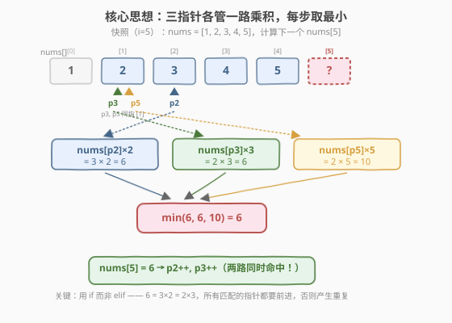
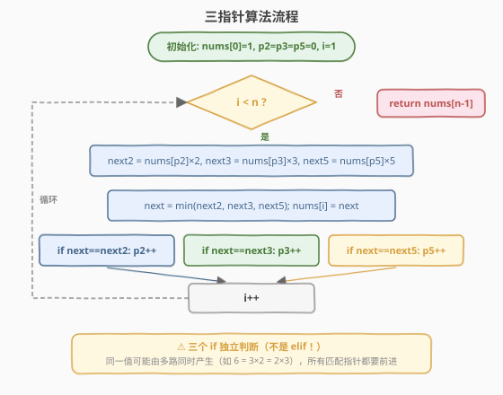
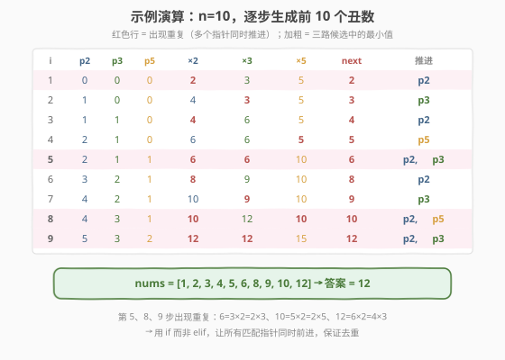

# 丑数II

- **题目名称**：丑数II
- **链接**：[264. 丑数 II](https://leetcode.cn/problems/ugly-number-ii/)
- **难度**：中等
- **标签**：动态规划、多路归并、三指针、堆

## 1. 题目概述

**丑数**是只包含质因数 `2`、`3`、`5` 的正整数。给定整数 `n`，返回第 `n` 个丑数。

**示例 1**：

```text
输入：n = 10
输出：12
解释：前 10 个丑数为 [1, 2, 3, 4, 5, 6, 8, 9, 10, 12]，第 10 个是 12。
```

**示例 2**：

```text
输入：n = 1
输出：1
解释：1 通常被视为丑数。
```

**约束条件**：

- `1 <= n <= 1690`

---

## 2. 解题思路

### 2.1 暴力思路：逐个检查

最直观的做法是从 `1` 开始逐个检查每个正整数是否为丑数：不断除以 `2`、`3`、`5` 直到商不再含这些因子，若最终得 `1` 则是丑数。数够 `n` 个即返回。

> ⚠️ 问题：第 `1690` 个丑数约 `2.1 × 10⁹`，需要逐个检查到这个量级的所有整数，绝大多数都不是丑数（密度极低），时间不可接受。

换一个角度：与其**检查**每个数是不是丑数，不如直接**生成**丑数。

### 2.2 核心观察：三指针多路归并



关键洞察：

1. **丑数序列有序**：丑数从小到大排列。
2. **每个丑数由前一个生成**：除 `1` 外，每个丑数 = 某个更小的丑数 × `2` / `3` / `5`。
3. **三路乘积流**：可以看作三条有序「流」的归并——
   - ×2 流：`1×2, 2×2, 3×2, 4×2, 5×2, 6×2, ...`
   - ×3 流：`1×3, 2×3, 3×3, 4×3, ...`
   - ×5 流：`1×5, 2×5, 3×5, ...`
4. **去重**：同一个值可能由多路同时产生（如 `6 = 3×2 = 2×3`），只保留一份。

> 💡 这正是「合并 K 个有序链表」的思路——不过只有 3 路，用**三个指针**代替堆即可做到 `O(n)`。

**三指针方案**：

- 维护数组 `nums[]` 存已生成的丑数（有序），`nums[0] = 1`。
- 三个指针 `p2`、`p3`、`p5` 分别表示「下一个该乘 `2` / `3` / `5` 的丑数在 `nums` 中的索引」。
- 每步取 `min(nums[p2]×2, nums[p3]×3, nums[p5]×5)` 作为下一个丑数。
- **谁的乘积等于这个最小值，谁的指针就 +1**（可能多个同时 +1，处理去重）。

### 2.3 算法流程图



### 2.4 示例演算

以 `n = 10` 为例，展示每步的指针状态、三路候选与推进情况：



| 步骤 | p2 | p3 | p5 | ×2 | ×3 | ×5 | next | 推进 |
|------|----|----|----|----|----|----|------|------|
| 1 | 0 | 0 | 0 | 2 | 3 | 5 | 2 | p2 |
| 2 | 1 | 0 | 0 | 4 | 3 | 5 | 3 | p3 |
| 3 | 1 | 1 | 0 | 4 | 6 | 5 | 4 | p2 |
| 4 | 2 | 1 | 0 | 6 | 6 | 5 | 5 | p5 |
| 5 | 2 | 1 | 1 | 6 | 6 | 10 | 6 | p2, p3 |
| 6 | 3 | 2 | 1 | 8 | 9 | 10 | 8 | p2 |
| 7 | 4 | 2 | 1 | 10 | 9 | 10 | 9 | p3 |
| 8 | 4 | 3 | 1 | 10 | 12 | 10 | 10 | p2, p5 |
| 9 | 5 | 3 | 2 | 12 | 12 | 15 | 12 | p2, p3 |

最终 `nums = [1, 2, 3, 4, 5, 6, 8, 9, 10, 12]`，第 10 个丑数为 `12`。

> 💡 **第 5、8、9 步是关键**：`6 = 3×2 = 2×3`、`10 = 5×2 = 2×5`、`12 = 6×2 = 4×3`，同一个值由多路同时产生。必须让**所有**匹配的指针同时前进，否则下一轮会产生重复值。这就是为什么代码里用三个独立的 `if` 而非 `if-elif` 链。

---

## 3. 参考代码

### C++

```cpp
class Solution {
  public:
    int nthUglyNumber(int n) {
        vector<int> nums(n);
        nums[0] = 1;
        int p2 = 0, p3 = 0, p5 = 0;
        for (int i = 1; i < n; i++) {
            int next2 = nums[p2] * 2;
            int next3 = nums[p3] * 3;
            int next5 = nums[p5] * 5;
            int next = min(next2, min(next3, next5));
            nums[i] = next;
            if (next == next2) p2++;   // 独立 if，非 elif
            if (next == next3) p3++;
            if (next == next5) p5++;
        }
        return nums[n - 1];
    }
};
```

### Python

```python
class Solution:
    def nthUglyNumber(self, n: int) -> int:
        nums = [1] * n
        p2 = p3 = p5 = 0
        for i in range(1, n):
            next2, next3, next5 = nums[p2] * 2, nums[p3] * 3, nums[p5] * 5
            nxt = min(next2, next3, next5)
            nums[i] = nxt
            if nxt == next2:
                p2 += 1
            if nxt == next3:
                p3 += 1
            if nxt == next5:
                p5 += 1
        return nums[-1]
```

> ⚠️ **为什么用 `if` 不用 `elif`？** 当 `next` 同时等于多个候选时（如 `6 = next2 = next3`），所有匹配的指针都必须前进。若用 `elif`，只推进第一个匹配的指针，另一个停留在原地，下一轮会再次产生同样的值，导致 `nums` 中出现重复。

---

## 4. 复杂度分析

| 维度 | 复杂度 | 说明 |
|------|--------|------|
| 时间复杂度 | $O(n)$ | 循环 `n` 次，每次 `O(1)`：三个乘法 + 一次 `min` + 若干比较 |
| 空间复杂度 | $O(n)$ | `nums` 数组存储 `n` 个丑数；三个指针 `O(1)` |

> 💡 相比暴力逐个检查（需扫描到第 `n` 个丑数的实际值，远大于 `n`），三指针方案直接生成，每个位置只算一次，是理论最优。

---

## 5. 扩展：最小堆解法

除了三指针，还可以用**最小堆**求解，思路更通用（可扩展到 `k` 个因子）：

1. 将 `1` 入堆，用集合 `seen` 去重。
2. 每轮弹出堆顶 `x`（当前最小丑数），将 `x×2`、`x×3`、`x×5` 若未见过则入堆。
3. 弹出 `n` 次后，第 `n` 次弹出的即为答案。

```python
def nthUglyNumber_heap(self, n: int) -> int:
    import heapq
    heap = [1]
    seen = {1}
    factors = [2, 3, 5]
    for _ in range(n):
        x = heapq.heappop(heap)
        for f in factors:
            if x * f not in seen:
                seen.add(x * f)
                heapq.heappush(heap, x * f)
    return x
```

| 方法 | 时间 | 空间 | 适用场景 |
|------|------|------|----------|
| **三指针** | $O(n)$ | $O(n)$ | 固定 3 个因子，最优 |
| **最小堆** | $O(n \log n)$ | $O(n)$ | 因子数 `k` 较多时更通用（如 [313. 超级丑数](https://leetcode.cn/problems/super-ugly-number/)） |

> 💡 当因子数 `k` 较大时（超级丑数），堆的 `O(n log k)` 比维护 `k` 个指针的常数更优；`k=3` 时三指针的 `O(n)` 已是最优。

---

## 6. 面试要点

1. **为什么不能对每个已有丑数都乘 2/3/5 再排序去重？**

   - 会产生大量重复和乱序值，每轮需排序去重，效率差。三指针利用了「每路乘积单调递增」的性质，像归并排序一样只需取最小，无需排序。

2. **为什么三个指针分别维护，而不是共用一个？**

   - 三个因子的增长速率不同：×2 最快、×5 最慢。同一段时间内，×2 路需要消费更多丑数作为基数，指针走得更快。各自独立追踪才能保证每路的候选值始终是「该路中 ≥ 当前最大丑数」的最小值。

3. **为什么用 `if` 而不是 `elif`？**

   - 同一个丑数可能由多路同时产生（如 `6 = 3×2 = 2×3`）。若只推进第一个匹配的指针，另一个不前进，下一轮会再次算出同一个值，导致 `nums` 中出现重复。三个独立 `if` 保证所有匹配指针同时前进，天然去重。

4. **指针为什么只会前进不会后退？**

   - 丑数序列单调递增。若 `nums[p2]×2` 已被选为 `next`，则后续候选 `nums[p2+1]×2` 更大，不会回头。每路乘积流都是单调递增的，指针只需前进。

5. **堆方法和三指针方法怎么选？**

   - 三指针 `O(n)` 是 3 因子的最优解，代码简洁。最小堆 `O(n log n)` 更通用，当因子数 `k` 增大时（如超级丑数 `k` 可达 100），堆方案 `O(n log k)` 比维护 `k` 个指针更方便，且不会因指针过多而混乱。

---

## 7. 同类练习题

- [263. 丑数](https://leetcode.cn/problems/ugly-number/)：判断单个数是否为丑数（不断除 2/3/5 看是否得 1），是本题的反向基础
- [313. 超级丑数](https://leetcode.cn/problems/super-ugly-number/)：将 3 个因子推广到 `k` 个质因子，用堆或 `k` 指针
- [1201. 丑数 III](https://leetcode.cn/problems/ugly-number-iii/)：求第 `n` 个能被 `a/b/c` 整除的数，用二分答案 + 容斥原理
- [23. 合并 K 个升序链表](https://leetcode.cn/problems/merge-k-sorted-lists/)：同样的多路归并思想，`k` 路用堆
- [632. 最小区间](https://leetcode.cn/problems/smallest-range-covering-elements-from-k-lists/)：`k` 个有序列表中各取一个数使区间最小，多路归并 + 滑动窗口
