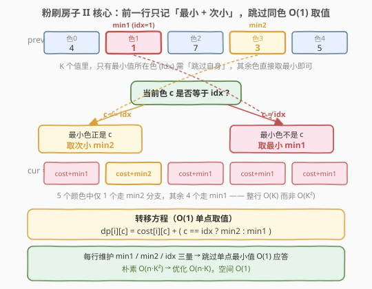
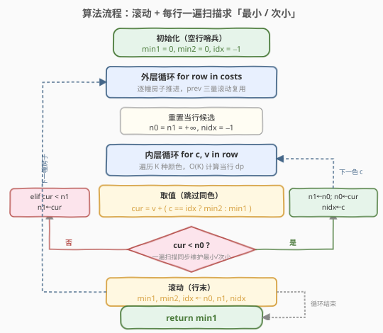
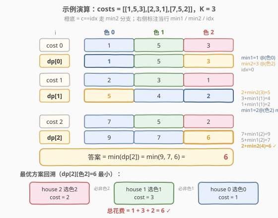

# LeetCode 粉刷房子 II 题解

## 1. 题目概述

- **标题 / 题号**：粉刷房子 II（#265，hard）
- **链接**：https://leetcode.cn/problems/paint-house-ii/
- **难度**：困难
- **标签**：动态规划

**题意**：一排 `n` 幢房子需要粉刷，每幢房子可以涂成 `K` 种颜色之一。给定 `n × K` 的花费矩阵 `costs`，其中 `costs[i][c]` 表示把第 `i` 幢房子涂成颜色 `c` 的花费。要求**相邻两幢房子颜色不同**，求涂完所有房子的**最小总花费**。

> 本题是 [256. 粉刷房子](../0201-0300/256_粉刷房子.md) 的 **K 色推广版**——256 中 `K=3` 固定，每格转移「取另两色最小」可展开成 `O(K)=O(1)`；本题 `K` 可达 `n`，朴素转移 `O(n·K²)`，题目在 **Follow-up** 中明确要求 **`O(n·K)`** 的解法。难点不在状态设计，而在**把每格 `O(K)` 的「跳过同色取最小」压成 `O(1)`**。

**示例 1**：

```text
输入：costs = [[1,5,3],[2,3,1],[7,5,2]]
输出：6
解释：house 0 涂色0(1) + house 1 涂色1(3) + house 2 涂色2(2) = 6
```

**示例 2**：

```text
输入：costs = [[1,2,3]]
输出：1
解释：只有一幢房子，直接选最便宜的颜色0(1)。
```

**约束**：

- `costs.length == n`
- `costs[i].length == K`
- `1 <= n <= 100`
- `1 <= K <= 100`
- `1 <= costs[i][j] <= 20`
- 保证存在合法方案（`n >= 2` 时 `K >= 2`）

> 💡 状态定义与 256 完全一致：$dp[i][c]$ = 涂完第 $0 \dots i$ 幢房子的最小花费且第 $i$ 幢涂颜色 $c$。差异仅在 $K$ 不再固定为 3——这让「转移时取前一行另 $K-1$ 个值的最小」从 $O(1)$ 退化成 $O(K)$，整题变 $O(n \cdot K^2)$。Follow-up 的 `O(n·K)` 要靠一个**经典预处理技巧**破局。

## 2. 解题思路

### 2.1 暴力思路：朴素 DP $O(n \cdot K^2)$

直接照搬 256 的状态与转移，只是「另两色最小」推广为「另 $K-1$ 色最小」：

$$dp[i][c] = costs[i][c] + \min_{c' \neq c} dp[i-1][c']$$

**边界**：`dp[0][c] = costs[0][c]`；**答案**：$\min_c dp[n-1][c]$。

实现时每格内层再开一个 `O(K)` 循环扫前一行、跳过 `c' == c` 取最小：

```text
for i in 1..n-1:
    for c in 0..K-1:
        best = +∞
        for c' in 0..K-1:
            if c' != c: best = min(best, dp[i-1][c'])
        dp[i][c] = costs[i][c] + best
```

三重循环 $O(n \cdot K^2)$。$n, K \le 100$ 时约 $10^6$，时间上能过，但**未满足 Follow-up 的 $O(n \cdot K)$ 要求**。

> ⚠️ 浪费的根源：每个 `c` 都把前一行 $K$ 个值扫一遍取「跳过自身」的最小——$K$ 个 `c` 各扫一遍，共 $K^2$ 次比较，但前一行整行只有 $K$ 个值。**若一次性把「整行的最小、次小」预处理出来，每个 `c` 就能 `O(1)` 回答「跳过自身的最小」**，整行从 $K^2$ 降到 $K$。

### 2.2 核心观察：最小 + 次小，跳过同色 $O(1)$ 取值



**关键洞察**：「跳过单点取最小」可分两种情况，而两种情况都只需前一行**两个量**即可应答：

对前一行 $dp[i-1][\cdot]$ 维护：

- **`min1`**：前一行的**最小值**；
- **`min2`**：前一行的**次小值**（来自与 `min1` **不同**的颜色）；
- **`idx`**：`min1` 所在的颜色下标。

于是当前色 `c` 的转移 $O(1)$：

$$
dp[i][c] = costs[i][c] + \begin{cases} \text{min2} & \text{若 } c = \text{idx（要跳过的正是最小值，取次小）} \\ \text{min1} & \text{若 } c \neq \text{idx（最小值不在 } c \text{ 上，直接取）} \end{cases}
$$

> 💡 **为什么这样正确？** 「跳过 $c$ 取最小」的本质是「在前一行除 $c$ 外的颜色里取最小」。若 $c$ 恰好是最小值所在色（`c == idx`），排除它后剩下的最小就是**次小 `min2`**；否则最小值 `min1` 本就不在 `c` 上，排除 $c$ 不影响它，仍是 `min1`。一个 `if` 把 $O(K)$ 的扫描折叠成 $O(1)$ 查询——因为「除一个点外的最小」**只取决于这个点是不是全局最小**。

> ⚠️ **`min2` 必须来自与 `min1` 不同的颜色**：这是「次小」的定义要求。若整行有重复最小值（如 `[5,5,3]`，`min1=3@色2`，`min2=5@色0`），`min2` 取的是「严格第二小」所在色，与 `idx` 不同。即便整行全相等（`[5,5,5]`），一遍扫描时第二个 `5` 会更新 `min2`，此时 `min2 == min1` 但来自不同颜色——`c == idx` 时取 `min2` 仍合法（值相同但颜色不同）。详见第 5.1 节的扫描逻辑。

### 2.3 算法流程图



**三步法**（滚动数组 $O(1)$ 空间）：

1. **初始化哨兵**：`min1 = 0, min2 = 0, idx = -1`。用「空行」作前驱——空行加 0 不影响第 0 幢的 `dp[0][c] = costs[0][c]`（`idx = -1` 使 `c == idx` 永不成立，全部走 `min1 = 0` 分支），免去对第 0 幢单独处理。
2. **逐行递推**：对每行 `row = costs[i]`：
   - 重置当行候选 `n0 = n1 = +∞, nidx = -1`；
   - 遍历 `c = 0..K-1`：`cur = row[c] + (c == idx ? min2 : min1)`，并**一遍扫描同步维护**当行的 `n0/n1/nidx`（见 5.1）；
   - 行末滚动 `min1, min2, idx ← n0, n1, nidx`。
3. **收尾**：`return min1`（最后一行的最小值即答案）。

> 💡 **空行哨兵的妙处**：把第 0 幢的「无前驱」统一成「前驱是一行全 0 的空行」。这样循环从 `i = 0` 直接跑，无需 `if (i == 0)` 特判。这与打家劫舍把「哨兵」塞进 DP 表头、或二维 DP 加一圈 0 边界是同一思想——**用哨兵消特判**。

### 2.4 示例演算

以 `costs = [[1,5,3],[2,3,1],[7,5,2]]`（`K=3`）为例：



**初始**（空行哨兵）：`min1=0, min2=0, idx=-1`

**第 0 幢** `row=[1,5,3]`：`idx=-1` ⇒ 全部走 `min1=0` 分支 ⇒ `dp[0]=[1,5,3]`
扫描得 `min1=1@(色0), min2=3@(色2), idx=0`

**第 1 幢** `row=[2,3,1]`：

| 颜色 | 计算 | dp[1] | 走哪条分支 |
|------|------|-------|-----------|
| 色0 | 2 + (c==0==idx → min2=3) = 5 | **5** | min2 |
| 色1 | 3 + (c≠idx → min1=1) = 4 | 4 | min1 |
| 色2 | 1 + (c≠idx → min1=1) = 2 | **2** | min1 |

扫描得 `min1=2@(色2), min2=4@(色1), idx=2`

**第 2 幢** `row=[7,5,2]`：

| 颜色 | 计算 | dp[2] | 走哪条分支 |
|------|------|-------|-----------|
| 色0 | 7 + min1=2 = 9 | 9 | min1 |
| 色1 | 5 + min1=2 = 7 | 7 | min1 |
| 色2 | 2 + (c==2==idx → min2=4) = 6 | **6** | min2 |

**答案** = `min(9, 7, 6) = 6` ✓

> 💡 **观察「min2 分支」何时触发**：只有当 `c` 恰好等于前一行的最小色 `idx` 时才走 `min2`——每行至多 1 个颜色走此分支，其余 `K-1` 个走 `min1`。这正是把 $O(K^2)$ 压成 $O(K)$ 的关键：**全行只关心两个数（最小、次小），而非对每个 `c` 重新扫一遍**。

**最优方案回溯**：`dp[2][色2]=6` 最小 → house 2 选色2（cost 2）→ 前一格必非色2，house 1 选色1（`dp[1][色1]=4`，cost 3）→ 前一格必非色1，house 0 选色0（`dp[0][色0]=1`，cost 1）。总花费 `1+3+2=6`。注意三幢房子颜色 `0/1/2` 各不相同——本题只要求**相邻**不同，恰好这里全不同是巧合，不相邻的同色仍合法。

## 3. 参考代码

### C++

```cpp
// 粉刷房子II.cpp —— 线性 DP + 最小次小滚动，O(n·K) 时间 O(1) 空间
// 编译: g++ -O2 -std=c++17 粉刷房子II.cpp -o paint2
#include <vector>
#include <climits>
#include <algorithm>
using namespace std;

class Solution {
  public:
    int minCostII(vector<vector<int>>& costs) {
        int n = costs.size(), K = costs[0].size();
        // 前一行最小 / 次小 / 最小色号；初值 0 = 空行哨兵（加 0 不影响第 0 幢）
        int min1 = 0, min2 = 0, idx = -1;
        for (int i = 0; i < n; ++i) {
            int n0 = INT_MAX, n1 = INT_MAX, nidx = -1;   // 当行候选
            for (int c = 0; c < K; ++c) {
                // 跳过同色：c==idx 取次小 min2，否则取最小 min1
                int cur = costs[i][c] + (c == idx ? min2 : min1);
                // 一遍扫描同步维护当行最小 / 次小
                if (cur < n0) { n1 = n0; n0 = cur; nidx = c; }  // 新最小，旧最小降为次小
                else if (cur < n1) { n1 = cur; }                 // 仅刷新次小
            }
            min1 = n0; min2 = n1; idx = nidx;                    // 滚动
        }
        return min1;
    }
};
```

### Python

```python
class Solution:
    def minCostII(self, costs: list[list[int]]) -> int:
        # 前一行最小 / 次小 / 最小色号；初值 0 = 空行哨兵
        min1 = min2 = 0
        idx = -1
        for row in costs:
            n0 = n1 = float('inf')   # 当行候选
            nidx = -1
            for c, v in enumerate(row):
                # 跳过同色：c==idx 取次小 min2，否则取最小 min1
                cur = v + (min2 if c == idx else min1)
                # 一遍扫描同步维护当行最小 / 次小
                if cur < n0:
                    n1 = n0; n0 = cur; nidx = c      # 新最小，旧最小降为次小
                elif cur < n1:
                    n1 = cur                          # 仅刷新次小
            min1, min2, idx = n0, n1, nidx            # 滚动
        return min1
```

> 💡 两版骨架一致。核心是**内层一遍循环同时做两件事**：① 用 `min1/min2/idx` 算出 `cur`；② 用 `cur` 更新当行的 `n0/n1/nidx`。算完一行直接滚动，前一行即弃——全程只存 3 个标量，空间 $O(1)$。空行哨兵 `min1=min2=0, idx=-1` 让第 0 幢无需特判：`c == -1` 永不成立，所有 `c` 走 `min1=0` 分支，`dp[0][c] = costs[0][c]` 自然成立。

> ⚠️ **`n1` 不要漏更新**：维护次小时常见 bug 是「只在新最小出现时才动 `n1`」，导致次小停留在 `+∞`。正确做法是：① `cur < n0` 时，**先把旧 `n0` 降为 `n1`** 再更新 `n0`；② `cur >= n0` 但 `cur < n1` 时，单独刷新 `n1`。两条分支缺一不可，否则 `c == idx` 时会取到 `+∞` 得出错误答案。

## 4. 复杂度分析

| 维度 | 复杂度 | 说明 |
|------|--------|------|
| **时间复杂度** | $O(n \cdot K)$ | 外层 $n$ 幢房子，内层 $K$ 种颜色；每色 $O(1)$ 转移 + $O(1)$ 维护次小，整行 $O(K)$ |
| **空间复杂度** | $O(1)$ | 仅 `min1/min2/idx` 与当行 `n0/n1/nidx` 共 6 个标量，与 $n$、$K$ 无关 |
| 朴素 DP | $O(n \cdot K^2)$ | 每格内层再扫前一行 $K$ 个值取「跳过同色」最小；$K=n=100$ 时约 $10^6$，能过但不满足 Follow-up |
| 最坏情况 | 同 $O(n \cdot K)$ | 与花费取值无关；即便整行全相等，次小维护逻辑仍正确（见 5.1） |

> ⚠️ **为何朴素 $O(n \cdot K^2)$ 也能 AC，Follow-up 仍要 $O(n \cdot K)$？** 面试中 Follow-up 考察的是**优化思维**：识别「每格重复扫前一行」的冗余，用预处理（最小+次小）把单点查询从 $O(K)$ 降到 $O(1)$。这种「**预处理两个量，把逐点扫描变成逐点查询**」的思路在面试中高频出现（见 5.2 的「跳过单点」家族）。

## 5. 扩展

### 5.1 一遍扫描求「最小 + 次小」的通用模板

本题内层循环的另一贡献是**在一次遍历中同时求出最小与次小**——这是比「先求最小再求次小（两遍 $O(K)$）」更优的 $O(K)$ 单遍写法：

```text
n0 = n1 = +∞
for x in 序列:
    if x < n0:          n1 = n0; n0 = x      # 新最小出现：旧最小自动降为次小
    else if x < n1:     n1 = x               # 非最小但更小：刷新次小
```

**正确性要点**：

- `n1` 的更新有**两条路径**：要么随 `n0` 被刷新而「继承旧 `n0`」，要么作为「介于新旧最小之间的值」被单独刷新。
- **重复最小值的处理**：序列 `[5,5,5]` 中，首个 `5` 成为 `n0`，第二个 `5` 走 `else if x < n1`（`5 < +∞`）刷新 `n1=5`。最终 `n0=n1=5`，且二者来自不同位置——这正是 265 所需的「次小来自不同颜色」。
- **`n1` 可能为 `+∞`**：当序列长度为 1（`K=1`）时无次小，`n1` 保持 `+∞`。本题 `n>=2` 时 `K>=2`，不会触发；但若输入确使 `n1=+∞`，下一行 `c==idx` 会取到 `+∞`，正确表达「无合法方案」。

> 💡 这个单遍「最小+次小」模板适用于任何需要「除一个点外的最小值」的场景：维护最小与次小，单点询问 $O(1)$ 应答。它是 265 的灵魂，也是「**预处理常数个极值，把逐点线性查询降为常数查询**」这一思想的代表。

### 5.2 「跳过单点」思想家族

「在一组数里取除某个下标外的极值」是一类通用需求。共性解法：**预处理足够多的极值信息，让单点询问 $O(1)$**。

| 题目 | 跳过的「单点」 | 预处理 | 单点查询 |
|------|---------------|--------|---------|
| **265 粉刷房子 II（本题）** | 同色 $c$ | 前一行 `min1/min2/idx` | `c==idx ? min2 : min1` |
| [238. 除自身以外数组的乘积](../0201-0300/238_除自身以外数组的乘积.md) | 下标 $i$ 自身 | 前缀积 + 后缀积 | `pre[i-1] * suf[i+1]` |
| 接雨水类（左右最大高度） | 下标 $i$ 自身 | `leftMax[]` + `rightMax[]` | `min(leftMax[i], rightMax[i])` |

> 💡 本质都是「**预处理两个互补方向/两个极值**，使跳过任意单点都能 $O(1)$ 拼出答案」。238 用前缀×后缀绕开自身；265 用最小×次小绕开同色。记忆钩子：**凡「除某点外」型问题，先想「能否预处理两个量」**。

### 5.3 粉刷房子系列全景

| 题目 | 颜色数 | 额外约束 | 核心改动 | 与本题关系 |
|------|--------|---------|---------|-----------|
| [256 粉刷房子](../0201-0300/256_粉刷房子.md) | 3 | 相邻不同色 | 三变量滚动 DP，`K=3` 固定 `O(1)` 转移 | 本题的 `K=3` 特例（母题） |
| **265 粉刷房子 II（本题）** | K | 相邻不同色 | 最小+次小压到 $O(nK)$ | K 色推广 |
| [1473 粉刷房子 III](https://leetcode.cn/problems/paint-house-iii/) | K | 相邻不同色 + 目标街区数 | 三维 DP `dp[i][c][t]` | 加「已形成街区数」维度 |

> 三题共用「相邻不同色 → 转移跳过同色」的状态机骨架，差别只在颜色数与附加维度。256 是入门、265 是 Follow-up 优化、1473 是状态扩展——一条完整的难度阶梯。

## 6. 面试要点

1. **朴素 DP 是 $O(n \cdot K^2)$，瓶颈在哪？Follow-up 要 $O(n \cdot K)$，怎么优化？**

   > 瓶颈在每格 `dp[i][c]` 内层又开一个 $O(K)$ 循环扫前一行取「跳过同色」最小——$K$ 个 `c` 各扫一遍，共 $K^2$。优化：预处理前一行的**最小 `min1`、次小 `min2`、最小色号 `idx`**，则 `dp[i][c] = costs[i][c] + (c == idx ? min2 : min1)`，单格 $O(1)$，整行 $O(K)$，总计 $O(n \cdot K)$。本质是把「逐点 $O(K)$ 扫描」换成「一次 $O(K)$ 预处理 + $K$ 次 $O(1)$ 查询」。

2. **为什么 `c == idx` 时取次小而非其它？次小和最小可能相等吗？**

   > 「跳过 `c` 取最小」=「在除 `c` 外的颜色里取最小」。若 `c` 恰是前一行最小值所在色（`c == idx`），排除它后剩下的最小就是次小 `min2`；否则最小 `min1` 不在 `c` 上，排除 `c` 不影响它。次小**可以**等于最小——当整行有重复最小值时（如 `[5,5,5]`），`min1=min2=5` 但来自不同颜色，`c==idx` 取 `min2=5` 仍合法（值同色不同）。

3. **一遍扫描维护「最小 + 次小」时，`n1` 的更新为什么有两条路径？漏 `else if` 会怎样？**

   > `n1`（次小）的来源有二：① 新最小出现时，**旧最小自动降为次小**（`cur < n0` 分支里 `n1 = n0`）；② `cur` 介于新旧最小之间时，单独刷新次小（`else if cur < n1`）。若漏掉 `else if`，则次小只在新最小刷新时被动更新——遇到「先大后小」的序列（如 `[3, 7, 5]`，`n0=3` 后 `7` 不触发任何更新，`5` 本应是次小却因 `5 < n0(3)` 不成立、又无 `else if` 而**被丢弃**），`n1` 错误停留 `+∞`，下一行 `c==idx` 取到 `+∞` 出错。

4. **空行哨兵 `min1=min2=0, idx=-1` 的作用是什么？不用哨兵要怎么写？**

   > 作用是**统一第 0 幢的「无前驱」为「前驱是一行全 0 的空行」**，使循环从 `i=0` 直接跑、无特判：`idx=-1` 让 `c == idx` 恒不成立，所有 `c` 走 `min1=0` 分支，`dp[0][c] = costs[0][c] + 0` 自然成立。不用哨兵则需 `if (i == 0) dp[0][c] = costs[0][c]` 单独处理第 0 幢，再从 `i=1` 进循环——多一段边界代码。哨兵的代价仅是「第 0 幢多一次 `(c==-1?...)` 判断」，可忽略。

5. **如果 `K=1` 且 `n>=2`（无法相邻不同色），你的代码会怎样表现？**

   > 第 0 幢后 `min1 = costs[0][0]`, `min2 = +∞`, `idx = 0`。第 1 幢唯一颜色 `c=0 == idx`，走 `min2 = +∞` 分支，`cur = +∞`，最终返回 `+∞`——**正确表达了「无合法方案」**。但题目保证存在合法方案（`n>=2` 时 `K>=2`），故此为防御性正确，不会在合法输入上触发。面试中可主动提及「`+∞` 表示不可达」，体现对状态语义的把握。

> 💡 **一句话总结**：265 的灵魂是「**预处理最小+次小，把『跳过单点取最小』从 $O(K)$ 降到 $O(1)$**」——状态与 256 完全相同，仅 `K` 不再固定，转移时维护前一行 `min1/min2/idx` 三量，`c==idx` 取次小、否则取最小，整行 $O(K)$、总计 $O(nK)$、空间 $O(1)$。这是「除某点外取极值」型问题的通用优化范式。

## 同类练习题

| # | 题目 | 与本题的关联 |
|---|------|-------------|
| 256 | [粉刷房子](https://leetcode.cn/problems/paint-house/)（[题解](../0201-0300/256_粉刷房子.md)） | 本题的 `K=3` 特例与母题，三变量滚动 DP，转移退化为「取另两色最小」$O(1)$，先做 256 掌握状态机骨架再升级到 265 |
| 238 | [除自身以外数组的乘积](https://leetcode.cn/problems/product-of-array-except-self/)（[题解](../0201-0300/238_除自身以外数组的乘积.md)） | 同属「跳过单点」家族，用前缀积 + 后缀积把「除下标 $i$ 外的乘积」从 $O(n)$ 降到 $O(1)$，思想与本题「最小+次小」一脉相承 |
| 1473 | [粉刷房子 III](https://leetcode.cn/problems/paint-house-iii/) | 在相邻不同色基础上加「目标街区数」维度，三维 DP `dp[i][c][t]`，是本题的状态扩展，承接「跳过同色」转移骨架 |
| 918 | [最大环形子数组和](https://leetcode.cn/problems/maximum-sum-circular-subarray/)（[题解](../0901-1000/918_最大环形子数组和.md)） | 用「最大 + 次大（取反的最小）」处理环形跨界，与本题「维护两个极值应答单点」的预处理思路同类 |
| 410 | [分割数组的最大值](https://leetcode.cn/problems/split-array-largest-sum/)（[题解](../0401-0500/410_分割数组的最大值.md)） | 二分答案 + 贪心验证的另一类「极值优化」思路，对照本题「预处理极值」的优化路径，丰富「最值型 DP/二分」工具箱 |
