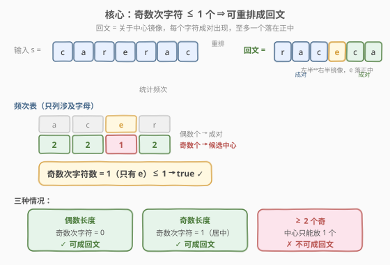
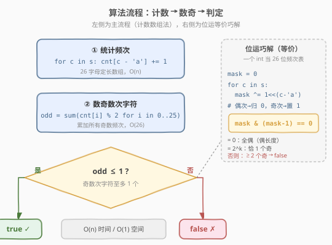
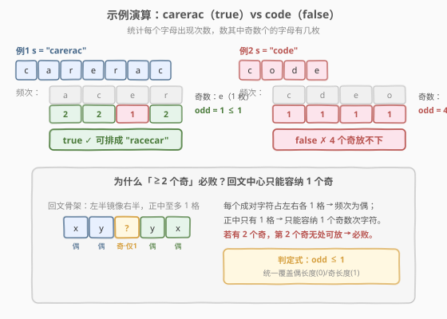

# 回文排列

- **题目名称**：回文排列
- **链接**：[266. 回文排列](https://leetcode.cn/problems/palindrome-permutation/)
- **难度**：简单
- **标签**：哈希表、字符串、位运算

## 1. 题目概述

给定一个字符串 `s`，判断 `s` 的**某个排列**是否能构成一个**回文串**。若能返回 `true`，否则返回 `false`。

回文串：正读与反读相同的字符串，如 `"racecar"`、`"aab"` 重排为 `"aba"`。

**示例 1**：

```text
输入：s = "code"
输出：false
解释：c/o/d/e 各出现 1 次，4 个奇数次字符，无法两两配对成回文。
```

**示例 2**：

```text
输入：s = "aab"
输出：true
解释：a 出现 2 次、b 出现 1 次，重排为 "aba" 是回文。
```

**示例 3**：

```text
输入：s = "carerac"
输出：true
解释：c/a/r 各 2 次，e 1 次，重排为 "racecar" 是回文。
```

**约束条件**：

- $1 \le \text{s.length} \le 5 \times 10^5$
- `s` 只包含**小写英文字母**

> 💡 这道题是回文家族的「**可行性判定**」母题——不要求构造出回文，只问「**能不能**」。它向下接 [9 回文数](../0001-0100/9_回文数.md)、[125 验证回文串](../0101-0200/125_验证回文串.md) 的「给定串判回文」，向上接 [409 最长回文](https://leetcode.cn/problems/longest-palindrome/)（求能构造的**最长**回文长度）与 [267 回文排列 II](https://leetcode.cn/problems/palindrome-permutation-ii/)（**枚举**所有回文排列）。核心判据一脉相承：**回文 ⟺ 字符关于中心镜像成对，至多一个落在正中**。

---

## 2. 解题思路

### 2.1 暴力思路：枚举全排列逐个判回文

最直觉的做法：生成 `s` 的所有排列，逐个检查是否为回文，有一个满足即返回 `true`。

> ⚠️ 问题：$n$ 个字符的全排列数为 $O(n!)$，对 $n = 7$ 已达 $5040$，对题设 $n = 5\times 10^5$ 完全不可行。而且我们**根本不关心**具体是哪个排列，只关心「**存不存在**」。暴力枚举回答了远超题目所需的问题，付出指数级代价。

### 2.2 核心观察：奇数次字符 ≤ 1 个即合法



回文的本质是「**关于中心镜像**」：位置 $i$ 与 $n-1-i$ 的字符必须相同。这意味着除可能的正中位置外，**每个字符都成对出现**——即出现次数为偶数。

> 💡 **判定定理**：`s` 可重排成回文 ⟺ `s` 中**出现奇数次的字符不超过 1 个**。
>
> - 偶数长度 $n$：所有字符都需成对，奇数次字符数 $= 0$；
> - 奇数长度 $n$：正中那一格放 1 个「落单」字符，奇数次字符数 $= 1$；
> - 合并：奇数次字符数 $\le 1$。

以 `"carerac"` 为例：`a/c/r` 各 2 次（偶），`e` 1 次（奇）。奇数次字符仅 `e` 一个 $\le 1$，可把 `e` 放正中、其余两两镜像，重排为 `"racecar"`。

**为什么「≥2 个奇」必败？** 回文正中只有 1 个位置，只能容纳 1 个落单字符。若有 2 个奇数次字符，第 2 个落单字符无处安放——它无法成对（次数为奇），又抢不到唯一的中心格，必败。详见 2.4 演算图。

### 2.3 算法流程图



主流程三步（计数数组法）：

1. **统计频次**：建 `cnt[26] = {0}`，遍历 `s`，`cnt[c - 'a']++`。
2. **数奇**：遍历 `cnt`，累加 `cnt[i] % 2`，得到奇数次字符数 `odd`。
3. **判定**：`odd <= 1` 返回 `true`，否则 `false`。

> 💡 **位运巧解（等价）**：用一个 `int` 当 26 位频次表——`mask ^= 1 << (c - 'a')`，每出现一次就翻转对应位（偶次归 0、奇次置 1）。最终 `mask` 中 1 的个数恰为奇数次字符数。判定 `mask` 至多 1 位为 1，等价于 `mask & (mask - 1) == 0`（抹掉最低位 1 后为 0，说明原本至多 1 位为 1，即 0 或 $2^k$）。一行判完，无需第二趟遍历。

### 2.4 示例演算

以 `"carerac"`（true）与 `"code"`（false）对比，展示频次统计与奇数计数：



| 步骤 | `"carerac"` | `"code"` |
|------|-------------|----------|
| 统计频次 | a:2, c:2, e:1, r:2 | c:1, d:1, e:1, o:1 |
| 数奇（`cnt[i]%2` 之和） | e 一枚为奇 → `odd = 1` | 四枚全奇 → `odd = 4` |
| 判定 `odd <= 1` | $1 \le 1$ ✓ → **true** | $4 > 1$ ✗ → **false** |
| 重排结果 | `"racecar"`（e 居中） | 无法成回文（4 个落单抢 1 个中心） |

> ⚠️ **「数奇」而非「数偶」**：偶数次字符天然能成对，无需关注其具体数量；只需盯住「落单」的奇数次字符。这种「只数异常项」的聚焦，把判定从 $O(26)$ 的逐格核对压缩到「一个计数器累加」，思路更清晰、代码更短。

---

## 3. 参考代码

### C++

```cpp
class Solution {
  public:
    bool canPermutePalindrome(string s) {
        int cnt[26] = {0};
        for (char c : s) ++cnt[c - 'a'];       // 统计频次
        int odd = 0;
        for (int i = 0; i < 26; ++i)
            odd += cnt[i] & 1;                  // 累加奇数次字符
        return odd <= 1;                        // 至多 1 个落单
    }
};
```

### Python

```python
class Solution:
    def canPermutePalindrome(self, s: str) -> bool:
        cnt = [0] * 26
        for c in s:
            cnt[ord(c) - 97] += 1               # 统计频次
        odd = sum(v & 1 for v in cnt)           # 累加奇数次字符
        return odd <= 1
```

> 💡 **位运版**：用异或翻转代替计数，`mask` 的 1 恰为奇数次字符。`mask & (mask - 1) == 0` 一行判定「至多 1 位为 1」。

```python
class Solution:
    def canPermutePalindrome(self, s: str) -> bool:
        mask = 0
        for c in s:
            mask ^= 1 << (ord(c) - 97)          # 偶次归 0，奇次置 1
        return mask & (mask - 1) == 0           # 至多 1 位为 1
```

> 💡 **更 Pythonic 的写法**：`return sum(v & 1 for v in Counter(s).values()) <= 1`。`Counter` 内部即哈希频次表，等价手写循环，常数略大但最简洁。面试可先写手写数组版体现对「26 字母定长」结构的利用，再提 `Counter` 与位运版作为优雅替代。

---

## 4. 复杂度分析

| 维度 | 计数数组法 | 位运法 | 全排列枚举 |
|------|-----------|--------|-----------|
| **时间复杂度** | $O(n)$ | $O(n)$ | $O(n!)$ |
| **空间复杂度** | $O(1)$ | $O(1)$ | $O(n)$ |
| **实现难度** | 直观，推荐面试首选 | 一行判定，巧解 | 不可行 |

> ⚠️ **空间 $O(1)$ 的来源**：小写字母只有 26 种，`cnt[26]`（或 `mask` 的 1 个 `int`）大小固定，与 $n$ 无关 → $O(1)$。若字符集扩展为整个 Unicode（百万级码点），定长数组不再可行，需改用哈希表，空间退化为 $O(k)$，$k$ 为不同字符数（最坏 $O(n)$）。这与 [242 有效的字母异位词](./242_有效的字母异位词.md) 的进阶讨论同源。

---

## 5. 扩展：位运算判定的数学原理

位运版的两行代码看似魔法，实则有严谨的位运算恒等式支撑：

**翻转代替计数**。`mask ^= 1 << k` 对第 $k$ 位做「异或 1」：每出现一次字符 $k$，第 $k$ 位翻转一次。出现偶数次 → 翻转偶数次 → 归 0；出现奇数次 → 翻转奇数次 → 置 1。故 `mask` 中 1 的个数 $=$ 奇数次字符数。

**`mask & (mask - 1) == 0` 判「至多 1 位为 1」**。`mask - 1` 把 `mask` 的**最低位 1** 及其后所有位翻转。`mask & (mask - 1)` 抹掉最低位 1：

- `mask = 0`（全偶）：`0 & -1 = 0` ✓；
- `mask = 2^k`（恰 1 个奇）：`2^k & (2^k - 1) = 0` ✓（如 `1000 & 0111 = 0000`）；
- `mask` 有 $\ge 2$ 位为 1：抹掉最低位 1 后仍剩高位 1，`&` 结果 $\ne 0$ ✗。

这一技巧即 [191 位 1 的个数](../0001-0100/191_位1的个数.md) 与 [231 2 的幂](./231_2的幂.md) 共用的 `n & (n-1)` 消最低位 1——本题把它用于「1 的个数 $\le 1$」判定，承接同一套位运算工具箱。

> 💡 **与「$n$ 是否 2 的幂」的同构**：231 题「$n$ 是 2 的幂 ⟺ $n > 0$ 且 $n \& (n-1) == 0$」（恰好 1 位为 1）；本题放宽为「至多 1 位为 1」（允许 0）。把 231 的判定加上「或等于 0」即得本题，两题共享 `n & (n-1) == 0` 这一「至多 1 位为 1」的核心判据。

---

## 6. 面试要点

1. **为什么「奇数次字符 ≤ 1 个」是充要条件？**

   - **必要性**：回文关于中心镜像，位置 $i$ 与 $n-1-i$ 配对，故每个字符成对出现（偶数次）；正中至多 1 格容纳 1 个落单字符。所以奇数次字符 $\le 1$。
   - **充分性**：若奇数次字符 $\le 1$，把所有偶数次字符两两分置左右半，把唯一的奇数次字符（若有）放正中，即得回文。构造可行。
   - 故为充要条件。

2. **偶数长度和奇数长度需要分开处理吗？**

   - 不需要。`odd <= 1` 一个判定式统一覆盖：偶数长度时 `odd = 0`，奇数长度时 `odd = 1`，两者都 $\le 1$ 通过。这正是合并两种情况的简洁之处——不必先判 $n$ 的奇偶。

3. **位运版 `mask & (mask - 1) == 0` 在判什么？**

   - 判 `mask` 至多 1 位为 1。`mask & (mask-1)` 抹掉最低位 1：结果为 0 说明原本至多 1 位为 1（即 `mask = 0` 或 `mask = 2^k`）。等价于「奇数次字符数 $\le 1$」。比「数奇」省一趟遍历，但可读性略低，面试可先讲计数法再升级到位运。

4. **如果字符集是 Unicode（不限小写字母）怎么办？**

   - 定长数组不可行（码点百万级）。改用哈希表 `Counter`，统计后数奇，时间仍 $O(n)$，空间 $O(k)$（$k$ 为不同字符数）。位运版也失效（需 100 万位，超出 `int` 范围）。这是「定长数组 $O(1)$」前提被打破后的退化，与 242 异位词的进阶讨论同源。

5. **和 409 最长回文、267 回文排列 II 的关系？**

   - 三题同根于「奇数次字符」这一判据。本题是**可行性**（能否成回文，`odd <= 1`）；[409](https://leetcode.cn/problems/longest-palindrome/) 是**最值**（最长回文长度 $= n - \max(0, \text{odd} - 1)$，把多余的奇各削 1 凑偶）；[267](https://leetcode.cn/problems/palindrome-permutation-ii/) 是**枚举**（列出所有回文排列，回溯 + 取一半排列 + 镜像）。从「判定」到「计数」到「构造」逐级升级。

> 💡 **一句话总结**：回文排列判定 = 奇数次字符 $\le 1$。统计 26 字母频次、数奇、判 `odd <= 1`，$O(n)$ 时间 $O(1)$ 空间。位运版用异或翻转 + `mask & (mask-1) == 0` 一行替代「数奇」环节。是回文家族可行性判定的母题，承接 9/125 的「判回文」，启 409 的「求最长」与 267 的「枚举全部」。

---

## 7. 同类练习题

- [9. 回文数](https://leetcode.cn/problems/palindrome-number/)（[题解](../0001-0100/9_回文数.md)）：判给定整数本身是否回文（反转一半对比），对照本题判「能否重排成回文」——前者串已固定，后者允许重排
- [125. 验证回文串](https://leetcode.cn/problems/valid-palindrome/)（[题解](../0101-0200/125_验证回文串.md)）：判给定串本身是否回文（左右双指针），与本题共享「关于中心镜像」的回文本质
- [409. 最长回文](https://leetcode.cn/problems/longest-palindrome/)：求能构造的最长回文长度，把本题的「可行性」升级为「最值」——奇数次字符每多 1 个就削掉 1 凑偶
- [267. 回文排列 II](https://leetcode.cn/problems/palindrome-permutation-ii/)：列出所有回文排列，把本题的「判定」升级为「枚举」——取半排列 + 镜像拼接
- [231. 2 的幂](https://leetcode.cn/problems/power-of-two/)（[题解](./231_2的幂.md)）：共享 `n & (n-1) == 0` 判「至多 1 位为 1」的位运算技巧，本题位运版判定的同源母题
