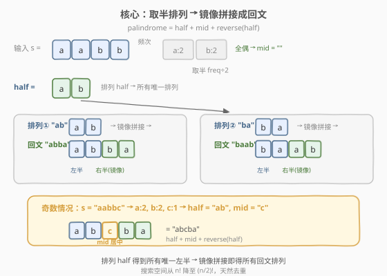
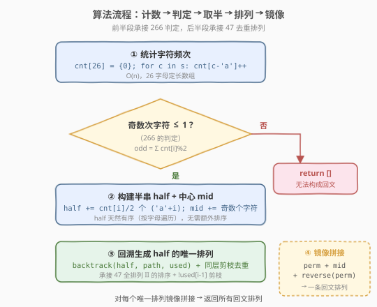
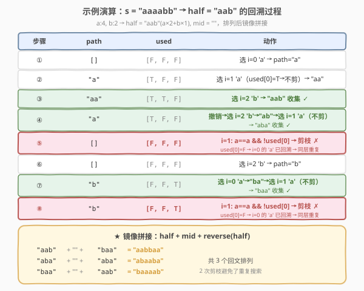

# LeetCode 回文排列 II 题解

## 1. 题目概述

- **标题 / 题号**：回文排列 II（#267，medium）
- **链接**：https://leetcode.cn/problems/palindrome-permutation-ii/
- **难度**：中等
- **标签**：哈希表、字符串、回溯

**题意**：给定一个字符串 `s`，返回 `s` 的所有**回文排列**（不含重复）。若不存在任何回文排列，返回空列表。

> ⚠️ 本题为 LeetCode **会员锁题**，题意与 [266 回文排列](./266_回文排列.md) 一脉相承：266 问「能不能」，本题问「构造出全部」。

**示例 1**：

```text
输入：s = "aabb"
输出：["abba", "baab"]
解释：a 出现 2 次、b 出现 2 次，全偶。取半 "ab"，排列得 "ab"/"ba"，镜像拼接为 "abba"/"baab"。
```

**示例 2**：

```text
输入：s = "abc"
输出：[]
解释：a/b/c 各 1 次，3 个奇数次字符 > 1，无法构成回文。
```

**约束**：

- $1 \le \text{s.length} \le 16$（会员题实际约束较松，方法可处理更大规模）
- `s` 只包含**小写英文字母**

> 💡 本题是回文家族的「**枚举构造**」终章——向下承接 [266 回文排列](./266_回文排列.md) 的可行性判定（奇数次字符 $\le 1$），向旁借力 [47 全排列 II](../0001-0100/47_全排列II.md) 的排序 + 同层剪枝去重。核心降维：回文关于中心镜像，故只需排列**左半**，右半由镜像自动确定——搜索空间从 $O(n!)$ 降至 $O((n/2)!)$。

## 2. 解题思路

### 2.1 暴力思路：枚举全排列逐个判回文

最直觉的做法：生成 `s` 的所有全排列（用 [46 全排列](../0001-0100/46_全排列.md) 模板），逐个检查是否回文，用 `HashSet` 去重。

> ⚠️ 三重浪费：① 对 $n = 16$，全排列达 $16! \approx 2 \times 10^{13}$，完全不可行；② 大量排列根本不是回文，白做检查；③ 重复排列先生成再过滤。暴力法回答了远超所需的问题。

### 2.2 核心观察：取半排列 + 镜像拼接



回文的本质是「**关于中心镜像**」：位置 $i$ 与 $n-1-i$ 的字符相同。这意味着**右半完全由左半决定**——只要确定了左半的排列，右半就是它的逆序。

> 💡 **降维定理**：设 `half` 为每个字符取 $\lfloor \text{freq} / 2 \rfloor$ 个组成的字符串，`mid` 为奇数次字符（至多 1 个）。则：
>
> $$\text{palindrome} = \text{half} + \text{mid} + \text{reverse}(\text{half})$$
>
> 所有回文排列 $\iff$ `half` 的所有唯一排列。搜索空间从 $n!$ 降至 $(n/2)!$。

以 `"aabb"` 为例：`a:2, b:2` → `half = "ab"`, `mid = ""`。

- 排列 `"ab"` → `"ab" + "" + "ba" = "abba"`
- 排列 `"ba"` → `"ba" + "" + "ab" = "baab"`

若 `s = "aabbc"`：`a:2, b:2, c:1` → `half = "ab"`, `mid = "c"`。排列 `"ab"` → `"ab" + "c" + "ba" = "abcba"`。

**前置判定**：先沿用 [266](./266_回文排列.md) 的判据——奇数次字符 $> 1$ 则直接返回 `[]`，无需进入排列阶段。

### 2.3 算法流程图



五步流程：

1. **统计频次**：`cnt[26]`，遍历 `s` 计数，$O(n)$。
2. **判定可行性**：数奇（`odd = Σ cnt[i] % 2`），`odd > 1` → 返回 `[]`（承接 266）。
3. **构建半串**：`half` 取每个字符 `cnt[i] / 2` 个，`mid` 取奇数次字符。按字母顺序遍历，`half` 天然有序，**无需额外排序**。
4. **回溯排列**：用 [47 全排列 II](../0001-0100/47_全排列II.md) 的排序 + 同层剪枝模板，生成 `half` 的所有唯一排列。
5. **镜像拼接**：对每个排列 `p`，输出 `p + mid + reverse(p)`。

> 💡 **为什么 half 天然有序？** 步骤 3 按 `i` 从 0 到 25 遍历字母表，`half.append(cnt[i]/2, 'a'+i)` 按 `a, b, c, ...` 顺序追加。相同字母连续排列，满足剪枝条件 `half[i] == half[i-1]` 所需的「相邻」前提，故无需调用 `sort`。

### 2.4 示例演算

以 `s = "aaaabb"` 为例：`a:4, b:2` → `half = "aab"`（`a×2 + b×1`），`mid = ""`。展示回溯树的 8 个关键步骤：



| 步骤 | path | used | 动作 |
|------|------|------|------|
| ① | `[]` | `[F,F,F]` | 选 i=0 `'a'` → `"a"` |
| ② | `"a"` | `[T,F,F]` | 选 i=1 `'a'`（`used[0]=T` → 不剪）→ `"aa"` |
| ③ | `"aa"` | `[T,T,F]` | 选 i=2 `'b'` → `"aab"` 收集 ✓ |
| ④ | `"a"` | `[T,F,F]` | 撤销→选 i=2 `'b'`→`"ab"`→选 i=1 `'a'`（不剪）→ `"aba"` 收集 ✓ |
| ⑤ | `[]` | `[F,F,F]` | i=1 `'a'`：`a==a && !used[0]` → **剪枝** ✗ |
| ⑥ | `[]` | `[F,F,F]` | 选 i=2 `'b'` → `"b"` |
| ⑦ | `"b"` | `[F,F,T]` | 选 i=0 `'a'`→`"ba"`→选 i=1 `'a'`（不剪）→ `"baa"` 收集 ✓ |
| ⑧ | `"b"` | `[F,F,T]` | i=1 `'a'`：`a==a && !used[0]` → **剪枝** ✗ |

> ⚠️ **步骤 ⑤ vs ② 的对比**（与 47 题步骤 ⑤ vs ⑧ 同构）：② 中 `used[0]=T`（`'a'` 在路径中）→ 选第二个 `'a'` 是不同位置 → **不剪**；⑤ 中 `used[0]=F`（`'a'` 已回溯撤销）→ 同层重复 → **剪**。这一 `!used[i-1]` 判定把 4! = 24 的搜索空间压缩到 3 个唯一排列。

最终镜像拼接：

| half 排列 | + mid + reverse | 回文排列 |
|-----------|-----------------|----------|
| `"aab"` | + `""` + `"baa"` | `"aabbaa"` |
| `"aba"` | + `""` + `"aba"` | `"abaaba"` |
| `"baa"` | + `""` + `"aab"` | `"baaaab"` |

共 3 个回文排列，无重复无遗漏。

## 3. 参考代码

### C++

```cpp
class Solution {
  public:
    vector<string> generatePalindromes(string s) {
        int cnt[26] = {0};
        for (char c : s) ++cnt[c - 'a'];

        string half, mid;
        for (int i = 0; i < 26; ++i) {
            if (cnt[i] & 1) mid.push_back('a' + i);
            half.append(cnt[i] / 2, 'a' + i);
        }

        if (mid.size() > 1) return {};

        vector<string> perms;
        string path;
        vector<bool> used(half.size(), false);
        backtrack(half, path, used, perms);

        vector<string> ans;
        for (string& p : perms) {
            string rev = p;
            reverse(rev.begin(), rev.end());
            ans.push_back(p + mid + rev);
        }
        return ans;
    }

  private:
    void backtrack(const string& half, string& path,
                   vector<bool>& used, vector<string>& ans) {
        if (path.size() == half.size()) {
            ans.push_back(path);
            return;
        }
        for (int i = 0; i < (int)half.size(); ++i) {
            if (used[i]) continue;
            if (i > 0 && half[i] == half[i - 1] && !used[i - 1]) continue;
            used[i] = true;
            path.push_back(half[i]);
            backtrack(half, path, used, ans);
            path.pop_back();
            used[i] = false;
        }
    }
};
```

### Python

```python
class Solution:
    def generatePalindromes(self, s: str) -> List[str]:
        cnt = [0] * 26
        for c in s:
            cnt[ord(c) - 97] += 1

        half, mid = [], ""
        for i in range(26):
            if cnt[i] & 1:
                mid += chr(i + 97)
            half.extend([chr(i + 97)] * (cnt[i] // 2))

        if len(mid) > 1:
            return []

        half_str = half
        perms = []
        used = [False] * len(half_str)

        def backtrack(path: List[str]) -> None:
            if len(path) == len(half_str):
                perms.append("".join(path))
                return
            for i in range(len(half_str)):
                if used[i]:
                    continue
                if i > 0 and half_str[i] == half_str[i - 1] and not used[i - 1]:
                    continue
                used[i] = True
                path.append(half_str[i])
                backtrack(path)
                path.pop()
                used[i] = False

        backtrack([])

        return [p + mid + p[::-1] for p in perms]
```

> 💡 **代码结构**：前半段（计数 + 判定 + 取半）承接 [266](./266_回文排列.md)，后半段（`backtrack` + 剪枝）承接 [47](../0001-0100/47_全排列II.md)。两块拼合即得本题——这正体现了回溯框架的积木式扩展性。`half` 按字母序构建天然有序，省去了 47 题中显式 `sort` 的一步。

> ⚠️ **Python 收集结果必须用** `"".join(path)` **而非直接存** `path` **引用**，原因同 [47](../0001-0100/47_全排列II.md)：`path` 是可变列表，后续 `pop()` 会改坏已存入的结果。

## 4. 复杂度分析

| 维度 | 复杂度 | 说明 |
|------|--------|------|
| 时间复杂度 | $O\bigl((n/2)! \cdot n\bigr)$ | 回溯生成 `half`（长度 $n/2$）的唯一排列，最坏 $(n/2)!$ 个；每个排列镜像拼接 $O(n)$ |
| 空间复杂度 | $O(n)$ | 递归栈深度 $n/2$ + `path`/`used` 各 $O(n/2)$（不计结果数组） |

> 💡 **与暴力 $O(n!)$ 的对比**：对 $n = 16$，暴力需 $16! \approx 2 \times 10^{13}$；取半后 $8! = 40320$，降维效果达 $10^9$ 倍。这正是「回文结构」带来的信息论优势——右半不独立，无需搜索。

> ⚠️ 当 `half` 中有大量重复字符时（如 `s = "aaaaaa"` → `half = "aaa"`），剪枝效果极为显著——3 个 `a` 的唯一排列仅 1 个（`"aaa"`），而非 $3! = 6$。

## 5. 扩展：从判定到构造——回文三连

| 题号 | 题目 | 问什么 | 核心判据/方法 |
|------|------|--------|--------------|
| [266](./266_回文排列.md) | 回文排列 | 能不能 | 奇数次字符 $\le 1$（判定） |
| [409](https://leetcode.cn/problems/longest-palindrome/) | 最长回文 | 最长多少 | $n - \max(0, \text{odd} - 1)$（最值） |
| **267** | **回文排列 II** | **构造全部** | **取半排列 + 镜像拼接（枚举）** |

三题共享「奇数次字符」这一回文判据，但从「判定」到「最值」到「构造」逐级升级。267 的独特之处在于引入了**降维**——利用回文的镜像对称性，把搜索空间砍半，再复用 47 的去重回溯生成左半排列。

> 💡 **为什么不用全排列 + 判回文？** 因为这放弃了回文的结构信息。正确的思路是：**先利用结构缩小搜索空间，再在缩小后的空间上搜索**。这一「结构先行」的原则在设计高效算法时无处不在——正如 [131 分割回文串](../0101-0200/131_分割回文串.md) 先预处理回文表再回溯，[132 分割回文串 II](../0101-0200/132_分割回文串II.md) 先预处理再 DP。

## 6. 面试要点

1. **为什么取半就能覆盖所有回文排列？**

   - 回文关于中心镜像，右半 $=$ reverse(左半)。故任意回文排列可唯一分解为 `(左半, 中心, 右半=reverse(左半))`。反之，任意 `half` 的排列 + `mid` + `reverse(half)` 都是合法回文。这建立了「half 的唯一排列」与「s 的回文排列」之间的**双射**，不重不漏。

2. **half 需要额外排序吗？**

   - 不需要。构建 `half` 时按字母表 `a` 到 `z` 顺序遍历，相同字符天然连续排列。剪枝条件 `half[i] == half[i-1]` 依赖相邻同值，这一前提已由构建顺序保证。对比 [47](../0001-0100/47_全排列II.md) 需显式 `sort`，本题省了这一步。

3. **剪枝条件 `!used[i-1]` 的含义是什么？**

   - `used[i-1] == false` 表示前一个同值元素在**同层**被选过又已回溯撤销——以它为首的子树已完整探索，再选同值的 `half[i]` 只会重复，故剪枝。若 `used[i-1] == true`，说明前一个同值元素在**当前路径**中（不同位置），选 `half[i]` 是新排列，不剪。与 47 题完全同源。

4. **如果字符集是 Unicode 怎么办？**

   - 定长 `cnt[26]` 不可行。改用 `Counter` 统计频次，`half` 从 `Counter` 按 key 排序构建（此时需显式排序以保证剪枝正确）。时间仍 $O(n + (n/2)!)$，空间 $O(k)$（$k$ 为不同字符数）。判定逻辑不变。

5. **本题和 47 全排列 II 的关系？**

   - 后半段完全是 47 的模板——排序 + `used` 数组 + `!used[i-1]` 同层剪枝。区别仅在于：① 搜索对象从 `nums` 换成 `half`（取半降维）；② 收集后多一步镜像拼接。这说明掌握了 47 的去重回溯框架，就能快速迁移到各类「生成唯一排列」的变体。

> 💡 **一句话总结**：回文排列 II = 266 判定 + 取半降维 + 47 去重回溯 + 镜像拼接。利用回文的镜像对称性把搜索空间砍半，在 `half` 上复用全排列 II 的同层剪枝生成唯一排列，最后 `p + mid + reverse(p)` 拼成完整回文。是「结构降维 + 框架复用」的典型范例。

## 同类练习题

| # | 题目 | 与本题的关联 |
|---|------|-------------|
| 266 | [回文排列](https://leetcode.cn/problems/palindrome-permutation/)（[题解](./266_回文排列.md)） | 判定能否重排成回文（奇数次字符 $\le 1$），本题的前置判定阶段 |
| 47 | [全排列 II](https://leetcode.cn/problems/permutations-ii/)（[题解](../0001-0100/47_全排列II.md)） | 含重复元素的唯一排列，本题后半段回溯模板的直接来源 |
| 409 | [最长回文](https://leetcode.cn/problems/longest-palindrome/) | 求能构造的最长回文长度，把 266 的「判定」升级为「最值」，三题共享奇数次字符判据 |
| 131 | [分割回文串](https://leetcode.cn/problems/palindrome-partitioning/)（[题解](../0101-0200/131_分割回文串.md)） | 回溯 + 回文判定，另一道「回文 + 回溯」组合题，对比本题的「回文 + 排列」 |
| 46 | [全排列](https://leetcode.cn/problems/permutations/)（[题解](../0001-0100/46_全排列.md)） | 不含重复元素的全排列母题，47 与本题回溯模板的基础 |
