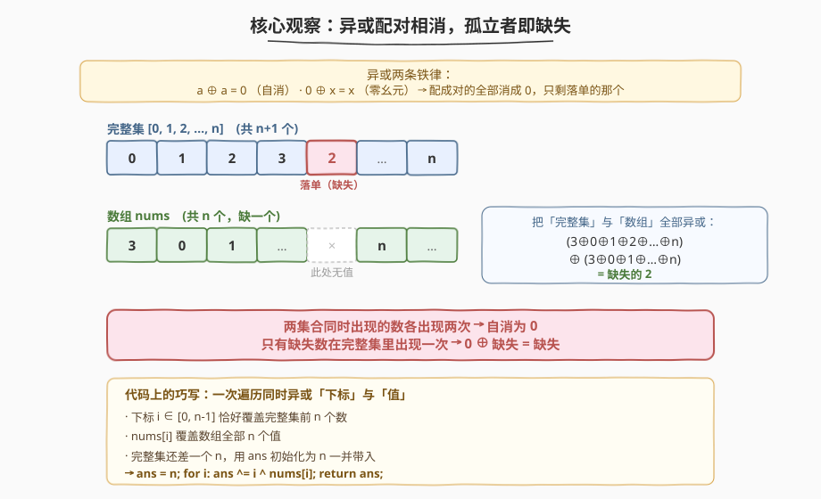
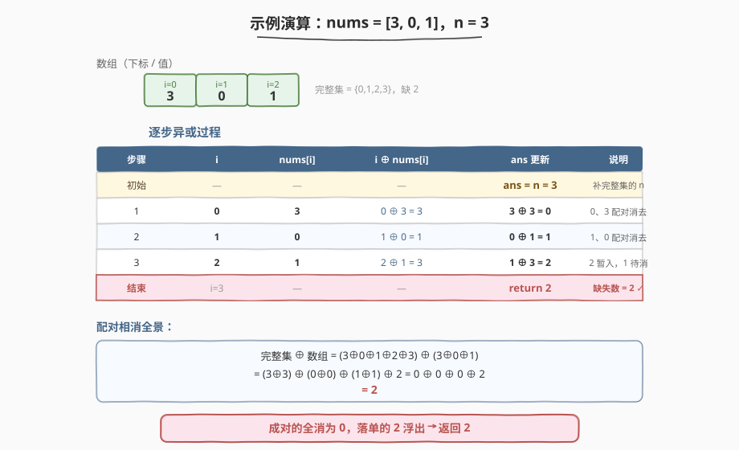

# LeetCode 丢失的数字 题解

## 1. 题目概述

- **标题 / 题号**：丢失的数字（#268，easy）
- **链接**：https://leetcode.cn/problems/missing-number/
- **难度**：简单
- **标签**：数组、位运算、异或、数学

**题意**：给定一个包含 `n` 个不同数字的数组 `nums`，这些数字取自 `[0, n]`（含端点）。也就是说，完整集合 $\{0, 1, 2, \dots, n\}$ 共有 $n + 1$ 个数，而数组只装了其中 $n$ 个，**恰好缺失一个**。请找出那个缺失的数字。

**约束**：

- $n = \text{nums.length}$
- $1 \le n \le 10^4$
- $0 \le \text{nums}[i] \le n$
- `nums` 中的所有数字**互不相同**

**进阶要求**：你能否实现 $O(n)$ 时间、$O(1)$ 空间且不借助求和（避免溢出讨论）的解法？

**示例 1**：

```text
输入：nums = [3,0,1]
输出：2
解释：n = 3，完整集合 {0,1,2,3} 中 2 未出现。
```

**示例 2**：

```text
输入：nums = [0,1]
输出：2
解释：n = 2，完整集合 {0,1,2} 中 2 未出现。
```

**示例 3**：

```text
输入：nums = [9,6,4,2,3,5,7,0,1]
输出：8
```

> 💡 这是一道"一眼就有思路"的入门题：排序、哈希、求和都能做。它的价值在于——**异或法**用一行循环、常数空间、无溢出风险地解决问题，是理解「异或配对相消」这一位运算核心思想的最佳敲门砖。掌握后可直接迁移到「只出现一次的数字」「错误的集合」等一整族题。

## 2. 解题思路

### 2.1 暴力思路

- **哈希集合**：把 `nums` 全部塞进 `set`，再从 $0$ 遍历到 $n$，第一个不在集合里的就是答案。时间 $O(n)$，但集合占 $O(n)$ 额外空间。
- **排序法**：先排序，再扫一遍找 `nums[i] != i` 的位置（若都匹配则缺失 `n`）。时间 $O(n \log n)$，空间取决于排序实现。
- **求和法**：用等差数列求和公式 $\frac{n(n+1)}{2}$ 减去数组之和，差值即缺失数。时间 $O(n)$、空间 $O(1)$，简单优雅，但**大 $n$ 时求和可能溢出**（本题 $n \le 10^4$ 不会溢出 32 位整数，但作为通用技巧有隐患）。

> ⚠️ 三种朴素法都能 AC，但哈希法空间超标、排序法时间偏高、求和法有理论溢出隐患。进阶要求点名的"不借助求和"，正是引导我们用**异或**这种「天然防溢出」的位运算手段。

### 2.2 核心观察：异或配对相消，孤立者即缺失



关键洞察源于异或运算的两条铁律：

1. **自反性**：$a \oplus a = 0$（任何数与自身异或为 0）。
2. **零幺元**：$0 \oplus x = x$（0 与任何数异或不变）。

把这两条合起来：**如果一堆数里每个数都成对出现，整堆异或结果为 0；若再混入一个落单的 $x$，结果就是 $x$**。

现在把「完整集合 $\{0, 1, \dots, n\}$」和「数组 `nums`」**全部异或在一起**：

- 每个出现在数组里的数，在完整集合里也有一个，**两两配对相消为 0**；
- 唯独那个**缺失数**只在完整集合里出现一次（数组里没有），无法配对，最终浮出。

> 💡 **代码上的巧写**：不必分别求「完整集异或」和「数组异或」再合并。注意到下标 $i$ 从 $0$ 取到 $n-1$，恰好覆盖完整集合的前 $n$ 个数；而 `nums[i]` 覆盖数组全部 $n$ 个值。于是**一次遍历同时异或下标和值**即可——只差完整集合的最后那个 $n$，用 `ans` 初始化为 $n$ 一并带入：
>
> `ans = n;  for i in 0..n-1:  ans ^= i ^ nums[i];  return ans;`

### 2.3 算法流程图

![算法流程：初始化 ans=n，遍历异或 i 与 nums[i]，循环结束返回 ans](../images/missing_number_algorithm_flow.svg)

流程极简，只有一趟遍历：

1. **初始化** `ans = n`（把完整集合里下标够不到的那个 $n$ 先放进累加器）。
2. **遍历** $i$ 从 $0$ 到 $n-1$：执行 `ans ^= i ^ nums[i]`，同时吃掉一个下标和一个数组值。
3. **返回** `ans`——此时所有成对的已相消，剩下的就是缺失数。

> ⚠️ **循环不变式**：每轮结束后，`ans` 等于「完整集 $\{n\} \cup \{0,\dots,i\}$」与「数组 $\{\text{nums}[0..i]\}$」的异或。已处理部分成对相消为 0，`ans` 始终代表「未处理部分 + 缺失数」的异或。遍历结束 $i = n$ 时，完整集与数组全部参与，`ans` 恰为缺失数。

### 2.4 示例演算

以 `nums = [3, 0, 1]`，$n = 3$ 为例（完整集 $\{0, 1, 2, 3\}$，缺失 $2$）：



| 步骤 | $i$ | $\text{nums}[i]$ | $i \oplus \text{nums}[i]$ | `ans` 更新 | 说明 |
|------|-----|------------------|---------------------------|------------|------|
| 初始 | — | — | — | `ans = n = 3` | 补完整集的 $n$ |
| 1 | 0 | 3 | $0 \oplus 3 = 3$ | $3 \oplus 3 = 0$ | 0、3 配对消去 |
| 2 | 1 | 0 | $1 \oplus 0 = 1$ | $0 \oplus 1 = 1$ | 1、0 配对消去 |
| 3 | 2 | 1 | $2 \oplus 1 = 3$ | $1 \oplus 3 = 2$ | 2 暂入，1 待消 |
| 结束 | $i=3$ | — | — | **return 2** | 缺失数 = 2 ✓ |

**全景验证**：完整集 $\oplus$ 数组 $= (3 \oplus 0 \oplus 1 \oplus 2 \oplus 3) \oplus (3 \oplus 0 \oplus 1) = (3\oplus3)\oplus(0\oplus0)\oplus(1\oplus1)\oplus 2 = 0\oplus0\oplus0\oplus 2 = 2$ ✓。成对的全消为 0，落单的 2 浮出。

## 3. 参考代码

### C++（异或法，$O(n)$ / $O(1)$）

```cpp
class Solution {
  public:
    int missingNumber(vector<int>& nums) {
        int n = nums.size();
        int ans = n;                       // 把完整集的 n 先带入
        for (int i = 0; i < n; ++i) {
            ans ^= i ^ nums[i];            // 同时异或下标和值
        }
        return ans;
    }
};
```

### Python

```python
class Solution:
    def missingNumber(self, nums: List[int]) -> int:
        n = len(nums)
        ans = n                            # 把完整集的 n 先带入
        for i, x in enumerate(nums):
            ans ^= i ^ x                   # 同时异或下标和值
        return ans
```

> 💡 为什么 `ans ^= i ^ nums[i]` 一行就够？因为「下标 $i$」覆盖完整集前 $n$ 个数、「`nums[i]`」覆盖数组全部值，二者在同一轮里同时被异或进去；加上初始的 $n$，完整集 $\{0,\dots,n\}$ 与数组 `nums` 的所有元素恰好各参与一次。异或满足交换律与结合律，顺序无关，结果只取决于「谁落单」。

## 4. 复杂度分析

| 维度 | 复杂度 | 说明 |
|------|--------|------|
| 时间复杂度 | $O(n)$ | 一趟遍历，每轮常数次异或，共 $n$ 轮 |
| 空间复杂度 | $O(1)$ | 仅 `ans`、`i` 两个变量，无额外数据结构 |

> 💡 这是该题的最优解：时间已达下界 $O(n)$（必须至少看一遍所有元素才能确定缺失），空间为常数。相比求和法，异或法全程在位级别运算，**无溢出风险**，是 $O(1)$ 空间下最稳妥的通用写法。

## 5. 扩展：求和法（高斯公式）

若不在意溢出讨论，求和法是最直觉的 $O(n)$ / $O(1)$ 解法——用等差数列求和公式减去数组之和：

$$\text{missing} = \frac{n(n+1)}{2} - \sum_{i=0}^{n-1} \text{nums}[i]$$

```cpp
class Solution {
  public:
    int missingNumber(vector<int>& nums) {
        int n = nums.size();
        int total = n * (n + 1) / 2;       // 完整集合的和
        int sum = 0;
        for (int x : nums) sum += x;
        return total - sum;
    }
};
```

```python
class Solution:
    def missingNumber(self, nums: List[int]) -> int:
        n = len(nums)
        return n * (n + 1) // 2 - sum(nums)
```

两种方法对比：

| 方法 | 时间 | 空间 | 溢出风险 | 特点 |
|------|------|------|----------|------|
| 异或法 | $O(n)$ | $O(1)$ | 无 | 位运算，天然防溢出，进阶要求首选 |
| 求和法 | $O(n)$ | $O(1)$ | 有（大 $n$ 时） | 数学公式，最易想到，Python 无溢出 |

> 💡 **溢出边界**：本题 $n \le 10^4$，$\frac{n(n+1)}{2} \le \frac{10^4 \times 10^5}{2} \approx 5 \times 10^7$，远在 32 位有符号整数上界 $2^{31}-1 \approx 2.1 \times 10^9$ 之内，C++ `int` 安全。若 $n$ 放大到 $10^5$ 量级（部分平台加强版数据），求和约 $5 \times 10^9$ 会溢出 `int`，需改 `long long`；异或法全程不累加，无此隐患。Python 整数任意精度，两种写法都安全。

> 💡 面试推荐：先讲异或法（满足进阶、防溢出、炫位运算功底），再补求和法作为「最朴素对照」，体现从直觉到优化的思维路径。

## 6. 面试要点

1. **为什么异或能找出缺失数？**

   - 异或有自反性 $a \oplus a = 0$ 和零幺元 $0 \oplus x = x$。把「完整集合」和「数组」全部异或：每个出现在数组里的数在完整集里也有一个，两两配对相消为 0；唯独缺失数只在完整集里出现一次，落单浮出。等价于「成对的全消，剩谁谁缺失」。

2. **`ans` 为什么初始化为 `n` 而不是 `0`？**

   - 下标 $i$ 只能取到 $n-1$，覆盖完整集 $\{0,\dots,n\}$ 的前 $n$ 个数，唯独漏掉 $n$ 本身。把 `ans` 初始化为 $n` 相当于预先把完整集的最后一个数塞进累加器，保证完整集所有元素都参与异或。若初始化为 0，则需在循环后再 `ans ^= n`，等价但多一步。

3. **异或法相比求和法有什么优势？**

   - 主要是**无溢出风险**：异或在位级别运算，结果位数不超过操作数，不会因累加而溢出。求和法在 $n$ 很大时 $\frac{n(n+1)}{2}$ 可能超出整型范围（C++ 需 `long long`，Python 无此问题）。此外异或法天然满足进阶要求"不借助求和"，是面试官想听的位运算解法。

4. **数组无序会影响异或法吗？为什么？**

   - 不会。异或满足**交换律**（$a\oplus b = b\oplus a$）和**结合律**（$(a\oplus b)\oplus c = a\oplus(b\oplus c)$），最终结果只取决于「哪些数参与了异或」，与顺序无关。数组乱序只是改变了配对消去的先后，不影响最终落单的那个。

5. **如果题目改为"数组里有重复，找一个重复和一个缺失"怎么办？**

   - 这是 [645. 错误的集合](https://leetcode.cn/problems/set-mismatch/)。异或法可扩展：先异或找出「重复 ⊕ 缺失」（二者不同，结果非 0），再按某一位区分两类数（与 [260. 只出现一次的数字 III](https://leetcode.cn/problems/single-number-iii/) 同模板），最后各做一次定位异或分别求出。是异或"配对相消"思想的进阶应用。

## 同类练习题

| # | 题目 | 与本题的关联 |
|---|------|-------------|
| 136 | [只出现一次的数字](https://leetcode.cn/problems/single-number/) | 异或配对相消的母题——除一个数外其余都出现两次，一次异或即得，本题的思想源头 |
| 287 | [寻找重复数](https://leetcode.cn/problems/find-the-duplicate-number/)（[题解](./287_寻找重复数.md)） | 同族对偶题——本题找"缺失"，287 找"重复"，对照体会鸽巢与判圈两种思路 |
| 448 | [找到所有数组中消失的数字](https://leetcode.cn/problems/find-all-numbers-disappeared-in-an-array/)（[题解](../0401-0500/448_找到所有数组中消失的数字.md)） | 批量找缺失，值域 $[1,n]$ 用原地标记法，对照本题只缺一个的异或解法 |
| 645 | [错误的集合](https://leetcode.cn/problems/set-mismatch/) | 找一个重复 + 一个缺失的综合题，异或法按位分组的进阶应用 |
| 41 | [缺失的第一个正数](https://leetcode.cn/problems/first-missing-positive/)（[题解](../0001-0100/41_缺失的第一个正数.md)） | 困难版，值域为任意整数，需先缩小范围再原地哈希，循环交换法的招牌题 |
