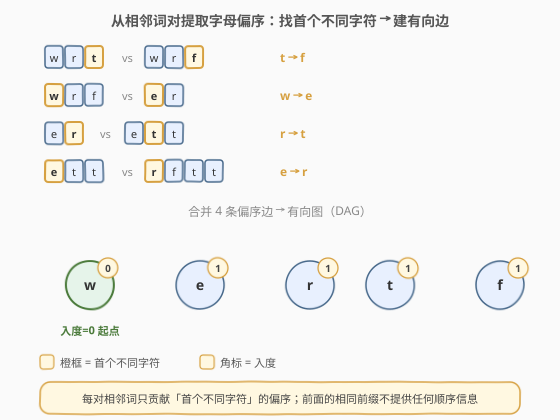
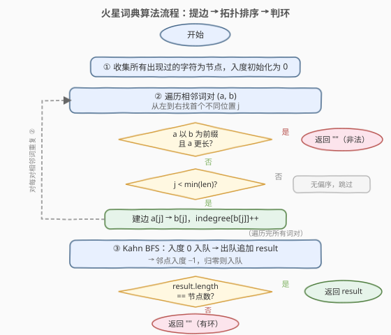
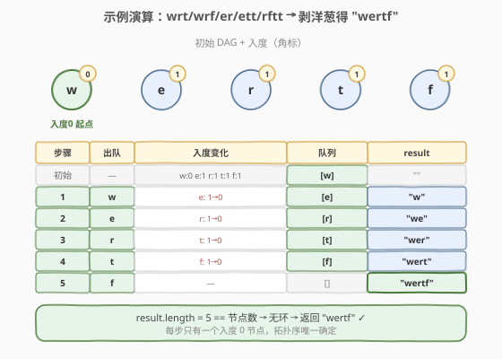

# LeetCode 火星词典 题解

## 1. 题目概述

- **标题 / 题号**：火星词典（#269，hard）
- **链接**：https://leetcode.cn/problems/alien-dictionary/
- **难度**：困难
- **标签**：拓扑排序、图、广度优先搜索、深度优先搜索

**题意**：一种外星语言使用英文小写字母，但**字母顺序未知**。你拿到该语言的词典 `words`，其中的单词**按外星语言的字母顺序排列**。请根据这份有序词典，推断出外星语言中所有出现过的字母的一种合法排列顺序，返回该排列字符串。若**不存在合法顺序**（存在矛盾/环），返回空字符串 `""`。

**示例 1**：

```text
输入：words = ["wrt","wrf","er","ett","rftt"]
输出："wertf"
解释：从相邻词对可提取偏序 t<f, w<e, r<t, e<r，串联得 w<e<r<t<f。
```

**示例 2**：

```text
输入：words = ["z","x"]
输出："zx"
解释：z < x，直接返回 "zx"。
```

**示例 3**：

```text
输入：words = ["z","x","z"]
输出：""
解释：z<x 且 x<z → 矛盾（环），无合法顺序。
```

**约束**：

- `1 <= words.length <= 100`
- `1 <= words[i].length <= 100`
- `words[i]` 仅由小写英文字母组成

> 💡 本题是 [207. 课程表](../0201-0300/207_课程表.md) 的「输出拓扑序」版——把课程依赖换成字母偏序，判可行升级为求具体顺序。核心仍是 Kahn 拓扑排序，难点在**如何从有序单词列表中正确提取偏序边**与**前缀非法判定**。

## 2. 解题思路

### 2.1 暴力思路

对词典中所有字母做全排列，逐一验证该排列是否与词典中每对相邻词的顺序一致。验证方式：按候选排列给每个字母编号，比较相邻词的编号序列是否非递减。字母数至多 26，全排列 $26!$ 种——显然不可行。

优化方向：不需要枚举所有排列，只需从相邻词对中**提取偏序约束**（谁在谁前面），再用拓扑排序求出一个满足所有约束的顺序。这正是**把隐式的排序信息转化为显式的有向图**的过程。

### 2.2 核心观察：相邻词对提取偏序 + 拓扑排序



关键直觉：

- **只有相邻词对才提供有效信息**：若 `words[i] < words[i+1]`，它们之间的顺序由**第一个不同的字符**决定，前面相同的前缀不提供任何顺序信息。
- **提取偏序边**：找到相邻词对 `a, b` 从左到右首个不同位置 `j`，若 `a[j] != b[j]`，则在外星语言中 `a[j]` 排在 `b[j]` 前面，建有向边 `a[j] → b[j]`。
- **前缀非法检测**：若 `a` 比 `b` 长，且 `b` 是 `a` 的前缀（即 `a = b + 后缀`），说明较长的词排在了较短的前缀词前面——这在任何字典序中都**不合法**（短前缀应该排在前面，如 `"ab" < "abc"`），直接返回 `""`。
- **拓扑排序求序**：所有偏序边构成有向图，对图做 Kahn BFS 拓扑排序，出队顺序即字母排列。若存在环（拓扑序长度 < 节点数），说明约束矛盾，返回 `""`。

> 💡 一句话：**相邻词对的首个不同字符给出偏序边，Kahn 拓扑排序出队顺序即为答案**。前缀非法（长词排在前缀短词前面）是唯一需要单独检测的退化情况。

> ⚠️ **为什么只看相邻词对？** 词典已排序，`words[i] < words[i+1]` 是直接的偏序来源；非相邻词对（如 `words[0]` vs `words[2]`）的偏序已被相邻关系传递蕴含，无需重复提取。这与「排序数组中只需比较相邻元素」同理。

### 2.3 算法流程图



三阶段：① 收集字符建节点 → ② 遍历相邻词对提取偏序边（含前缀非法检测）→ ③ Kahn BFS 拓扑排序判环并输出。每条偏序边在建图时被访问一次，拓扑排序中每条边在删边时访问一次，总时间 $O(C + V + E)$（$C$ 为所有单词总字符数）。

### 2.4 示例演算



以 `words = ["wrt","wrf","er","ett","rftt"]` 为例：

| 相邻词对 | 首个不同位置 j | 偏序边 |
|----------|---------------|--------|
| `"wrt"` vs `"wrf"` | j=2 (t vs f) | t → f |
| `"wrf"` vs `"er"` | j=0 (w vs e) | w → e |
| `"er"` vs `"ett"` | j=1 (r vs t) | r → t |
| `"ett"` vs `"rftt"` | j=0 (e vs r) | e → r |

4 条边串联成链 `w → e → r → t → f`，入度分别为 0/1/1/1/1。Kahn 从唯一入度 0 的 `w` 开始，逐步剥洋葱：

| 步骤 | 出队 | 入度变化 | 队列 | result |
|------|------|----------|------|--------|
| 初始 | — | w:0 e:1 r:1 t:1 f:1 | `[w]` | `""` |
| 1 | w | e:1→0 | `[e]` | `"w"` |
| 2 | e | r:1→0 | `[r]` | `"we"` |
| 3 | r | t:1→0 | `[t]` | `"wer"` |
| 4 | t | f:1→0 | `[f]` | `"wert"` |
| 5 | f | — | `[]` | `"wertf"` |

`result.length = 5 == 节点数`，无环，返回 `"wertf"`。本题每步只有一个入度 0 节点，拓扑序唯一确定；若多个节点同时入度为 0，返回任意一个合法顺序即可。

> ⚠️ **前缀非法示例**：`words = ["abc", "ab"]`，`a` = `"abc"` 比 `b` = `"ab"` 长，且 `b` 是 `a` 的前缀（`j = min(3,2) = 2`，`a[0..2) == b[0..2)` 即 `"ab" == "ab"`），说明 `"abc"` 排在 `"ab"` 前面——任何字典序中短前缀必排在前，矛盾，返回 `""`。对照合法情况 `["ab", "abc"]`：`j = 2 == min(2,3)`，但 `len(a)=2 < len(b)=3`，短词排前面合法，不建边。

## 3. 参考代码

### C++

```cpp
class Solution {
  public:
    string alienOrder(vector<string>& words) {
        // ① 收集所有出现过的字符为节点，入度初始化为 0
        unordered_map<char, unordered_set<char>> adj;
        unordered_map<char, int> indegree;
        for (const string& w : words)
            for (char c : w)
                indegree[c] = 0;          // 确保每个字符都是图中的节点

        // ② 遍历相邻词对，提取偏序边
        for (int i = 0; i + 1 < (int)words.size(); ++i) {
            const string& a = words[i];
            const string& b = words[i + 1];
            int n = min(a.size(), b.size());
            int j = 0;
            while (j < n && a[j] == b[j]) ++j;   // 找首个不同位置
            if (j == n && a.size() > b.size())   // 前缀非法：长词排在前缀短词前
                return "";
            if (j < n) {                         // a[j] != b[j] → 建边 a[j]→b[j]
                if (adj[a[j]].insert(b[j]).second)  // 去重：同一对边只算一次
                    indegree[b[j]]++;
            }
        }

        // ③ Kahn BFS 拓扑排序
        queue<char> q;
        for (auto& [c, d] : indegree)
            if (d == 0) q.push(c);

        string result;
        while (!q.empty()) {
            char u = q.front(); q.pop();
            result.push_back(u);
            for (char v : adj[u])
                if (--indegree[v] == 0) q.push(v);
        }

        // 有环则拓扑序长度 < 节点数
        return result.size() == indegree.size() ? result : "";
    }
};
```

### Python

```python
from collections import deque, defaultdict

class Solution:
    def alienOrder(self, words: List[str]) -> str:
        # ① 收集所有出现过的字符为节点，入度初始化为 0
        indegree = {c: 0 for w in words for c in w}
        adj = defaultdict(set)

        # ② 遍历相邻词对，提取偏序边
        for i in range(len(words) - 1):
            a, b = words[i], words[i + 1]
            n = min(len(a), len(b))
            j = 0
            while j < n and a[j] == b[j]:
                j += 1                        # 找首个不同位置
            if j == n and len(a) > len(b):    # 前缀非法
                return ""
            if j < n:                         # a[j] != b[j] → 建边 a[j]→b[j]
                if b[j] not in adj[a[j]]:     # 去重：同一对边只算一次
                    adj[a[j]].add(b[j])
                    indegree[b[j]] += 1

        # ③ Kahn BFS 拓扑排序
        q = deque([c for c in indegree if indegree[c] == 0])
        result = []
        while q:
            u = q.popleft()
            result.append(u)
            for v in adj[u]:
                indegree[v] -= 1
                if indegree[v] == 0:
                    q.append(v)

        # 有环则拓扑序长度 < 节点数
        return "".join(result) if len(result) == len(indegree) else ""
```

> 💡 **两处去重细节**：① **边去重**——同一对字符可能从多个相邻词对中重复提取（如 `["ab","ac","ad"]` 会三次得到 `a` 在前），用 `set` 存邻接表 + `insert().second` / `not in` 判重，保证入度不被多算；② **节点全覆盖**——`indegree` 字典必须包含所有出现过的字符（包括只出现在一个词中、没有偏序约束的字符），否则 `result.size() == indegree.size()` 的环检测会误判。Python 中 `{c: 0 for w in words for c in w}` 一行搞定，同时保留首次出现顺序使输出确定。

## 4. 复杂度分析

| 维度 | 复杂度 | 说明 |
|------|--------|------|
| 时间复杂度 | $O(C + V + E)$ | $C$ 为所有单词总字符数（遍历词对找首个不同 + 收集字符各 $O(C)$）；拓扑排序 $O(V+E)$，其中 $V \le 26$、$E \le 26 \times 25$ |
| 空间复杂度 | $O(C + V + E)$ | 邻接表 $O(V+E)$，入度字典 $O(V)$；$V \le 26$ 故图部分 $O(1)$，但收集字符需遍历所有单词 $O(C)$ |

> ⚠️ 字母表大小固定为 26，因此 $V$ 和 $E$ 都是常数级（$V \le 26, E \le 325$），图的拓扑排序部分是 $O(1)$。真正的时间瓶颈是**遍历所有单词对找首个不同字符**，最坏每对要比较到较短词末尾，合计 $O(C)$。所以整体复杂度由 $C$ 主导，即 $O(C)$。

## 5. 扩展：DFS 后序逆序与字典序最小输出

### 5.1 DFS 三色标记法（替代 Kahn）

除 Kahn BFS 外，可用 [207. 课程表](../0201-0300/207_课程表.md) 的 DFS 三色标记法：对每个未访问节点 DFS，节点离开递归栈时（标记 `2` 前）压入结果栈，最终栈的逆序即拓扑序。若递归途中遇到「访问中」（颜色 `1`）的节点，说明存在回边 → 环 → 返回 `""`。

```python
def alienOrder_dfs(self, words):
    adj = defaultdict(set)
    indegree_chars = {c for w in words for c in w}
    for i in range(len(words) - 1):
        a, b = words[i], words[i + 1]
        n = min(len(a), len(b))
        j = 0
        while j < n and a[j] == b[j]: j += 1
        if j == n and len(a) > len(b): return ""
        if j < n: adj[a[j]].add(b[j])

    color = {c: 0 for c in indegree_chars}  # 0 未访问 / 1 访问中 / 2 已完成
    result = []
    def dfs(u):
        color[u] = 1
        for v in adj[u]:
            if color[v] == 1: return False    # 回边 → 环
            if color[v] == 0 and not dfs(v): return False
        color[u] = 2
        result.append(u)                       # 离开时记录（后序）
        return True
    for c in indegree_chars:
        if color[c] == 0 and not dfs(c): return ""
    return "".join(reversed(result))            # 后序逆序 = 拓扑序
```

> 💡 **DFS 后序逆序 = 拓扑序**的直觉：一个节点在它指向的所有节点之后离开递归栈（后序），所以后序序列中「被指向的节点」排在「指向它的节点」前面，逆序后「指向者」排前 → 拓扑序。

### 5.2 字典序最小的拓扑序

本题只要求返回**任意一个**合法顺序。若要求返回**字典序最小**的合法顺序，只需把 Kahn 的队列换成**最小堆**（优先弹出最小的字符），即可在每步贪心地选最小的可用节点：

```python
import heapq
q = [c for c in indegree if indegree[c] == 0]
heapq.heapify(q)
# while q: u = heapq.heappop(q); ... heapq.heappush(q, v) ...
```

这与 [329. 矩阵中的最长递增路径](https://leetcode.cn/problems/longest-increasing-path-in-a-matrix/) 中「按拓扑序 DP 松弛」的思想一脉相承——拓扑序确定了节点的处理顺序，在此顺序上做贪心/DP 即可保证正确性。

## 6. 面试要点

1. **为什么只比较相邻词对，不需要比较所有词对？**
   > 词典已按外星语言排序，`words[i] < words[i+1]` 的偏序信息已蕴含 `words[i] < words[i+k]`（传递性）。只看相邻词对足以提取所有直接的偏序约束，非相邻词对的信息是冗余的，与「检查排序数组只需比较相邻元素」同理。

2. **前缀非法检测的条件是什么？为什么这是非法的？**
   > 当 `a` 以 `b` 为前缀且 `a` 比 `b` 长时（即 `a` 和 `b` 在 `b` 的长度范围内完全相同，但 `a` 后面还有字符），说明 `a` 排在了 `b` 前面。在任何字典序中，短前缀词必排在以它为前缀的长词前面（如 `"ab" < "abc"`），所以这种情况矛盾，返回 `""`。检测条件：`j == min(len(a), len(b))` 且 `len(a) > len(b)`。

3. **为什么要对边去重？不去重会怎样？**
   > 同一对字符的偏序可能从多个相邻词对中重复提取（如 `["ba","bc","bd"]` 三次得到 `b < c/d`... 实际是 `b` 在前但 `a/c/d` 各不同；更好的例子是 `["ab","ac","ad"]` 三次得到 `b < c, b < d`... 其实更准确是 `a` 相同，`b/c/d` 不同）。真正会重复的是像 `["a","b","a","b"]` 这种，但更常见的是同一对边被不同词对重复贡献。不去重会导致入度被多算，使本该归零的节点无法归零，误判为有环。用 `set` 存邻接表 + 插入判重即可。

4. **如何判断存在环（矛盾约束）？**
   > Kahn BFS 结束后，若 `result.length < 节点数`，说明有节点入度始终未归零，困在环中（如 `["z","x","z"]` 提取 `z→x` 和 `x→z`，互为前驱，两者入度均为 1，队列初始为空，`result` 为空）。DFS 三色法则在递归途中遇到「访问中」节点即判定回边 → 环。

5. **只出现在一个单词中的字符怎么处理？**
   > 它们没有任何偏序约束（入度为 0），会在 Kahn 初始化时直接入队，出现在结果中。这就是为什么 `indegree` 字典必须包含所有出现过的字符——即使没有边指向它们，它们也是图中的合法节点，需要出现在最终排列中。若漏掉，`result.size() == indegree.size()` 的环检测会出错。

## 同类练习题

| # | 题目 | 与本题的关联 |
|---|------|-------------|
| 207 | [课程表](https://leetcode.cn/problems/course-schedule/) | 拓扑排序判环的母题，本题在其基础上增加「从有序序列提取偏序边」与「输出拓扑序」 |
| 210 | [课程表 II](https://leetcode.cn/problems/course-schedule-ii/) | 把 Kahn 的 `count` 换成出队顺序数组，直接输出拓扑序，与本题的输出要求一致 |
| 953 | [验证外星语词典](https://leetcode.cn/problems/verifying-an-alien-dictionary/) | 本题的逆问题——给定字母顺序，验证单词列表是否按该顺序排序 |
| 444 | [序列重构](https://leetcode.cn/problems/sequence-reconstruction/) | 从子序列重建原序列，同样用拓扑排序验证唯一性 |
| 329 | [矩阵中的最长递增路径](https://leetcode.cn/problems/longest-increasing-path-in-a-matrix/) | 拓扑排序 + DP，在拓扑序上松弛求最长路径，拓展拓扑排序的应用场景 |
