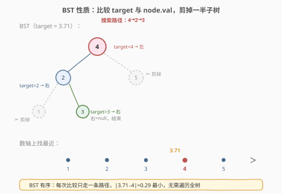
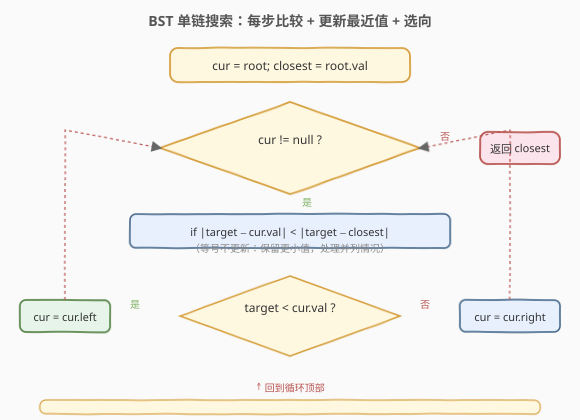
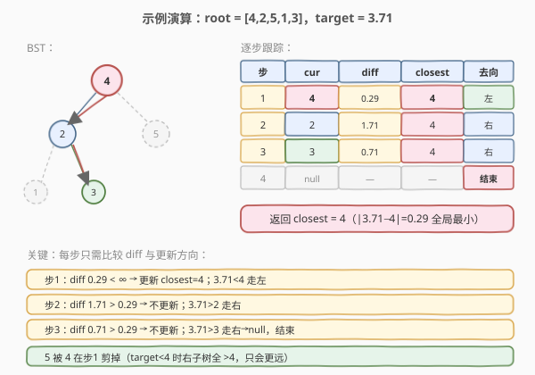

# 最接近的二叉搜索树值

- **题目名称**：最接近的二叉搜索树值
- **链接**：[270. 最接近的二叉搜索树值](https://leetcode.cn/problems/closest-binary-search-tree-value/)
- **难度**：简单
- **标签**：树、BST、二分查找

## 1. 题目概述

给定一棵**二叉搜索树（BST）**的根节点 `root` 和一个目标值 `target`，请返回树中**最接近 `target`** 的节点值。若有多个节点与 `target` 距离相同，返回**较小的那个值**。

> **BST 性质回顾**：对于任意节点 `node`，其左子树所有值 $< \text{node.val}$，右子树所有值 $> \text{node.val}$；中序遍历得到严格递增序列。

**示例 1**：

```text
输入：root = [4,2,5,1,3], target = 3.714286
输出：4
解释：树结构如下
        4
       / \
      2   5
     / \
    1   3
|3.714286 − 4| = 0.286 最小，故返回 4。
```

**示例 2**：

```text
输入：root = [1], target = 4.428571
输出：1
```

**约束条件**：

- 树中节点数在范围 `[1, 10^4]` 内
- `0 <= Node.val <= 10^9`
- `-10^9 <= target <= 10^9`

---

## 2. 解题思路

### 2.1 暴力思路：全量遍历 + 线性扫描

对 BST 做一次完整遍历（前序/中序均可），把所有值收集到数组，再线性扫描找 `|target − val|` 最小者。

- 时间复杂度 $O(n)$，空间复杂度 $O(n)$（存数组）或 $O(h)$（边遍历边维护）。
- 这能 AC，但**完全没有利用 BST 的有序性**——BST 的本质是「每次比较可剪掉一半子树」，本题只需走**一条从根到叶的路径**即可定位最近值。

### 2.2 核心观察：BST 单链搜索——每步比较 + 选向



BST 的有序性带来了一个关键推论：

> 💡 **最近值必在搜索路径上**。从根出发，按 `target` 与 `node.val` 的大小关系选向（`target < node.val` 走左，否则走右），沿途维护一个 `closest`。这条路径**就是二分查找在树上的镜像**——每访问一个节点就排除掉一半子树。

为什么「最近值必在搜索路径上」？因为 BST 的有序性保证：

- 当 `target < node.val` 时，`node` 的**右子树所有值更大**（$> \text{node.val} > \text{target}$），它们离 `target` 比 `node.val` 更远，**右子树整棵剪掉**。
- 当 `target > node.val` 时，`node` 的**左子树所有值更小**（$< \text{node.val} < \text{target}$），同理**左子树整棵剪掉**。
- 当 `target == node.val` 时，距离为 0，直接命中。

因此只需沿一条路径走到底，路径上一定包含最近值。路径长度等于树高 $h$，平衡 BST 下 $h = O(\log n)$。

> ⚠️ **并列情况处理**：当 `|target − cur.val| == |target − closest|` 时**不更新** `closest`。因为搜索路径天然有序——先访问的是更接近根的节点，其值未必更小；但并列时保留旧值可能丢掉「返回较小值」的要求。安全做法是：并列时取 `min(cur.val, closest)`，或直接用严格小于 `<` 不更新（因搜索路径从上往下，值未必单调，故推荐取 min 的写法，见代码注释）。

### 2.3 算法流程图



### 2.4 示例演算



以 `root = [4,2,5,1,3]`，`target = 3.714286` 为例，逐步跟踪：

| 步骤 | cur | `diff = |target − cur.val|` | closest | 更新？ | 去向 |
|------|-----|---------------------------|---------|--------|------|
| 1    | 4   | 0.286                     | 4       | 是（0.286 < ∞） | 3.71 < 4 → 左 |
| 2    | 2   | 1.714                     | 4       | 否（1.714 > 0.286） | 3.71 > 2 → 右 |
| 3    | 3   | 0.714                     | 4       | 否（0.714 > 0.286） | 3.71 > 3 → 右 |
| 4    | null | —                        | 4       | —      | 结束 |

搜索路径 `4 → 2 → 3`，只访问 3 个节点（全树 5 个），右子树的 `5` 在第 1 步就被剪掉（`target < 4` 时右子树全 $> 4$，只会更远）。最终 `closest = 4`。✓

---

## 3. 参考代码

### C++

```cpp
class Solution {
  public:
    int closestValue(TreeNode* root, double target) {
        int closest = root->val;
        TreeNode* cur = root;
        while (cur) {
            if (std::abs(target - cur->val) < std::abs(target - closest)) {
                closest = cur->val;
            } else if (std::abs(target - cur->val) == std::abs(target - closest)) {
                closest = std::min(closest, cur->val);
            }
            cur = (target < cur->val) ? cur->left : cur->right;
        }
        return closest;
    }
};
```

### Python

```python
class Solution:
    def closestValue(self, root: Optional[TreeNode], target: float) -> int:
        closest = root.val
        cur = root
        while cur:
            if abs(target - cur.val) < abs(target - closest):
                closest = cur.val
            elif abs(target - cur.val) == abs(target - closest):
                closest = min(closest, cur.val)
            cur = cur.left if target < cur.val else cur.right
        return closest
```

> 💡 **并列分支的取舍**：用 `elif ==` 时取 `min` 是最稳妥的写法——搜索路径上的值并非单调（先大后小或反之都可能出现），所以不能假设「先到者更小」。若题目放宽为「任意一个最近值即可」，可删掉 `elif` 分支只保留严格 `<`。

---

## 4. 复杂度分析

| 维度 | 复杂度 | 说明 |
|------|--------|------|
| 时间复杂度 | $O(h)$ | 只走一条从根到叶的路径，每步 $O(1)$；平衡 BST 下 $h = O(\log n)$，最坏（退化为链）$h = O(n)$ |
| 空间复杂度 | $O(1)$ | 迭代法仅用 `cur` / `closest` 两个变量，无栈无数组 |

> ⚠️ 暴力遍历为 $O(n)$ 时间 + $O(n)$ 空间。BST 单链搜索法利用有序性优化到 $O(h)$ 时间 + $O(1)$ 空间，是本题的最优解。

---

## 5. 扩展：递归写法与 k 最近值（272）

### 5.1 递归写法

迭代和递归等价，递归更简洁但牺牲 $O(h)$ 栈空间：

```cpp
class Solution {
  public:
    int closestValue(TreeNode* root, double target) {
        TreeNode* child = (target < root->val) ? root->left : root->right;
        if (!child) return root->val;
        int sub = closestValue(child, target);
        auto d1 = std::abs(target - root->val);
        auto d2 = std::abs(target - sub);
        if (d1 < d2) return root->val;
        if (d2 < d1) return sub;
        return std::min(root->val, sub);
    }
};
```

### 5.2 进阶：272. 最接近的二叉搜索树值 II

返回 **k 个**最接近的值。此时单链搜索不够——最近值可能分散在搜索路径两侧。主流解法：

1. **中序遍历得到升序数组** + 双端队列/双指针：中序 $O(n)$，再用双指针从「target 插入位置」向两侧扩散取 k 个，$O(n)$。
2. **两个栈分别维护前驱/后继迭代器**（中序的前驱栈与后继栈），每次取更近的一侧推进，$O(h + k)$。这是最优解，承接本题的「单链搜索」思想升级为「双向迭代器」。

---

## 6. 面试要点

1. **为什么最近值一定在搜索路径上？**
   - BST 有序性保证：`target < node.val` 时右子树全更大、离 `target` 更远；`target > node.val` 时左子树全更小、同理更远。每步剪掉「必然更远」的半棵子树，最近值只可能在保留的那条路径上。

2. **并列时为什么要取 `min`？**
   - 题目要求「多个答案返回较小值」。搜索路径上的值并非单调递增/递减（如先走左到 2 再走右到 3），所以「先访问的」不一定是「更小的」。取 `min(cur.val, closest)` 是最安全的写法。

3. **时间复杂度是 $O(\log n)$ 还是 $O(n)$？**
   - 取决于树形。平衡 BST 为 $O(\log n)$；退化为链表时为 $O(n)$。这是所有「BST 单链搜索」类题目的通性——BST 的效率完全依赖平衡性。

4. **迭代 vs 递归怎么选？**
   - 迭代 $O(1)$ 空间，递归 $O(h)$ 栈空间。面试中迭代版展示对栈空间的敏感度，递归版更简洁。两者逻辑完全等价（都是沿一条路径走）。

5. **target 是 `double`，节点值是 `int`，比较时要注意什么？**
   - `|target − cur.val|` 的结果是 `double`，用 `std::abs`（C++）或 `abs`（Python 自动适配）。返回值是 `int`（节点值本身），不要把 `closest` 声明成 `double`。

---

## 7. 同类练习题

- [700. 二叉搜索树中的搜索](https://leetcode.cn/problems/search-in-a-binary-search-tree/)：BST 单链搜索的精确匹配版，本题是「最近值」版的母题
- [230. 二叉搜索树中第K小的元素](https://leetcode.cn/problems/kth-smallest-element-in-a-bst/)：BST 中序升序性质的应用，对比本题的「剪枝搜索」
- [98. 验证二叉搜索树](https://leetcode.cn/problems/validate-binary-search-tree/)：BST 中序单调性的判定，理解 BST 性质的基础
- [272. 最接近的二叉搜索树值 II](https://leetcode.cn/problems/closest-binary-search-tree-value-ii/)：本题的 k 个最近值进阶版，双栈迭代器 $O(h+k)$ 解法
