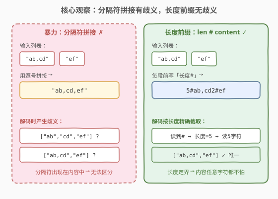
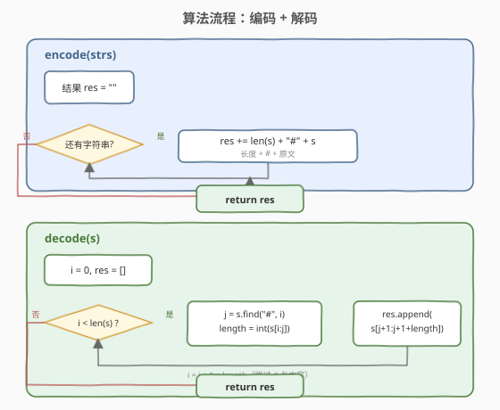
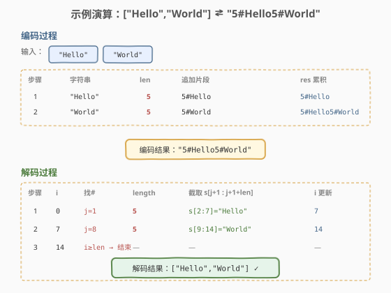

# 字符串的编码与解码

- **题目名称**：字符串的编码与解码
- **链接**：[271. 字符串的编码与解码](https://leetcode.cn/problems/encode-and-decode-strings/)
- **难度**：中等
- **标签**：设计、字符串、编码

## 1. 题目概述

设计一个算法把**字符串列表**编码为单个字符串，再将其解码还原为原列表。编码和解码分别由 `encode` 和 `decode` 两个方法实现。要求编解码互为逆操作——`decode(encode(strs)) == strs`。

**示例 1**：

```text
输入：strs = ["Hello","World"]
输出：["Hello","World"]
```

**示例 2**：

```text
输入：strs = [""]
输出：[""]
```

**示例 3**：

```text
输入：strs = ["we","say",":","yes"]
输出：["we","say",":","yes"]
```

**约束条件**：

- `0 <= strs.length < 100`
- `0 <= strs[i].length < 200`
- `strs[i]` 仅包含 UTF-8 字符
- 不允许借助类成员/全局状态在 `encode` 与 `decode` 间传递信息（必须自包含）

> ⚠️ **难点**：字符串内容可以包含**任意字符**——包括你选作分隔符的字符。这是本题区别于「普通 join/split」的核心。

---

## 2. 解题思路

### 2.1 暴力思路：分隔符拼接

最直觉的做法是选一个分隔符（如逗号 `,`），`",".join(strs)` 编码，`s.split(",")` 解码。

问题在于：**当字符串内容本身包含分隔符时，解码会产生歧义**。例如 `["ab,cd", "ef"]` 编码后是 `"ab,cd,ef"`，解码时无法判断原列表是 `["ab","cd","ef"]` 还是 `["ab,cd","ef"]`——结构信息丢失了。

> ⚠️ 换任何分隔符都一样：只要内容能包含该字符，歧义就存在。需要一个**与内容无关的定界方式**。

### 2.2 核心观察：长度前缀定界



关键思想：**不靠特殊字符定界，而靠「长度」定界**。对每个字符串，先写它的字符长度，再写一个分隔符 `#`，最后写字符串内容本身：

```
<len>#<content><len>#<content>...
```

为什么这样做无歧义？

- 解码时，先读到第一个 `#`——它**前面**的字符一定是数字（长度），`#` 后紧跟的**前 `len` 个字符**就是原文，**精确截取**，不多不少。
- 内容中即使出现 `#` 或数字也不影响：因为截取范围由 `len` **硬性规定**，读完 `len` 个字符就跳到下一段，内容里的 `#` 会被当作普通字符吞掉。

> 💡 **本质**：这是网络协议中**TLV（Type-Length-Value）**思想的简化版——用「长度」而非「特殊标记」来界定消息边界，因而对 Value 内容完全免疫。`#` 只承担「长度字段结束」的语义，不承担定界语义，所以它出现在内容中无关紧要。

### 2.3 算法流程图



**编码** `encode(strs)`：遍历列表，对每个字符串 `s` 追加 `str(len(s)) + "#" + s`。

**解码** `decode(s)`：用指针 `i` 扫描，循环直到末尾：
1. 从 `i` 起找到下一个 `#`，记其位置为 `j`；
2. 长度 `length = int(s[i:j])`；
3. 原文 `content = s[j+1 : j+1+length]`，加入结果；
4. `i = j + 1 + length`（跳过 `#` 与内容，指向下一段长度字段）。

### 2.4 示例演算



以 `strs = ["Hello","World"]` 为例：

**编码**：

| 步骤 | 字符串 | len | 追加片段 | res 累积 |
|------|--------|-----|----------|----------|
| 1 | `"Hello"` | 5 | `5#Hello` | `5#Hello` |
| 2 | `"World"` | 5 | `5#World` | `5#Hello5#World` |

**解码** `"5#Hello5#World"`：

| 步骤 | i | 找 # | length | 截取 `s[j+1:j+1+len]` | i 更新 |
|------|---|------|--------|----------------------|--------|
| 1 | 0 | j=1 | 5 | `s[2:7]` = `"Hello"` | 7 |
| 2 | 7 | j=8 | 5 | `s[9:14]` = `"World"` | 14 |
| 3 | 14 | i≥len，结束 | — | — | — |

最终 `["Hello","World"]`，与原列表一致。✓

> 💡 注意第 2 步：`i=7` 指向第二个 `5`，`find("#", 7)` 找到 `j=8`，`s[9:14]` 精确截取 5 个字符 `"World"`——即便内容里含 `#` 也会被这个长度硬性吞掉。

---

## 3. 参考代码

### C++

```cpp
class Codec {
  public:
    string encode(vector<string>& strs) {
        string res;
        for (const string& s : strs) {
            res += to_string(s.size()) + "#" + s;
        }
        return res;
    }

    vector<string> decode(string s) {
        vector<string> res;
        int i = 0;
        while (i < (int)s.size()) {
            int j = s.find('#', i);
            int length = stoi(s.substr(i, j - i));
            res.push_back(s.substr(j + 1, length));
            i = j + 1 + length;
        }
        return res;
    }
};
```

### Python

```python
class Codec:
    def encode(self, strs: list[str]) -> str:
        return "".join(f"{len(s)}#{s}" for s in strs)

    def decode(self, s: str) -> list[str]:
        res = []
        i = 0
        while i < len(s):
            j = s.find("#", i)
            length = int(s[i:j])
            res.append(s[j + 1 : j + 1 + length])
            i = j + 1 + length
        return res
```

> 💡 两个实现共享同一套骨架：**「找 # → 读长度 → 按长度截取 → 跳过」** 循环。Python 用切片 `s[j+1:j+1+length]` 天然处理越界（超出自动截断），C++ 用 `substr(pos, count)` 同理。注意 `find` 的第二个参数 `i` 指定搜索起点，避免每次从头扫。

---

## 4. 复杂度分析

| 维度 | 复杂度 | 说明 |
|------|--------|------|
| 时间复杂度 | $O(N)$ | 编码遍历所有字符一次；解码 `find` + `substr` 各扫一次，总体线性。$N$ 为所有字符串总长 |
| 空间复杂度 | $O(N)$ | 编码结果字符串长度等于 $N$ 加上长度前缀开销；解码结果列表存全部原文 |

> 💡 长度前缀的开销是 $O(k \cdot \log L)$（$k$ 为字符串个数，$L$ 为最大长度），相对内容本身可忽略，故整体仍为 $O(N)$。

---

## 5. 扩展：其他编码方案对比

| 方案 | 格式示例 | 优点 | 缺点 |
|------|----------|------|------|
| **长度前缀**（本题） | `5#Hello5#World` | 内容免疫、紧凑、易实现 | 长度字段需解析（但极简单） |
| 转义分隔符 | `ab\,cd,ef` | 直觉 | 转义规则复杂、内容含转义符需双重转义 |
| Base64 逐串 | `SGVsbG8=,V29ybGQ=` | 内容无歧义 | 体积膨胀 33%、仍需分隔符 |
| 定长头（二进制） | `[4B len][content]` | 最紧凑、无 `#` | 字符串载体需处理二进制安全 |

> ⚠️ **定长头方案**（每个字符串前固定写 4 字节长度）更紧凑且无需 `#`，但要求传输通道**二进制安全**。本题接口是 `string`，字符串可能因编码问题丢失某些字节，故「长度 + `#`」的文本方案更稳妥——`#` 是可打印 ASCII，不受编码影响。

---

## 6. 面试要点

1. **为什么不能用分隔符 join/split？**
   - 字符串内容可能包含分隔符本身。`["a,b"]` 用逗号拼接得 `"a,b"`，解码成 `["a","b"]` 就错了。任何固定分隔符都有此问题，因为约束允许任意字符。

2. **长度前缀为什么无歧义？**
   - 长度用数字表示，`#` 仅标记「数字结束」。解码时读完 `#` 后按长度**精确截取**内容，内容里的 `#` 或数字都被这个硬性长度吞掉，不参与定界，所以内容任意字符都安全。

3. **`#` 出现在内容中会不会出错？**
   - 不会。解码指针 `i` 总是指向「下一段长度字段」的起点，`find("#", i)` 只会在长度字段之后找到第一个 `#`。截取 `length` 个字符后，`i` 跳到下一段长度字段——内容中的 `#` 被包含在截取范围内，不会被当作分隔符。

4. **空字符串怎么处理？**
   - 长度为 0，编码为 `"0#"`（`0` + `#` + 空内容）。解码时 `length=0`，`substr(j+1, 0)` 返回空串，`i` 跳过 `#` 直接到下一段。无需特判。

5. **这题和 297（树的序列化）的区别？**
   - 297 序列化的是**树结构**，用「前序 + null 标记」编码拓扑；本题序列化的是**字符串列表**，用「长度前缀」编码边界。两者共同点是「显式编码结构信息以无损往返」，但定界手段不同：树靠 `#` 标记空位，列表靠长度定界。

---

## 7. 同类练习题

- [297. 二叉树的序列化与反序列化](https://leetcode.cn/problems/serialize-and-deserialize-binary-tree/)（[题解](../0201-0300/297_二叉树的序列化与反序列化.md)）：树结构序列化，用 null 标记编码拓扑，对比本题用长度编码边界
- [38. 外观数列](https://leetcode.cn/problems/count-and-say/)（[题解](../0001-0100/38_外观数列.md)）：RLE 行程编码（数字+字符），与长度前缀编码的思路同源，对比适用场景
- [449. 序列化和反序列化 BST](https://leetcode.cn/problems/serialize-and-deserialize-bst/)：297 的 BST 特化版，利用有序性压缩空位
- [168. Excel表列名称](https://leetcode.cn/problems/excel-sheet-column-title/)（[题解](../0001-0100/168_Excel表列名称.md)）：数字↔字符串的进制编码，对比本题的长度定界编码
