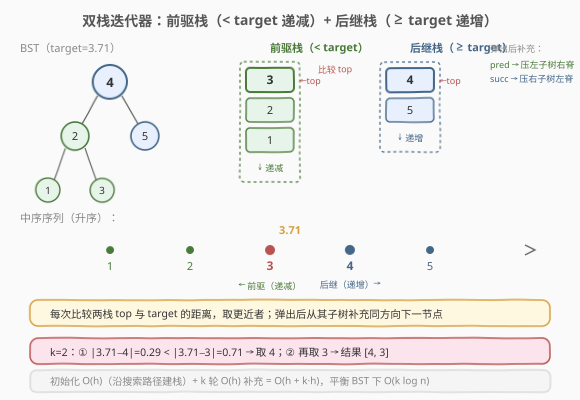
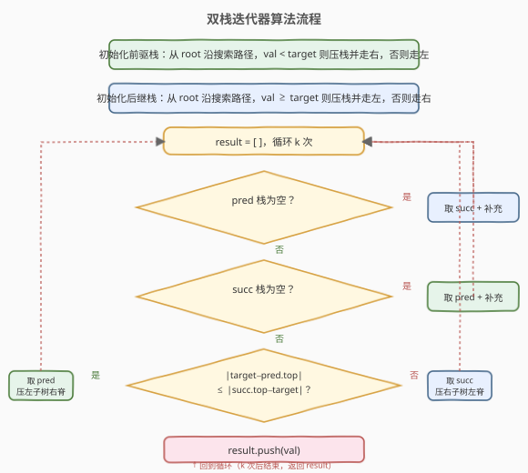
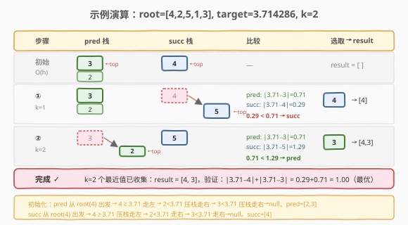

# 最接近的二叉搜索树值II

- **题目名称**：最接近的二叉搜索树值 II
- **链接**：[272. 最接近的二叉搜索树值 II](https://leetcode.cn/problems/closest-binary-search-tree-value-ii/)
- **难度**：困难
- **标签**：树、BST、栈、中序遍历

## 1. 题目概述

给定一棵**二叉搜索树（BST）**的根节点 `root`、一个目标值 `target` 和一个整数 `k`，请返回树中**最接近 `target`** 的 `k` 个节点值。可以按任意顺序返回。答案保证唯一。

> **与 270 的区别**：[270. 最接近的二叉搜索树值](../0201-0300/270_最接近的二叉搜索树值.md) 只需返回** 1 个**最近值——沿搜索路径走一条链即可；本题需要返回 **k 个**最近值，它们可能分散在搜索路径两侧，无法只走一条路径。

**示例 1**：

```text
输入：root = [4,2,5,1,3], target = 3.714286, k = 2
输出：[4,3]
解释：树结构如下
        4
       / \
      2   5
     / \
    1   3
|3.714286 − 4| = 0.286，|3.714286 − 3| = 0.714，
两个最近值是 4 和 3。
```

**示例 2**：

```text
输入：root = [1], target = 0.000000, k = 1
输出：[1]
```

**约束条件**：

- 树中节点数在范围 `[1, 10^4]` 内
- `0 <= Node.val <= 10^9`
- `-10^9 <= target <= 10^9`
- `1 <= k <= 树中节点数`
- **进阶**：假设 BST 是平衡的，能否在 $O(h + k)$ 时间内解决？（$h$ 为树高）

---

## 2. 解题思路

### 2.1 暴力思路：中序遍历 + 全量排序

对 BST 做一次完整中序遍历，得到升序数组 `[1,2,3,4,5]`，再按 `|val − target|` 排序取前 `k` 个。

- 时间复杂度 $O(n \log n)$（排序），空间复杂度 $O(n)$（存数组）。
- 这能 AC，但**既浪费了 BST 的有序性（中序已升序，无需再排序），也无法提前终止**——即使 `k=1` 也要遍历全树。

> 💡 更优的暴力：中序得到升序数组后用**双指针**从 target 位置向两侧扩散取 k 个——$O(n)$ 时间。但这仍需 $O(n)$ 空间存全部节点值，且没有利用「只探索 target 附近」的可能性。

### 2.2 核心观察：双栈迭代器——前驱栈 + 后继栈



270 的单链搜索能找到 1 个最近值，但 k 个最近值分散在 target 两侧。**关键转化**：将 BST 中序遍历视为一条升序数轴，target 将其切为两段——

- **前驱段**（$< \text{target}$）：按**递减**顺序排列，最大者（最接近 target）在前
- **后继段**（$\geq \text{target}$）：按**递增**顺序排列，最小者（最接近 target）在前

> 💡 这等价于「两个有序链表的合并」——每次从两端各取一个候选，比较谁更近 target，取更近者。区别在于这两条「链表」不是预构建的数组，而是用**两个栈**模拟的**惰性中序迭代器**，只按需展开 target 附近的节点，不遍历全树。

**前驱栈**（模拟逆中序：右→根→左，产生递减序列）：

- **初始化**：从 `root` 出发，`val < target` 则压栈并走右（右子树可能有更大的前驱），`val ≥ target` 则走左。初始化后栈顶 = 最大的 `< target` 值。
- **弹出后补充**：弹出节点 `p` 后，`p` 的**左子树全部 $< p.\text{val} < \text{target}$**，下一个前驱是左子树的最大值（最右节点）。因此走 `p.left` 然后一路向右压栈——栈顶变为左子树的最大值。

**后继栈**（模拟正中序：左→根→右，产生递增序列）：

- **初始化**：从 `root` 出发，`val ≥ target` 则压栈并走左（左子树可能有更小的后继），`val < target` 则走右。初始化后栈顶 = 最小的 `≥ target` 值。
- **弹出后补充**：弹出节点 `s` 后，`s` 的**右子树全部 $> s.\text{val} \geq \text{target}$**，下一个后继是右子树的最小值（最左节点）。因此走 `s.right` 然后一路向左压栈——栈顶变为右子树的最小值。

> ⚠️ **为什么补充时不用再判断 `< target` / `≥ target`？** 因为 BST 的有序性保证：前驱栈弹出节点的左子树值全部 $< \text{p.val} < \text{target}$，后继栈弹出节点的右子树值全部 $> \text{s.val} \geq \text{target}$。补充时只需沿脊压栈，无需额外判断。

### 2.3 算法流程图



### 2.4 示例演算



以 `root = [4,2,5,1,3]`，`target = 3.714286`，`k = 2` 为例：

**初始化**：

| 栈 | 搜索路径 | 压栈节点 | 栈状态（底→顶） |
|----|----------|----------|-----------------|
| 前驱栈 | 4(≥t,走左) → 2(<t,压栈,走右) → 3(<t,压栈,走右) → null | 2, 3 | `[2, 3]` top=3 |
| 后继栈 | 4(≥t,压栈,走左) → 2(<t,走右) → 3(<t,走右) → null | 4 | `[4]` top=4 |

**收集 k=2 个值**：

| 步骤 | pred top | succ top | pred 差 | succ 差 | 选取 | 补充 | result |
|------|----------|----------|---------|---------|------|------|--------|
| ①    | 3        | 4        | 0.714   | 0.286   | succ(4) | 4.right=5，压左脊→`[5]` | `[4]` |
| ②    | 3        | 5        | 0.714   | 1.286   | pred(3) | 3.left=null，无补充→`[2]` | `[4, 3]` |

验证：中序序列 `[1,2,3,4,5]`，与 3.71 距离排序为 `4(0.29) < 3(0.71) < 5(1.29) < 2(1.71) < 1(2.71)`，前 2 个是 4 和 3。✓

---

## 3. 参考代码

### C++

```cpp
class Solution {
  public:
    vector<int> closestKValues(TreeNode* root, double target, int k) {
        stack<TreeNode*> pred, succ;

        // 初始化前驱栈：val < target 压栈走右，否则走左
        TreeNode* cur = root;
        while (cur) {
            if (cur->val < target) {
                pred.push(cur);
                cur = cur->right;
            } else {
                cur = cur->left;
            }
        }

        // 初始化后继栈：val >= target 压栈走左，否则走右
        cur = root;
        while (cur) {
            if (cur->val >= target) {
                succ.push(cur);
                cur = cur->left;
            } else {
                cur = cur->right;
            }
        }

        vector<int> result;
        for (int i = 0; i < k; i++) {
            if (pred.empty()) {
                result.push_back(nextSucc(succ));
            } else if (succ.empty()) {
                result.push_back(nextPred(pred));
            } else {
                if (target - pred.top()->val <= succ.top()->val - target) {
                    result.push_back(nextPred(pred));
                } else {
                    result.push_back(nextSucc(succ));
                }
            }
        }
        return result;
    }

  private:
    // 弹出前驱栈顶，压入其左子树的右脊（下一个更小的前驱）
    int nextPred(stack<TreeNode*>& pred) {
        TreeNode* node = pred.top();
        pred.pop();
        int val = node->val;
        TreeNode* cur = node->left;
        while (cur) {
            pred.push(cur);
            cur = cur->right;
        }
        return val;
    }

    // 弹出后继栈顶，压入其右子树的左脊（下一个更大的后继）
    int nextSucc(stack<TreeNode*>& succ) {
        TreeNode* node = succ.top();
        succ.pop();
        int val = node->val;
        TreeNode* cur = node->right;
        while (cur) {
            succ.push(cur);
            cur = cur->left;
        }
        return val;
    }
};
```

### Python

```python
class Solution:
    def closestKValues(self, root: Optional[TreeNode], target: float, k: int) -> List[int]:
        pred, succ = [], []

        # 初始化前驱栈
        cur = root
        while cur:
            if cur.val < target:
                pred.append(cur)
                cur = cur.right
            else:
                cur = cur.left

        # 初始化后继栈
        cur = root
        while cur:
            if cur.val >= target:
                succ.append(cur)
                cur = cur.left
            else:
                cur = cur.right

        def next_pred():
            node = pred.pop()
            val = node.val
            cur = node.left
            while cur:
                pred.append(cur)
                cur = cur.right
            return val

        def next_succ():
            node = succ.pop()
            val = node.val
            cur = node.right
            while cur:
                succ.append(cur)
                cur = cur.left
            return val

        result = []
        for _ in range(k):
            if not pred:
                result.append(next_succ())
            elif not succ:
                result.append(next_pred())
            elif target - pred[-1].val <= succ[-1].val - target:
                result.append(next_pred())
            else:
                result.append(next_succ())
        return result
```

> 💡 **并列处理**：`target - pred.top <= succ.top - target` 用 `<=`，并列时取前驱（较小值），与 270 的「并列取较小值」一致。题目保证答案唯一，实际不会因并列导致不同结果集。

> 💡 **为什么 `nextPred` 压左子树右脊而不是走右子树？** 前驱栈模拟逆中序（右→根→左），弹出 `p` 后下一个更小值在 `p` 的左子树中，且是左子树的最大值（最右节点）。沿 `p.left` 一路向右压栈，栈顶恰好是左子树最大值——逆中序的下一个节点。对照标准中序迭代器（230 题）弹出后走右子树左脊，方向恰好镜像。

---

## 4. 复杂度分析

| 维度 | 复杂度 | 说明 |
|------|--------|------|
| 时间复杂度 | $O(h + k \cdot h)$ | 初始化两栈各 $O(h)$（沿搜索路径压栈）；每轮弹出 $O(1)$ + 补充 $O(h)$（沿子树的一条脊压栈）；平衡 BST 下 $h = O(\log n)$，即 $O(k \log n)$ |
| 空间复杂度 | $O(h)$ | 两个栈的深度均不超过树高 $h$；平衡 BST 下 $O(\log n)$ |

> ⚠️ **摊还分析**：每个节点在整个过程中最多被压栈一次（初始化或补充时）、弹栈一次，因此总工作量上界为 $O(n)$。当 $k$ 较小时实际远优于 $O(n)$——只探索 target 附近的节点，不遍历全树。$O(h + k \cdot h)$ 是逐次操作的最坏上界，$O(n)$ 是全局摊还上界。

> ⚠️ **进阶要求 $O(h + k)$ 的可行性**：严格的 $O(h + k)$ 需要每轮补充均摊 $O(1)$，这在一般情况下不成立——单次补充可能压入 $O(h)$ 个节点（如弹出根节点时压入整条左子树右脊）。$O(h + k)$ 的说法在一些资料中出现，实际指的是「初始化 $O(h)$ + 收集 $k$ 个值」的工作量下界，未计入补充的遍历代价。精确上界是 $O(h + k \cdot h)$。

---

## 5. 扩展：中序遍历 + 双指针（O(n) 解法）

当空间不限或树可能极度不平衡时，中序 + 双指针是更简洁的解法：

```python
class Solution:
    def closestKValues(self, root: Optional[TreeNode], target: float, k: int) -> List[int]:
        # 中序遍历得到升序数组
        vals = []
        def inorder(node):
            if not node:
                return
            inorder(node.left)
            vals.append(node.val)
            inorder(node.right)
        inorder(root)

        # 双指针从 target 插入位置向两侧扩散
        lo, hi = 0, len(vals) - 1
        while lo < hi:
            mid = (lo + hi) // 2
            if vals[mid] < target:
                lo = mid + 1
            else:
                hi = mid
        # lo = 第一个 >= target 的位置
        left, right = lo - 1, lo
        result = []
        for _ in range(k):
            if left < 0:
                result.append(vals[right]); right += 1
            elif right >= len(vals):
                result.append(vals[left]); left -= 1
            elif target - vals[left] <= vals[right] - target:
                result.append(vals[left]); left -= 1
            else:
                result.append(vals[right]); right += 1
        return result
```

**对比**：

| 维度 | 双栈迭代器 | 中序 + 双指针 |
|------|-----------|--------------|
| 时间 | $O(h + k \cdot h)$，平衡 BST $O(k \log n)$ | $O(n)$（必须遍历全树） |
| 空间 | $O(h)$（两栈深度） | $O(n)$（存升序数组） |
| 优势 | $k$ 小时远优于 $O(n)$，不遍历全树 | 实现简单，不依赖树平衡性 |
| 适用 | 平衡 BST、$k \ll n$ | 任意 BST、$k$ 接近 $n$ |

> 💡 中序 + 双指针的本质是把 BST 展平为有序数组，再用 [658. 找到 K 个最接近的元素](https://leetcode.cn/problems/find-k-closest-elements/) 的双指针模板。双栈迭代器则是在树上「原地」执行同样的双指针合并，避免了展平的 $O(n)$ 代价。

---

## 6. 面试要点

1. **为什么不能用 270 的单链搜索？**
   - 270 只需 1 个最近值，最近值必在搜索路径上。本题需要 k 个，它们分散在 target 两侧——搜索路径左侧的前驱和右侧的后继都需要，无法只走一条路径。双栈分别维护两个方向的迭代器，合并取 k 个。

2. **前驱栈和后继栈分别模拟什么？**
   - 前驱栈模拟**逆中序**（右→根→左），产生递减序列，栈顶是最大的 `< target` 值。后继栈模拟**正中序**（左→根→右），产生递增序列，栈顶是最小的 `≥ target` 值。两栈合并等价于从 target 位置向两侧扩散的双指针。

3. **补充时为什么不用再判断 `< target` / `≥ target`？**
   - BST 有序性保证：前驱栈弹出节点的左子树全部 $< \text{target}$，后继栈弹出节点的右子树全部 $\geq \text{target}$。补充只需沿脊压栈，无需重复判断，这是算法正确性的关键。

4. **时间复杂度是 $O(k \log n)$ 还是 $O(n)$？**
   - 逐次操作最坏 $O(h + k \cdot h)$，平衡 BST 下 $O(k \log n)$。全局摊还 $O(n)$（每个节点最多压弹一次）。$k$ 小时远优于中序 + 双指针的 $O(n)$；$k$ 接近 $n$ 时两者接近。

5. **并列时取前驱还是后继？**
   - 用 `<=` 取前驱（较小值），与 270 的「并列取较小值」一致。题目保证答案唯一，并列不会导致不同结果集，但统一取较小值是安全的习惯。

---

## 7. 同类练习题

- [270. 最接近的二叉搜索树值](https://leetcode.cn/problems/closest-binary-search-tree-value/)（[题解](../0201-0300/270_最接近的二叉搜索树值.md)）：本题的 k=1 版，单链搜索 $O(h)$，是双栈迭代器的退化情形
- [230. 二叉搜索树中第K小的元素](https://leetcode.cn/problems/kth-smallest-element-in-a-bst/)（[题解](../0201-0300/230_二叉搜索树中第K小的元素.md)）：BST 中序迭代器的单向版，双栈是它的双向扩展
- [173. 二叉搜索树迭代器](https://leetcode.cn/problems/binary-search-tree-iterator/)：标准中序迭代器（后继栈），前驱栈是其镜像，理解 173 是理解双栈的基础
- [658. 找到 K 个最接近的元素](https://leetcode.cn/problems/find-k-closest-elements/)：有序数组版的「k 最近值」，双指针模板——双栈迭代器是其在 BST 上的原地带栈版本
- [94. 二叉树的中序遍历](https://leetcode.cn/problems/binary-tree-inorder-traversal/)（[题解](../0001-0100/94_二叉树的中序遍历.md)）：中序遍历的基础模板，双栈分别模拟正/逆中序
