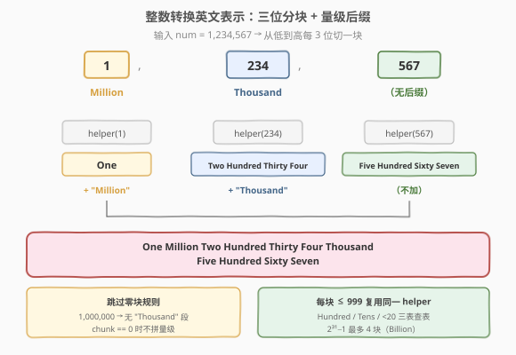
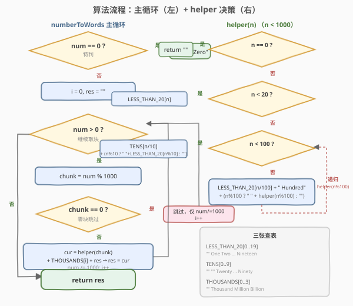
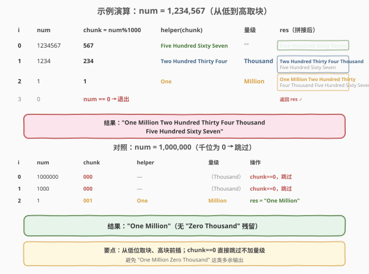

# 整数转换英文表示

- **题目名称**：整数转换英文表示
- **链接**：[273. 整数转换英文表示](https://leetcode.cn/problems/integer-to-english-words/)
- **难度**：困难
- **标签**：递归、数学、字符串、模拟

## 1. 题目概述

将一个非负整数 `num` 转换为其对应的**英文表示**。英文数字按每三位一组读出，并加上 **Thousand / Million / Billion** 等量级后缀。

**示例 1**：

```text
输入：num = 123
输出："One Hundred Twenty Three"
```

**示例 2**：

```text
输入：num = 12345
输出："Twelve Thousand Three Hundred Forty Five"
```

**示例 3**：

```text
输入：num = 1234567
输出："One Million Two Hundred Thirty Four Thousand Five Hundred Sixty Seven"
```

**约束条件**：

- $0 \le \text{num} \le 2^{31} - 1$

> 💡 这题的难点不在算法思想，而在**工程细节**：英文读数有固定的「三位一段 + 量级」规则，但 1–19 的不规则词、Twenty~Ninety 的整十词、`chunk == 0` 时跳过量级、零的特判、单词间空格拼接……任何一处疏忽都会 WA。把它拆成「主循环取块 + helper 处理一块」两段，是化解复杂度的关键。

---

## 2. 解题思路

### 2.1 暴力思路：逐位硬编码

最直觉的做法：把 `num` 按十/百/千/万…位拆开，对每一位独立翻译。但英文不是「按十进制位」读，而是**按三位一段**读——`1,234,567` 读作「一百万 + 二百三十四千 + 五百六十七」，并非「一二三四五六七」。逐位硬编码会陷入无穷的 `if/else` 分支，且无法自然处理千位以上的量级词。这条路走不通。

### 2.2 核心观察：三位分块 + 量级后缀



关键洞察：英文数字天然**每三位一段**，每段都是一个 $\le 999$ 的数，套上对应的**量级后缀**（Thousand / Million / Billion）。于是问题被干净地拆成两层：

1. **外层（主循环）**：从低位到高位，每次 `chunk = num % 1000` 取出最低 3 位，`num //= 1000` 推进，用下标 `i` 索引量级表 `THOUSANDS = ["", "Thousand", "Million", "Billion"]`。
2. **内层（helper）**：把任意一个 $\le 999$ 的 `chunk` 翻译成英文短语——百位拼 `"X Hundred"`，十位与个位用两张查表（`LESS_THAN_20` 与 `TENS`）解决。

> 💡 **为什么是三位一段？** 因为英文的量级词以 $10^3$ 为阶梯：Thousand=$10^3$、Million=$10^6$、Billion=$10^9$。而 $2^{31}-1 \approx 2.1 \times 10^9$，最多 4 段（Billion 为最高段），`THOUSANDS` 表只需 4 项即可兜底。这与 [12. 整数转罗马数字](../0001-0100/12_整数转罗马数字.md) 的「贪心配 13 个面值」形成对照——罗马数字无千以上量级词，故上限 3999；英文有递增量级词，理论上可无限扩展。

**两张查表的设计**：

- `LESS_THAN_20[0..19]`：`""`、`"One"`…`"Nineteen"`——1 到 19 的英文都不规则（eleven/twelve/thirteen/fifteen/eighteen…），必须逐个列出。下标即数值，$O(1)$ 直查。
- `TENS[0..9]`：`""`、`""`、`"Twenty"`…`"Ninety"`——20/30/…/90 的整十词，下标为十位数字。下标 0、1 不用（个位区已被 `LESS_THAN_20` 覆盖）。

于是 `helper(n)`（$n < 1000$）只需三分支：

- $n < 20$：直查 `LESS_THAN_20[n]`；
- $n < 100$：`TENS[n/10]`，若个位非零再补 `" " + LESS_THAN_20[n%10]`；
- 否则：`LESS_THAN_20[n/100] + " Hundred"`，若余下两位非零再递归 `helper(n%100)`。

> ⚠️ **跳过零块**：当 `chunk == 0` 时（如 `1,000,000` 的「千位段」为 000），**不拼任何词、也不加量级后缀**——否则会输出 `"One Million Zero Thousand"` 这类错误。这是本题最容易踩的坑。

### 2.3 算法流程图



左半是主循环 `numberToWords`：先特判 `num == 0` 返回 `"Zero"`；之后循环取块，`chunk == 0` 跳过，否则用 `helper` 翻译并拼上量级后缀，**前插**到结果串（因为从低位取块、高位要先输出）。右半是 `helper(n)` 的三分支决策树，$n \ge 100$ 时递归处理低两位。

### 2.4 示例演算

以 `num = 1,234,567` 为例：



**主循环逐块处理**：

| 轮次 $i$ | num（进入时） | chunk = num%1000 | helper(chunk) | 量级 THOUSANDS[i] | res（拼接后） |
|----------|---------------|------------------|---------------|-------------------|---------------|
| 0 | 1234567 | 567 | Five Hundred Sixty Seven | `""` | Five Hundred Sixty Seven |
| 1 | 1234 | 234 | Two Hundred Thirty Four | Thousand | Two Hundred Thirty Four Thousand Five Hundred Sixty Seven |
| 2 | 1 | 1 | One | Million | One Million Two Hundred Thirty Four Thousand Five Hundred Sixty Seven |
| 3 | 0 | — | — | — | num == 0，退出，返回 res ✓ |

> 💡 **前插技巧**：从低位取块，但高位要先输出。与其把结果逆序，不如每轮把新翻译的块 **拼在 res 前面**：`res = helper(chunk) + " " + scale + " " + res`。这样取完最后一块时 res 自然是从高到低的正确顺序。

图中下半部分用 `num = 1,000,000` 对照展示「跳过零块」规则：千位段为 `000` 直接跳过，最终只输出 `"One Million"`，没有多余的 `"Zero Thousand"`。

---

## 3. 参考代码

### C++（分块 + helper 递归）

```cpp
class Solution {
    const vector<string> LESS_THAN_20 = {
        "", "One", "Two", "Three", "Four", "Five", "Six", "Seven", "Eight",
        "Nine", "Ten", "Eleven", "Twelve", "Thirteen", "Fourteen", "Fifteen",
        "Sixteen", "Seventeen", "Eighteen", "Nineteen"};
    const vector<string> TENS = {
        "", "", "Twenty", "Thirty", "Forty", "Fifty",
        "Sixty", "Seventy", "Eighty", "Ninety"};
    const vector<string> THOUSANDS = {"", "Thousand", "Million", "Billion"};

  public:
    string numberToWords(int num) {
        if (num == 0) return "Zero";
        string res;
        for (int i = 0; i < (int)THOUSANDS.size() && num > 0; ++i) {
            int chunk = num % 1000;
            if (chunk != 0) {
                string cur = helper(chunk);
                if (!THOUSANDS[i].empty()) cur += " " + THOUSANDS[i];
                if (!res.empty()) cur += " " + res;
                res = cur;
            }
            num /= 1000;
        }
        return res;
    }

  private:
    string helper(int n) {
        if (n == 0) return "";
        if (n < 20) return LESS_THAN_20[n];
        if (n < 100)
            return TENS[n / 10] + (n % 10 == 0 ? "" : " " + LESS_THAN_20[n % 10]);
        return LESS_THAN_20[n / 100] + " Hundred" +
               (n % 100 == 0 ? "" : " " + helper(n % 100));
    }
};
```

### Python（分块 + helper 递归）

```python
class Solution:
    LESS_THAN_20 = ["", "One", "Two", "Three", "Four", "Five", "Six", "Seven",
                    "Eight", "Nine", "Ten", "Eleven", "Twelve", "Thirteen",
                    "Fourteen", "Fifteen", "Sixteen", "Seventeen", "Eighteen", "Nineteen"]
    TENS = ["", "", "Twenty", "Thirty", "Forty", "Fifty",
            "Sixty", "Seventy", "Eighty", "Ninety"]
    THOUSANDS = ["", "Thousand", "Million", "Billion"]

    def numberToWords(self, num: int) -> str:
        if num == 0:
            return "Zero"
        res = ""
        for i in range(len(self.THOUSANDS)):
            if num == 0:
                break
            chunk = num % 1000
            if chunk != 0:
                cur = self._helper(chunk)
                if self.THOUSANDS[i]:
                    cur += " " + self.THOUSANDS[i]
                if res:
                    cur += " " + res
                res = cur
            num //= 1000
        return res

    def _helper(self, n: int) -> str:
        if n == 0:
            return ""
        if n < 20:
            return self.LESS_THAN_20[n]
        if n < 100:
            return self.TENS[n // 10] + ("" if n % 10 == 0 else " " + self.LESS_THAN_20[n % 10])
        return (self.LESS_THAN_20[n // 100] + " Hundred"
                + ("" if n % 100 == 0 else " " + self._helper(n % 100)))
```

> ⚠️ **写法细节**：
> - **前插而非后插**：`cur = helper(chunk) + scale + res`，把新块放在已累积结果之前，避免最后整体反转。
> - **空格守门**：量级词 `THOUSANDS[i]` 为空（最低段）时不加空格；`res` 为空（第一块）时不加空格；`helper` 返回空串（`n%100==0` 等）时不加空格。三个 `if` 把空格问题封死。
> - **`num == 0` 特判**：`helper(0)` 返回 `""`，但主函数需返回 `"Zero"`——零是唯一需要显式输出英文单词的「空」情形。
> - Python 中查表声明为**类属性**（大写常量），所有实例共享，避免每次调用重建。

---

## 4. 复杂度分析

| 维度 | 复杂度 | 说明 |
|------|--------|------|
| 时间复杂度 | $O(\log_{10} n)$ | 段数 = $\lfloor \log_{1000} n \rfloor + 1 \le 4$；每段 `helper` 处理 3 位数，常数次查表与字符串拼接，总操作数与位数成正比 |
| 空间复杂度 | $O(\log_{10} n)$ | `helper` 递归深度至多 2（百位→低两位）；输出串长度与位数成正比；三张查表为固定常数 |

> 💡 严格来说，$2^{31}-1 \approx 2.1 \times 10^9$，段数至多 4，故时间与空间均为 $O(1)$（与输入大小无关的常数上界）。但写成 $O(\log_{10} n)$ 更能反映「随位数增长」的本质，便于推广到任意大数（如 Python 大整数场景）。

---

## 5. 扩展：迭代版 helper 与大数推广

### 5.1 迭代版 helper（消除递归）

`helper` 中 $n \ge 100$ 时递归处理低两位，递归深度仅 2，但可改成纯迭代消除调用开销：

```cpp
string helper(int n) {
    string s;
    if (n >= 100) {
        s = LESS_THAN_20[n / 100] + " Hundred";
        n %= 100;
        if (n) s += " ";
    }
    if (n >= 20) {
        s += TENS[n / 10];
        n %= 10;
        if (n) s += " ";
    }
    if (n > 0) s += LESS_THAN_20[n];
    return s;
}
```

逻辑与递归版完全等价：先剥百位、再剥十位、最后个位，每步用 `if (n)` 守门空格。性能差异在常数级，面试按个人喜好选择即可。

### 5.2 推广到任意大数

`THOUSANDS` 表只列到 `Billion`（$10^9$），因为 `int` 上界 $2^{31}-1 \approx 2.1 \times 10^9$。若用 64 位或大整数，只需在表尾追加更大量级词：

| 量级 | 后缀 | 数值 |
|------|------|------|
| $10^9$ | Billion | 十亿 |
| $10^{12}$ | Trillion | 万亿 |
| $10^{15}$ | Quadrillion | 千万亿 |
| $10^{18}$ | Quintillion | 百亿亿 |

主循环结构不变，只需把 `THOUSANDS` 扩展为对应长度。这是「分块 + 量级」架构的可扩展优势——对比 [12. 整数转罗马数字](../0001-0100/12_整数转罗马数字.md) 上限锁死在 3999（标准符号无千以上表示），本题架构可自然延伸。

> ⚠️ 注意英文量级词采用**短级差制**（short scale）：$10^9$ = Billion、$10^{12}$ = Trillion，每三级递增一级。部分欧洲语言用长级差制（$10^{12}$ = Billion），翻译时勿混淆。

---

## 6. 面试要点

1. **为什么按三位一段，而不是逐位翻译？**

   - 英文数字的量级词以 $10^3$ 为阶梯（Thousand/Million/Billion），每段内部读法完全一致（$\le 999$ 的同一套规则）。逐位翻译无法表达「234 千」这种量级组合，必须先分块再加量级后缀。这与 [168. Excel 表列名称](../0001-0100/168_Excel表列名称.md) 的 26 进制逐位不同，因为英文不是纯进制编码而是「分块 + 量级」混合制。

2. **`helper` 为什么需要三张表？能不能合并？**

   - `LESS_THAN_20`（1–19 不规则）、`TENS`（20–90 整十词）、`THOUSANDS`（量级）。前两者无法合并：1–19 的词形完全不规则（eleven/fifteen/eighteen…），而 20 以上遵循「整十词 + 个位词」组合规则。强行合并会引入大量特判，不如两张表分工清晰。`THOUSANDS` 是量级表，与数值翻译解耦。

3. **chunk == 0 时为什么要跳过？**

   - 如 `1,000,000` 的千位段是 `000`，若不跳过会输出 `"One Million Zero Thousand"`——英文读数从不读「零千」。故 `chunk == 0` 时既不调 `helper`、也不加量级后缀，直接推进 `num //= 1000`。这是本题最高频的 WA 点。

4. **从低位取块，怎么保证输出从高位到低位？**

   - 两种做法：①用 `list` 收集各段，最后 `reverse` 再 `join`；②**前插**——每轮把新翻译的块拼在已有 `res` 之前（`res = cur + " " + res`）。前插无需最后反转，代码更紧凑。注意「前插」时 `res` 非空才加连接空格。

5. **`num == 0` 为什么要特判返回 `"Zero"`？**

   - `helper(0)` 按设计返回 `""`（空串），若不特判，`numberToWords(0)` 会返回空串而非 `"Zero"`。零是唯一一个「值为零却要输出英文单词」的情形——任何正数中的零段都被跳过，只有输入本身就是零时才需要显式说 `"Zero"`。

> 💡 **一句话总结**：273 是「分块 + 量级」的工程题——外层每三位取一块配量级后缀，内层用三张查表把 $\le 999$ 的数翻成英文。难点全在边界：跳过零块、空格守门、零的特判、前插顺序。把它和 [12. 整数转罗马数字](../0001-0100/12_整数转罗马数字.md) 的「贪心配面值」对照，能完整覆盖「数值 → 英文符号串」的两类范式。

---

## 7. 同类练习题

- [12. 整数转罗马数字](https://leetcode.cn/problems/integer-to-roman/)（[题解](../0001-0100/12_整数转罗马数字.md)）：同为「数值 → 符号串」映射，但用贪心配 13 个面值（无千以上量级词，上限 3999），对照两种范式的差异
- [13. 罗马数字转整数](https://leetcode.cn/problems/roman-to-integer/)（[题解](../0001-0100/13_罗马数字转整数.md)）：本题的逆问题（符号串 → 数值），逐位贪心判定加减，两题合看完整理解符号编码
- [168. Excel 表列名称](https://leetcode.cn/problems/excel-sheet-column-title/)（[题解](../0001-0100/168_Excel表列名称.md)）：1-indexed 的 26 进制转换，同为「数值 → 符号串」，对比「纯进制」与「分块 + 量级」的差异
- [171. Excel 表列序号](https://leetcode.cn/problems/excel-sheet-column-number/)（[题解](../0101-0200/171_Excel表列序号.md)）：168 的逆问题，Horner 累乘合成方向，与本题的外层循环取块互为正反
- [8. 字符串转换整数 (atoi)](https://leetcode.cn/problems/string-to-integer-atoi/)（[题解](../0001-0100/8_字符串转换整数atoi.md)）：符号串 → 数值的模拟，对比「解析」与「生成」两类字符串数值互转的边界处理
