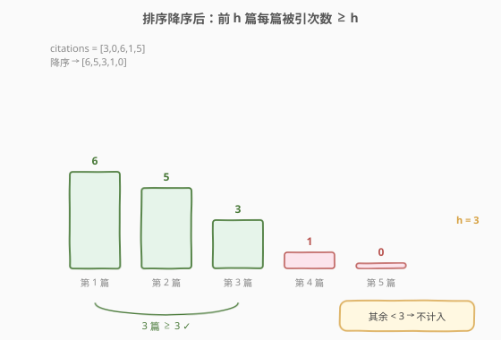
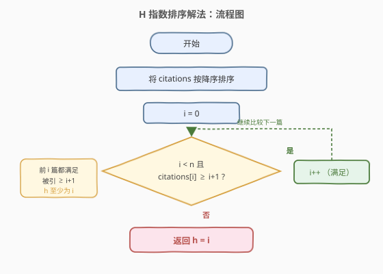
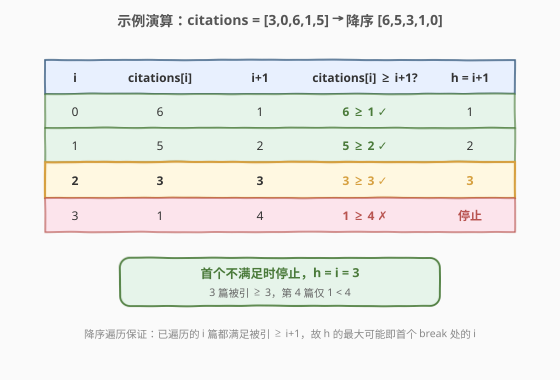

# H 指数

- **题目名称**：H 指数
- **链接**：[274. H 指数](https://leetcode.cn/problems/h-index/)
- **难度**：中等
- **标签**：数组、排序、计数排序

## 1. 题目概述

给你一个整数数组 `citations`，其中 `citations[i]` 表示研究者的第 `i` 篇论文被引用的次数。计算并返回该研究者的 **h 指数**。

> 💡 **h 指数的定义**：一名科研人员的 h 指数是指他/她发表了 `h` 篇论文，且**至少有 `h` 篇论文被引用次数大于等于 `h` 次**（其余 $n-h$ 篇论文的被引次数都小于 `h`）。换句话说，h 是同时满足「数量条件」与「引用条件」的最大整数。

**示例 1**：

```text
输入：citations = [3,0,6,1,5]
输出：3
解释：研究者共有 5 篇论文，被引次数为 3,0,6,1,5。
      其中有 3 篇论文（被引 6,5,3）被引用 ≥ 3 次；
      其余 2 篇（被引 1,0）被引用 < 3 次，故 h 指数为 3。
```

**示例 2**：

```text
输入：citations = [1,1,3]
输出：1
解释：有 1 篇论文被引 ≥ 1；但被引 ≥ 2 的论文为 0 篇，故 h = 1。
```

**约束条件**：

- $n == \text{citations.length}$
- $1 \leq n \leq 5000$
- $0 \leq \text{citations[i]} \leq 1000$

> 💡 **进阶要求**：能否给出 $O(n)$ 的解法？答案是**计数排序**——利用「h 不会超过论文总数 $n$」这一关键观察，把引用次数桶化后从高到低累加即可定位 h。

---

## 2. 解题思路

### 2.1 暴力思路

按定义枚举每个候选 $h \in [0, n]$，对每个 $h$ 扫一遍数组统计「被引次数 $\geq h$」的论文数 $c$，若 $c \geq h$ 则更新答案。两重循环 $O(n^2)$，在 $n = 5000$ 时偏慢但能过；更大的痛点是它没有利用「排序后条件单调」的结构，难以做到线性。

### 2.2 核心观察：排序后「前 h 篇都 ≥ h」



把 `citations` **按降序排序**，设排序后为 $c_0 \geq c_1 \geq \dots \geq c_{n-1}$。则「至少有 $h$ 篇论文被引 $\geq h$」等价于：**前 $h$ 篇中引用次数最小的那篇也 $\geq h$**，即 $c_{h-1} \geq h$。

于是我们只需**从前往后扫**，找到**最大的** $h$，使得对所有的 $i < h$ 都有 $c_i \geq i+1$。由于序列降序，一旦某处 $c_i < i+1$，其后必然更小，条件只会更不成立——所以**首个不满足的位置**就直接确定了答案 $h = i$。

> ⚠️ **关键单调性**：降序序列中 $c_i$ 单调不增，而 $i+1$ 单调递增。两条曲线的「最后一个交点」就是 h 指数。一旦 $c_i < i+1$，后续 $i$ 更大、$c_i$ 更小，绝无翻身可能，因此可以放心 `break`。

### 2.3 算法流程图



**步骤**：

1. 将 `citations` 按降序排序；
2. 令 $i = 0$，从前往后遍历；
3. 若 $i < n$ 且 $c_i \geq i+1$，说明第 $i+1$ 篇也满足条件，$i \gets i+1$ 继续；
4. 一旦 $c_i < i+1$（或到达末尾），停止；
5. 返回 $h = i$（即已确认满足条件的前 $i$ 篇）。

> 💡 **为什么返回 $i$ 而非 $i+1$？** 循环不变量是「前 $i$ 篇都满足 $c_j \geq j+1$」。当循环在 $i$ 处停下时，前 $i$ 篇合法（对应 $h \geq i$），而第 $i+1$ 篇不合法（$c_i < i+1$，对应 $h < i+1$），所以最大 $h$ 恰为 $i$。

### 2.4 示例演算

以 `citations = [3,0,6,1,5]` 为例，降序排序得 `[6,5,3,1,0]`：



| $i$ | $c_i$ | $i+1$ | $c_i \geq i+1$? | $h = i+1$ |
|-----|-------|-------|------------------|-----------|
| 0 | 6 | 1 | $6 \geq 1$ ✓ | 1 |
| 1 | 5 | 2 | $5 \geq 2$ ✓ | 2 |
| 2 | 3 | 3 | $3 \geq 3$ ✓ | **3** |
| 3 | 1 | 4 | $1 \geq 4$ ✗ | 停止 |

在 $i=3$ 处首次不满足，返回 $h = i = 3$。验证：3 篇（6,5,3）被引 $\geq 3$，第 4 篇仅 1 次 $< 4$，答案正确。

---

## 3. 参考代码

### C++

```cpp
class Solution {
  public:
    int hIndex(vector<int>& citations) {
        sort(citations.begin(), citations.end(), greater<int>());
        int i = 0;
        while (i < (int)citations.size() && citations[i] >= i + 1) {
            ++i;
        }
        return i;
    }
};
```

### Python

```python
class Solution:
    def hIndex(self, citations: List[int]) -> int:
        citations.sort(reverse=True)
        i = 0
        while i < len(citations) and citations[i] >= i + 1:
            i += 1
        return i
```

> ⚠️ **易错点**：
> - 判断条件是 `citations[i] >= i + 1`（1-based 的篇数），不是 `>= i`，也别漏掉 `i + 1` 里那个 `+1`。
> - 返回值是循环停下时的 `i`（即满足条件的篇数），不是 `i + 1`。
> - 升序排序也可，但遍历方向与下标含义要相应调整（从后往前，比较 `citations[n-1-h] >= h+1`），降序更直观、不易错。

---

## 4. 复杂度分析

| 维度 | 复杂度 | 说明 |
|------|--------|------|
| 时间复杂度 | $O(n \log n)$ | 主体是降序排序；之后的线性扫描为 $O(n)$，被排序主导 |
| 空间复杂度 | $O(\log n)$ | 排序所需的栈空间（`sort` 原地排序，仅递归/迭代栈） |

---

## 5. 扩展：计数排序实现 $O(n)$

排序解法瓶颈在 $O(n \log n)$ 的排序。注意到一个**关键观察**：

> 💡 **h 指数不可能超过论文总数 $n$**——因为「至少 $h$ 篇被引 $\geq h$」要求 $h \leq n$。所以任何 $> n$ 的引用次数都可以**截断为 $n$**而不影响答案。

据此用**计数排序**：开一个大小为 $n+1$ 的桶 `count`，`count[k]` 记录被引次数**恰好为** $k$ 的论文数（被引 $> n$ 的全部并入 `count[n]`）。然后**从大到小**累加 `total`，第一个满足 `total >= i` 的 $i$ 就是 h 指数。

```python
class Solution:
    def hIndex(self, citations: List[int]) -> int:
        n = len(citations)
        count = [0] * (n + 1)
        for c in citations:
            count[min(c, n)] += 1          # > n 的并入 count[n]
        total = 0
        for i in range(n, -1, -1):         # 从大到小累加
            total += count[i]
            if total >= i:                 # 至少 i 篇被引 >= i
                return i
        return 0
```

```cpp
class Solution {
  public:
    int hIndex(vector<int>& citations) {
        int n = citations.size();
        vector<int> count(n + 1, 0);
        for (int c : citations) count[min(c, n)]++;
        int total = 0;
        for (int i = n; i >= 0; --i) {
            total += count[i];
            if (total >= i) return i;
        }
        return 0;
    }
};
```

| 维度 | 复杂度 | 说明 |
|------|--------|------|
| 时间复杂度 | $O(n)$ | 两次长度为 $n$（或 $n+1$）的线性遍历，无排序 |
| 空间复杂度 | $O(n)$ | 额外的 `count` 数组，大小 $n+1$ |

> ⚠️ **为什么从大到小累加？** h 指数要「最大」，而 `total` 随 $i$ 减小单调递增（累加更多桶）。从 $n$ 往下扫，**第一个**满足 `total >= i` 的 $i$ 即为最大的合法 h——因为更小的 $i$ 虽也满足，但不是最大值。这与排序解法「找首个 break」的思路同构，只是把排序换成了桶计数。

---

## 6. 面试要点

1. **h 指数的定义为什么等价于「降序后 $c_{h-1} \geq h$」？**
   - 降序后，前 $h$ 篇中最小的被引次数是 $c_{h-1}$。若 $c_{h-1} \geq h$，则前 $h$ 篇每篇被引都 $\geq h$，即「至少 $h$ 篇被引 $\geq h$」成立，且 $h$ 越大越难满足，于是最大 $h$ 就是使 $c_{h-1} \geq h$ 成立的最后一个位置。

2. **排序解法为什么返回 `i` 而不是 `i+1`？**
   - 循环不变量：「前 $i$ 篇都满足 $c_j \geq j+1$」。当在 $i$ 处停下（$c_i < i+1$）时，前 $i$ 篇合法（$h \geq i$），第 $i+1$ 篇不合法（$h < i+1$），故最大 $h = i$。若循环因越界停下，则全部 $n$ 篇都满足，$h = n = i$。

3. **计数排序为什么能把 $> n$ 的引用次数截断为 $n$？**
   - h 指数 $\leq n$，所以判定 `total >= i` 时 $i \leq n$。一篇被引 $c > n$ 的论文对「被引 $\geq i$」（任意 $i \leq n$）的贡献恒为 1，把它记入 `count[n]` 后，从 $n$ 往下累加时它会被正确计入所有 $i \leq n$ 的 `total`，信息无损。

4. **计数排序为什么从 $n$ 往下扫，而非从 $0$ 往上？**
   - 要最大 $h$。`total` 随 $i$ 减小而递增（累加更多桶），从 $n$ 往下首个满足 `total >= i` 的就是最大值。若从 $0$ 往上，则需扫完取最后一个满足点，等价但不如「首个即答案」直观。

5. **如果输入已升序，能否 $O(n)$ 求解？**
   - 可以。升序下从后往前扫，维护 $h$（初始 0），当 `citations[n-1-h] >= h+1` 时 $h$ 自增并继续，否则停止。本质与降序解法同构，只是省去了排序。若未排序，则仍需 $O(n \log n)$ 排序或 $O(n)$ 计数排序。

---

## 7. 同类练习题

- [275. H 指数 II](https://leetcode.cn/problems/h-index-ii/)：输入已升序排序，要求 $O(\log n)$ 二分解法，是本题的二分变体，体会「有序 + 单调性 → 二分」的套路
- [324. 摆动排序 II](https://leetcode.cn/problems/wiggle-sort-ii/)：同样依赖计数排序 / 桶思想处理「值域受限」的排序需求，对比两种桶排应用场景
- [347. 前 K 个高频元素](https://leetcode.cn/problems/top-k-frequent-elements/)：用桶（按频次）代替堆求 Top-K，与本题「用桶替代排序」的思路同源
- [56. 合并区间](https://leetcode.cn/problems/merge-intervals/)：排序后线性扫描的结构，对比「排序改变遍历顺序以利用单调性」的通用手法
- [215. 数组中的第K个最大元素](https://leetcode.cn/problems/kth-largest-element-in-an-array/)：第 K 大与「第 h 篇被引」的下标语义相通，可对比快速选择与计数排序两种线性思路
