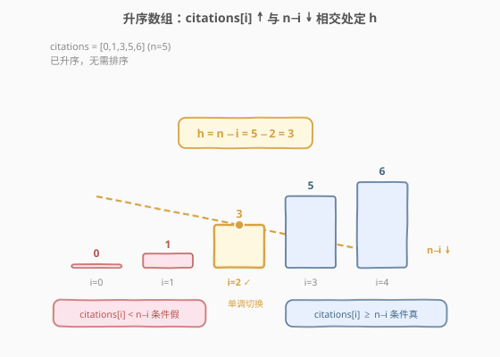
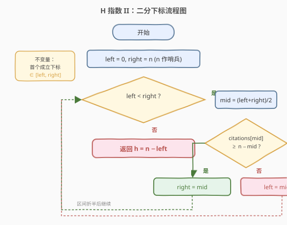
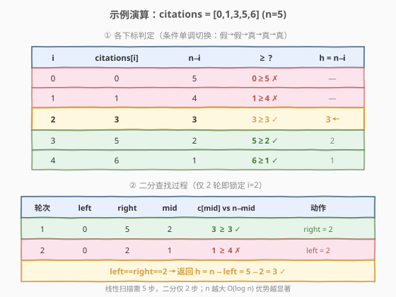

# H 指数 II

- **题目名称**：H 指数 II
- **链接**：[275. H 指数 II](https://leetcode.cn/problems/h-index-ii/)
- **难度**：中等
- **标签**：数组、二分查找

## 1. 题目概述

给定一个整数数组 `citations`，其中 `citations[i]` 表示研究者的第 `i` 篇论文被引用的次数。**数组已按升序排序**（非降序）。计算并返回该研究者的 **h 指数**。

> 💡 **h 指数的定义**：一名科研人员的 h 指数是指他/她发表了 `h` 篇论文，且**至少有 `h` 篇论文被引用次数大于等于 `h` 次**。换句话说，h 是同时满足「数量条件」与「引用条件」的最大整数。

**示例 1**：

```text
输入：citations = [0,1,3,5,6]
输出：3
解释：有 3 篇论文（被引 3,5,6）被引用 ≥ 3 次；
      被引 ≥ 4 次的只有 2 篇（5,6），故最大 h = 3。
```

**示例 2**：

```text
输入：citations = [1,1,3]
输出：1
解释：有 1 篇论文被引 ≥ 1；但被引 ≥ 2 的论文为 0 篇，故 h = 1。
```

**约束条件**：

- $n == \text{citations.length}$
- $1 \le n \le 10^5$
- $0 \le \text{citations[i]} \le 1000$
- `citations` **已按升序排序**

> ⚠️ **进阶要求**：本题要求 $O(\log n)$ 时间。这正是 [274. H 指数](../0201-0300/274_H指数.md) 的进阶版——274 输入无序、用 $O(n \log n)$ 排序或 $O(n)$ 计数排序；本题输入已有序，省去排序后瓶颈在「线性扫描」，需用**二分查找**把扫描换成对数查找。

---

## 2. 解题思路

### 2.1 暴力思路：复用 274 的线性扫描

把 [274](../0201-0300/274_H指数.md) 的排序解法搬过来，但既然输入已升序，可以从后往前扫，维护 `h`：当 `citations[n-1-h] >= h+1` 时 `h` 自增。时间 $O(n)$，正确但浪费了「已有序」这一结构，达不到 $O(\log n)$ 的进阶要求。

问题转化为：**如何利用升序的单调性，把「逐位比较」换成「折半定位」？**

### 2.2 核心观察：升序下「citations[i] ≥ n−i」首次成立处即答案



设数组升序，下标从 0 开始。对下标 $i$，由于升序，**下标 $i$ 及其右侧共 $n - i$ 篇论文的被引次数都 $\ge$ `citations[i]`**。于是只要 `citations[i] >= n - i`，就有「至少 $n - i$ 篇论文被引 $\ge n - i$」，即 $h = n - i$ 是一个合法的 h 指数。

> 💡 **一句话直觉**：站在下标 $i$ 往右看，右侧恰好有 $n - i$ 篇，且它们被引都 $\ge$ `citations[i]`。若 `citations[i]` 本身已达到 $n - i$，那么「$n - i$ 篇被引 $\ge n - i$」立刻成立，$h = n - i$ 合法。

**关键单调性**（这就是二分的基石）：

- 随着 $i$ 增大，`citations[i]` **单调递增**（升序保证）；
- 同时 $n - i$ **单调递减**。
- 因此条件 `citations[i] >= n - i` 在 $i$ 上呈现「**先全假，后全真**」的单调切换——**首个成立的 $i$ 对应最大的 $h = n - i$**（再往右 $i$ 更大、$n - i$ 更小，虽然也成立但 $h$ 更小，不是最大值）。

> ⚠️ **为什么首个成立处就是最大 h？** 合法 $h = n - i$ 随 $i$ 增大而减小。所以「最早成立的 $i$」给出「最大的合法 $h$」。这与 274 降序解法里「首个 $c_i < i+1$ 处停止、返回 $i$」是对偶的：一个从左找首个成立，一个从左找首个破坏，本质都是「两条单调曲线的交点」。

### 2.3 算法流程图



**循环不变量**：**首个满足 `citations[i] >= n - i` 的下标始终落在闭区间 `[left, right]` 内**。若全不满足，则 `left` 会越过 $n-1$ 落到哨兵 $n$，此时 $h = n - n = 0$。

**步骤**：

1. `left = 0, right = n`（`right = n` 作哨兵，处理「全不满足」时返回 $h = 0$）；
2. 取 `mid = (left + right) / 2`（向下取整）；
3. 若 `citations[mid] >= n - mid`：`mid` 满足条件，首个成立点在 `mid` 或其左侧，`right = mid`；
4. 否则：`mid` 不满足，首个成立点必在 `mid` 右侧，`left = mid + 1`；
5. 当 `left < right` 不成立时退出，返回 $h = n - \text{left}$。

> 💡 **为什么 `right` 初值取 `n` 而非 `n-1`？** 当所有 `citations[i] < n - i`（即没有论文满足条件，如 `citations = [0,0,0]`）时，合法下标不存在。把 `right = n` 设为哨兵，循环会让 `left` 一路推到 $n$，最终 $h = n - n = 0$，无需特判。这正是「区间型二分 + 哨兵」的优雅之处。

### 2.4 示例演算

以 `citations = [0,1,3,5,6]`（$n = 5$）为例，二分查找首个 `citations[i] >= 5 - i` 的下标：



先列出每个下标的判定（便于理解单调切换）：

| $i$ | `citations[i]` | $n - i$ | `citations[i] >= n - i`? | 合法 $h = n - i$ |
|-----|----------------|--------|---------------------------|-------------------|
| 0 | 0 | 5 | $0 \ge 5$ ✗ | — |
| 1 | 1 | 4 | $1 \ge 4$ ✗ | — |
| 2 | 3 | 3 | $3 \ge 3$ ✓ | **3** |
| 3 | 5 | 2 | $5 \ge 2$ ✓ | 2 |
| 4 | 6 | 1 | $6 \ge 1$ ✓ | 1 |

条件在 $i = 2$ 处由假转真，首个成立处 $i = 2$，最大 $h = 5 - 2 = 3$。二分过程：

| 轮次 | left | right | mid | citations[mid] | n−mid | 比较 | 动作 |
|------|------|-------|-----|----------------|-------|------|------|
| 1 | 0 | 5 | 2 | 3 | 3 | $3 \ge 3$ ✓ | right = mid = 2 |
| 2 | 0 | 2 | 1 | 1 | 4 | $1 \ge 4$ ✗ | left = mid+1 = 2 |
| 结束 | 2 | 2 | — | — | — | left==right | 返回 $h = n - 2 = 3$ |

两轮折半锁定 $i = 2$，返回 $h = 3$ ✓。对比线性扫描需 3 步比较，二分仅 2 步，且 $n$ 越大优势越明显（$O(\log n)$ vs $O(n)$）。

---

## 3. 参考代码

### C++

```cpp
class Solution {
  public:
    int hIndex(vector<int>& citations) {
        int n = citations.size();
        int left = 0, right = n;              // right = n 作哨兵
        while (left < right) {
            int mid = left + (right - left) / 2;
            if (citations[mid] >= n - mid) {
                right = mid;                  // mid 满足，首个成立点在左（含 mid）
            } else {
                left = mid + 1;               // mid 不满足，去右半找
            }
        }
        return n - left;                      // 哨兵 left=n 时自然返回 0
    }
};
```

### Python

```python
class Solution:
    def hIndex(self, citations: List[int]) -> int:
        n = len(citations)
        left, right = 0, n                    # right = n 作哨兵
        while left < right:
            mid = (left + right) // 2
            if citations[mid] >= n - mid:
                right = mid                   # mid 满足，首个成立点在左（含 mid）
            else:
                left = mid + 1                # mid 不满足，去右半找
        return n - left                       # 哨兵 left=n 时自然返回 0
```

> ⚠️ **易错点**：
> - 判定条件是 `citations[mid] >= n - mid`，**右端是 `n - mid`（篇数）而非 `mid`**。容易和 274 的 `citations[i] >= i + 1` 混淆——274 降序遍历用「第 $i+1$ 篇」，本题升序用「右侧 $n-i$ 篇」，两套下标语义不同。
> - `right` 初值取 `n`（哨兵）而非 `n - 1`，否则「全不满足」时会漏掉 $h = 0$ 的返回，需额外特判。
> - `mid` 向下取整（`left + (right-left)/2`），配合 `right = mid` 与 `left = mid + 1` 两个分支都能让区间严格缩小，不死循环。若改用向上取整，`right = mid` 分支在 `left+1==right` 时会卡死。

---

## 4. 复杂度分析

| 维度 | 复杂度 | 说明 |
|------|--------|------|
| 时间复杂度 | $O(\log n)$ | 每轮区间折半，共 $O(\log n)$ 轮，每轮 $O(1)$ 比较；满足进阶要求 |
| 空间复杂度 | $O(1)$ | 仅 `left` / `right` / `mid` 三个指针，无额外空间 |

---

## 5. 扩展：对偶视角——二分答案 h

上面的解法是「二分下标 $i$」。还有一种等价的「**二分答案 $h$**」视角：直接在答案区间 $[0, n]$ 上二分，对候选 $h$ 检查 `citations[n - h] >= h`（即第 $h$ 篇从右数的论文是否被引 $\ge h$）。

```python
class Solution:
    def hIndex(self, citations: List[int]) -> int:
        n = len(citations)
        lo, hi = 0, n
        while lo < hi:
            mid = (lo + hi + 1) // 2          # 向上取整，配合 lo = mid
            if citations[n - mid] >= mid:     # mid 可行，尝试更大
                lo = mid
            else:
                hi = mid - 1                  # mid 不可行
        return lo
```

> ⚠️ 注意 $h = 0$ 时 `citations[n - 0] = citations[n]` 越界，但 $h = 0$ 恒可行（0 篇被引 $\ge 0$ 恒真），故二分区间取 $[0, n]$、`mid` 向上取整保证 `mid >= 1` 时才访问 `citations[n - mid]`，避开了越界。

两种视角殊途同归：**「二分下标」找首个成立的 $i$ → $h = n - i$；「二分答案」找最大可行的 $h$**。前者代码更简洁（无越界陷阱），后者思路更直观（直接对答案二分）。面试中任选一种讲清即可，推荐「二分下标」版。

---

## 6. 面试要点

1. **本题与 274 的核心区别是什么？**
   - 274 输入无序，需 $O(n \log n)$ 排序或 $O(n)$ 计数排序；本题输入已升序，省去排序，瓶颈转为线性扫描，用二分查找降到 $O(\log n)$。两者 h 指数定义相同，差异在「输入是否有序」决定的最优解法。

2. **为什么条件 `citations[i] >= n - i` 在 $i$ 上单调？**
   - 升序保证 `citations[i]` 随 $i$ 增大而递增；同时 $n - i$ 随 $i$ 增大而递减。一个增、一个减，二者的大小关系只能发生「假→真」的单向切换，不会反复横跳。单调性是二分可行的充要条件。

3. **为什么返回 $n - \text{left}$ 而不是 `left`？**
   - `left` 是首个满足条件的**下标**，不是 h 指数本身。该下标右侧有 $n - \text{left}$ 篇论文被引 $\ge$ `citations[left]` $\ge n - \text{left}$，故 $h = n - \text{left}$。下标与 h 之间差一个「右侧篇数」的换算，这是本题最易写错的地方。

4. **为什么 `right` 取 $n$ 作哨兵，而非 $n - 1$？**
   - 当全部 `citations[i] < n - i`（无任何论文满足）时，合法下标不存在。若 `right = n - 1`，循环退出时 `left = n`，但 `left` 从未进入过循环体处理该越界值，需特判返回 0。取 `right = n` 让哨兵参与不变量维护，循环自然把 `left` 推到 $n$，返回 $n - n = 0$，无需特判。

5. **能否在无序输入上直接套用本题的二分解法？**
   - 不能。二分依赖「`citations[i]` 随 $i$ 单调递增」这一前提，无序输入不满足。必须先排序（$O(n \log n)$）或用计数排序（$O(n)$），排序后才能二分——这正是 274 的解法路径。本题省去了排序步骤，因为输入已经有序。

---

## 7. 同类练习题

- [274. H 指数](https://leetcode.cn/problems/h-index/)（[题解](../0201-0300/274_H指数.md)）：本题的无序版，排序降序后线性扫描或计数排序 $O(n)$，体会「有序 → 二分」「无序 → 排序再二分」的递进
- [704. 二分查找](https://leetcode.cn/problems/binary-search/)：闭区间二分的母题，本题的 `left < right` + `right = mid` + 哨兵模板即源于此
- [153. 寻找旋转排序数组中的最小值](https://leetcode.cn/problems/find-minimum-in-rotated-sorted-array/)（[题解](../0101-0200/153_寻找旋转排序数组中的最小值.md)）：另一道「利用结构单调性二分」的经典，对比「与右端点比较缩区间」与「条件单调切换找首个成立」两种二分范式
- [875. 爱吃香蕉的珂珂](https://leetcode.cn/problems/koko-eating-bananas/)（[题解](../0801-0900/875_爱吃香蕉的珂珂.md)）：二分答案的招牌题，对比本题第 5 节「二分答案 $h$」视角，体会「二分下标」与「二分答案」的统一框架
- [35. 搜索插入位置](https://leetcode.cn/problems/search-insert-position/)：找首个满足条件的位置（lower_bound），与本题「找首个 `citations[i] >= n - i` 的下标」同构，是区间型二分找边界的入门题
