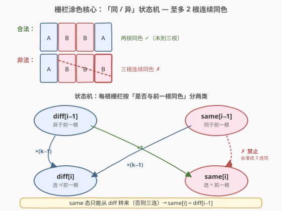
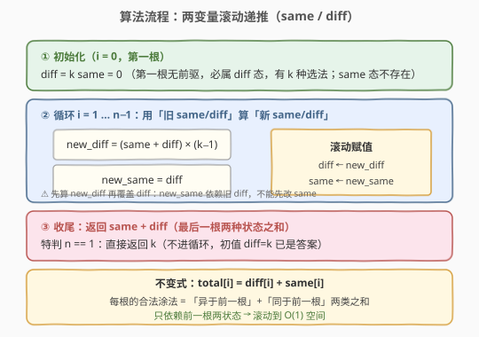
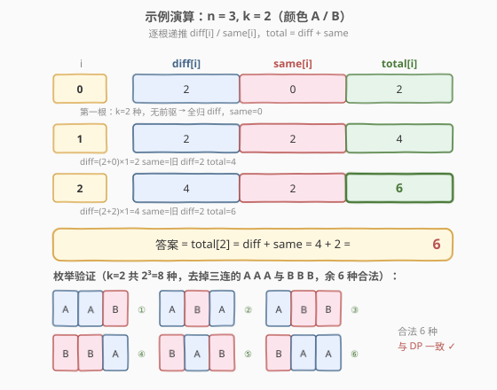

# LeetCode 栅栏涂色 题解

## 1. 题目概述

- **标题 / 题号**：栅栏涂色（#276，medium）
- **链接**：https://leetcode.cn/problems/paint-fence/
- **难度**：中等
- **标签**：动态规划

**题意**：有 `n` 根排成一排的栅栏柱，每根可以涂成 `k` 种颜色之一。要求**任意相邻的栅栏柱中，同色的连续段长度不超过 2**（即不能出现三根及以上的连续同色）。求涂完所有 `n` 根栅栏的**方案总数**。

**示例 1**：

```text
输入：n = 3, k = 2
输出：6
解释：颜色记为 A / B。k=2 共 2³=8 种排列，去掉三连同色的 A A A 与 B B B，合法方案共 6 种：
  A A B   A B A   A B B   B B A   B A B   B A A
```

**示例 2**：

```text
输入：n = 1, k = 1
输出：1
解释：只有一根栅栏、一种颜色，唯一方案。
```

**示例 3**：

```text
输入：n = 7, k = 2
输出：42
```

**约束**：

- `1 <= n <= 50`
- `1 <= k <= 10^5`
- 测试用例保证答案在 `[0, 2^31 - 1]` 范围内

> 💡 本题是「**线性计数 DP + 状态机**」的招牌题。约束不是「相邻必须不同色」（那是 [256. 粉刷房子](../0201-0300/256_粉刷房子.md) 的严格版），而是更宽松的「至多两根连续同色」。这一松弛让「当前选什么颜色」不再重要——重要的是「**当前是否与前一根同色**」，因为只有「已经同色」时才需要禁止再同色。把状态压缩成 `same` / `diff` 两类，转移退化为两变量滚动，$O(n)/O(1)$ 即得。

## 2. 解题思路

### 2.1 暴力思路：DFS 枚举每根栅栏的颜色

最直观的做法：DFS 逐根栅栏枚举 `k` 种颜色，遇到「连续三根同色」就剪枝，到第 `n` 根时方案数 +1。

```text
dfs(i, prevColor, runLen):   // runLen = 末尾连续同色长度（1 或 2）
    if i == n: return 1
    ans = 0
    for c in {0..k-1}:
        if c == prevColor and runLen == 2: continue   // 再同色会凑成三连
        ans += dfs(i+1, c, c == prevColor ? runLen+1 : 1)
    return ans
```

时间 $O(k^n)$，`n=50` 时天文数字。问题在于**子问题被重复求解**：`dfs(i, prevColor, runLen)`（「第 `i` 根往后、前一根颜色是 `prevColor`、末尾已连 `runLen` 根同色」的方案数）会被不同前缀反复调用。

> ⚠️ 暴力法的启示：一旦固定「第 `i` 根栅栏**是否与前一根同色**」以及「前一根是否再前一根同色」，后续的合法方案数就**只取决于这两点**，与更早的栅栏、以及具体什么颜色无关——颜色是对称的，方案数只看「连续同色段长度」。这就是**无后效性**，是 DP 可行的根本。

### 2.2 核心观察：「同 / 异」状态机



**关键洞察**：颜色有 `k` 种但彼此对称——把方案按「第 `i` 根是否与第 `i-1` 根同色」分成两类，定义两个状态：

- $\text{diff}[i]$：第 `i` 根颜色**不同于**第 `i-1` 根的方案数；
- $\text{same}[i]$：第 `i` 根颜色**同于**第 `i-1` 根的方案数。

于是 $\text{total}[i] = \text{diff}[i] + \text{same}[i]$。转移规则由「禁止三连」直接推出：

| 当前态 | 来源 | 选择数 | 推导 |
|--------|------|--------|------|
| `diff[i]` | 前一根无论 `same` 还是 `diff`，都可选「与前一根不同」的颜色 | `k−1` | $\text{diff}[i] = (\text{diff}[i-1] + \text{same}[i-1]) \times (k-1)$ |
| `same[i]` | 必须与前一根同色，且**前一根不能已与前前根同色**（否则凑三连）→ 前一根必须是 `diff` 态 | `1` | $\text{same}[i] = \text{diff}[i-1] \times 1$ |

**边界**（`i = 0`，第一根无前驱）：$\text{diff}[0] = k$（`k` 种颜色都算「异」，因为没有前驱可「同」），$\text{same}[0] = 0$（第一根不可能「同于前一根」）。

**答案**：$\text{total}[n-1] = \text{diff}[n-1] + \text{same}[n-1]$。

> 💡 **为什么状态只需要「同/异」而不需要具体颜色？** 因为 `k` 种颜色地位完全对等——「第 `i` 根选某个特定颜色」的方案数，与「选另一个特定颜色」完全相同。转移系数 `k−1` / `1` 已把「具体选哪种颜色」的计数吸收进去了，不再需要把颜色作为维度。这是**对称性压缩状态**的典型范例：相同结构的状态可合并，只保留对后续转移有影响的本质属性（此处为「连续同色段长度是 1 还是 2」）。

> ⚠️ **`same[i]` 为什么只能从 `diff[i-1]` 转来？** 「第 `i` 根同于第 `i-1` 根」要求末尾连续同色段长度变 2，这只有在「第 `i-1` 根的连续段长度还是 1」时才合法——即第 `i-1` 根本身属 `diff` 态（它和第 `i-2` 根不同色）。若第 `i-1` 根属 `same` 态（它已和第 `i-2` 根同色，连续段已是 2），再让第 `i` 根同色就会凑成三连，被题目禁止。所以 `same[i-1] → same[i]` 这条转移被阻断（图中红虚线 ✗），`same[i]` 的唯一来源是 `diff[i-1]`。

### 2.3 算法流程图



**三步法**（两变量滚动，$O(1)$ 空间）：

1. **初始化**：`diff = k`，`same = 0`（即 `i = 0` 的两状态值）。
2. **逐根递推**：对 `i = 1 … n−1`，用「旧 `same`/`diff`」算「新 `same`/`diff`」：
   - `new_diff = (same + diff) * (k - 1)`
   - `new_same = diff`
   - `diff, same = new_diff, new_same`
3. **收尾**：返回 `diff + same`（最后一根两状态之和）。

> ⚠️ **赋值顺序陷阱**：`new_same` 依赖**旧** `diff`，因此必须**先**算出 `new_diff`、`new_same` 这两个临时值，**再**统一覆盖 `diff`、`same`。若写成 `diff = (same + diff) * (k - 1); same = diff`，则 `same` 会读到**新** `diff`，逻辑全错。两变量滚动题里这是最常见的 bug，参考代码用临时变量 `nd`/`ns` 显式隔开。

### 2.4 示例演算

以 `n = 3, k = 2`（颜色 A / B）为例：



| i | diff[i] | same[i] | total[i] | 计算 |
|---|---------|---------|----------|------|
| 0 | 2 | 0 | 2 | 第一根：k=2 种，无前驱 → 全归 diff，same=0 |
| 1 | 2 | 2 | 4 | diff=(2+0)×1=2；same=旧 diff=2 |
| 2 | 4 | 2 | **6** | diff=(2+2)×1=4；same=旧 diff=2 |

**答案** = `total[2] = 4 + 2 = 6` ✓。

**对照枚举**（`k=2` 共 $2^3=8$ 种排列，排除三连的 `A A A` 与 `B B B`，余 6 种合法）：

```text
合法 6 种：A A B  |  A B A  |  A B B  |  B B A  |  B A B  |  B A A
非法 2 种：A A A（三连同色）  B B B（三连同色）
```

8 − 2 = 6，与 DP 结果一致。注意 `A A B`、`A B B`、`B B A`、`B A A` 这四种含「两连同色」但未到三连，正属 `same` 态合法分支；而 `A A A`、`B B B` 触发三连禁区，对应状态机里 `same → same` 的被阻断转移。

> 💡 **回看 SVG**：演算图底部画出的 6 个格子即上述 6 种合法排列，编号 ①–⑥ 与 `total[2]=6` 吻合，直观印证「`same` 态用过一次后不能再转 `same`」。

## 3. 参考代码

### C++

```cpp
// 栅栏涂色.cpp —— 线性计数 DP + 同/异状态机，两变量滚动 O(1) 空间
// 编译: g++ -O2 -std=c++17 栅栏涂色.cpp -o fence
class Solution {
  public:
    int numWays(int n, int k) {
        if (n == 1) return k;                 // 单根：k 种颜色任选
        // diff / same = 第 0 根的两状态值
        long long diff = k, same = 0;
        for (int i = 1; i < n; ++i) {
            long long nd = (same + diff) * (k - 1);   // 新 diff：选 ≠ 前一根
            long long ns = diff;                       // 新 same：必须前一根属 diff 态
            diff = nd;
            same = ns;
        }
        return (int)(diff + same);
    }
};
```

### Python

```python
class Solution:
    def numWays(self, n: int, k: int) -> int:
        if n == 1:
            return k                       # 单根：k 种颜色任选
        diff, same = k, 0                   # 第 0 根的两状态
        for _ in range(1, n):
            nd = (same + diff) * (k - 1)    # 新 diff：选 ≠ 前一根
            ns = diff                       # 新 same：前一根必须属 diff 态
            diff, same = nd, ns
        return diff + same
```

> 💡 两版等价。`n == 1` 特判可省略——此时循环不执行，直接返回 `diff + same = k + 0 = k`，与特判结果一致；保留特判仅为可读性。注意 `k` 可达 $10^5$、`n` 可达 50，中间值理论上可达 $k^n$ 量级，但题目保证最终答案在 `int` 内，C++ 用 `long long` 中间变量更稳妥，返回时再截回 `int`。

## 4. 复杂度分析

| 维度 | 复杂度 | 说明 |
|------|--------|------|
| **时间复杂度** | $O(n)$ | 每根栅栏做 $O(1)$ 次状态转移，共 $n$ 根 |
| **空间复杂度** | $O(1)$ | 只保留 `diff` / `same` 两个变量，与 $n$、$k$ 无关 |
| 最坏情况 | 同上 | $n=50$ 时仅 50 次乘加，常数级 |

> ⚠️ 暴力 DFS $O(k^n)$ 的浪费在于「同一 `(i, prevColor, runLen)` 子问题被不同前缀反复求解」。DP 把「末尾连续同色段长度」压缩成 `same`/`diff` 两状态存下来只算一次——这是「最优子结构 + 无后效性 → DP」的标准范式。本题连表都不用开，两变量滚动即可。

## 5. 扩展：与「相邻必须不同色」计数版的对比

把约束从「至多两根连续同色」收紧为「**任意相邻都不同色**」，就得到本题的严格版计数问题。此时 `same` 态被彻底禁止（任何位置都不许同色），递推退化为：

$$\text{diff}[i] = \text{diff}[i-1] \times (k-1), \quad \text{same}[i] = 0$$

展开即 $\text{total}[n] = k \cdot (k-1)^{n-1}$（第一根 `k` 选、之后每根 `k−1` 选）。这正是 [256. 粉刷房子](../0201-0300/256_粉刷房子.md) 把「最小花费」换成「计数方案」的纯计数镜像——256 的转移 `dp[i][c] = cost[i][c] + min(dp[i-1][c′], c′≠c)` 里，`c′≠c` 这条「跳过同色」边就是严格版的 `k−1` 条选择。

| 题型 | 约束 | 状态 | 转移核心 | 答案形式 |
|------|------|------|----------|----------|
| **276 栅栏涂色（本题）** | 至多 2 连同 | `same` / `diff` 两态 | `same` 只能从 `diff` 转来 | 两变量滚动 DP |
| 严格不同色（计数版） | 相邻必不同 | 仅 `diff` 一态 | `diff[i] = diff[i-1]·(k−1)` | $k(k-1)^{n-1}$ 闭式 |
| [256 粉刷房子](../0201-0300/256_粉刷房子.md) | 相邻必不同 | `dp[i][c]` 三色 | 取前一行另两色最小 | 最小花费 DP |

> 💡 **从「严格不同」到「至多 2 连同」的本质变化**：约束松弛一格，让「同色」从「全局禁止」变成「用过一次后即禁止」。状态机因此从单态扩展为双态，新增的 `same` 态记录「已用过一次同色配额」，再用一次就触发三连禁区。这种「配额用尽即锁死」的状态扩展思想，与有限状态机计数（如 [70. 爬楼梯](../0001-0100/70_爬楼梯.md) 升级为「步长受限」、[790. 多米诺和托米诺平铺](https://leetcode.cn/problems/domino-and-tromino-tiling/) 的「缺口态」）一脉相承。

## 6. 面试要点

1. **为什么状态只需要 `same` / `diff` 两类，不需要记录具体颜色？**

   > `k` 种颜色完全对称——选任意一个特定颜色的合法方案数都相同。转移系数 `k−1`（选异色）和 `1`（选同色）已经把「具体选哪种颜色」的计数吸收了，剩下对后续转移有影响的只有「末尾连续同色段是 1 还是 2」，即 `same`/`diff`。把对称状态合并是压缩状态维度的通用技巧。

2. **`same[i] = diff[i-1]` 里的「×1」从哪来？为什么不是 `× k`？**

   > 「第 `i` 根同于第 `i-1` 根」一旦决定要同色，颜色就**被前一根钉死**了——只有 1 种选法（复用前一根的颜色），不是 `k` 种。`k−1` 出现在 `diff[i]` 里，因为「选异色」要在剩余 `k−1` 种里挑。搞清「同色 1 种 / 异色 k−1 种」是写出正确转移的关键。

3. **两变量滚动时为什么要用临时变量 `nd`/`ns`？**

   > `new_same` 依赖**旧** `diff`，`new_diff` 也依赖**旧** `same`+`diff`。若边算边覆盖（如 `diff = (same+diff)*(k-1); same = diff`），`same` 会读到**新** `diff`，逻辑全错。必须先用临时变量把两个新值都算好，再统一赋值。这是所有「多变量相互依赖滚动」题的通用陷阱，对照 [198. 打家劫舍](../0101-0200/198_打家劫舍.md) 的 `prev`/`curr` 滚动更直观。

4. **`n == 1` 的特判有必要吗？`k == 1` 的情况递推能处理吗？**

   > `n == 1` 特判**非必需**：循环不执行时返回 `diff+same = k+0 = k`，与特判一致，保留只为可读。`k == 1` 递推能自然处理：`diff[i] = total*(k-1) = 0`，`same[i] = diff[i-1]`，于是 `n≥3` 时 `total` 会归零（只有一种颜色、超过两根必三连），`n=1→1`、`n=2→1`、`n=3→0`，均正确，无需特判。

5. **如果改成「至多 m 根连续同色」怎么做？**

   > 把双态升级为 `m` 态状态机：用 `cnt[j]` 表示「末尾连续同色段长度恰为 `j`」（`j = 1..m`）。转移：`cnt[1][i] = total[i-1]·(k−1)`（异色，连续段重置为 1），`cnt[j][i] = cnt[j-1][i-1]`（同色，连续段 +1，`j=2..m`），`cnt[m]` 不允许再同色。状态数 `O(m)`，时间 `O(n·m)`，空间 `O(m)`。本题即 `m=2` 的特例，状态压缩成 `same`/`diff` 两类。

> 💡 **一句话总结**：276 的灵魂是「**约束松弛一格 → 状态机多开一态**」——「至多两根连续同色」让「同色」从全局禁止变成「用过即锁」，状态压缩成 `same`/`diff` 两类，转移退化为 `same[i]=diff[i-1]`、`diff[i]=total[i-1]·(k−1)`，两变量滚动 $O(n)/O(1)$。这个「同/异状态机 + 配额用尽锁死」模板是所有「连续段长度受限」计数 DP 的母题。

## 同类练习题

| # | 题目 | 与本题的关联 |
|---|------|-------------|
| 256 | [粉刷房子](https://leetcode.cn/problems/paint-house/)（[题解](../0201-0300/256_粉刷房子.md)） | 同为「涂色 + 相邻约束」的线性 DP，但约束是「相邻必须不同色」（严格版），求最小花费而非方案数；转移的「跳过同色」即本题 `diff` 的 `k−1` 选择 |
| 198 | [打家劫舍](https://leetcode.cn/problems/house-robber/)（[题解](../0101-0200/198_打家劫舍.md)） | 经典两态（偷/不偷）状态机 DP + 滚动数组，与本题 `same`/`diff` 双态滚动同构 |
| 70 | [爬楼梯](https://leetcode.cn/problems/climbing-stairs/)（[题解](../0001-0100/70_爬楼梯.md)） | 最基础的线性计数 DP，本题的「方案总数」计数骨架即源于此 |
| 213 | [打家劫舍 II](https://leetcode.cn/problems/house-robber-ii/)（[题解](../0201-0300/213_打家劫舍II.md)） | 环形约束下的状态机 DP，展示「约束变化 → 状态机分情况」的扩展思路 |
| 790 | [多米诺和托米诺平铺](https://leetcode.cn/problems/domino-and-tromino-tiling/) | 「缺口态」状态机计数 DP，与本题「连续段长度受限 → 多态状态机」的思想一脉相承 |
