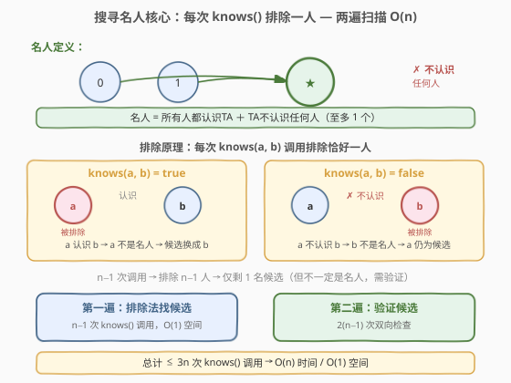
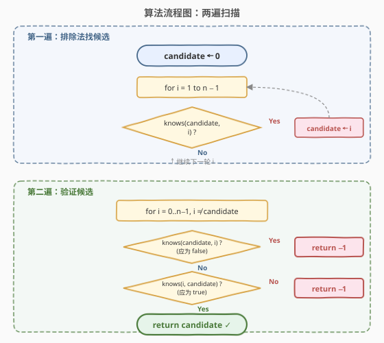
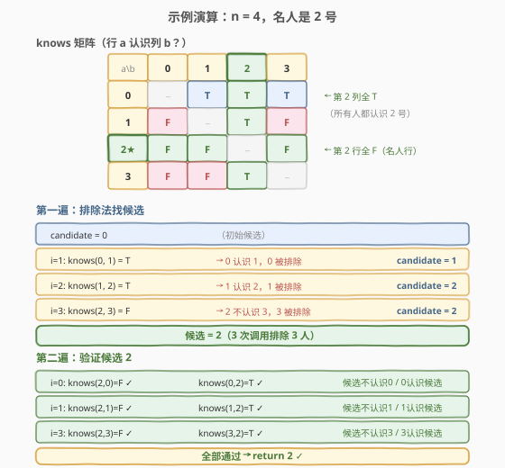

# 搜寻名人

- **题目名称**：搜寻名人
- **链接**：[277. 搜寻名人](https://leetcode.cn/problems/find-the-celebrity/)
- **难度**：中等
- **标签**：图、贪心、交互问题

## 1. 题目概述

假设你在一个派对上，有 `n` 个人（标号 `0` 到 `n−1`）。你有一个 API `bool knows(int a, int b)`，返回人物 `a` 是否认识人物 `b`。

**名人**定义：
- 名人**不认识**任何其他人
- 所有其他人都**认识**名人

找到名人并返回其标号，若不存在则返回 `−1`。

**示例 1**：

```text
输入：n = 3
knows(0,1)=T  knows(0,2)=T
knows(1,0)=F  knows(1,2)=T
knows(2,0)=F  knows(2,1)=F
输出：2
解释：2 号不认识任何人（knows(2,0)=F, knows(2,1)=F），且 0 号和 1 号都认识 2 号。
```

**示例 2**：

```text
输入：n = 1
输出：0
解释：唯一的人即名人——没有"其他人"需认识/被认识，两条条件平凡满足。
```

**约束条件**：

- `1 <= n <= 100`
- `knows(a, b)` 返回 `true` 或 `false`
- `knows(a, a)` 返回 `false`（无人认识自己）
- 题目保证 `n` 个人中**至多有一个名人**

> 💡 本题是「**两遍扫描消除法**」的招牌题。核心洞察：每次 `knows(a, b)` 调用都能排除恰好一个人——`true` 排除 `a`（`a` 认识了别人），`false` 排除 `b`（`b` 不被 `a` 认识）。`n−1` 次调用排除 `n−1` 人，仅剩 1 名候选，再花一遍验证即可。总计 $O(n)$ 次 `knows()` 调用，$O(1)$ 空间。

---

## 2. 解题思路

### 2.1 暴力思路：逐人全面检查

对每个人 `i`，逐一检查两条名人条件：

```text
for i in 0..n-1:
    is_celebrity = true
    for j in 0..n-1, j ≠ i:
        if knows(i, j): is_celebrity = false; break   // i 认识 j → 不是名人
    if not is_celebrity: continue
    for j in 0..n-1, j ≠ i:
        if not knows(j, i): is_celebrity = false; break  // j 不认识 i → 不是名人
    if is_celebrity: return i
return -1
```

时间 $O(n^2)$ 次 `knows()` 调用（最坏每人查 $2(n−1)$ 次），空间 $O(1)$。`n=100` 时约 20000 次调用。问题在于**每次 `knows(a, b)` 的信息只用了半面**——它同时约束了 `a` 和 `b` 的名人资格，但暴力法只用来判定其中一人。

> ⚠️ 暴力法的启示：`knows(a, b)` 的返回值**同时约束两个人**——`true` 说明 `a` 不是名人（`a` 认识了别人），`false` 说明 `b` 不是名人（`b` 不被 `a` 认识）。若每次调用都充分利用「排除一人」的信息，就能把 $O(n^2)$ 降到 $O(n)$。

### 2.2 核心观察：排除法找候选



**关键洞察**：`knows(a, b)` 的返回值无论真假，都能排除恰好一个人：

| 返回值 | 排除谁 | 原因 |
|--------|--------|------|
| `knows(a, b) = true` | 排除 `a` | `a` 认识了某人，违反「名人不认识任何人」 |
| `knows(a, b) = false` | 排除 `b` | `b` 不被 `a` 认识，违反「所有人都认识名人」 |

**第一遍——排除法找候选**：维护 `candidate`，初始为 `0`。从 `i = 1` 到 `n−1`，每次调用 `knows(candidate, i)`：

- 若 `true`：`candidate` 认识 `i` → `candidate` 被排除 → `candidate = i`（`i` 成为新候选）
- 若 `false`：`candidate` 不认识 `i` → `i` 被排除 → `candidate` 不变

$n−1$ 次调用后，所有非 `candidate` 的人都被排除了——**`candidate` 是唯一可能的名人**。

> 💡 **为什么 `candidate` 是「唯一可能」而非「一定是」名人？** 第一遍只验证了 `candidate` 的部分条件：
> - 对 `i > candidate`：确认了 `knows(candidate, i) = false`（候选不认识 `i`），但**未检查 `i` 是否认识候选**。
> - 对 `i < candidate`：当时是 `knows(candidate_old, i)` 导致旧候选被排除，但**当前候选**对这些 `i` 的认识关系尚未检查。
> 
> 因此必须进行第二遍完整验证。

### 2.3 算法流程图



**两遍法**（$O(n)$ 时间，$O(1)$ 空间）：

1. **第一遍（排除法）**：`candidate = 0`，遍历 `i = 1…n−1`，若 `knows(candidate, i)` 则 `candidate = i`。结果：`candidate` 是唯一可能的名人。
2. **第二遍（验证）**：遍历 `i = 0…n−1`（`i ≠ candidate`），检查两条条件：
   - `knows(candidate, i) == false`（候选不认识 `i`）
   - `knows(i, candidate) == true`（`i` 认识候选）
   - 任一条件不满足 → `return −1`
3. 全部通过 → `return candidate`

### 2.4 示例演算

以 `n = 4`、名人为 `2` 号为例：



**knows 矩阵**（行 `a` 认识列 `b`？）：

| a＼b | 0 | 1 | 2 | 3 |
|------|---|---|---|---|
| 0 | − | T | T | T |
| 1 | F | − | T | F |
| **2** | **F** | **F** | **−** | **F** |
| 3 | F | F | T | − |

第 2 行全 `F`（不认识任何人），第 2 列全 `T`（所有人都认识 2 号）→ 2 号是名人。

**第一遍**（排除法）：

| 步骤 | 调用 | 结果 | 排除 | candidate |
|------|------|------|------|-----------|
| 初始 | — | — | — | 0 |
| i=1 | `knows(0, 1)` | T | 0 被排除（0 认识 1） | 1 |
| i=2 | `knows(1, 2)` | T | 1 被排除（1 认识 2） | 2 |
| i=3 | `knows(2, 3)` | F | 3 被排除（2 不认识 3） | 2 |

3 次调用排除 3 人，候选 = 2。

**第二遍**（验证候选 2）：

| i | knows(2, i) | knows(i, 2) | 结果 |
|---|-------------|-------------|------|
| 0 | F ✓ | T ✓ | 通过 |
| 1 | F ✓ | T ✓ | 通过 |
| 3 | F ✓ | T ✓ | 通过 |

6 次验证全部通过 → `return 2`。

**总调用次数**：第一遍 3 次 + 第二遍 6 次 = 9 次 = $3(n−1) = 3 \times 3$。

---

## 3. 参考代码

### C++

```cpp
// 搜寻名人.cpp —— 两遍扫描消除法，O(n) knows() 调用 / O(1) 空间
// 编译: g++ -O2 -std=c++17 搜寻名人.cpp -o celebrity

// Forward declaration of the knows API.
bool knows(int a, int b);

class Solution {
  public:
    int findCelebrity(int n) {
        // 第一遍：排除法找候选
        int candidate = 0;
        for (int i = 1; i < n; ++i) {
            if (knows(candidate, i))   // candidate 认识 i → candidate 被排除
                candidate = i;
            // else: candidate 不认识 i → i 被排除，candidate 不变
        }

        // 第二遍：验证候选
        for (int i = 0; i < n; ++i) {
            if (i == candidate) continue;
            // 候选不应认识 i，且 i 应认识候选
            if (knows(candidate, i) || !knows(i, candidate))
                return -1;
        }
        return candidate;
    }
};
```

### Python

```python
# The knows API is already defined.
# def knows(a: int, b: int) -> bool:

class Solution:
    def findCelebrity(self, n: int) -> int:
        # 第一遍：排除法找候选
        candidate = 0
        for i in range(1, n):
            if knows(candidate, i):       # candidate 认识 i → candidate 被排除
                candidate = i
            # else: candidate 不认识 i → i 被排除，candidate 不变

        # 第二遍：验证候选
        for i in range(n):
            if i == candidate:
                continue
            # 候选不应认识 i，且 i 应认识候选
            if knows(candidate, i) or not knows(i, candidate):
                return -1
        return candidate
```

> 💡 两版等价。第二遍验证用 `||` 短路合并两条条件：`knows(candidate, i)` 为 `true` 时直接返回 `−1`（候选认识某人），无需再调 `knows(i, candidate)`。短路求值在名人不存在时能省掉部分 `knows()` 调用。

---

## 4. 复杂度分析

| 维度 | 复杂度 | 说明 |
|------|--------|------|
| **时间（knows 调用数）** | $O(n)$ | 第一遍 $n−1$ 次 + 第二遍至多 $2(n−1)$ 次 = 至多 $3(n−1)$ 次 |
| **空间复杂度** | $O(1)$ | 仅维护 `candidate` 一个变量 |
| 最坏情况 | $3(n−1)$ 次调用 | 名人存在时第二遍需全部检查；名人不存在时可能提前返回 |

> ⚠️ 暴力法 $O(n^2)$ 的浪费在于「每次 `knows()` 只用来判定一个人，另一半信息丢弃」。排除法把每次调用的「排除一人」信息榨干——$n−1$ 次调用确定唯一候选，再用 $2(n−1)$ 次验证。这是**信息论下界**最优的：$n$ 人中判定至多 1 个名人，每次二元比较至多排除 1 人，需 $\Omega(n)$ 次。

---

## 5. 扩展：名人不存在的情况与验证的必要性

### 5.1 为什么第一遍后候选不一定是名人？

第一遍结束后 `candidate` 是唯一可能的名人，但以下情况会导致验证失败：

1. **候选认识某人**（`i < candidate`）：第一遍中 `candidate` 成为候选后，只对 `i > candidate` 检查了 `knows(candidate, i) = false`，对 `i < candidate` 的认识关系未检查。例如 `knows(2, 0) = true` 时候选 2 认识 0，不是名人。

2. **某人不认识候选**：第一遍只确认了 `candidate` 不认识 `i`（排除 `i`），未检查 `i` 是否认识 `candidate`。例如 `knows(0, 2) = false` 时 0 不认识候选 2，2 不是名人。

### 5.2 无名人的示例

```text
n = 3, knows 矩阵：
     knows(0,1)=T  knows(0,2)=F
     knows(1,0)=F  knows(1,2)=T
     knows(2,0)=T  knows(2,1)=F

第一遍：
  candidate=0 → knows(0,1)=T → candidate=1
  candidate=1 → knows(1,2)=T → candidate=2

第二遍验证 candidate=2:
  i=0: knows(2,0)=T → 候选认识 0！→ return -1
```

候选 2 在第一遍中「淘汰」了所有人，但第二遍发现 `knows(2, 0) = true`，立即返回 `−1`。

> 💡 **为什么名人至多只有一个？** 若 `A` 和 `B` 都是名人，则 `A` 不认识任何人 → `A` 不认识 `B`；但 `B` 是名人 → 所有人都认识 `B` → `A` 认识 `B`。矛盾！名人唯一性是排除法可行的前提——排除到只剩 1 人时，若名人在场必是此人。

---

## 6. 面试要点

1. **为什么排除法的第一遍能保证候选是「唯一可能」的名人？**

   > 每次调用 `knows(candidate, i)` 都排除了两人之一：`true` 排除 `candidate`（它认识别人），`false` 排除 `i`（它不被 `candidate` 认识）。$n−1$ 次调用后，$n−1$ 个人被排除，仅剩 `candidate`。若名人存在，必在未被排除者中，即 `candidate`。

2. **第一遍为什么不能直接返回 `candidate`？还需要第二遍验证吗？**

   > 必须验证。第一遍只检查了 `candidate` 对 `i > candidate` 的认识关系（都是 `false`），但未检查：①`candidate` 是否认识 `i < candidate` 的人；②任何人是否认识 `candidate`。这两个条件都可能不满足，导致候选不是名人。验证是不可省略的。

3. **`knows(a, b)` 返回 `true` 时为什么排除 `a` 而不是 `b`？**

   > `true` 表示 `a` 认识 `b`，违反了名人的「不认识任何人」条件，所以 `a` 被排除。`b` 仍可能是名人——被人认识是名人的必要条件，`a` 认识 `b` 反而支持 `b` 是名人。反之 `false` 表示 `a` 不认识 `b`，违反了 `b` 的「被所有人认识」条件，排除 `b`。

4. **`n = 1` 时算法正确吗？**

   > 正确。第一遍循环不执行（`range(1, 1)` 为空），`candidate = 0`。第二遍循环也为空（没有 `i ≠ 0`），直接返回 `0`。唯一的人满足名人的两条平凡条件（没有其他人需认识/被认识）。

5. **能优化 `knows()` 调用次数吗？$3(n−1)$ 是最优的吗？**

   > $3(n−1)$ 是该算法的调用量，理论下界是 $\Omega(n)$（每次二元比较至多排除 1 人，$n$ 人需 $n−1$ 次确定候选）。验证阶段利用 `||` 短路可在名人不存在时提前返回，减少部分调用。但渐进复杂度都是 $O(n)$，面试中 $3n$ 次调用已足够优秀。

> 💡 **一句话总结**：277 的灵魂是「**每次 `knows()` 排除一人 → $n−1$ 次定候选 → 再验证**」。这与 Boyer-Moore 多数投票（消除不同对 → 定候选 → 验证）是同一套「排除 + 验证」范式——排除规则从「不同则同归于尽」换成「`true` 排除 `a` / `false` 排除 `b`」。掌握这个范式，就能解决所有「在 $O(n)$ 时间内找到满足特殊条件的唯一元素」问题。

---

## 7. 同类练习题

- [997. 找到小镇的法官](https://leetcode.cn/problems/find-the-town-judge/)：本题的「信任数组」版——法官 = 名人（被所有人信任 + 不信任任何人），输入从 API 变为 `trust` 边列表，可用入度/出度数组 $O(n)$ 求解，核心思想完全一致
- [229. 多数元素 II](https://leetcode.cn/problems/majority-element-ii/)（[题解](../0201-0300/229_多数元素II.md)）：Boyer-Moore 多数投票进阶版，同为「排除 + 验证」范式——配对消除不同元素定候选，再验证候选出现次数是否超过 $\lfloor n/3 \rfloor$
- [169. 多数元素](https://leetcode.cn/problems/majority-element/)（[题解](../0101-0200/169_多数元素.md)）：Boyer-Moore 多数投票基础版，消除不同对定候选再验证，是 229 与本题共用的「排除 + 验证」模板的母题
- [287. 寻找重复数](https://leetcode.cn/problems/find-the-duplicate-number/)（[题解](../0201-0300/287_寻找重复数.md)）：在 $O(n)$ 时间 $O(1)$ 空间找特殊元素（重复数），用 Floyd 快慢指针判环而非排除法，对照另一种「$O(n)$ 找特殊元素」的思路
