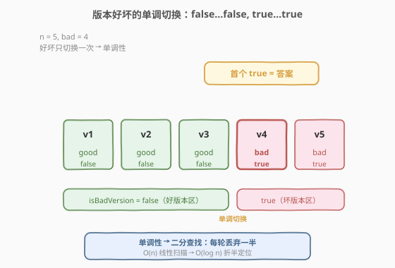
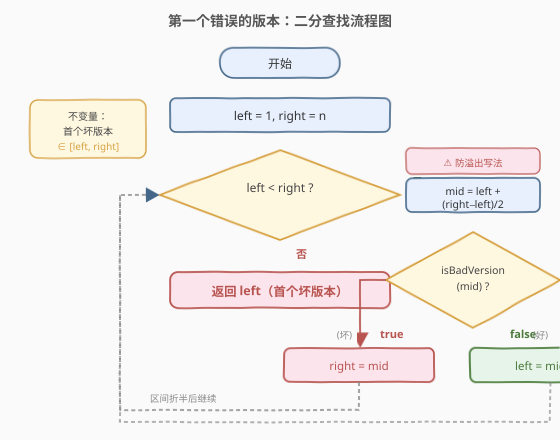
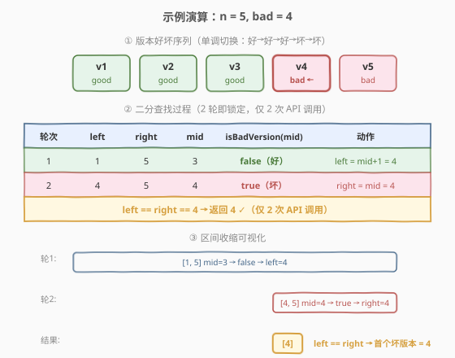

# LeetCode 第一个错误的版本 题解

## 1. 题目概述

- **标题 / 题号**：第一个错误的版本（#278，easy）
- **链接**：https://leetcode.cn/problems/first-bad-version/
- **难度**：简单
- **标签**：二分查找、交互

**题意**：你是产品经理，正在带领团队开发一个产品。产品有 `n` 个版本，编号从 `1` 到 `n`。某一天某个版本出了问题，称为**第一个错误版本**，**此后所有版本都是错误的**。

给定一个 API `isBadVersion(version)`，它会返回某个版本是否错误。你的任务是**找出第一个错误版本**，并**尽量减少调用 API 的次数**。

**示例 1**：

```text
输入：n = 5, bad = 4
输出：4
解释：调用 isBadVersion(3) → false
      调用 isBadVersion(4) → true
      所以 4 是第一个错误版本。
```

**示例 2**：

```text
输入：n = 1, bad = 1
输出：1
```

**约束**：

- `1 <= bad <= n <= 2^31 - 1`

> 💡 本题的核心是「**单调布尔序列上找首个 true**」：版本的好/坏构成一列 `false, false, ..., false, true, true, ..., true`，只有一次切换。这正是 [35. 搜索插入位置](../0001-0100/35_搜索插入位置.md) 的 `lower_bound` 模板——只不过「比较」从 `nums[mid] >= target` 换成了 `isBadVersion(mid)`。

## 2. 解题思路

### 2.1 暴力思路：线性扫描

从版本 `1` 到 `n` 依次调用 `isBadVersion`，返回首个返回 `true` 的版本号。最坏需要 `n` 次 API 调用。当 $n = 2^{31}-1 \approx 21$ 亿时，线性扫描会超时——题目明确要求**尽量减少调用次数**。

> ⚠️ 本题的「成本」不是时间，而是 **API 调用次数**。暴力法浪费了「坏版本一旦出现后续全坏」这一**单调性**，而这正是二分查找的基石。

### 2.2 核心观察：单调布尔序列 = 二分查找



关键洞察：版本的好坏序列具有**单调性**——前半段全是 `false`（好版本），后半段全是 `true`（坏版本），**只有一次切换**。寻找「首个 `true`」等价于在有序序列上做 `lower_bound`，每次比较中点就能丢掉一半。

形式化：设 `isBadVersion(v)` 在 $v$ 上单调（即若 $v$ 坏，则 $v+1, v+2, \ldots$ 全坏）。我们要找最小的 $v$ 使 `isBadVersion(v) == true`。

- 取 `mid = left + (right - left) / 2`
- 若 `isBadVersion(mid)` 为 **true**：`mid` 是坏版本，**首个坏版本在 `mid` 或更早**，收缩右界 `right = mid`；
- 若 `isBadVersion(mid)` 为 **false**：`mid` 是好版本，**首个坏版本在 `mid` 之后**，收缩左界 `left = mid + 1`。

> 💡 **与 35 的对照**：35 的判定是 `nums[mid] >= target`（值比较），本题是 `isBadVersion(mid)`（函数调用）。两者都是「判定条件在中点上的单调切换」，模板完全一致：`right = mid` 保留候选、`left = mid + 1` 排除已确认的好版本。唯一区别是 35 在 0-indexed 数组上操作，本题在 1-indexed 版本号上操作。

### 2.3 算法流程图



**循环不变量**：**首个坏版本始终落在闭区间 `[left, right]` 内**。每轮调用一次 `isBadVersion(mid)`，根据返回值收缩区间，直到 `left == right` 时锁定唯一候选。

**步骤**：

1. `left = 1, right = n`（版本号从 1 开始）；
2. 取 `mid = left + (right - left) / 2`（向下取整，**防溢出**）；
3. 若 `isBadVersion(mid)` 为 `true`：`mid` 是坏版本，首个坏版本在 `mid` 或其左侧，`right = mid`；
4. 否则：`mid` 是好版本，首个坏版本必在 `mid` 右侧，`left = mid + 1`；
5. 当 `left < right` 不成立时退出，返回 `left`。

> ⚠️ **为什么 `mid` 必须用 `left + (right - left) / 2`？** 本题 $n$ 可达 $2^{31}-1$，`left + right` 在 C++/Java 中会**整数溢出**得到负数，传入 `isBadVersion` 会越界。差值写法保证中间结果不超过 `right`，安全。这是本题最常见的踩坑点。

### 2.4 示例演算

以 `n = 5, bad = 4` 为例，版本好坏为 `[1✓, 2✓, 3✓, 4✗, 5✗]`（✓=好/false，✗=坏/true）：



| 轮次 | left | right | mid | isBadVersion(mid) | 动作 |
|------|------|-------|-----|-------------------|------|
| 1 | 1 | 5 | 3 | false（版本 3 是好的） | left = mid+1 = 4 |
| 2 | 4 | 5 | 4 | true（版本 4 是坏的） | right = mid = 4 |
| 收敛 | 4 | 4 | — | left == right | **返回 4** |

两轮折半锁定版本 `4`，仅调用 2 次 API。对比线性扫描需 4 次（从 1 扫到 4），$n$ 越大优势越显著：$O(\log n)$ vs $O(n)$。

## 3. 参考代码

### C++

```cpp
class Solution {
  public:
    int firstBadVersion(int n) {
        int left = 1, right = n;
        while (left < right) {
            int mid = left + (right - left) / 2;
            if (isBadVersion(mid)) {
                right = mid;
            } else {
                left = mid + 1;
            }
        }
        return left;
    }
};
```

### Python

```python
class Solution:
    def firstBadVersion(self, n: int) -> int:
        left, right = 1, n
        while left < right:
            mid = left + (right - left) // 2
            if isBadVersion(mid):
                right = mid
            else:
                left = mid + 1
        return left
```

> ⚠️ **三个易错点**：
> 1. **`mid` 防溢出**：`left + (right - left) / 2` 而非 `(left + right) / 2`。$n \le 2^{31}-1$ 时 `left + right` 可达 $2^{32}-2$，在 32 位有符号整数下溢出。Python 不溢出但保持同一写法便于跨语言记忆。
> 2. **`right = mid` 而非 `mid - 1`**：`mid` 本身就是坏版本时，它**可能是**第一个，不能跳过。这与 [35](../0001-0100/35_搜索插入位置.md) 的 `right = mid - 1`（闭区间模板）不同——本题用 `left < right` + `right = mid`（左闭右闭但收缩保留候选），两种模板都能写 `lower_bound`，关键是区间定义与收缩自洽。
> 3. **循环条件 `left < right` 而非 `left <= right`**：本题模板中 `right = mid` 不越过 `mid`，若用 `left <= right` 会在 `left == right` 时仍进入循环、取 `mid = left`，若该版本坏则 `right = mid` 无变化 → 死循环。`left < right` 保证 `left == right` 时退出，此时 `left` 即答案。

## 4. 复杂度分析

| 维度 | 复杂度 | 说明 |
|------|--------|------|
| 时间复杂度 | $O(\log n)$ | 每轮区间折半，共 $\lceil \log_2 n \rceil$ 轮；$n = 2^{31}-1$ 时仅约 31 次 |
| 空间复杂度 | $O(1)$ | 仅 `left` / `right` / `mid` 三个变量 |
| API 调用次数 | $O(\log n)$ | 每轮调用一次 `isBadVersion`，与时间复杂度一致 |

> 💡 $n = 2^{31}-1 \approx 21$ 亿时，$\log_2 n \approx 31$，即**最多 31 次 API 调用**即可在 21 亿个版本中定位首个坏版本。对比线性扫描的 21 亿次，这是「指数级」与「对数级」的鸿沟——二分查找的力量。

## 5. 扩展：两种二分模板的对照

本题使用「`left < right` + `right = mid` + `left = mid + 1`」模板（与 [275. H 指数 II](../0201-0300/275_H指数II.md) 一致），而 [35. 搜索插入位置](../0001-0100/35_搜索插入位置.md) 使用「`left <= right` + `right = mid - 1` + `left = mid + 1`」模板（闭区间）。两者都能实现 `lower_bound`，区别在于区间定义与终止条件：

| 维度 | `left < right` 模板（本题/275） | `left <= right` 模板（35） |
|------|----------------------------------|----------------------------|
| 区间语义 | `[left, right]`，退出时 `left == right` 为答案 | `[left, right]`，退出时 `left > right`，`left` 为答案 |
| 命中时收缩 | `right = mid`（保留候选，不跳过） | `right = mid - 1`（跳过已确认候选） |
| 终止条件 | `left == right`（区间收缩到单点） | `left > right`（区间为空） |
| 适用场景 | 「找首个满足条件」的判定型二分 | 「找下界 / 命中即返回」的值比较型二分 |
| 哨兵技巧 | `right = n + 1` 可处理「全不满足」 | `right = n - 1`，退出时 `left` 自然落到插入点 |

> 💡 **选择建议**：当判定条件是**函数调用**（如 `isBadVersion`）且我们关心「首个满足」时，`left < right` 模板更自然——无需处理「命中后继续找左边界」的细节，`right = mid` 直接保留候选。当判定条件是**值比较**且可能「命中即返回」时，`left <= right` 模板更直观。两种模板都要熟练，关键是区间定义、收缩、终止三者自洽。

## 6. 面试要点

1. **为什么用二分而不是线性扫描？**

   - 版本好坏具有单调性：一旦某版本坏了，后续全坏。序列为 `false...false, true...true`，只有一次切换。单调性是二分可行的充要条件——每轮比较中点即可丢掉一半，把 $O(n)$ 降到 $O(\log n)$。$n$ 可达 21 亿，线性扫描不可行。

2. **`mid = left + (right - left) / 2` 为什么不能写成 `(left + right) / 2`？**

   - 本题 $n \le 2^{31}-1$，`left + right` 最大可达 $2(2^{31}-1) = 2^{32}-2$，超过 32 位有符号整数上界 $2^{31}-1$，溢出为负数。传入 `isBadVersion` 会越界报错。差值写法保证中间结果 $\le \text{right} \le n$，不溢出。这是本题**最高频的踩坑点**。

3. **为什么 `right = mid` 而不是 `right = mid - 1`？**

   - `isBadVersion(mid)` 为 `true` 时，`mid` 是坏版本，**它可能就是第一个**，不能跳过。`right = mid` 将 `mid` 保留在搜索区间内。若写 `right = mid - 1`，会漏掉 `mid` 本身就是首个坏版本的情况（如 `n = 1, bad = 1` 时 `mid = 1`，`right = 0` 导致漏判）。

4. **循环条件为什么是 `left < right` 而不是 `left <= right`？**

   - 本题模板中 `right = mid` 不越过 `mid`，当 `left == right` 时若仍进入循环，`mid = left`，若该版本坏则 `right = mid` 无变化，**死循环**。`left < right` 保证区间收缩到单点时退出，此时 `left` 就是首个坏版本，直接返回。

5. **本题和 35 搜索插入位置是什么关系？**

   - 本质同构。35 在有序数组上找「首个 `nums[i] >= target`」的下界，判定是值比较 `nums[mid] >= target`；本题在单调布尔序列上找「首个 `isBadVersion(v) == true`」，判定是函数调用。两者都是 `lower_bound` 的实例，只是判定的「数据源」不同：35 是显式数组，本题是隐式 API。会一道即会一类。

## 同类练习题

| # | 题目 | 与本题的关联 |
|---|------|-------------|
| 35 | [搜索插入位置](https://leetcode.cn/problems/search-insert-position/)（[题解](../0001-0100/35_搜索插入位置.md)） | `lower_bound` 的值比较版，判定从 `isBadVersion` 换成 `nums[mid] >= target`，模板同构 |
| 275 | [H 指数 II](https://leetcode.cn/problems/h-index-ii/)（[题解](../0201-0300/275_H指数II.md)） | 同为 `left < right` + `right = mid` 模板的二分找边界，对比「找首个满足条件的下标」的通用范式 |
| 704 | [二分查找](https://leetcode.cn/problems/binary-search/) | 闭区间二分的母题，理解 `left <= right` 与 `left < right` 两种模板的差异 |
| 69 | [x 的平方根](https://leetcode.cn/problems/sqrtx/) | 在答案值域上二分找「最大的平方 ≤ x」，也是防溢出的经典场景 |
| 852 | [山脉数组的峰顶索引](https://leetcode.cn/problems/peak-index-in-a-mountain-array/) | 单调性二分的另一变体，找「首个下降点」，体会不同单调结构下的二分判定 |
