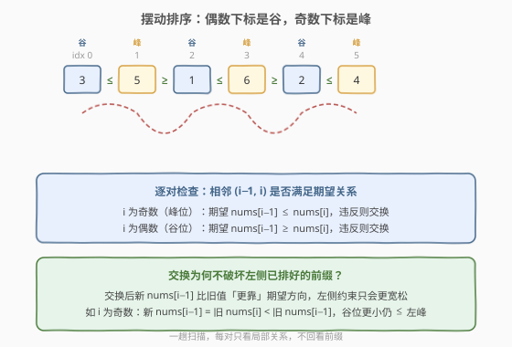
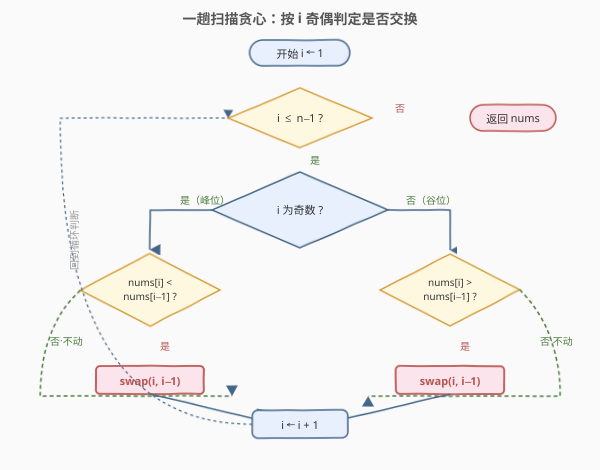

# 摆动排序

- **题目名称**：摆动排序
- **链接**：[280. Wiggle Sort](https://leetcode.cn/problems/wiggle-sort/)
- **难度**：中等
- **标签**：数组、贪心、排序

## 1. 题目概述

给定一个**无序整数数组** `nums`，请**原地**重排，使其满足「摆动」序列：

$$\text{nums}[0] \leq \text{nums}[1] \geq \text{nums}[2] \leq \text{nums}[3] \geq \text{nums}[4] \leq \cdots$$

即**偶数下标为「谷」**（不大于右邻），**奇数下标为「峰」**（不小于右邻）。你可以假设输入总能得到一个合法答案；返回**任一**合法摆动序列即可。

**示例 1**：

```text
输入：nums = [3,5,2,1,6,4]
输出：[3,5,1,6,2,4]   （[1,6,2,5,3,4] 等任意合法摆动序列均可）
解释：3 ≤ 5 ≥ 1 ≤ 6 ≥ 2 ≤ 4，奇偶交替满足峰谷关系。
```

**示例 2**：

```text
输入：nums = [6,6,5,6,3,8]
输出：[6,6,5,6,3,8]   （已天然满足，含相等元素时 ≤/≥ 允许取等）
```

**约束条件**：

- `1 <= nums.length <= 5 * 10^4`
- `0 <= nums[i] <= 10^4`
- 保证存在至少一个合法摆动排列

**进阶**：能否用 $O(n)$ 时间、$O(1)$ 额外空间完成？

> 💡 本题是「**相邻关系约束 + 原地贪心**」家族的招牌题。核心是认识到摆动条件只约束**相邻对**的相对大小，与全局排序无关——因此无需排序，只需一趟扫描，对每对违反期望关系的相邻元素做一次局部交换即可。下文 2.2 给出 $O(n)$ 一趟贪心模板，并证明「局部交换不破坏已处理前缀」。

---

## 2. 解题思路

### 2.1 暴力思路：排序后两两交换

最直观的想法：先**整体排序**，再把 `nums[1]` 与 `nums[2]`、`nums[3]` 与 `nums[4]`……两两交换。

```text
排序 nums
for i in range(1, n, 2):       # 从下标 1 起，每跨 2
    if i + 1 < n:
        swap(nums[i], nums[i+1])
```

排序后序列单调递增，把每对 `(奇数位, 偶数位)` 交换后，奇数位拿到较大值、偶数位拿到较小值，恰好形成 `小 ≤ 大 ≥ 小 ≤ 大 ≥ …`。

- **正确**：能保证得到合法摆动序列（含相等的情形也成立，因为 `≤`/`≥` 允许取等）；
- **缺点**：时间 $O(n \log n)$、空间视排序实现而定（$O(\log n)$ 栈或 $O(n)$），且**做了远超必要的全局排序**——题目只要「相邻相对大小」符合，根本不需要整体有序。

> ⚠️ 本题追求的是 $O(n)$。排序版可作为兜底解或用来对拍验证，但不是最优。下面的一趟贪心才是面试官想看到的进阶解法。

### 2.2 核心观察：一趟扫描，按奇偶判定局部交换



**关键洞察**：摆动条件是**局部约束**——每对相邻元素 `(i−1, i)` 只需满足一种期望关系，与前缀、后缀的绝对大小无关：

| 下标 `i` | 角色 | 期望关系（对 `nums[i−1]` 与 `nums[i]`） | 违反时的修复 |
|----------|------|------------------------------------------|--------------|
| 奇数 | 峰 | `nums[i−1] ≤ nums[i]`（即 `nums[i] ≥ nums[i−1]`） | 若 `nums[i] < nums[i−1]`，交换两者 |
| 偶数 | 谷 | `nums[i−1] ≥ nums[i]`（即 `nums[i] ≤ nums[i−1]`） | 若 `nums[i] > nums[i−1]`，交换两者 |

从 `i = 1` 起向右扫描，每遇到一对违反期望关系的相邻元素，就**当场交换**它们。模板极简：

```text
for i in 1 .. n-1:
    if (i 奇 and nums[i] < nums[i-1]) or (i 偶 and nums[i] > nums[i-1]):
        swap(nums[i], nums[i-1])
```

> 💡 **为什么交换是安全的（不破坏左侧已排好的前缀）？** 这是全题最关键的正确性保证。以 `i` 为奇数（峰位）为例：触发交换意味着 `nums[i] < nums[i−1]`，交换后 `新 nums[i−1] = 旧 nums[i]`（更小），`新 nums[i] = 旧 nums[i−1]`（更大）。① 新对 `(i−1, i)`：`新 nums[i−1] < 新 nums[i]`，满足 `≤` ✓；② 左侧对 `(i−2, i−1)`：`i−1` 是谷位，原约束 `nums[i−2] ≥ 旧 nums[i−1]`，而 `新 nums[i−1] = 旧 nums[i] < 旧 nums[i−1]`，故 `nums[i−2] ≥ 旧 nums[i−1] > 新 nums[i−1]`，约束 `≥` 仍成立 ✓。**偶数位同理对称**。本质是：交换让 `nums[i−1]`「更靠」期望方向（峰位变得更大、谷位变得更小），左侧约束只会**更宽松**而非更紧。因此一趟向右扫描即可，**无需回看**。

> ⚠️ **为什么不需要排序？** 摆动序列不要求整体有序——`[3,5,1,6,2,4]` 中 `1` 排在 `5` 后面、`6` 排在 `1` 后面，全局看完全无序，但每对相邻关系都满足。排序版把「整体有序」作为充分条件来满足「相邻有序」，是过强约束；一趟贪心直接瞄准「相邻有序」这个**充要条件**，故能做到 $O(n)$。

### 2.3 算法流程图



**完整步骤**：

1. **初始化**：从 `i = 1` 开始（下标 0 无左邻，天然跳过）；
2. **循环** `i` 从 `1` 到 `n − 1`：
   - **判定奇偶**：
     - `i` 为**奇数**（峰位）：若 `nums[i] < nums[i−1]`，交换 `nums[i]` 与 `nums[i−1]`；否则不动；
     - `i` 为**偶数**（谷位）：若 `nums[i] > nums[i−1]`，交换 `nums[i]` 与 `nums[i−1]`；否则不动；
   - `i ← i + 1`，回到循环判断；
3. **返回** `nums`（原数组已原地修改为合法摆动序列）。

> 💡 判定与交换可压缩成一行：当 `(i 为奇) == (nums[i] < nums[i−1])` 时即需交换——奇数位违反表现为 `nums[i] < nums[i−1]`（真），偶数位违反表现为 `nums[i] > nums[i−1]`（即 `nums[i] < nums[i−1]` 为假，但偶数位本应 `nums[i] ≤ nums[i−1]`，违反是 `>`）。更清晰的等价写法见 2.2 模板，可读性优先。

### 2.4 示例演算

以 `nums = [3, 5, 2, 1, 6, 4]` 演示一趟扫描，覆盖「不动」「交换」两种情形：

![示例演算：[3,5,2,1,6,4] 的一趟贪心过程](../images/wiggle_sort_walkthrough.svg)

| `i` | 奇偶·角色 | 期望 | 检查 `(i−1, i)` | 动作 | 数组状态 |
|-----|-----------|------|-----------------|------|----------|
| 1 | 奇·峰 | `a0 ≤ a1` | `3 ≤ 5` ✓ | 不动 | `[3, 5, 2, 1, 6, 4]` |
| 2 | 偶·谷 | `a1 ≥ a2` | `5 ≥ 2` ✓ | 不动 | `[3, 5, 2, 1, 6, 4]` |
| 3 | 奇·峰 | `a2 ≤ a3` | `2 ≤ 1` ✗ | swap(2,3) | `[3, 5, 1, 2, 6, 4]` |
| 4 | 偶·谷 | `a3 ≥ a4` | `2 ≥ 6` ✗ | swap(3,4) | `[3, 5, 1, 6, 2, 4]` |
| 5 | 奇·峰 | `a4 ≤ a5` | `2 ≤ 4` ✓ | 不动 | `[3, 5, 1, 6, 2, 4]` |

- **`i = 3`**：期望峰位 `nums[3] ≥ nums[2]`，实际 `1 < 2` 违反，交换得 `[3, 5, 1, 2, 6, 4]`。注意交换后 `nums[2] = 1`（更小），左侧对 `(1, 2)` 原约束 `5 ≥ 2` 现变为 `5 ≥ 1`，仍成立——这正是「谷位变得更小，左侧约束更宽松」的体现；
- **`i = 4`**：期望谷位 `nums[4] ≤ nums[3]`，实际 `6 > 2` 违反，交换得 `[3, 5, 1, 6, 2, 4]`。交换后 `nums[3] = 6`（更大），左侧对 `(2, 3)` 原约束 `1 ≤ 2` 现变为 `1 ≤ 6`，仍成立——「峰位变得更大，左侧约束更宽松」；
- 最终 `3 ≤ 5 ≥ 1 ≤ 6 ≥ 2 ≤ 4` ✓，全程序仅 2 次相邻交换，无回看。

> 💡 **观察「交换的连锁」**：本题中 `i = 3` 的交换把 `nums[3]` 从 `1` 变成 `2`，紧接着 `i = 4` 又因 `2 < 6` 触发交换。看起来像「连锁反应」，但每次交换都是**局部独立的**——只看当前对 `(i−1, i)` 是否违反，不关心前缀历史。这正是贪心可证的关键：每步把当前对修好，且修复不会回溯破坏前缀。

---

## 3. 参考代码

### C++

```cpp
class Solution {
public:
    void wiggleSort(vector<int>& nums) {
        int n = nums.size();
        for (int i = 1; i < n; ++i) {
            if (i & 1) {                       // i 为奇数：峰位，期望 nums[i] >= nums[i-1]
                if (nums[i] < nums[i - 1]) {
                    swap(nums[i], nums[i - 1]);
                }
            } else {                           // i 为偶数：谷位，期望 nums[i] <= nums[i-1]
                if (nums[i] > nums[i - 1]) {
                    swap(nums[i], nums[i - 1]);
                }
            }
        }
    }
};
```

### Python

```python
class Solution:
    def wiggleSort(self, nums: List[int]) -> None:
        """
        Do not return anything, modify nums in-place instead.
        """
        for i in range(1, len(nums)):
            if i & 1:                          # i 为奇数：峰位，期望 nums[i] >= nums[i-1]
                if nums[i] < nums[i - 1]:
                    nums[i], nums[i - 1] = nums[i - 1], nums[i]
            else:                              # i 为偶数：谷位，期望 nums[i] <= nums[i-1]
                if nums[i] > nums[i - 1]:
                    nums[i], nums[i - 1] = nums[i - 1], nums[i]
```

> 💡 两版骨架一致：一趟 `for i in 1..n-1`，按 `i` 奇偶分两支判定违反并交换。`i & 1` 比 `i % 2 == 1` 更简洁且等价。Python 直接用元组解包 `a, b = b, a` 交换，无需临时变量。**进阶一行写法**：`if (i & 1) == (nums[i] < nums[i - 1]): swap(...)`——把「奇数位且 `nums[i] < nums[i−1]`」与「偶数位且 `nums[i] > nums[i−1]`（即 `nums[i] < nums[i−1]` 为假但需交换）」统一成一个布尔等价，但可读性较差，面试讲解建议保留显式双分支。

---

## 4. 复杂度分析

| 维度 | 复杂度 | 说明 |
|------|--------|------|
| 时间复杂度 | $O(n)$ | 一趟扫描，每个 `i` 做常数次比较与至多一次交换，共 $n − 1$ 轮 |
| 空间复杂度 | $O(1)$ | 原地修改，仅 `i` 与交换临时变量，无额外数组 |
| 交换次数 | 至多 $n − 1$ | 每轮至多一次相邻交换；实际违反次数取决于输入，最坏全反向时约 $n/2$ 次 |

> ⚠️ 与排序版对比：排序版 $O(n \log n)$ 时间 + $O(\log n)$ 栈空间；一趟贪心版 $O(n)$ 时间 + $O(1)$ 空间，全面更优。关键是识别出「约束是局部的，无需全局排序」。

---

## 5. 扩展：排序版与摆动排序 II

### 5.1 排序 + 两两交换（兜底解）

当一时想不到一趟贪心时，排序版是最容易想到且必对的兜底：

```python
def wiggleSortSort(nums):
    nums.sort()
    for i in range(1, len(nums) - 1, 2):   # 下标 1, 3, 5 ... 与其后一个交换
        nums[i], nums[i + 1] = nums[i + 1], nums[i]
```

排序后 `[a0 ≤ a1 ≤ a2 ≤ a3 ≤ a4 ≤ a5 …]`，交换 `(a1,a2)`、`(a3,a4)` 得 `[a0, a2, a1, a4, a3, a6, a5, …]`，满足 `a0 ≤ a2 ≥ a1 ≤ a4 ≥ a3 ≤ …`。含相等元素时取等仍合法。**面试中可先抛排序版说清思路，再优化到一趟贪心**，展示从「充分条件」到「充要条件」的优化过程。

### 5.2 摆动排序 II（LeetCode 324，严格交替）

[324. 摆动排序 II](https://leetcode.cn/problems/wiggle-sort-ii/) 把约束收紧为**严格**摆动 `nums[0] < nums[1] > nums[2] < nums[3] > …`（不允许取等），且要求 $O(n)$ 时间、$O(1)$ 空间（进阶）。此时本题的一趟贪心**失效**——相等的元素无法靠局部交换分隔开，必须借助**中位数划分**（快速选择找中位数 + 三路划分 `小|中|大`）再交叉放置。324 是 280 的进阶版，核心区别在于「允许取等」让 280 可贪心、「严格不等」逼 324 走划分。详见 [324 题解](../0301-0400/324_摆动排序II.md)（待补）。

> 💡 **从 280 到 324 的本质跃迁**：280 的「`≤`/`≥` 允许取等」意味着相等元素随便摆都合法，局部交换足够；324 的「`<`/`>` 严格不等」要求相等的元素**必须被分到不同半区**，需要先按中位数把数组分成「严格小于中位数 | 等于中位数 | 严格大于中位数」三段，再按「偶数位放小、奇数位放大」交叉填入——否则 `2,2,2` 这类输入无论怎么局部交换都无法严格摆动。

---

## 6. 面试要点

1. **为什么一趟贪心是正确的？交换不会破坏前缀吗？**

   > 不会。以 `i` 为奇数（峰位）触发交换为例：交换前 `nums[i] < nums[i−1]`，交换后 `新 nums[i−1] = 旧 nums[i]`（更小）。新对 `(i−1, i)` 自然满足 `≤`；左侧对 `(i−2, i−1)` 的原约束是 `nums[i−2] ≥ 旧 nums[i−1]`，而 `新 nums[i−1] < 旧 nums[i−1]`，故 `nums[i−2] ≥ 旧 nums[i−1] > 新 nums[i−1]`，`≥` 仍成立。偶数位对称。本质是交换让 `nums[i−1]` 更靠期望方向（峰变大、谷变小），左侧约束只会更宽松。因此可向右一趟扫描，无需回看。

2. **为什么不需要排序？摆动序列要求整体有序吗？**

   > 不要求。摆动条件只约束相邻对的相对大小（`a0 ≤ a1 ≥ a2 ≤ …`），是**局部**约束；整体看序列完全可能无序（如 `[3,5,1,6,2,4]`）。排序版用「整体有序」这个过强的充分条件来满足「相邻有序」，多花了 $O(n \log n)$；一趟贪心直接瞄准「相邻有序」这个充要条件，故 $O(n)$ 足够。

3. **判定条件怎么记？奇数位和偶数位的违反判定方向相反吗？**

   > 相反但对称。奇数位是峰，期望 `nums[i] ≥ nums[i−1]`，**违反 = `nums[i] < nums[i−1]`**；偶数位是谷，期望 `nums[i] ≤ nums[i−1]`，**违反 = `nums[i] > nums[i−1]`**。两者都用「当前位与左邻比，违反期望方向则交换」统一理解。代码里写显式双分支最清晰；进阶可用 `(i & 1) == (nums[i] < nums[i−1])` 合并，但面试讲解优先双分支。

4. **含大量相等元素时本题解法还成立吗？为什么 324 就不行？**

   > 280 成立。本题允许 `≤`/`≥` 取等，相等元素无论怎么摆都满足约束——如 `[2,2,2]` 本身就是合法摆动序列（`2 ≤ 2 ≥ 2 ≤`）。一趟贪心遇到相等时判定条件 `<` / `>` 都为假，不交换，直接通过。但 324 要求严格 `<`/`>`，相等元素必须被分到不同半区，局部交换无法把 `2,2,2` 隔开，故必须走中位数三路划分 + 交叉填入。

5. **本题与排序版的取舍？什么场景下用哪个？**

   > 面试优先讲一趟贪心（$O(n)$/$O(1)$），展示对「局部约束」的识别。若一时卡壳，可先抛排序版（$O(n \log n)$，必对）作为兜底，再说「注意到约束是局部的，可优化到 $O(n)$」过渡到贪心。工程上若 `n` 极小或代码简洁性优先，排序版两行更短；但本题的「考点」就是 $O(n)$ 贪心，必须掌握。

> 💡 **一句话总结**：280 的灵魂是「**约束局部化**」——摆动条件只管相邻对，与全局无关，故无需排序，一趟扫描对每对违反期望关系的相邻元素做一次局部交换即可，且交换让 `nums[i−1]` 更靠期望方向、左侧约束只更宽松，保证无需回看。$O(n)$/$O(1)$ 是「识别局部约束」红利的体现。

---

## 7. 同类练习题

- [324. 摆动排序 II](https://leetcode.cn/problems/wiggle-sort-ii/)：本题的严格不等版（`<`/`>` 不允许取等），一趟贪心失效，须用中位数三路划分 + 交叉填入，对照本题体会「允许取等」带来的贪心可行性
- [376. 摆动序列](https://leetcode.cn/problems/wiggle-sequence/)：求最长摆动子序列的长度，DP / 贪心（峰谷计数），是「摆动」概念的子序列版，对照本题的「整个数组重排为摆动」
- [215. 数组中的第 K 个最大元素](https://leetcode.cn/problems/kth-largest-element-in-an-array/)：快速选择划分，是 324 摆动排序 II 中位数划分的基础，本题进阶路线的关键前置
- [75. 颜色分类](https://leetcode.cn/problems/sort-colors/)：三路划分（荷兰国旗），与 324 的「小|中|大」三段划分同模板，对照本题局部交换的「二路」思维
- [283. 移动零](https://leetcode.cn/problems/move-zeroes/)：另一类「一趟扫描 + 原地交换」的数组贪心，对照本题「一趟扫描 + 局部交换」的模板感
