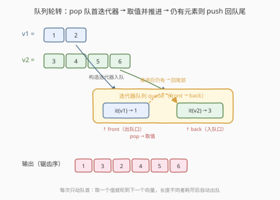
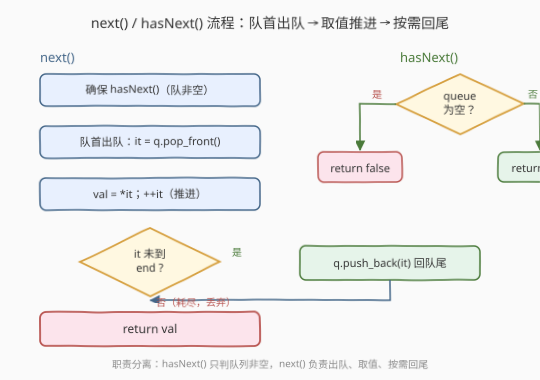

# LeetCode 锯齿迭代器 题解

## 1. 题目概述

- **标题 / 题号**：锯齿迭代器（#281，medium）
- **链接**：https://leetcode.cn/problems/zigzag-iterator/
- **难度**：中等
- **标签**：设计、队列、迭代器、轮转调度

**题意**：给定 $k$ 个一维整数向量，请实现一个「锯齿」迭代器，按**交替轮转**顺序逐个返回它们的元素：先取第 1 个向量的下一个元素，再取第 2 个向量的下一个元素……取到第 $k$ 个后再回到第 1 个，**循环往复**直到所有向量全部耗尽。实现 `ZigzagIterator` 类：

- `ZigzagIterator(List<int> v1, List<int> v2)`：用两个向量初始化对象（本题接口给两个向量，进阶要求支持 $k$ 个）。
- `int next()`：按锯齿顺序返回下一个元素。
- `bool hasNext()`：若仍有元素可返回则 `true`，否则 `false`。

**示例 1**：

```text
输入：
v1 = [1, 2]
v2 = [3, 4, 5, 6]
调用序列：[next, next, next, next, next, next, hasNext]
输出：     [1,    3,    2,    4,    5,    6,    false]

解释：交替取 v1、v2 的元素 → 1(来自v1), 3(v2), 2(v1), 4(v2), 5(v2), 6(v2)。
      v1 先耗尽，之后只剩 v2 独占输出。
```

**示例 2**：

```text
输入：
v1 = [1]
v2 = [2, 3, 4, 5, 6]
输出：[1, 2, 3, 4, 5, 6]
解释：v1 只有一个元素，取完即退场，v2 接管剩余输出。
```

**约束**：

- $0 \leq \text{v1.length}, \text{v2.length} \leq 1000$
- $1 \leq \text{v1.length} + \text{v2.length} \leq 2000$
- $-10^6 \leq \text{v1[i]}, \text{v2[i]} \leq 10^6$
- `next()` 与 `hasNext()` 的调用总次数不超过 $10^4$

**进阶**：如果给定 $k$ 个一维向量，你的代码能否优雅地扩展？

> 💡 本题是「**迭代器设计 + 轮转调度**」家族的招牌题。核心是认识到「锯齿」本质是 $k$ 路数据源的**公平轮询（round-robin）**——每个向量轮流贡献一个元素，耗尽者自动退场。用**队列管理各向量的迭代器**即可天然表达这一调度：每次从队首取一个迭代器、读一个值、推进，若仍有剩余则压回队尾。这个模板对 $k$ 个向量零改动扩展，是本题的「正解」。

## 2. 解题思路

### 2.1 暴力思路：下标轮询

最直观的做法：维护一个「当前轮到第几个向量」的指针 `cur`，以及每个向量各自的下标 `idx[i]`。`next()` 时从 `cur` 起**环形查找**下一个尚未耗尽的向量，取其当前元素并推进下标，再把 `cur` 前进一位（取模 $k$）。

```text
cur = 0
idx = [0] * k
next():
    while idx[cur] == len(vecs[cur]):   # 跳过已耗尽的向量
        cur = (cur + 1) % k
    val = vecs[cur][idx[cur]]
    idx[cur] += 1
    cur = (cur + 1) % k
    return val
```

- **正确**：能产出锯齿序；
- **缺点**：① 当多数向量已耗尽时，`while` 环形扫描每次可能要跳过大量空向量，单次 `next()` 最坏 $O(k)$；② 「已耗尽的向量」仍然占着位置反复被检查，没有及时清理；③ $k$ 固定写死在取模里，扩展到动态增删向量不自然。本质问题是**用「轮到谁」的下标思维去模拟轮转**，而轮转的天然数据结构其实是**队列**。

> ⚠️ 下标轮询在 $k=2$ 时并不慢（最多跳 1 次），但进阶问 $k$ 个向量时，它的「扫描跳过空源」缺陷会被放大。下面的队列解法把「耗尽即退场」做成自动行为，单次 `next()` 均摊 $O(1)$。

### 2.2 核心观察：队列管理迭代器（轮转调度）



**关键洞察**：把每个向量包装成一个**迭代器**，所有迭代器入队。队列的「先进先出」天然对应「轮流来一遍」的轮转语义：

| 操作 | 含义 |
|------|------|
| `q.pop_front()` | 轮到队首向量贡献一个元素 |
| `*it; ++it` | 读取当前元素并推进该向量的迭代器 |
| `q.push_back(it)`（仅当 `it != end`） | 该向量还有剩余 → 排到队尾，等下轮再贡献 |
| （不回队） | 该向量已耗尽 → 自动退场，不再参与后续轮转 |

> 💡 **为什么这就实现了锯齿？** 队列里维护的是「尚未耗尽的向量迭代器」的**轮转顺序**。每次只动队首：取一个值后，若该向量还有元素就立刻排到队尾——于是下一个被取的必定是**另一个**向量（只要队列里还有别的）。当某向量耗尽，它自然不会被压回，队列里就少了一个竞争者。整个过程**无需显式判断「该轮到谁」**，调度规则完全内嵌在队列的 FIFO 结构里。

> ⚠️ **职责分离**（承接 [251. 展开二维向量](../0201-0300/251_展开二维向量.md) 的迭代器设计原则）：`hasNext()` 只负责判队列非空，`next()` 负责出队、取值、推进、按需回尾。把「定位有效源」与「读取值」拆开，`next()` 内部假设队列非空即可，逻辑更清爽。

**$k$ 个向量的扩展**：构造时把 $k$ 个迭代器全部 `push_back` 入队即可，其余代码**一个字都不用改**。这是队列解法相对于下标轮询的最大优势——调度逻辑与 $k$ 无关。

### 2.3 算法流程图



**`hasNext()`**：直接返回 `!q.empty()`。

**`next()`** 完整步骤：

1. **前置保证**：调用 `hasNext()` 确保队列非空（题目保证 `next()` 只在有元素时被调用，但防御性写法更稳）；
2. **队首出队**：`it = q.front(); q.pop();`（取出当前轮到的向量迭代器）；
3. **取值推进**：`val = *it; ++it;`（读取当前元素，迭代器前移到下一个）；
4. **按需回尾**：若 `it != end`（该向量仍有剩余），`q.push(it);` 把迭代器压回队尾；否则**丢弃**，该向量自动退场；
5. **返回** `val`。

> 💡 **C++ 实现注意**：`std::queue` 默认用 `std::deque` 作底层容器，存迭代器副本。`++it` 修改的是**队首那份副本**，出队后那份副本即为「推进后的状态」——若要回尾，push 的正是这份已推进的副本，逻辑自洽。若改用 `std::list<pair<iter, end>>` 显式存「迭代器 + 终止哨兵」成对，可读性更好，见第 3 节 C++ 版。

### 2.4 示例演算

以 `v1 = [1, 2]`、`v2 = [3, 4, 5, 6]` 为例，演示队列状态的逐步轮转：

![示例演算：v1=[1,2], v2=[3,4,5,6] 的队列轮转快照](../images/zigzag_iter_walkthrough.svg)

| # | 调用 | 队列状态变化（front→back） | 动作 | 返回 |
|---|------|------------------------------|------|------|
| 0 | 构造 | → `[v1→1, v2→3]` | 两个迭代器入队 | — |
| 1 | `next()` | `[v1→1, v2→3]` → `[v2→3, v1→2]` | pop v1 取 1，v1 推进至→2，仍有剩余回尾 | 1 |
| 2 | `next()` | `[v2→3, v1→2]` → `[v1→2, v2→4]` | pop v2 取 3，v2 推进至→4，仍有剩余回尾 | 3 |
| 3 | `next()` | `[v1→2, v2→4]` → `[v2→4]` | pop v1 取 2，v1 推进至 end，耗尽**不回队** | 2 |
| 4 | `next()` | `[v2→4]` → `[v2→5]` | pop v2 取 4，v2 推进至→5，回尾 | 4 |
| 5 | `next()` | `[v2→5]` → `[v2→6]` | pop v2 取 5，v2 推进至→6，回尾 | 6 |
| 6 | `next()` | `[v2→6]` → `[]` | pop v2 取 6，v2 推进至 end，耗尽不回队 | 6 |
| 7 | `hasNext()` | `[]` | 队空 → false | false |

> 💡 **观察第 3 步**：v1 在取完 `2` 后推进到 `end`，触发「不回队」分支，队列瞬间从 2 个迭代器降到 1 个。此后 v2 独占队列——每次 pop 取值、推进、回尾，队列始终只有 v2 自己，等价于「v2 顺序输出剩余元素」。**长度不等的向量天然被处理**：短者耗尽即退场，长者接管剩余输出，全程无需任何 `if (v1 完了) 切到 v2` 的特判。

> ⚠️ **易错点**：`next()` 里**先取值再判耗尽**，而不是「先判是否有下一个再取值」。顺序是 `val = *it; ++it; if (it != end) push(it);`。若写成「先 `++it` 再判」会跳过当前元素；若「先判 `it+1` 再取」则需处理末元素的边界。当前写法把「推进」和「判耗尽」合一：推进后 `it == end` 即代表耗尽，最简洁。

## 3. 参考代码

### C++（队列存迭代器对）

```cpp
class ZigzagIterator {
    queue<pair<vector<int>::iterator, vector<int>::iterator>> q;
public:
    ZigzagIterator(vector<int>& v1, vector<int>& v2) {
        if (!v1.empty()) q.push({v1.begin(), v1.end()});
        if (!v2.empty()) q.push({v2.begin(), v2.end()});
    }

    int next() {
        auto [it, end] = q.front(); q.pop();
        int val = *it;
        if (++it != end) q.push({it, end});
        return val;
    }

    bool hasNext() {
        return !q.empty();
    }
};
```

### Python（队列存索引指针对）

```python
from collections import deque

class ZigzagIterator:
    def __init__(self, v1: List[int], v2: List[int]):
        self.q = deque()
        if v1:
            self.q.append([v1, 0])      # [向量, 当前下标]
        if v2:
            self.q.append([v2, 0])

    def next(self) -> int:
        vec, idx = self.q.popleft()
        val = vec[idx]
        if idx + 1 < len(vec):
            self.q.append([vec, idx + 1])
        return val

    def hasNext(self) -> bool:
        return len(self.q) > 0
```

> 💡 两版结构完全对应：队列元素 = 「一个向量 + 它的当前位置」。C++ 用 `(iterator, end)` 对，Python 因迭代器不可序列化而用 `[vec, idx]` 列表模拟。`next()` 三步走：**popleft/front 取出 → 读当前值并推进 → 仍有剩余则 append/push 回尾**。Python 用 `deque.popleft()` 保证队首弹出 $O(1)$；若用 `list.pop(0)` 会退化到 $O(k)$。
>
> ⚠️ **构造时空向量的过滤**：`if (!v1.empty())` / `if v1:` 是必要的——空向量不应入队，否则 `next()` 会取到 `end` 解引用（UB）。这一过滤也体现了「耗尽即不占队列位」的一致原则。

## 4. 复杂度分析

| 维度 | 复杂度 | 说明 |
|------|--------|------|
| 时间（构造） | $O(k)$ | $k$ 个向量各入队一次，每次 $O(1)$ |
| 时间（`hasNext`） | $O(1)$ | 仅判队列是否为空 |
| 时间（`next`） | 均摊 $O(1)$ | 每次 pop/push/读取均为 $O(1)$；无「跳过空源」的扫描开销 |
| 空间 | $O(k)$ | 队列至多存放 $k$ 个迭代器（与元素总数 $N$ 无关） |

> ⚠️ **与下标轮询的对比**：下标轮询空间也是 $O(k)$，但单次 `next()` 最坏 $O(k)$（大量向量耗尽时环形扫描）；队列解法把「耗尽」做成 push 时不回队的自动行为，队中**永远只有活跃向量**，单次 `next()` 严格 $O(1)$（连均摊都不需要，无扫描）。这是「用队列替代环形下标扫描」带来的本质提升，在 $k$ 很大、向量长短不一时尤为显著。

## 5. 扩展：$k$ 个向量的泛化与变体

### 5.1 $k$ 个向量的泛化

进阶要求支持 $k$ 个向量。队列解法的扩展**只需改构造函数**——把 $k$ 个迭代器全部入队，`next()` / `hasNext()` 一行不改：

```cpp
class ZigzagIterator {
    queue<pair<vector<int>::iterator, vector<int>::iterator>> q;
public:
    // 构造函数接收 vector 的 vector，每个内层向量是一个数据源
    ZigzagIterator(vector<vector<int>>& data) {
        for (auto& v : data) {
            if (!v.empty()) q.push({v.begin(), v.end()});
        }
    }
    int next() {
        auto [it, end] = q.front(); q.pop();
        int val = *it;
        if (++it != end) q.push({it, end});
        return val;
    }
    bool hasNext() { return !q.empty(); }
};
```

> 💡 **为什么队列解法对 $k$ 天然友好？** 调度规则「pop 队首、取值推进、按需回尾」**不依赖 $k$ 的具体值**——$k$ 只决定初始队列长度，之后的轮转完全由队列自身驱动。下标轮询则需要 `cur = (cur + 1) % k` 这种与 $k$ 强耦合的取模，且要维护长度为 $k$ 的下标数组。这是「数据结构驱动调度」相对于「下标模拟调度」的根本优势：**把调度规则编码进数据结构，而非散落在代码分支里**。

### 5.2 变体：带优先级的轮转

若把「公平轮转」改为「按权重轮转」（权重大的向量每轮多贡献几个元素），只需把队列换成**优先队列**，按权重决定出队顺序。这对应 [528. 按权重随机选择](https://leetcode.cn/problems/random-pick-with-weight/) 的「加权采样」思想——队列解法的框架（pop→取值→按需回尾）不变，只换「谁下一个出队」的决策机制。

## 6. 面试要点

1. **为什么用队列而不是下标轮询？**

   > 下标轮询维护「当前轮到谁」的指针和每个向量的下标，耗尽的向量仍占位被反复扫描，单次 `next()` 最坏 $O(k)$。队列把「轮转顺序」和「活跃性」统一编码进 FIFO 结构：耗尽的迭代器 push 时不回队，自动退场，队中永远只有活跃向量，单次 `next()` 严格 $O(1)$。本质是把**调度规则交给数据结构**而非用分支模拟。

2. **`next()` 里「先取值再判耗尽」的顺序为什么重要？**

   > 顺序是 `val = *it; ++it; if (it != end) push(it);`。先取当前值、再推进、再判推进后是否到 end。这样「推进」和「判耗尽」共用一次 `++it`，无需预测下一个元素是否存在。若反过来「先判 `it+1` 再取」要处理末元素边界，若「先 `++it` 再取」会跳过当前元素。当前写法是最简洁且无边界特判的。

3. **如何扩展到 $k$ 个向量？代码要改多少？**

   > 只改构造函数：把 $k$ 个非空向量的迭代器全部入队，`next()` / `hasNext()` 一行不改。因为调度规则「pop→取值推进→按需回尾」与 $k$ 无关，$k$ 只决定初始队列长度。下标轮询则需改 `% k` 和下标数组长度，与 $k$ 强耦合。

4. **空向量为什么要过滤入队？不过滤会怎样？**

   > 空向量的迭代器 `begin == end`，入队后 `next()` 会解引用 `end`（C++ 未定义行为）。过滤也体现了「耗尽即不占队列位」的一致原则——空向量本质是「一开始就耗尽」。Python 版同理，空列表不应入队，否则 `vec[0]` 越界。

5. **本题与 251 展开二维向量的迭代器设计有何异同？**

   > 两者都是「多源数据按某种顺序展平」的迭代器设计，都遵循 `hasNext/next` **职责分离**原则。区别在遍历顺序：251 是**逐行顺序**展平（行内连取，行尾跳下行），用 `(row, col)` 双指针 + `hasNext` 跳空行；281 是**跨源交替**展平（每源取一个就轮换），用**队列**管理各源迭代器。前者是线性扫描，后者是轮转调度——数据结构的选择由「遍历顺序的语义」决定：顺序用指针，轮转用队列。

> 💡 **一句话总结**：281 的灵魂是「**用队列编码轮转调度**」——锯齿序本质是 $k$ 路数据源的公平轮询，把每个向量包装成迭代器入队，`next()` 每次从队首取一个值、推进，仍有剩余则压回队尾，耗尽则自动退场。这个模板对 $k$ 个向量零改动扩展，单次 `next()` 严格 $O(1)$，是「数据结构驱动调度」的典范。

## 同类练习题

| # | 题目 | 与本题的关联 |
|---|------|-------------|
| 251 | [展开二维向量](../0201-0300/251_展开二维向量.md) | 多源展平的迭代器设计，按**行内顺序**展平，用双指针 + `hasNext` 跳空行，对照本题的「跨源交替」用队列，体会遍历语义如何决定数据结构选择 |
| 284 | [窥视迭代器](../0201-0300/284_窥视迭代器.md) | 在迭代器基础上增加 `peek()` 预读功能，核心为单元素缓存（装饰器模式），同属「迭代器设计」家族 |
| 341 | [扁平化嵌套列表迭代器](https://leetcode.cn/problems/flatten-nested-list-iterator/) | 任意深度嵌套的展平，用**栈**模拟递归，是 251 的递归泛化版，对照本题用**队列**处理横向多源 |
| 173 | [二叉搜索树迭代器](https://leetcode.cn/problems/binary-search-tree-iterator/) | 惰性中序遍历的迭代器，用栈按需推进指针，与本题「队列按需轮转」同属「惰性迭代器」设计哲学 |
| 232 | [用栈实现队列](../0001-0100/232_用栈实现队列.md) | 用栈模拟队列的轮转倒换，均摊 $O(1)$ 分析的经典题，与本题的队列轮转调度同属「用一种结构模拟另一种语义」家族 |
