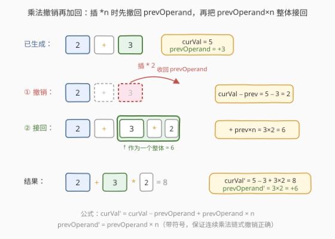
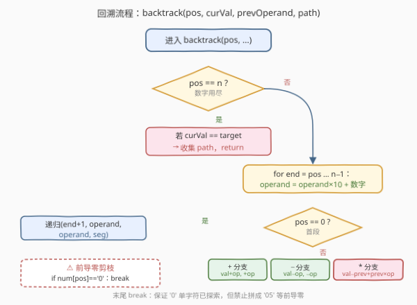
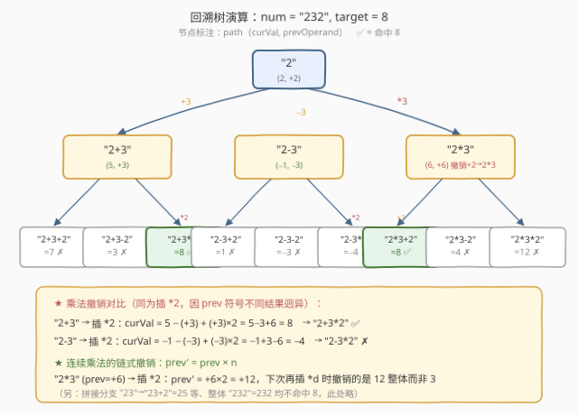

# 给表达式添加运算符

- **题目名称**：给表达式添加运算符
- **链接**：[282. Expression Add Operators](https://leetcode.cn/problems/expression-add-operators/)
- **难度**：困难
- **标签**：回溯、字符串、数学、递归

## 1. 题目概述

给定一个**只包含数字**的字符串 `num` 和一个整数目标值 `target`，在 `num` 的数字之间插入二元运算符 `'+'`、`'-'`、`'*'`，使得所得表达式的值等于 `target`。返回**所有**满足条件的表达式字符串。注意：

- 可以选择**不插入运算符**而把相邻数字拼成一个多位数（如 `"123"` 可拼成 `12` 和 `3`，即表达式 `"12+3"`）；
- 但**不允许有前导零**的多位数（如 `"05"`、`"00"` 非法，单独的 `"0"` 合法）；
- 操作数顺序必须与 `num` 中数字的原始顺序一致，不能重排；
- 返回结果中**不应有重复**表达式。

**示例 1**：

```text
输入：num = "123", target = 6
输出：["1+2+3", "1*2*3"]
解释："1+2+3" = 6，"1*2*3" = 6；"12+3" = 15 ≠ 6 不入选。
```

**示例 2**：

```text
输入：num = "232", target = 8
输出：["2*3+2", "2+3*2"]
解释："2*3+2" = 8，"2+3*2" = 8。
```

**示例 3**：

```text
输入：num = "3456237490", target = 9191
输出：[]
解释：无任何插入方案能凑出 9191，返回空数组。
```

**约束条件**：

- $1 \leq \text{num.length} \leq 10$
- `num` 仅包含数字 `'0'`–`'9'`
- $-2^{31} \leq \text{target} \leq 2^{31} - 1$
- 结果中每个表达式都按 `num` 的数字顺序求值，运算符仅限 `+ - *`（**无除法**、无括号、无一元运算）

> 💡 本题是「**回溯 + 乘法优先级处理**」的招牌题。难点不在「枚举所有插符方案」（标准回溯），而在 **`*` 的优先级高于 `+`/`-`**——当回溯到 `2+3` 后再插 `*2` 时，结果不是 `(2+3)*2=10` 而是 `2+(3*2)=8`。这要求我们在递归过程中不仅记住「当前累计值」，还要记住「**上一个操作数及其符号**」，以便乘法时**撤销上一步加/减**、把乘积重新接回。这正是本题区别于普通「数字回溯」的核心技巧。

---

## 2. 解题思路

### 2.1 暴力思路：枚举所有表达式再求值

最直白的做法分两步：① 枚举 `num` 数字之间的所有「空位」上插入 `+`/`-`/`*`/空（拼数）的**笛卡尔积**；② 对每个生成的表达式字符串用通用求值器（如双栈）算出值，等于 `target` 则收集。

- `num` 长度 $n$，有 $n-1$ 个空位，每个空位 4 种选择（`+`/`-`/`*`/拼），共 $4^{n-1}$ 个表达式；
- 每个表达式再 $O(n)$ 求值，总时间 $O(n \cdot 4^{n-1})$，$n \leq 10$ 时约 $2.6 \times 10^6$，可过但**空间浪费严重**——要先把所有表达式字符串都生成出来。

> ⚠️ 这种「先生成后求值」的割裂做法没有利用一个关键事实：**表达式可以在生成过程中增量求值**。每插一个运算符和一个操作数，新表达式的值能从旧表达式的值 $O(1)$ 推出。下面的回溯解法把「生成」与「求值」合一，边走边算，命中 `target` 时直接收集，无需二次扫描。

### 2.2 核心观察：回溯携带 `(当前值, 上一个操作数)`



回溯的骨架是：从第 1 个数字开始（它前面**没有运算符**，直接作为初始操作数），之后在每两个数字之间依次决定「插入 `+`/`-`/`*`」或「把下一个数字拼到当前操作数末尾」。关键在于递归状态需要携带**两个**量：

| 携带量 | 含义 | 作用 |
|--------|------|------|
| `curVal` | 当前已生成表达式（`path` 部分）的**求值结果** | 最终与 `target` 比较 |
| `prevOperand` | 上一个被加入 `curVal` 的**操作数连同其符号** | 乘法时用于「撤销再加回」 |

> 💡 **`prevOperand` 带符号**是精髓：表达式 `2+3` 中，`3` 是正数 `+3`，`prevOperand = +3`；表达式 `2-3` 中，`3` 是负数 `-3`，`prevOperand = -3`。把符号吸收进操作数，三种运算符的更新就能统一写成同一个公式。

**三种运算符的增量更新**（设新操作数为 `n`）：

1. **`+`**：`curVal' = curVal + n`；`prevOperand' = +n`
2. **`-`**：`curVal' = curVal - n`；`prevOperand' = -n`（注意符号）
3. **`*`**：因为 `*` 优先级高，**先撤销上一步的加/减**，再把乘积作为新的「上一个操作数」加回：

$$
\text{curVal}' = \text{curVal} - \text{prevOperand} + \text{prevOperand} \times n, \qquad \text{prevOperand}' = \text{prevOperand} \times n
$$

> ⚠️ 乘法的 `prevOperand'` **不带单独符号**——因为 `prevOperand` 已含符号，`prevOperand × n` 自然把符号带上了。例如 `2-3*2`：插 `*` 前 `curVal = -1, prevOperand = -3`；插 `*2` 后 `curVal = -1 - (-3) + (-3)*2 = -1+3-6 = -4`，`prevOperand = -6`。验证：`2-3*2 = 2-6 = -4` ✓。

**拼接数字（不插运算符）**：把下一个数字 `d` 拼到当前操作数末尾。这等价于「当前操作数 $\times 10 + d$（保留符号）」：

$$
\text{prevOperand}' =
\begin{cases}
\text{prevOperand} \times 10 + d, & \text{prevOperand} \geq 0 \\
\text{prevOperand} \times 10 - d, & \text{prevOperand} < 0
\end{cases}
$$

而 `curVal` 的更新是把「旧 `prevOperand`」替换成「新 `prevOperand`」：$\text{curVal}' = \text{curVal} - \text{prevOperand} + \text{prevOperand}'$。

> 💡 **前导零处理**：当当前操作数为 `0` 时，不允许再拼接数字（否则形成 `"05"` 这类非法前导零）。故拼接分支要加剪枝：`if (curOperand == 0) break;`——即「单字符 `'0'` 合法，但 `'0'` 后不能续数字」。这是本题最易踩的坑。

### 2.3 算法流程图



**主函数 `addOperators(num, target)`**：

1. 清空结果 `ans`；若 `num` 为空直接返回；
2. 从第 0 位起调用回溯 `backtrack(0, 0, 0, "")`（`pos=0, curVal=0, prevOperand=0, path=""`）。

**回溯 `backtrack(pos, curVal, prevOperand, path)`**：

1. **终止**：若 `pos == n`（数字用尽），检查 `curVal == target`，是则 `ans.push_back(path)`，返回；
2. **取出本段操作数**：从 `pos` 起向后枚举 `end`（闭区间 `[pos, end]` 拼成一个数），数值 `operand = operand*10 + (num[end]-'0')`：
   - **首段特判**（`pos == 0`）：第一个数前面**没有运算符**，`path` 直接以 `operand` 起头，递归 `backtrack(end+1, operand, operand, to_string(operand))`；
   - **非首段**：在 `path` 后分别追加 `+operand`、`-operand`、`*operand` 三种，按 2.2 节公式更新 `curVal`/`prevOperand` 递归；
   - **前导零剪枝**：一旦 `num[pos] == '0'`，本段操作数只允许取到 `"0"` 这一个字符，之后 `break`（不能继续拼成 `"0x"`）。

> 💡 **首段为何单独处理？** 第一个数字前面没有运算符可插，它直接构成表达式的左端，`curVal = prevOperand = operand`。若强行用统一循环，需要在 `path` 头部插入一个虚拟运算符，反而别扭。单独处理首段后，从 `pos > 0` 起的每次递归都对应「在已成形表达式后插一个运算符 + 一个操作数」，逻辑对称干净。

### 2.4 示例演算

以 `num = "232", target = 8` 为例，演示关键分支的 `curVal` / `prevOperand` 演化（仅画命中与典型乘法分支）：



| 步 | path | curVal | prevOperand | 动作 | 命中? |
|----|------|--------|-------------|------|-------|
| 起 | `"2"` | 2 | +2 | 首段取 `2` | — |
| 2a | `"2+3"` | 5 | +3 | 插 `+3` | — |
| 3a | `"2+3*2"` | $5-3+3\times2=8$ | $+6$ | 插 `*2`：撤销 `+3` 改 `+3*2` | ✅ `8` |
| 2b | `"2*3"` | $2-2+2\times3=6$ | $+6$ | 插 `*3`：撤销 `+2` 改 `+2*3` | — |
| 3b | `"2*3+2"` | $6+2=8$ | $+2$ | 插 `+2` | ✅ `8` |
| 2c | `"2-3"` | -1 | -3 | 插 `-3` | — |
| 3c | `"2-3*2"` | $-1-(-3)+(-3)\times2=-4$ | $-6$ | 插 `*2`：撤销 `-3` 改 `-3*2` | ✗ `-4` |

> 💡 **对比 3a 与 3c**：两者都从 `2±3` 出发插 `*2`，只因 `prevOperand` 符号不同（`+3` vs `-3`），乘法撤销后结果天差地别（`+8` vs `-4`）。这正是 `prevOperand` **携带符号**的威力——同一套公式自动适配加减两种历史，无需为「乘号前面是加还是减」写两套分支。

> ⚠️ **易错点：乘法的 `prevOperand` 更新**。常见错误是写 `prevOperand' = n`（像加减那样只记新操作数），丢失了「乘积应作为整体成为新的上一个操作数」这一事实。正确写法 `prevOperand' = prevOperand × n` 保证了**连续乘法**（如 `2*3*4`）的正确链式撤销：第二次乘 `4` 时撤销的是 `2*3=6` 整体，而非孤立的 `3`。

---

## 3. 参考代码

### C++

```cpp
class Solution {
    vector<string> ans;
    string num;
    int target;
    int n;
public:
    vector<string> addOperators(string num, int target) {
        this->num = num;
        this->target = target;
        this->n = num.size();
        ans.clear();
        if (n == 0) return ans;
        backtrack(0, 0, 0, "");
        return ans;
    }
private:
    void backtrack(int pos, long curVal, long prevOperand, string path) {
        if (pos == n) {
            if (curVal == target) ans.push_back(path);
            return;
        }
        long operand = 0;
        for (int end = pos; end < n; ++end) {
            operand = operand * 10 + (num[end] - '0');
            if (pos == 0) {
                backtrack(end + 1, operand, operand, to_string(operand));
            } else {
                backtrack(end + 1, curVal + operand, operand, path + "+" + to_string(operand));
                backtrack(end + 1, curVal - operand, -operand, path + "-" + to_string(operand));
                backtrack(end + 1, curVal - prevOperand + prevOperand * operand,
                          prevOperand * operand, path + "*" + to_string(operand));
            }
            if (num[pos] == '0') break;
        }
    }
};
```

### Python

```python
class Solution:
    def addOperators(self, num: str, target: int) -> List[str]:
        ans = []
        n = len(num)

        def backtrack(pos: int, cur_val: int, prev_operand: int, path: str):
            if pos == n:
                if cur_val == target:
                    ans.append(path)
                return
            operand = 0
            for end in range(pos, n):
                operand = operand * 10 + int(num[end])
                seg = num[pos:end + 1]
                if pos == 0:
                    backtrack(end + 1, operand, operand, seg)
                else:
                    backtrack(end + 1, cur_val + operand, operand, path + "+" + seg)
                    backtrack(end + 1, cur_val - operand, -operand, path + "-" + seg)
                    backtrack(end + 1,
                              cur_val - prev_operand + prev_operand * operand,
                              prev_operand * operand,
                              path + "*" + seg)
                if num[pos] == '0':
                    break
        if n > 0:
            backtrack(0, 0, 0, "")
        return ans
```

> 💡 两版结构完全对应。注意三个细节：① **`long` 防 `int` 溢出**：`num` 长度达 10 时，单段操作数可逼近 $10^{10}$，乘法链更可能爆 `int`，故 C++ 用 `long`，Python 天然大整数无忧；② **首段 `pos==0` 单独走一支**，不插运算符；③ **前导零剪枝 `if (num[pos]=='0') break;`** 放在循环末尾，确保 `"0"` 这一个字符的分支已被探索，只是禁止其后继续拼数字。Python 版直接用切片 `num[pos:end+1]` 作为 `path` 片段，省去 `to_string` 转换。

---

## 4. 复杂度分析

| 维度 | 复杂度 | 说明 |
|------|--------|------|
| 时间 | $O(n \cdot 4^{n-1})$ | 每个空位 4 种选择（`+`/`-`/`*`/拼），共 $4^{n-1}$ 个表达式；每个表达式 $O(n)$ 拼字符串与求值（增量求值本身 $O(1)$，但 `path + "+" + seg` 字符串拼接 $O(n)$） |
| 空间 | $O(n)$ | 递归栈深度至多 $n$（每次至少消耗一个数字），`path` 字符串长度至多 $2n-1$（$n$ 个数字 + $n-1$ 个运算符）；不计结果数组 |

> ⚠️ **$4^{n-1}$ 的来源**：每个空位独立选择「`+`/`-`/`*`/拼到前一个数」，4 个分支。但「拼」分支会消耗多个空位，故实际叶节点数严格小于 $4^{n-1}$——上界是 $4^{n-1}$，是渐近紧的多项式上界。$n=10$ 时约 $2.6\times10^6$，配合剪枝实际远小。

> 💡 **为何增量求值不降时间复杂度？** 增量求值把「每个表达式 $O(n)$ 求值」降到 $O(1)$，但**字符串拼接** `path + op + seg` 在 C++/Python 里仍是 $O(|path|)=O(n)$。若改用可变结构（`vector<char>` / `list`）原地增删可降到均摊 $O(1)$，但代码复杂度上升，且 $n \leq 10$ 时收益不显著，故工程上保持字符串拼接。

---

## 5. 扩展：除法、括号与一元运算

### 5.1 加入除法

若允许 `/`，需额外处理：① **除零保护**（操作数为 0 时跳过该分支）；② **整除语义**——题目若要求「整数除法截断」（如 `3/2=1`），需用 `trunc` 而非 Python 的 `//`（向负无穷取整）；③ `prevOperand'` 更新与乘法对称：`curVal' = curVal - prevOperand + prevOperand / n`，`prevOperand' = prevOperand / n`。除法引入浮点或截断后**链式撤销不再精确**（截断误差累积），是本题不考察 `/` 的原因之一。

### 5.2 加入括号

若允许括号，表达式空间从「线性插符」变为「任意加括号」，回溯骨架需改为**区间 DP 式分治**：对子串 `[i, j]` 枚举中点 `k` 与运算符，合并左右两子表达式的所有 (值, 串) 组合。这与 [241. 为运算表达式设计优先级](../0201-0300/241_为运算表达式设计优先级.md) 的「分治求所有加括号方案」同构——241 只求数量/求值，本题额外要求串重建。复杂度升到 Catalan 量级 $O(C_n \cdot n)$。

### 5.3 一元负号

若允许一元 `-`（如 `-3+5`），首段需多走一支 `prevOperand = -operand`，且后续不能连续两个一元号（`--3` 是否合法需约定）。本题明确无此需求，故首段只有「正操作数」一支。

---

## 6. 面试要点

1. **为什么乘法要「撤销再加回」，而不能直接 `curVal * n`？**

   > 因为 `*` 优先级高于 `+`/`-`。表达式 `a + b * c` 应算成 `a + (b*c)`，而非 `(a+b)*c`。回溯时插 `*c` 之前 `curVal = a + b` 已经把 `b` 加进去了，直接乘会把 `a` 也乘进去，得到 `(a+b)*c` 的错误值。正确做法是**先把 `b` 撤销**（`curVal - prevOperand`，其中 `prevOperand = b`），再把 `b*c` 整体加回（`+ prevOperand * n`）。`prevOperand' = prevOperand * n` 保证后续若再插 `*d` 时撤销的是 `b*c` 整体，链式乘法正确。

2. **`prevOperand` 为什么带符号？**

   > 把符号吸收进操作数，加减乘三种更新统一一个公式。表达式 `a - b * c` 中 `b` 是 `-b`（`prevOperand = -b`），撤销 `-b` 即 `curVal - (-b) = curVal + b`，再加 `(-b)*c`，得 `a + b - b*c = a - (b*c - b)`... 验证 `a - b*c`：`curVal' = (a-b) - (-b) + (-b)*c = a - b*c` ✓。若 `prevOperand` 不带符号，减法分支需单独写「先加回再减乘积」，代码分支翻倍且易错。

3. **前导零剪枝放在哪？为什么是 `break` 而不是 `continue`？**

   > 放在 `for end` 循环体末尾，判断 `num[pos] == '0'` 则 `break`。因为本段操作数从 `pos` 起，若首位是 `'0'`，则 `operand` 第一次取到 `0`（合法，已探索 `end=pos` 分支），但继续 `end` 增大会拼成 `"05"`、`"056"` 等前导零非法数，**全部**都该跳过，故直接 `break` 终止本段所有更长拼接。用 `continue` 只跳当前一个，后续 `end` 仍会拼出前导零，错误。

4. **首段为何单独处理？能否用统一循环？**

   > 第一个数字前面无运算符，`path` 直接以操作数起头，`curVal = prevOperand = operand`。若强行统一循环，需在 `path` 头部插虚拟运算符（如空串），逻辑变绕且需特判「虚拟运算符不参与求值」。单独处理首段后，从第二段起每次递归都对应「插一个运算符 + 一个操作数」，三支对称，可读性最佳。代价仅是循环内一个 `if (pos == 0)` 分支。

5. **为什么用 `long` 而非 `int`？**

   > `num` 长度达 10，单段操作数最大 $\approx 10^{10}$（如 `"9999999999"`），已超 `int`（$\approx 2.1\times10^9$）。乘法链更易爆（`9*9*9...` 虽快速变小，但 `99999*99999` ≈ $10^{10}$）。用 `long`（$\approx 9.2\times10^{18}$）覆盖所有中间值。Python 整数无限精度，无需此虑。题目 `target` 范围是 `int`，但中间 `curVal` 可能远超 `target` 再被后续运算拉回，故必须用更宽类型。

> 💡 **一句话总结**：282 的灵魂是「**乘法优先级下的增量求值**」——回溯携带 `(curVal, prevOperand)`，乘法时先撤销上一步加/减再把乘积整体接回，`prevOperand` 带符号统一三运算符公式，前导零剪枝守住多位数合法性。这是「回溯 + 表达式求值」交织的典范，承接 [224. 基本计算器](../0001-0100/224_基本计算器.md) 的优先级处理思想，但反向用于「生成」而非「求值」。

---

## 7. 同类练习题

- [241. 为运算表达式设计优先级](../0201-0300/241_为运算表达式设计优先级.md)：分治枚举所有加括号方案的求值，与本题「插运算符」对偶——241 给定表达式求所有加括号结果，282 给定数字求所有插符表达式，同属「表达式生成/求值」家族
- [224. 基本计算器](../0001-0100/224_基本计算器.md)：用栈处理 `+`/`-`/括号优先级，是本题「乘法优先级增量求值」的正向求值版本，理解 224 的「延迟求值」有助掌握 282 的「撤销再加回」
- [39. 组合总和](https://leetcode.cn/problems/combination-sum/)：回溯枚举所有和为 target 的组合，与本题「回溯枚举所有值为 target 的表达式」结构同构，区别在于 39 无运算符优先级，纯累加
- [95. 不同的二叉搜索树 II](https://leetcode.cn/problems/unique-binary-search-trees-ii/)：枚举所有 BST 结构并返回树列表，与本题枚举所有表达式并返回串列表同属「回溯生成全部方案」范式
- [227. 基本计算器 II](../0201-0300/227_基本计算器II.md)：含 `+ - * /` 的中缀表达式求值，理解其「先乘除后加减」的扫描策略，能加深对 282「乘法撤销」必要性的体会
