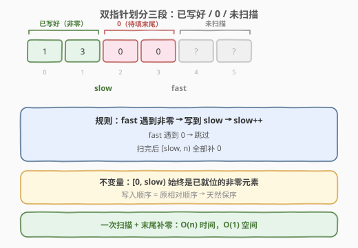
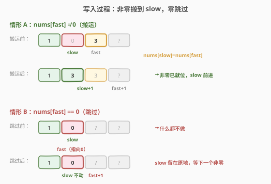
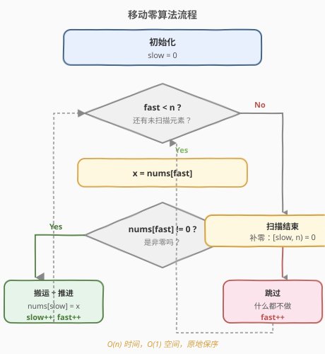
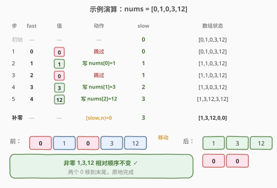

# 移动零

- **题目名称**：移动零
- **链接**：[283. 移动零](https://leetcode.cn/problems/move-zeroes/)
- **难度**：简单
- **标签**：数组、双指针

## 1. 题目概述

给定一个数组 `nums`，编写一个函数将所有 `0` 移动到数组的**末尾**，同时保持非零元素的**相对顺序**。

请注意，必须**在不复制数组**的情况下**原地**对数组进行操作。

**示例 1**：

```text
输入：nums = [0,1,0,3,12]
输出：[1,3,12,0,0]
解释：非零元素 1,3,12 保持相对顺序，两个 0 移到末尾。
```

**示例 2**：

```text
输入：nums = [0]
输出：[0]
```

**约束条件**：

- `1 <= nums.length <= 10^4`
- `-2^31 <= nums[i] <= 2^31 - 1`

> ⚠️ **两个硬性要求**：①**原地**修改（不能开新数组）；②非零元素的**相对顺序必须保持**。这排除了「从右往左交换把零冒泡到末尾」之外的无序做法，也排除了「收集非零再覆盖」的 `O(n)` 额外空间做法。

---

## 2. 解题思路

### 2.1 暴力思路

**辅助数组法**：开一个新数组，先顺序写入所有非零元素，剩余位置补 0，再拷回原数组。时间 `O(n)`、空间 `O(n)`。简单正确，但违反「原地」要求。

**冒泡法**：每遇到一个 0 就与右边相邻元素交换，像冒泡排序一样把 0 逐步推到末尾。时间 `O(n²)`、空间 `O(1)`。原地但太慢，且写法易错。

### 2.2 核心观察：读写双指针



扫描一遍数组时，可把下标分成三段：

- `[0, slow)`：已处理并放好的非零元素（**最终相对顺序正确**）。
- `[slow, fast)`：已被 `fast` 越过的 0（待填回末尾）。
- `[fast, n)`：尚未扫描的元素。

维护两个指针：

- `slow`：下一个非零元素该写入的位置（**写指针**）。
- `fast`：当前正在检查的元素（**读指针**）。

> 💡 **关键转化**：`fast` 一路扫描，遇到非零就「搬到」`slow` 处并让 `slow` 前进；遇到 0 就跳过。扫完后 `[slow, n)` 全部填 0 即可。这样非零元素的写入顺序就是它们的原相对顺序，天然满足要求。

### 2.3 一次扫描 + 末尾补零



算法步骤：

1. `slow = 0`。
2. `fast` 从 0 扫到 n−1：
   - 若 `nums[fast] != 0`：`nums[slow] = nums[fast]`，`slow += 1`。
   - 若为 0：跳过（什么都不做）。
3. 扫描结束后，把 `[slow, n)` 全部置 0。

> ⚠️ 步骤 2 的「搬运」会覆盖部分原值，但被覆盖的要么已被搬到前面、要么本就是 0，不会丢失信息。步骤 3 的补零不可省——因为搬运只搬非零，原 0 的位置可能仍残留旧值。

### 2.4 算法流程图



### 2.5 示例演算

以 `nums = [0,1,0,3,12]` 为例：



| 步骤 | fast | nums[fast] | 动作 | slow | 数组状态 |
|------|------|------------|------|------|----------|
| 初始 | — | — | — | 0 | [0,1,0,3,12] |
| 1 | 0 | 0 | 跳过 | 0 | [0,1,0,3,12] |
| 2 | 1 | 1 | 写入 nums[0]=1, slow=1 | 1 | [1,1,0,3,12] |
| 3 | 2 | 0 | 跳过 | 1 | [1,1,0,3,12] |
| 4 | 3 | 3 | 写入 nums[1]=3, slow=2 | 2 | [1,3,0,3,12] |
| 5 | 4 | 12 | 写入 nums[2]=12, slow=3 | 3 | [1,3,12,3,12] |
| 补零 | — | — | nums[3..4]=0 | — | **[1,3,12,0,0]** ✓ |

最终非零元素保持 `1,3,12` 的相对顺序，两个 0 移到末尾。

---

## 3. 参考代码

### C++

```cpp
class Solution {
  public:
    void moveZeroes(vector<int>& nums) {
        int slow = 0;
        for (int fast = 0; fast < nums.size(); fast++) {
            if (nums[fast] != 0) {
                nums[slow] = nums[fast];
                slow++;
            }
        }
        for (int i = slow; i < nums.size(); i++) {
            nums[i] = 0;
        }
    }
};
```

### Python

```python
class Solution:
    def moveZeroes(self, nums: List[int]) -> None:
        slow = 0
        for fast in range(len(nums)):
            if nums[fast] != 0:
                nums[slow] = nums[fast]
                slow += 1
        for i in range(slow, len(nums)):
            nums[i] = 0
```

---

## 4. 复杂度分析

| 维度 | 复杂度 | 说明 |
|------|--------|------|
| 时间复杂度 | O(n) | `fast` 扫一遍 + 末尾补零至多再扫一遍，共至多 `2n` 次操作 |
| 空间复杂度 | O(1) | 仅用 `slow`、`fast` 两个指针，原地修改 |

---

## 5. 扩展：交换写法（更少写入）

上述「覆盖 + 补零」在最坏情况下（前半全非零、后半全 0）写入次数仍为 `n`。若追求**更少的写入次数**，可在遇到非零时直接**交换** `nums[slow]` 与 `nums[fast]`，省去末尾补零：

```python
class Solution:
    def moveZeroes(self, nums: List[int]) -> None:
        slow = 0
        for fast in range(len(nums)):
            if nums[fast] != 0:
                nums[slow], nums[fast] = nums[fast], nums[slow]
                slow += 1
```

> 💡 **何时交换更有利**：当 0 较少时，交换写法的总写入次数约为「非零元素个数」，比覆盖法的 `n` 更少；但每次交换是 3 次赋值，常数略大。两种都正确，面试讲清取舍即可。注意当 `slow == fast` 时交换是自反的（无副作用），无需特判。

---

## 6. 面试要点

1. **为什么用「读写双指针」而非「快慢指针找环」那种？**
   - 本题的 `slow` 是「下一个写入位置」，`fast` 是「读取位置」，二者职责不同；与链表找环的「同速快慢追赶」语义不同，但都属双指针家族。核心是 `slow` 始终指向已处理段的边界。

2. **如何保证非零元素的相对顺序不变？**
   - `fast` 从左到右扫描，遇到非零就按 `slow` 顺序写入；写入顺序与原出现顺序一致，因此相对顺序天然保持。若 `fast` 从右往左则会打乱顺序。

3. **末尾补零能否省略？为什么？**
   - 覆盖法必须补零：搬运只写非零，原 0 的位置可能残留旧值（如示例中 `nums[3]` 仍是 3）。若用交换写法，0 会被换到后段，则无需补零。

4. **能否用 `std::stable_partition` 一行解决？**
   - 可以：`std::stable_partition(nums.begin(), nums.end(), [](int x){return x != 0;});`。其内部正是读写双指针，但面试时通常要求手写实现以展示理解。

5. **若题目改为「把负数移到末尾、保持正数与非负零相对顺序」呢？**
   - 把判据 `nums[fast] != 0` 改为 `nums[fast] >= 0` 即可，模板完全复用。这正是「读写双指针」作为通用模板的价值——只换判据，不改结构。

---

## 7. 同类练习题

- [27. 移除元素](https://leetcode.cn/problems/remove-element/)：把等于某值的元素移除，剩余保持顺序——同款读写双指针，判据换成 `!= val`
- [26. 删除有序数组中的重复项](https://leetcode.cn/problems/remove-duplicates-from-sorted-array/)：读写双指针去重，判据换成 `!= nums[slow-1]`
- [80. 删除有序数组中的重复项 II](https://leetcode.cn/problems/remove-duplicates-from-sorted-array-ii/)：允许至多两次重复，读写指针判据稍作推广
- [905. 按奇偶排序数组](https://leetcode.cn/problems/sort-array-by-parity/)：偶数在前奇数在后，双指针分区（不要求稳定时可对向交换）
- [922. 按奇偶排序数组 II](https://leetcode.cn/problems/sort-array-by-parity-ii/)：奇偶交替放置，双指针分别管理奇偶下标
