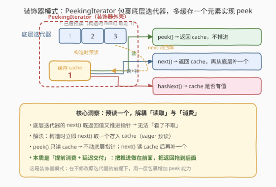
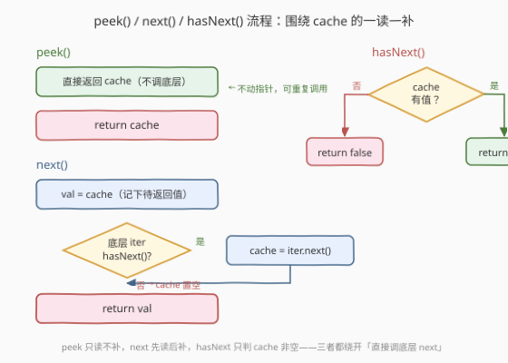

# 窥视迭代器

- **题目名称**：窥视迭代器
- **链接**：[284. Peeking Iterator](https://leetcode.cn/problems/peeking-iterator/)
- **难度**：中等
- **标签**：设计、迭代器、装饰器模式

## 1. 题目概述

给定一个已有的整数迭代器 `Iterator`（支持 `next()` 与 `hasNext()`），请设计一个 `PeekingIterator`，在原有功能基础上**额外支持 `peek()` 操作**——返回下一个元素但**不移动指针**。实现以下接口：

- `PeekingIterator(Iterator<int> nums)`：用指定整数迭代器 `nums` 初始化对象。
- `int next()`：返回数组中的下一个元素，并将指针移动到下个元素处。
- `bool hasNext()`：如果数组中存在下一个元素，返回 `true`；否则 `false`。
- `int peek()`：返回数组中的下一个元素，但**不移动指针**。

> 注意：每种语言可能有不同的构造函数和迭代器 `Iterator`，但均支持 `int next()` 和 `boolean hasNext()` 函数。

**示例 1**：

```text
输入：
["PeekingIterator", "next", "peek", "next", "next", "hasNext"]
[[[1, 2, 3]], [], [], [], [], []]
输出：
[null, 1, 2, 2, 3, false]

解释：
PeekingIterator iter = new PeekingIterator([1, 2, 3]); // [1,2,3]
iter.next();    // 返回 1，指针移动到下一个元素
iter.peek();    // 返回 2，指针未发生移动
iter.next();    // 返回 2，指针移动到下一个元素
iter.next();    // 返回 3，指针移动到下一个元素
iter.hasNext(); // 返回 False
```

**约束条件**：

- $1 \leq \text{nums.length} \leq 1000$
- $1 \leq \text{nums[i]} \leq 1000$
- 对 `next` 和 `peek` 的调用均有效
- `next`、`hasNext` 和 `peek` 最多调用 $1000$ 次

**进阶**：你将如何拓展你的设计，使之变得通用化，从而适应所有的类型，而不只是整数型？

> 💡 本题是「**迭代器设计**」家族中考察「**装饰器模式**」的招牌题。核心矛盾在于：`peek()` 要「看了不取」，而底层迭代器的 `next()` 是「既返回又推进」的原子操作——没有「看了不取」的能力。解法是**提前消费 + 延迟交付**：构造时立即 `next()` 预读一个元素存入缓存，`peek()` 直接返回缓存，`next()` 返回缓存后再从底层补读一个。这个「单元素缓冲」模板跨语言通用，是装饰器模式在迭代器场景的经典落地。

---

## 2. 解题思路

### 2.1 暴力思路：构造时一次性展平

最直观的做法：在构造函数中把迭代器的所有元素复制到一个数组中，之后用一个下标 `idx` 管理 `peek` / `next` / `hasNext`。

```python
class PeekingIterator:
    def __init__(self, iterator):
        self.data = []
        while iterator.hasNext():
            self.data.append(iterator.next())
        self.idx = 0

    def peek(self):
        return self.data[self.idx]

    def next(self):
        val = self.data[self.idx]
        self.idx += 1
        return val

    def hasNext(self):
        return self.idx < len(self.data)
```

- **正确**：`peek` 返回 `data[idx]` 不动下标，`next` 返回后 `idx++`，语义无误；
- **缺点**：① 额外空间 $O(N)$（$N$ 为元素总数）；② 构造时 $O(N)$ 全量遍历——如果只调一次 `next()` 就丢弃，做了大量无用功；③ **违背了迭代器的惰性哲学**：迭代器的核心价值是「按需取值」，一次性展平等于把迭代器退化成了数组。更关键的是，题目在 C++ 版本中明确要求「**DO NOT save a copy of nums**」，暴力展平直接违规。

> ⚠️ 本题的难点不在于「怎么存数据」，而在于「**在不修改底层迭代器接口的前提下，如何用 $O(1)$ 额外空间实现 peek**」。下面的缓存解法仅用一个变量就解决了问题。

### 2.2 核心观察：单元素缓存（装饰器模式）



**关键洞察**：`peek()` 的本质需求是「读取下一个值但不推进指针」。然而底层迭代器的 `next()` 是一个**原子操作**——它同时「返回值」和「推进指针」，无法拆开。既然不能「看了不取」，那就**提前取、慢慢交**：

| 步骤 | 操作 | 效果 |
|------|------|------|
| 构造 | `cache = iter.next()`（若 `iter.hasNext()`） | 预读第一个元素入缓存，底层指针已推进 |
| `peek()` | `return cache` | 只读缓存，**不调底层**，指针不动 |
| `next()` | `val = cache; cache = iter.next()`（若有） | 返回缓存值，再从底层补一个新值入缓存 |
| `hasNext()` | `return cache 有值` | 只看缓存是否非空 |

> 💡 **为什么这就解决了问题？** 关键在于「**读取**」与「**消费**」的解耦。底层迭代器的 `next()` 把这两件事捆绑在一起，我们通过缓存把它们拆开：构造时提前消费一个（推进底层指针），但把值暂存在缓存里延迟交付。`peek()` 只读取缓存——底层指针早已推进过，再调多少次 `peek()` 也不会重复推进。`next()` 读取缓存后立刻补读——把「推进」做在前面，为下一次 `peek` / `next` 备好料。

> ⚠️ **这就是装饰器模式**（Decorator Pattern）：`PeekingIterator` 包裹一个 `Iterator`，在不修改原迭代器的前提下「贴」上一层 `peek` 能力。缓存就是这层「装饰」的全部成本——仅 $O(1)$ 空间。这个模式与 [232. 用栈实现队列](../0001-0100/232_用栈实现队列.md) 的「用一种结构模拟另一种语义」同属「包装 + 转发」家族，区别在于装饰器不改变原有接口，只**增加**新接口。

### 2.3 算法流程图



**`peek()`**：直接返回 `cache`，不调用底层迭代器的任何方法——这是「不移动指针」的关键。

**`next()`** 完整步骤：

1. **记下待返回值**：`val = cache`（先把缓存值存到局部变量，因为马上要覆盖它）；
2. **回填缓存**：若底层 `iter.hasNext()` 为 `true`，`cache = iter.next()`（推进底层指针，取新值入缓存）；否则标记缓存为空；
3. **返回** `val`。

**`hasNext()`**：返回缓存是否非空。注意**不是**调底层 `iter.hasNext()`——因为缓存里的值是「已取出但未交付」的，即使底层已耗尽，只要缓存还有值，就 `hasNext` 为 `true`。

> 💡 **`hasNext()` 的陷阱**：如果你把 `hasNext()` 写成 `return iter.hasNext()`，会在缓存还有值但底层已耗尽时返回 `false`——漏掉最后一个元素。正确做法是 `return has_cache`（缓存是否有值）。缓存的值是在构造或上次 `next()` 时从底层取出的，它「代表」了底层的一个尚未交付的元素，必须被 `hasNext` 承认。

### 2.4 示例演算

以 `nums = [1, 2, 3]` 为例，演示缓存与底层指针的逐步变化：

![示例演算：nums=[1,2,3] 的 cache 与底层指针快照](../images/peeking_iter_walkthrough.svg)

| # | 调用 | 底层迭代器剩余 | cache | 返回 | 关键动作 |
|---|------|----------------|-------|------|----------|
| 0 | 构造 | `[1, 2, 3]` → `[2, 3]` | `1` | — | 预读 1 入 cache，底层指针推进到 2 |
| 1 | `next()` | `[2, 3]` → `[3]` | `2` | `1` | 返回 cache=1，补读 2 入 cache |
| 2 | `peek()` | `[3]`（不动） | `2` | `2` | 只读 cache，底层指针未动 |
| 3 | `next()` | `[3]` → `[]` | `3` | `2` | 返回 cache=2，补读 3 入 cache |
| 4 | `next()` | `[]` | 空 | `3` | 返回 cache=3，底层 hasNext=false → cache 置空 |
| 5 | `hasNext()` | `[]` | 空 | `false` | cache 为空 → false |

> 💡 **观察第 2 步**：`peek()` 返回 `2` 后，底层迭代器仍指向 `3`（剩余 `[3]`），cache 仍为 `2`——**状态完全不变**。这意味着 `peek()` 可以在 ② 和 ③ 之间被调用**任意次**，每次都返回 `2`，这正是「不移动指针」的语义。对比第 1 步和第 3 步的 `next()`：每次 `next()` 都会让 cache 换一个新值（1→2→3），底层指针随之推进。

> ⚠️ **观察第 4 步**：`next()` 返回 `3` 时，底层 `iter.hasNext()` 已经是 `false`（3 是最后一个元素），所以不再补读，cache 被置空。此时 `hasNext()` 返回 `false`。如果你错误地把 `hasNext()` 写成 `return iter.hasNext()`，在第 4 步之前（底层已空但 cache 还有 3）就会提前返回 `false`，导致 3 永远取不出来。

---

## 3. 参考代码

### C++（继承 Iterator + 单元素缓存）

```cpp
/*
 * Below is the interface for Iterator, which is already defined for you.
 * **DO NOT** modify the interface for Iterator.
 *
 *  class Iterator {
 *      struct Data;
 *      Data* data;
 *      Iterator(const vector<int>& nums);
 *      Iterator(const Iterator& iter);
 *      int next();
 *      bool hasNext() const;
 *  };
 */

class PeekingIterator : public Iterator {
    int cache;
    bool has_cache = false;
public:
    PeekingIterator(const vector<int>& nums) : Iterator(nums) {
        if (Iterator::hasNext()) {
            cache = Iterator::next();
            has_cache = true;
        }
    }

    int peek() {
        return cache;
    }

    int next() {
        int val = cache;
        if (Iterator::hasNext()) {
            cache = Iterator::next();
        } else {
            has_cache = false;
        }
        return val;
    }

    bool hasNext() const {
        return has_cache;
    }
};
```

### Python（组合 Iterator + 单元素缓存）

```python
class PeekingIterator:
    def __init__(self, iterator):
        self.iter = iterator
        self.cache = None
        self.has_cache = False
        if self.iter.hasNext():
            self.cache = self.iter.next()
            self.has_cache = True

    def peek(self):
        return self.cache

    def next(self):
        val = self.cache
        if self.iter.hasNext():
            self.cache = self.iter.next()
        else:
            self.has_cache = False
            self.cache = None
        return val

    def hasNext(self):
        return self.has_cache
```

> 💡 两版结构完全对应：构造时预读一个元素入 `cache`；`peek()` 直接返回 `cache`；`next()` 返回 `cache` 后从底层补读（或置空）；`hasNext()` 只判 `cache` 是否有值。C++ 通过继承 `Iterator` 复用其 `next()` / `hasNext()`，Python 通过组合持有 `self.iter` 转发调用——两种关系中装饰器的语义一致。
>
> ⚠️ **C++ 继承 vs Python 组合**：C++ 题目要求继承 `Iterator`（因为基类有拷贝构造等内部状态），调用基类方法需显式 `Iterator::next()`；Python 无此约束，用组合更自然。两种方式都是装饰器模式的合法实现——「包装 + 转发 + 增能」。

---

## 4. 复杂度分析

| 维度 | 复杂度 | 说明 |
|------|--------|------|
| 时间（构造） | $O(1)$ | 仅预读一个元素 |
| 时间（`peek`） | $O(1)$ | 直接返回缓存，不调底层 |
| 时间（`next`） | $O(1)$ | 返回缓存 + 最多一次底层 `next()` |
| 时间（`hasNext`） | $O(1)$ | 只判布尔标志 |
| 空间 | $O(1)$ | 仅一个缓存变量 + 一个布尔标志（不计输入） |

> ⚠️ **与暴力展平的对比**：暴力法构造 $O(N)$ + 空间 $O(N)$，单次 `peek` 严格 $O(1)$（数组随机访问）。缓存法构造 $O(1)$ + 空间 $O(1)$，所有操作均 $O(1)$。缓存法的核心优势是**保持惰性**——元素按需从底层取出，不多读一个，体现迭代器设计哲学。

---

## 5. 扩展：泛型化与 C++ 拷贝构造技巧

### 5.1 泛型化（进阶要求）

题目进阶要求支持所有类型。缓存法的逻辑与类型无关，只需将 `int` 替换为模板参数：

```cpp
template<typename T>
class PeekingIterator : public Iterator<T> {
    T cache;
    bool has_cache = false;
public:
    PeekingIterator(const vector<T>& nums) : Iterator<T>(nums) {
        if (Iterator<T>::hasNext()) {
            cache = Iterator<T>::next();
            has_cache = true;
        }
    }
    T peek() { return cache; }
    T next() {
        T val = cache;
        if (Iterator<T>::hasNext()) cache = Iterator<T>::next();
        else has_cache = false;
        return val;
    }
    bool hasNext() const { return has_cache; }
};
```

Python 借助泛型标注即可（运行时本就鸭子类型）：

```python
from typing import Generic, TypeVar, Iterator

T = TypeVar('T')

class PeekingIterator(Generic[T]):
    def __init__(self, iterator: Iterator[T]):
        self.iter = iterator
        self.cache: T | None = None
        self.has_cache = False
        if self.iter.hasNext():
            self.cache = self.iter.next()
            self.has_cache = True
    # ... 其余方法不变
```

> 💡 **泛型化的本质**：缓存逻辑只依赖 `next()` / `hasNext()` 两个接口，与元素类型无关。模板/泛型只是让编译器做类型检查，算法逻辑零修改。这与 [251. 展开二维向量](../0201-0300/251_展开二维向量.md) 的「双指针惰性遍历」一样——迭代器设计的套路天然类型无关。

### 5.2 C++ 拷贝构造技巧（语言特有捷径）

C++ 版本的 `Iterator` 类提供了**拷贝构造函数** `Iterator(const Iterator& iter)`。利用它可以用一种取巧的方式实现 `peek()`——拷贝一份当前迭代器，对**副本**调 `next()`，原迭代器指针不动：

```cpp
class PeekingIterator : public Iterator {
public:
    PeekingIterator(const vector<int>& nums) : Iterator(nums) {}

    int peek() const {
        return Iterator(*this).next();   // 拷贝副本，对副本 next()
    }

    int next() {
        return Iterator::next();
    }

    bool hasNext() const {
        return Iterator::hasNext();
    }
};
```

> 💡 **为什么能用？** `Iterator(*this)` 调用拷贝构造，创建一个状态完全相同的副本。对副本调 `next()` 只推进副本的指针，原对象的指针纹丝不动。这巧妙地避开了缓存——`peek` 不需要任何成员变量。
>
> ⚠️ **代价与局限**：每次 `peek()` 都要拷贝一份迭代器（涉及堆分配 `Data*`），开销比缓存法大；且依赖拷贝构造的存在，不具跨语言通用性。缓存法是 $O(1)$ 单次 `peek` 且语言无关的正解，拷贝构造技巧是 C++ 独有的「炫技」写法，面试中可作为补充提及但不应作为主解。

---

## 6. 面试要点

1. **为什么不能直接在 `peek()` 里调底层 `next()`？**

   > 底层 `next()` 是原子操作——返回值的同时推进指针，无法拆分。调了就等于消费了一个元素，`peek` 就退化成了 `next`。解法是「提前消费 + 延迟交付」：构造时预读一个存入缓存，`peek()` 只读缓存不碰底层，把「推进」和「返回」在时间上错开。

2. **`hasNext()` 为什么要判缓存而不是底层 `iter.hasNext()`？**

   > 缓存里的值是「已从底层取出但尚未交付」的元素。即使底层已耗尽，只要缓存还有值，就仍有元素可返回。若 `hasNext()` 调底层 `iter.hasNext()`，会在缓存还持有最后一个元素时返回 `false`，导致该元素永远取不出来。正确写法是 `return has_cache`。

3. **`next()` 里「先记 val 再补读」的顺序为什么重要？**

   > 顺序是 `val = cache; cache = iter.next();`。先把缓存值存到局部变量 `val`，再覆盖 `cache`。若反过来「先补读再取旧值」会丢失旧的缓存值。这与 [281. 锯齿迭代器](../0201-0300/281_锯齿迭代器.md) 的 `val = *it; ++it;` 同理——先读后推进，避免覆盖未保存的数据。

4. **装饰器模式在这里如何体现？与继承/组合的关系？**

   > `PeekingIterator` 包裹一个 `Iterator`，保持原有 `next()` / `hasNext()` 语义不变，仅**增加** `peek()` 接口。C++ 用继承复用基类方法，Python 用组合持有底层迭代器——两种关系都符合装饰器「包装 + 转发 + 增能」的语义。装饰器与代理模式的区别在于：装饰器侧重「加功能」，代理侧重「控制访问」。

5. **如何扩展到任意类型？**

   > 缓存逻辑只依赖 `next()` / `hasNext()` 接口，与元素类型无关。C++ 用模板 `template<typename T>`，Python 用 `Generic[T]` 泛型标注，算法逻辑零修改。若要支持自定义类型的 `peek`，只需该类型可拷贝（C++ 可拷贝构造 / Python 不可变引用即可）。

> 💡 **一句话总结**：284 的灵魂是「**提前消费 + 延迟交付**」——底层 `next()` 把「返回」和「推进」绑死，我们用单元素缓存把它们拆开：构造时预读一个入缓存，`peek()` 只读不补，`next()` 先读后补。这是装饰器模式在迭代器场景的经典落地，$O(1)$ 空间、全操作 $O(1)$ 时间，且天然泛型化。

---

## 7. 同类练习题

- [251. 展开二维向量](../0201-0300/251_展开二维向量.md)：多源展平的迭代器设计，用双指针 + `hasNext` 跳空行，同属「迭代器设计」家族，对照本题的「缓存」体会不同迭代器问题的数据结构选择
- [281. 锯齿迭代器](../0201-0300/281_锯齿迭代器.md)：多向量交替遍历用队列管理迭代器，与本题同为「包裹底层迭代器 + 增能」的装饰器思想
- [341. 扁平化嵌套列表迭代器](https://leetcode.cn/problems/flatten-nested-list-iterator/)：任意深度嵌套的展平，用栈模拟递归，是 251 的递归泛化版，对照本题的「单元素缓存」体会不同复杂度的迭代器设计
- [173. 二叉搜索树迭代器](https://leetcode.cn/problems/binary-search-tree-iterator/)：惰性中序遍历的迭代器，用栈按需推进指针，与本题「按需预读」同属「惰性迭代器」设计哲学
- [232. 用栈实现队列](../0001-0100/232_用栈实现队列.md)：用栈模拟队列的倒换，均摊 $O(1)$ 分析的经典题，与本题「用缓存模拟 peek」同属「用一种结构包装另一种语义」家族
