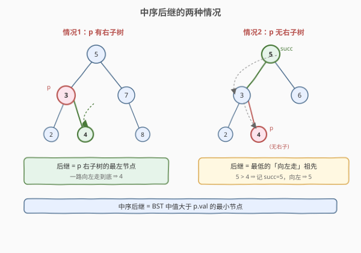
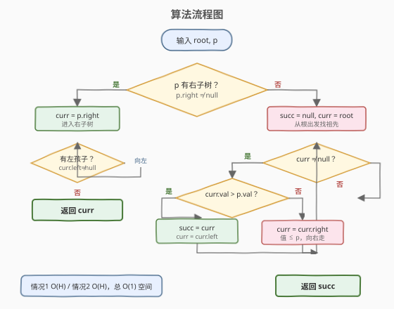
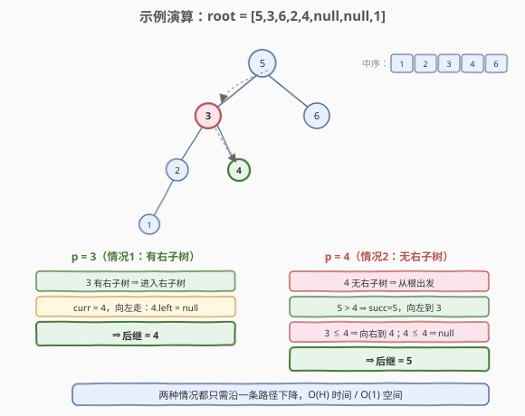

# LeetCode 二叉搜索树中的中序后继 题解

## 1. 题目概述

- **标题 / 题号**：二叉搜索树中的中序后继（#285，medium）
- **链接**：https://leetcode.cn/problems/inorder-successor-in-bst/
- **难度**：中等
- **标签**：树、BST、中序遍历

**题意**：给定一棵**二叉搜索树（BST）**的根节点 `root` 和树中的一个节点 `p`，找到节点 `p` 在 BST 中的**中序后继**。

中序后继的定义：在 BST 的中序遍历序列中，紧排在 `p` 之后的那个节点，即**值大于 `p.val` 的最小节点**。如果 `p` 没有中序后继（`p` 是序列末尾），返回 `null`。

**示例 1**：

```text
输入：root = [2,1,3], p = 1
输出：2
解释：中序序列为 [1,2,3]，1 的后继是 2
     树结构：  2
             / \
            1   3
```

**示例 2**：

```text
输入：root = [5,3,6,2,4,null,null,1], p = 6
输出：null
解释：中序序列为 [1,2,3,4,5,6]，6 是最大值无后继
```

**约束**：

- 树中节点数在 `[1, 10^4]` 范围内
- 所有节点值互不相同
- `p` 一定存在于给定的 BST 中
- `root` 是一棵合法的 BST

## 2. 解题思路

### 2.1 暴力思路：全量中序 + 找下一个

对 BST 做一次完整中序遍历，把所有节点存入数组，找到 `p` 的位置，返回下一个节点。时间 `O(n)`，空间 `O(n)`。简单但浪费——BST 的值域有序性可以让我们只走一条路径。

### 2.2 核心观察：中序后继只取决于 p 的局部结构



中序后继是「值大于 `p.val` 的最小节点」。利用 BST 左子树值 < 根值 < 右子树值的性质，后继的位置只取决于 `p` 有没有右子树，分两种情况：

1. **`p` 有右子树**：中序遍历「左-根-右」，`p` 访问完后紧接着是**右子树**。右子树的最小值 = 右子树的**最左节点**。所以后继 = `p.right` 一路向左走到底。

2. **`p` 无右子树**：`p` 是其子树的最后一个访问节点，后继在**祖先**中。具体是哪个祖先？中序遍历中，一个节点访问完后如果要去祖先，一定是「从左子树回到父节点」时——即**最低的、`p` 在其左子树中的祖先**。从 `root` 出发，凡是 `cur.val > p.val`，说明 `p` 在 `cur` 的左子树中，`cur` 是候选后继，记录并**向左走**；否则 `p` 在右子树，**向右走**。最后记录的候选就是后继。

> 💡 情况 2 的本质：从根到 `p` 的路径上，最后一次「向左拐」的节点就是后继。因为中序遍历中，`p` 访问完后会沿路径回溯，遇到第一个「左子树回上来」的祖先即后继。若全程没向左拐（`p` 是最大值），后继为 `null`。

### 2.3 算法流程图



### 2.4 示例演算



以 `root = [5,3,6,2,4,null,null,1]`（中序 `[1,2,3,4,5,6]`）为例，演示两种情况：

**情况 1 — `p = 3`（有右子树）**：

| 步骤 | 动作 | 结果 |
|------|------|------|
| 1    | 3 有右子树 ⇒ 进入右子树 | curr = 4 |
| 2    | 4 无左孩子 ⇒ 停止 | 后继 = 4 |

**情况 2 — `p = 4`（无右子树）**：

| 步骤 | curr | 判断 | 动作 | succ |
|------|------|------|------|------|
| 1    | 5    | 5 > 4 | 记 succ=5，向左到 3 | 5 |
| 2    | 3    | 3 ≤ 4 | 向右到 4 | 5 |
| 3    | 4    | 4 ≤ 4 | 向右到 null | 5 |
| —    | null | 退出  | 返回 succ | **5** |

## 3. 参考代码

### C++

```cpp
class Solution {
  public:
    TreeNode* inorderSuccessor(TreeNode* root, TreeNode* p) {
        // 情况1：p 有右子树 → 后继是右子树的最左节点
        if (p->right) {
            TreeNode* cur = p->right;
            while (cur->left) cur = cur->left;
            return cur;
        }
        // 情况2：p 无右子树 → 从根出发找最低「向左走」祖先
        TreeNode* succ = nullptr;
        TreeNode* cur = root;
        while (cur) {
            if (cur->val > p->val) {
                succ = cur;            // p 在 cur 左子树，cur 是候选后继
                cur = cur->left;
            } else {
                cur = cur->right;      // p 在 cur 右子树，cur 不是后继
            }
        }
        return succ;
    }
};
```

### Python

```python
class Solution:
    def inorderSuccessor(self, root: TreeNode, p: TreeNode) -> TreeNode:
        # 情况1：p 有右子树 → 后继是右子树的最左节点
        if p.right:
            cur = p.right
            while cur.left:
                cur = cur.left
            return cur
        # 情况2：p 无右子树 → 从根出发找最低「向左走」祖先
        succ = None
        cur = root
        while cur:
            if cur.val > p.val:
                succ = cur             # p 在 cur 左子树，cur 是候选后继
                cur = cur.left
            else:
                cur = cur.right        # p 在 cur 右子树，cur 不是后继
        return succ
```

**暴力中序版（对照）**：

```cpp
class Solution {
  public:
    TreeNode* inorderSuccessor(TreeNode* root, TreeNode* p) {
        vector<TreeNode*> order;
        inorder(root, order);
        for (int i = 0; i < (int)order.size(); i++) {
            if (order[i] == p)
                return i + 1 < (int)order.size() ? order[i + 1] : nullptr;
        }
        return nullptr;
    }
    void inorder(TreeNode* node, vector<TreeNode*>& order) {
        if (!node) return;
        inorder(node->left, order);
        order.push_back(node);
        inorder(node->right, order);
    }
};
```

> 💡 两种情况都不需要栈或递归，沿一条路径单向下降即可，因此迭代法天然 `O(1)` 空间，满足「常数空间」的进阶要求。

## 4. 复杂度分析

| 维度 | 复杂度 | 说明 |
|------|--------|------|
| 时间复杂度 | O(H) | 情况 1 沿右子树左脊下降；情况 2 从根沿一条路径下降；最多走树高 H 步 |
| 空间复杂度 | O(1) | 迭代法仅用 `succ` / `cur` 两个指针 |

> 💡 平衡 BST 时 `H = O(log n)`，链状退化时 `H = O(n)`。比暴力中序的 `O(n)` 时间 + `O(n)` 空间更优——不必遍历整棵树，也不必存储中序序列。

## 5. 扩展：无 root 访问的变体（510）

[510. 二叉搜索树中的中序后继 II](https://leetcode.cn/problems/inorder-successor-in-bst-ii/) 是本题的进阶变体：**不给 `root`，只给 `p`**，但每个节点额外有 `parent` 指针。思路仍是两种情况：

- **`p` 有右子树**：后继 = 右子树最左节点（与本题完全相同）。
- **`p` 无右子树**：后继 = 沿 `parent` 指针**向上**走，直到遇到第一个「当前节点是其父的左孩子」的祖先，该父节点即后继（等价于本题「最后一次向左拐」的逻辑，只是方向从「从根向下」变成「从 p 向上」）。

> ⚠️ 本题情况 2 必须从 `root` 出发，因为普通 `TreeNode` 没有 `parent` 指针，无法从 `p` 向上回溯。510 通过 `parent` 指针解决了这个限制，是「数据结构增强解锁新解法」的典型例子。

## 6. 面试要点

1. **中序后继的定义是什么？**
   - BST 中序遍历序列中紧接在 `p` 之后的节点，等价于「值大于 `p.val` 的最小节点」。BST 中序严格递增，故「序列下一个」=「更大的最小值」。

2. **为什么分「有右子树 / 无右子树」两种情况？**
   - 中序遍历「左-根-右」：若 `p` 有右子树，`p` 访问后紧接右子树的最小值（最左节点）；若 `p` 无右子树，`p` 是其子树的末尾，后继在祖先中——即从根到 `p` 路径上最后一次「向左拐」的节点。

3. **情况 2 为什么从 root 出发而不是从 p 出发？**
   - 普通 `TreeNode` 没有 `parent` 指针，无法从 `p` 向上回溯。只能从已知的 `root` 向下走，沿途记录「向左拐」的候选。若有 `parent` 指针（510 题），则可从 `p` 直接向上走。

4. **为什么时间复杂度是 O(H) 而非 O(n)？**
   - 两种情况都只沿一条从上到下的路径走，路径长度最多为树高 H，不遍历其他分支。平衡时 `O(log n)`，退化时 `O(n)`，均优于全量中序的确定 `O(n)`。

5. **如何判断 p 是最大值（无后继）？**
   - 情况 1：右子树最左节点存在则必有后继。情况 2：若从根到 `p` 全程「向右走」（从未记录 `succ`），说明 `p` 在最右侧路径上、是最大值，返回 `null`。

## 同类练习题

| # | 题目 | 与本题的关联 |
|---|------|-------------|
| 230 | [二叉搜索树中第K小的元素](https://leetcode.cn/problems/kth-smallest-element-in-a-bst/)（[题解](230_二叉搜索树中第K小的元素.md)） | BST 中序升序的应用，迭代中序找第 k 个 |
| 94 | [二叉树的中序遍历](https://leetcode.cn/problems/binary-tree-inorder-traversal/)（[题解](../0001-0100/94_二叉树的中序遍历.md)） | 中序遍历基础模板 |
| 173 | [二叉搜索树迭代器](https://leetcode.cn/problems/binary-search-tree-iterator/) | 迭代中序的延迟求值，next() 即取中序下一个 |
| 510 | [二叉搜索树中的中序后继 II](https://leetcode.cn/problems/inorder-successor-in-bst-ii/) | 无 root、带 parent 指针的变体，向上回溯找后继 |
| 270 | [最接近的二叉搜索树值](https://leetcode.cn/problems/closest-binary-search-tree-value/)（[题解](270_最接近的二叉搜索树值.md)） | BST 值域单向下降找目标，思路同构 |
