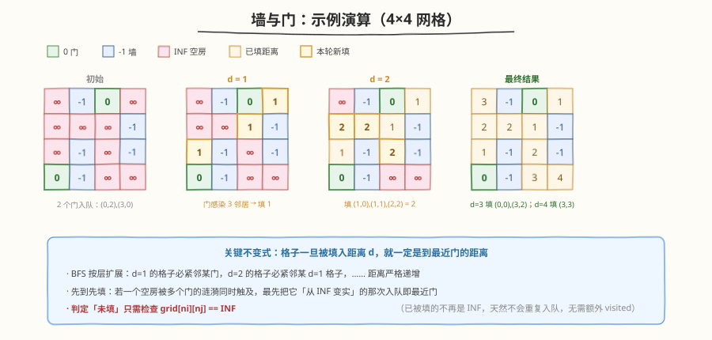

# LeetCode 墙与门 题解

## 1. 题目概述

- **标题 / 题号**：墙与门（#286，medium）
- **链接**：https://leetcode.cn/problems/walls-and-gates/
- **难度**：中等
- **标签**：广度优先搜索、矩阵、多源 BFS

**题意**：给定 `m×n` 网格 `rooms`，每个格子取以下三值之一：

- `-1`：墙或障碍物
- `0`：门
- `INF`（即 $2^{31}-1 = 2147483647$）：空房间

要求**就地**填充每个空房间到**最近门**的距离；若无法到达任何门，保持 `INF`。墙和门本身不变。

**示例 1**：

```text
输入：rooms = [[INF,-1, 0, INF],
               [INF,INF,INF,-1],
               [INF,-1, INF,-1],
               [ 0, -1, INF,INF]]
输出：[[ 3, -1, 0,  1],
        [ 2,  2, 1, -1],
        [ 1, -1, 2, -1],
        [ 0, -1, 3,  4]]
解释：两个门分别在 (0,2) 与 (3,0)，每个空房被填到最近门的曼哈顿距离。
```

**约束**：

- `m == rooms.length`
- `n == rooms[i].length`
- `1 <= m, n <= 250`
- `rooms[i][j]` 取值为 `-1`、`0` 或 $2^{31}-1$

> 💡 把「门」看作多源 BFS 的源点，把「空房间」看作待求最短距离的节点——这正是 [994. 腐烂的橘子](../0901-1000/994_腐烂的橘子.md)「多源同时入队、逐层扩展」的同一套骨架，只不过本题把「感染时间」换成了「填距离」，并改为**就地写入** `grid` 而非返回分钟数。

## 2. 解题思路

### 2.1 暴力思路（对每个空房做单源 BFS）

对每个 `INF` 格子从自身出发做 BFS，找到第一扇门即停止，把距离写回。每个空房跑一次 BFS，最坏 `O((mn)²)`。问题在于：相邻的空房会**重复扫描同一片区域**，大量重叠计算。

### 2.2 核心观察：多源 BFS（反转源汇）


关键洞察：与其「从每个空房找门」，不如**反转方向**——「让所有门同时向外扩散」。把每扇门（`0`）在初始化时全部入队，BFS 逐层扩展，每扩出一层距离 `+1`。由于 BFS 按层推进，**一个空房第一次被触及时的层数，就是它到最近门的距离**。

> 💡 **等价于超级源点**：设想添加一个「超级源点」连向所有门（边权 1），那么从超级源点出发的单源 BFS = 所有门同时出发的多源 BFS。这一视角把多源 BFS 直接归约为经典单源最短路，正确性由 BFS 的层级单调性保证。与 [542. 01 矩阵](https://leetcode.cn/problems/01-matrix/)（把所有 `0` 当源点求每个 `1` 的最近距离）完全同构。

**就地写入省去 visited**：把 `INF` 当作「未访问」标记，填入距离后该格不再是 `INF`，天然不会重复入队——无需额外 `visited` 数组。这是本题相对 994 的一个巧解：994 用 `fresh` 计数判定完成，本题用 `grid[ni][nj] == INF` 直接判定可扩展。

### 2.3 算法流程图


1. 扫描网格：所有门 `(i,j)`（值为 `0`）入队；`INF` 为待填空房
2. BFS 循环（按层处理）：
   - 取当前层大小 `size`
   - 逐个 `pop` `(i,j)`，检查四邻居 `(ni,nj)`
   - 若 `rooms[ni][nj] == INF`：填 `rooms[ni][nj] = rooms[i][j] + 1`，并入队
3. 队列空即结束（就地完成，无需返回值）

> ⚠️ 距离递推 `rooms[ni][nj] = rooms[i][j] + 1`：由于 `(i,j)` 是按层 pop 的，其值就是它到最近门的距离，邻居比它远一步，故 `+1`。门本身的值为 `0`，恰好作为距离基准。

### 2.4 示例演算



以示例 1 的 `4×4` 网格为例，两扇门 `(0,2)`、`(3,0)` 同时入队：

| 层数 d | 入队格子（本轮新填） | 说明 |
|--------|----------------------|------|
| 0 | `(0,2)`、`(3,0)` | 两扇门，自身距离 0 |
| 1 | `(0,3)`、`(1,2)`、`(2,0)` | 各自紧邻某扇门 |
| 2 | `(1,0)`、`(1,1)`、`(2,2)` | 由 d=1 的格子扩展 |
| 3 | `(0,0)`、`(3,2)` | 由 `(1,0)`、`(2,2)` 扩展 |
| 4 | `(3,3)` | 由 `(3,2)` 扩展，最远点 |

注意 `(0,3)` 距门 `(0,2)` 为 1，而它距门 `(3,0)` 要绕墙很远——多源 BFS 让 `(0,2)` 的涟漪先到，自动填入正确的小值 `1`。最终 `(3,3) = 4` 是全图最大距离。

## 3. 参考代码

### C++

```cpp
class Solution {
  public:
    void wallsAndGates(vector<vector<int>>& rooms) {
        int m = rooms.size(), n = rooms[0].size();
        queue<pair<int, int>> q;
        for (int i = 0; i < m; i++)
            for (int j = 0; j < n; j++)
                if (rooms[i][j] == 0)
                    q.push({i, j});
        int dirs[4][2] = {{0, 1}, {0, -1}, {1, 0}, {-1, 0}};
        while (!q.empty()) {
            int size = q.size();
            for (int k = 0; k < size; k++) {
                auto [i, j] = q.front();
                q.pop();
                for (auto& d : dirs) {
                    int ni = i + d[0], nj = j + d[1];
                    if (ni >= 0 && ni < m && nj >= 0 && nj < n &&
                        rooms[ni][nj] == INT_MAX) {
                        rooms[ni][nj] = rooms[i][j] + 1;
                        q.push({ni, nj});
                    }
                }
            }
        }
    }
};
```

### Python

```python
class Solution:
    def wallsAndGates(self, rooms: List[List[int]]) -> None:
        m, n = len(rooms), len(rooms[0])
        q = collections.deque(
            (i, j) for i in range(m) for j in range(n) if rooms[i][j] == 0
        )
        dirs = [(0, 1), (0, -1), (1, 0), (-1, 0)]
        while q:
            for _ in range(len(q)):          # 当前层
                i, j = q.popleft()
                for di, dj in dirs:
                    ni, nj = i + di, j + dj
                    if 0 <= ni < m and 0 <= nj < n and rooms[ni][nj] == 2147483647:
                        rooms[ni][nj] = rooms[i][j] + 1
                        q.append((ni, nj))
```

> 💡 Python 中 `INF` 用字面量 `2147483647` 判断最稳妥；若题面保证用 `float('inf')` 初始化则改为 `math.isinf`。C++ 直接与 `INT_MAX` 比较即可。

## 4. 复杂度分析

| 维度 | 复杂度 | 说明 |
|------|--------|------|
| 时间复杂度 | `O(m·n)` | 每个格子最多入队一次，每条边被常数次检查 |
| 空间复杂度 | `O(m·n)` | 队列最坏存放所有门及其扩展层 |

> 💡 `m, n ≤ 250`，格子数上限 `62500`，远低于时限；无需 `visited` 使空间常数更小。

## 5. 扩展：为何「就地写入」能替代 visited

本题能用 `rooms[ni][nj] == INF` 直接判定可扩展，依赖一个**不变式**：

> **只有 `INF` 格子是「未访问」的；一旦被填入距离，该格便有了有限值，绝不会再等于 `INF`。**

由此推出三点：

1. **不会重复入队**：填入距离后值不再是 `INF`，后续任何邻居触及它都会被 `== INF` 判定挡掉。
2. **首次填入即最优**：BFS 按层扩展，距离严格递增，先到的层更小 → 填的就是最近门距离。这与 Dijkstra「首次出队即最短路」同构。
3. **墙/门天然短路**：墙 `-1`、门 `0` 都不等于 `INF`，自动跳过，无需特判。

> ⚠️ 这一技巧的前提是题面承诺「空房初值为 `INF` 且不会被其它操作改成 `INF`」。若初值是任意大数且可能与某条路径长度冲突，则必须显式 `visited`。本题 `INF = 2^31-1` 远大于任何真实距离（最大 `m+n ≤ 500`），安全。

## 6. 面试要点

1. **为什么从门出发，而不是从空房出发？**

   - 门少空房多时，从门出发只需一次多源 BFS（`O(mn)`）；从空房出发每个空房一次 BFS（最坏 `O((mn)²)`）。
   - 本质是**反转源汇**：求「每个空房到最近门」等价于求「每扇门到所有可达空房」——后者源点少，BFS 次数少。

2. **多源 BFS 的正确性怎么保证？**

   - 等价于加一个「超级源点」连向所有门（边权 1）的单源 BFS。BFS 的层级单调性保证每个格子首次被触及时的层数 = 到最近源点的最短距离。
   - 两个门的涟漪同时扩展，先到达的那个填入更小值；后到的因格子已非 `INF` 而被自动忽略——无需比较取 `min`。

3. **为什么不需要 `visited` 数组？**

   - `INF` 兼任「未访问」标记：填入距离后值改变，天然不会重复入队。前提是 `INF` 远大于任何真实距离（本题满足）。
   - 若初值不唯一（如用 `-1` 既表墙又表未访问），则必须额外 `visited` 或用哨兵值区分。

4. **距离递推 `rooms[ni][nj] = rooms[i][j] + 1` 为什么对？**

   - `(i,j)` 按层 pop，其值已是到最近门的距离；邻居比它远一步，故 `+1`。
   - 门自身值为 `0`，恰为距离基准——这是题面 `0` 表示门的妙处，省去了单独记录层数。

5. **和 994 腐烂的橘子、542 01 矩阵的区别？**

   - 三者同为多源 BFS 骨架。994 用 `fresh` 计数判定是否全部感染（可能有不可达）；542 与本题都是就地填距离，但 542 的「源」是所有 `0`、待求是每个 `1` 的最近 `0`，结构完全对称。
   - 本题额外有「墙 `-1`」作为障碍，使部分格子不可达（保持 `INF`）——这是相对 542 的一个小变化。

## 同类练习题

| # | 题目 | 与本题的关联 |
|---|------|-------------|
| 994 | [腐烂的橘子](https://leetcode.cn/problems/rotting-oranges/)（[题解](../0901-1000/994_腐烂的橘子.md)） | 多源 BFS 求全部感染的最少分钟，骨架一致，差异在用 `fresh` 计数判完成 |
| 542 | [01 矩阵](https://leetcode.cn/problems/01-matrix/) | 把所有 `0` 当源点求每个 `1` 的最近距离，与本题完全同构，无障碍版 |
| 1926 | [网格图中递增路径的数目](https://leetcode.cn/problems/number-of-increasing-paths-in-a-grid/) | 网格上的图搜索，DFS + 记忆化方向不同但同属矩阵遍历家族 |
| 417 | [太平洋大西洋水流问题](https://leetcode.cn/problems/pacific-atlantic-water-flow/)（[题解](../0401-0500/417_太平洋大西洋水流问题.md)） | 反向多源 DFS/BFS，从海洋边界逆流而上取交集，同样是「反转源汇」思想的体现 |
