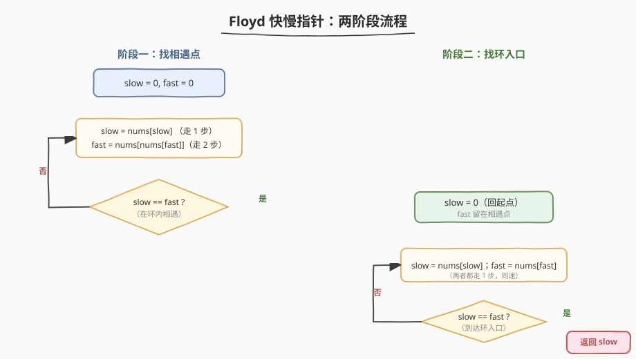
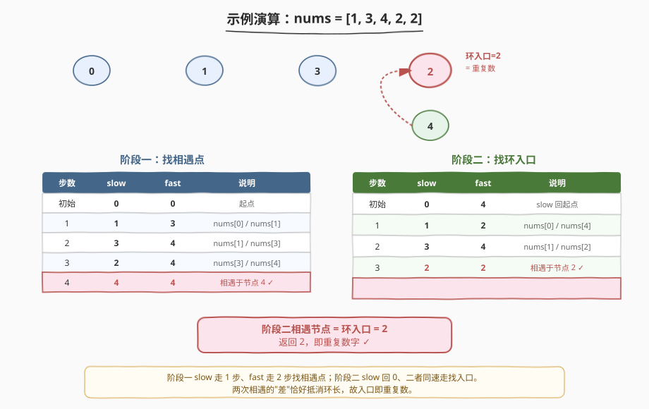

# 寻找重复数

- **题目名称**：寻找重复数
- **链接**：[287. 寻找重复数](https://leetcode.cn/problems/find-the-duplicate-number/)
- **难度**：中等
- **标签**：数组、双指针、快慢指针（Floyd 判圈）、二分查找

## 1. 题目概述

给定一个包含 `n + 1` 个整数的数组 `nums`，其数字都在 `[1, n]` 的范围内（含端点）。请找出**那个重复的数字**。

**约束条件**：

- `nums.length == n + 1`
- `1 <= n <= 10^5`
- `nums[i]` 的取值范围是 `[1, n]`（含端点）
- 只有一个重复的整数，但它**可能重复不止一次**
- **进阶要求**：
  1. **不能修改数组** `nums`（禁止排序、禁止原地标记）；
  2. 只能使用**常数级额外空间** $O(1)$（禁止哈希集合）；
  3. 时间复杂度小于 $O(n^2)$。

**示例 1**：

```text
输入：nums = [1,3,4,2,2]
输出：2
解释：2 是唯一重复的数字，出现了两次。
```

**示例 2**：

```text
输入：nums = [3,1,3,4,2]
输出：3
```

**示例 3**：

```text
输入：nums = [1,1]
输出：1
```

> 💡 这是一道"看似简单、限制极严"的经典题。排序、哈希、暴力都被三条进阶要求逐一条封杀。它的最优解法是**把数组当成链表，用 Floyd 快慢指针找环入口**——一次学透一个模板，能直接迁移到「环形链表 II」「快乐数」等同构题。

---

## 2. 解题思路

### 2.1 暴力思路：哈希集合

最直觉的做法：遍历数组，用哈希集合记录见过的数，遇到已在集合里的就是答案。

- 时间 $O(n)$，空间 $O(n)$。

能 AC，但**违反进阶要求 ②（常数空间）**。另一种"排序后找相邻相等"的方法时间 $O(n \log n)$、空间 $O(1)$，但**违反要求 ①（不能修改数组）**。

> ⚠️ 三条进阶要求把"排序 / 哈希 / 暴力"三件套全部封死，逼我们想出更巧的常数空间、不修改数组的解法。

### 2.2 核心观察：数组即链表，Floyd 快慢指针

![把数组当成链表：nums[i] 是节点 i 的下一条边](../images/find_duplicate_floyd_concept.svg)

关键洞察：**把 `nums[i]` 看作从节点 `i` 出发指向节点 `nums[i]` 的一条边**，整个数组就变成了一张「每个节点出度恰为 1」的**函数图**（functional graph）。

为什么一定有环？由**鸽巢原理**：`n + 1` 个节点的编号都在 `[1, n]`，而节点 `0` 的取值 `nums[0] ∈ [1, n]`，所以从节点 `0` 出发永远走不到 `0`（没有任何边指向 0）。`n + 1` 条边塞进 `n` 个非零节点，必然存在一个被**重复指向**的节点——它就是**环的入口**，而它的编号正是那个重复出现的数字。

> 💡 **重复数 = 环入口**：重复数字 `d` 至少出现两次，意味着节点 `d` 的**入度 ≥ 2**（一条来自环内，一条来自环外的"尾巴"）。在「出度恒为 1」的函数图里，入度为 2 的节点恰好是「尾巴接入环」的那个交汇点，也就是环入口。所以**找重复数 ⟺ 找环入口**。

于是直接套用 [142. 环形链表 II](https://leetcode.cn/problems/linked-list-cycle-ii/) 的 **Floyd 快慢指针**：

1. **阶段一（找相遇点）**：`slow` 每次走 1 步（`slow = nums[slow]`），`fast` 每次走 2 步（`fast = nums[nums[fast]]`）。两者进入环后必然相遇。
2. **阶段二（找入口）**：把 `slow` 重置回起点 `0`，`fast` 留在相遇点，**两者都改为每次走 1 步**。再次相遇的节点就是环入口 = 重复数。

> ⚠️ 阶段二的数学保证：设起点到环入口距离为 `a`、入口到相遇点距离为 `b`、环长为 `c`。阶段一有 `2(a+b) = a + b + k·c`，化简得 `a = k·c − b`。所以从起点走 `a` 步、从相遇点走 `a` 步，二者恰在入口相遇。这正是「slow 回起点、同速走」的原理。

### 2.3 算法流程图



**阶段一**：快慢指针从 `0` 出发，一快一慢，在环内相遇 → 得到相遇点。

**阶段二**：慢指针回起点 `0`，快慢**同速**各走 1 步，再次相遇即为环入口（重复数）。

### 2.4 示例演算

以 `nums = [1,3,4,2,2]` 为例（指针均为**下标**）：



**阶段一（找相遇点）**：

| 步数 | slow（走 1 步） | fast（走 2 步） | 说明 |
|------|-----------------|-----------------|------|
| 初始 | 0 | 0 | 起点 |
| 1 | nums[0]=1 | nums[nums[0]]=nums[1]=3 | — |
| 2 | nums[1]=3 | nums[nums[3]]=nums[2]=4 | — |
| 3 | nums[3]=2 | nums[nums[4]]=nums[2]=4 | — |
| 4 | nums[2]=4 | nums[nums[4]]=nums[2]=4 | **在节点 4 相遇** ✓ |

**阶段二（找入口）**：`slow` 重置为 `0`，二者同速：

| 步数 | slow | fast | 说明 |
|------|------|------|------|
| 初始 | 0 | 4 | slow 回起点，fast 留在相遇点 |
| 1 | nums[0]=1 | nums[4]=2 | — |
| 2 | nums[1]=3 | nums[2]=4 | — |
| 3 | nums[3]=2 | nums[4]=2 | **在节点 2 相遇** ✓ |

返回 `2`，即重复数 ✓。

---

## 3. 参考代码

### C++（Floyd 快慢指针，$O(n)$ / $O(1)$）

```cpp
class Solution {
  public:
    int findDuplicate(vector<int>& nums) {
        // 阶段一：快慢指针在环内相遇
        int slow = 0, fast = 0;
        do {
            slow = nums[slow];            // 走 1 步
            fast = nums[nums[fast]];      // 走 2 步
        } while (slow != fast);

        // 阶段二：慢指针回起点，二者同速走，再相遇即环入口
        slow = 0;
        while (slow != fast) {
            slow = nums[slow];
            fast = nums[fast];
        }
        return slow;
    }
};
```

### Python

```python
class Solution:
    def findDuplicate(self, nums: List[int]) -> int:
        # 阶段一：快慢指针在环内相遇
        slow = fast = 0
        while True:
            slow = nums[slow]                 # 走 1 步
            fast = nums[nums[fast]]           # 走 2 步
            if slow == fast:
                break

        # 阶段二：慢指针回起点，同速走再相遇即环入口
        slow = 0
        while slow != fast:
            slow = nums[slow]
            fast = nums[fast]
        return slow
```

> 💡 指针存的是**下标**，`nums[slow]` 就是"下一个节点"。阶段一用 `do-while`（C++）或 `while True` + `break`（Python）保证至少走一步再判断，避免起点即相遇的误判。整个过程**不修改 `nums`**、只用常数变量，完美满足三条进阶要求。

---

## 4. 复杂度分析

| 维度 | 复杂度 | 说明 |
|------|--------|------|
| 时间复杂度 | $O(n)$ | 阶段一在环内至多走 $O(n)$ 步相遇；阶段二从起点到入口距离 $a < n$，共 $O(n)$ |
| 空间复杂度 | $O(1)$ | 仅 `slow`、`fast` 两个指针变量，无额外数据结构 |

> ⚠️ 时间为何是 $O(n)$ 而非 $O(n^2)$？快慢指针进入环后，每一步二者距离缩小 1，至多 $c$（环长 $\le n$）步内必然相遇，故阶段一总计线性。

---

## 5. 扩展：二分答案法 $O(n \log n)$

若一时想不到 Floyd，还有一条朴素但稳妥的常数空间解法——**对"数值范围"二分**。

观察：若重复数为 `d`，那么对任意 `mid`，统计 `nums` 中 `≤ mid` 的元素个数 `cnt`：

- 若 `cnt > mid`，说明 `[1, mid]` 内"装不下"这么多数字，重复数落在 `[1, mid]`；
- 否则落在 `[mid+1, n]`。

```cpp
class Solution {
  public:
    int findDuplicate(vector<int>& nums) {
        int lo = 1, hi = (int)nums.size() - 1;
        while (lo < hi) {
            int mid = lo + (hi - lo) / 2;
            int cnt = 0;
            for (int x : nums) if (x <= mid) cnt++;
            if (cnt > mid) hi = mid;
            else            lo = mid + 1;
        }
        return lo;
    }
};
```

两种方法对比：

| 方法 | 时间 | 空间 | 修改数组 | 特点 |
|------|------|------|----------|------|
| Floyd 快慢指针 | $O(n)$ | $O(1)$ | 否 | **最优**，但需想到"数组即链表" |
| 二分答案 | $O(n \log n)$ | $O(1)$ | 否 | 思路直白，易想到，满足全部进阶要求 |

> 💡 面试推荐：先讲 Floyd（最优且炫技），若面试官说"没想到判圈怎么办"，再补二分答案作为保底方案，体现思维的广度。

---

## 6. 面试要点

1. **为什么从节点 0 出发一定能找到环？**

   - 数组共 `n + 1` 个元素，值域 `[1, n]`，没有任何元素等于 `0`，所以没有任何边指向节点 `0`——节点 `0` 是"尾巴"的起点，永远不会回到自身。`n + 1` 条边塞进 `n` 个非零节点（鸽巢），必然存在入度 ≥ 2 的节点，即存在环。

2. **为什么"环入口"就是重复数字？**

   - 重复数字 `d` 出现 ≥ 2 次，意味着节点 `d` 被至少两条边指向（入度 ≥ 2）。在出度恒为 1 的函数图中，入度为 2 的节点正是"尾巴汇入环"的交汇点 = 环入口。故找重复数等价于找环入口。

3. **阶段二为什么把 `slow` 重置到 `0` 就能找到入口？**

   - 设起点到入口 `a`、入口到相遇点 `b`、环长 `c`。阶段一有 `2(a+b) = a + b + k·c`，得 `a = k·c − b`。从相遇点再走 `a` 步等价于走 `k·c − b` 步，恰绕环 `k` 圈减去 `b` 回到入口；而从起点走 `a` 步也到入口。所以二者同速走 `a` 步必在入口相遇。

4. **不能用排序 / 哈希，还有什么常数空间解法？**

   - **二分答案**：对数值范围 `[1, n]` 二分，每次 $O(n)$ 统计 `≤ mid` 的个数判断重复落在哪半边，总 $O(n \log n)$、$O(1)$ 空间、不修改数组。是 Floyd 想不到时的保底方案。（注：位运算按二进制位统计也是 $O(n \log n)$ 同类思路。）

5. **为什么不能用"原地标记（取负号）"？**

   - 「取负号 / 加 n」等原地标记法能 $O(n)$ 找到重复数，但**修改了数组**，违反进阶要求 ①。面试中要先确认是否允许修改数组；若题目明确"不能修改"，则只能用 Floyd 或二分答案。

---

## 7. 同类练习题

- [142. 环形链表 II](https://leetcode.cn/problems/linked-list-cycle-ii/)：Floyd 快慢指针找环入口的"原版"，本题是把它迁移到数组上的同构题
- [202. 快乐数](https://leetcode.cn/problems/happy-number/)（[题解](./202_快乐数.md)）：对"各位平方和"函数做 Floyd 判圈，判断是否会陷入循环，同款模板
- [442. 数组中重复的数据](https://leetcode.cn/problems/find-all-duplicates-in-an-array/)：同样 `[1,n]` 范围数组找重复，但允许 $O(n)$ 原地标记，对照体会限制不同带来的解法差异
- [645. 错误的集合](https://leetcode.cn/problems/set-mismatch/)：找一个重复 + 一个缺失，鸽巢思想的进阶变体
