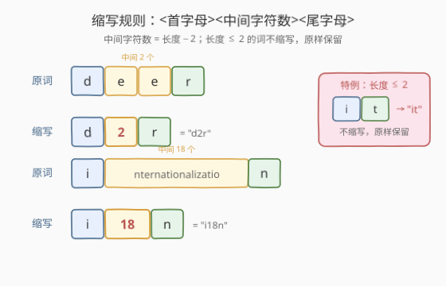
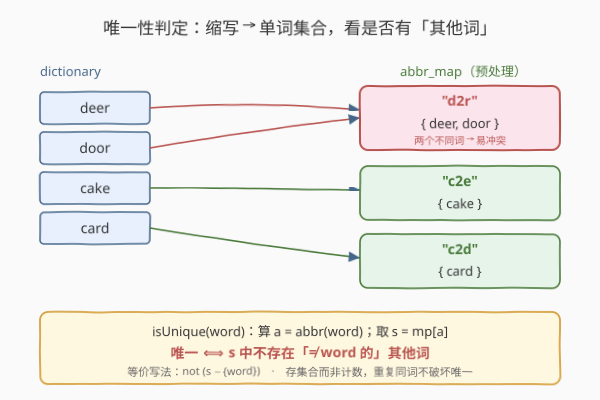
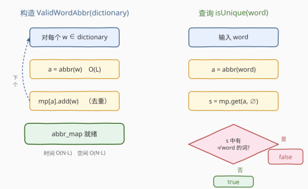
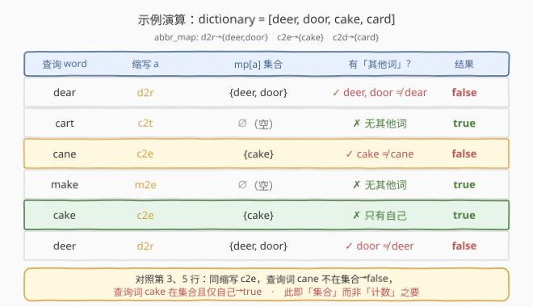

# 单词的唯一缩写

- **题目名称**：单词的唯一缩写
- **链接**：[288. 单词的唯一缩写](https://leetcode.cn/problems/unique-word-abbreviation/)
- **难度**：中等
- **标签**：哈希表、字符串、设计

## 1. 题目概述

单词的**缩写**遵循 `<首字母><中间字符个数><尾字母>` 的形式。中间字符个数 = 单词长度减 2（首尾各占一个）。几个例子：

- `it` → `it`（长度 ≤ 2，**不缩写**，原样保留）
- `dog` → `d1g`（首尾之间 1 个字符）
- `deer` → `d2r`（首尾之间 2 个字符）
- `internationalization` → `i18n`（首尾之间 18 个字符）



> ⚠️ 本题为 LeetCode **会员锁题**。题意要求设计一个类 `ValidWordAbbr`，用一份**字典**初始化，并支持 `isUnique(word)` 查询：单词 `word` 的缩写在字典中是否**唯一**。

**「唯一」的定义**（关键）：单词 `word` 的缩写 `a` 在字典中唯一，当且仅当**字典里不存在另一个不同的单词**也具有缩写 `a`。注意——

- 若 `word` 自身在字典中（哪怕出现多次），并不破坏唯一性；
- 只有当字典里有**与 `word` 不同的**单词共享同一缩写时，才不唯一。

**接口**：

```text
ValidWordAbbr(dictionary)  —— 用字符串数组 dictionary 初始化
isUnique(word: str) -> bool —— 判断 word 的缩写是否唯一
```

**示例 1**：

```text
输入：
dictionary = ["deer", "door", "cake", "card"]
isUnique("dear") -> false
isUnique("cart") -> true
isUnique("cane") -> false
isUnique("make") -> true
```

解释（缩写映射：`d2r → {deer, door}`、`c2e → {cake}`、`c2d → {card}`）：

| 查询 | 缩写 | 字典中该缩写对应的单词集合 | 唯一？ | 原因 |
|------|------|---------------------------|--------|------|
| `dear` | `d2r` | `{deer, door}` | ❌ false | 集合里 `deer`、`door` 都不是 `dear` |
| `cart` | `c2t` | `{}`（空） | ✅ true | 字典里没单词共享此缩写 |
| `cane` | `c2e` | `{cake}` | ❌ false | `cake ≠ cane`，是「其他词」 |
| `make` | `m2e` | `{}` | ✅ true | 无其他词共享 |

**示例 2**（字典含重复词，考查唯一性边界）：

```text
dictionary = ["deer", "deer"]
isUnique("deer") -> true
isUnique("door") -> false
```

解释：`d2r → {deer}`（集合去重）。`deer` 查询时集合里只有自己 → 唯一；`door` 查询时集合里有 `deer` 这个「其他词」 → 不唯一。

**约束条件**：

- 每个单词仅含小写英文字母
- 单词长度 `1 <= word.length`（具体上界未公开，方法可处理常规规模）

> 💡 本题的核心不是「怎么缩写」（缩写规则很简单），而是**精确理解「唯一」的定义**并选择合适的数据结构预处理。最常见的错误是「缩写 → 计数」：若字典含重复词 `["deer","deer"]`，计数为 2 会误判 `deer` 不唯一。正确做法是「缩写 → 单词集合」，只关心集合中是否存在**与查询词不同的**单词。

---

## 2. 解题思路

### 2.1 暴力思路：每次查询遍历全字典

每次 `isUnique(word)` 时，先算出 `word` 的缩写 `a`，再遍历整个字典，逐个计算每个词的缩写，统计与 `a` 相同且**不等于 `word`** 的词的个数。若有则不唯一。

```text
isUnique(word):
    a = abbrev(word)
    for w in dictionary:
        if w != word and abbrev(w) == a:
            return false
    return true
```

简单直观，但每次查询 `O(N·L)`（N 为字典大小、L 为平均词长）。若查询次数多，代价高。能否预处理把每次查询降到接近 `O(L)`？

### 2.2 核心观察：缩写 → 单词集合 预处理

把所有「**相同的缩写**」对应到同一组单词——预处理一张哈希表 `abbr_map`：键是缩写字符串，值是该缩写对应的**不同单词的集合**。

```text
abbr_map: dict[str, set[str]]
  "d2r" -> {"deer", "door"}
  "c2e" -> {"cake"}
  "c2d" -> {"card"}
```

查询 `isUnique(word)` 时：

1. 算 `a = abbrev(word)`；
2. 取 `s = abbr_map.get(a, set())`；
3. 唯一 ⟺ `s` 中不存在「**与 `word` 不同的**」单词，即 `s - {word}` 为空。



> 💡 **为什么存「集合」而非「计数」？** 因为「唯一」的判定对象是**不同的单词**，不是**出现次数**。字典 `["deer","deer"]` 中 `d2r` 对应两个 `deer`，但它们是**同一个词**，不构成「其他词」，`deer` 仍唯一。集合天然去重，`{"deer"}` 大小为 1，查询 `deer` 时 `s - {deer} = ∅` → 唯一。若存计数 `2`，会误判 `2 > 1` 不唯一。**这是本题最大的坑**。

### 2.3 算法流程图



- **预处理**（构造函数）：遍历字典，对每个词算缩写，加入 `abbr_map[abbr]` 集合。`O(N·L)` 时间、`O(N·L)` 空间。
- **查询**：算缩写 `O(L)` + 集合查找 `O(1)`（平均）+ 集合差集 `O(|s|)`（最坏与该缩写下的词数成正比，通常很小）。整体 `O(L)` 量级。

### 2.4 示例演算

以 `dictionary = ["deer", "door", "cake", "card"]` 为例，预处理得到 `abbr_map`，再逐个演算查询：



注意 `cake` 查询 `c2e` 时集合 `{cake}` 里只有自己 → 唯一（true）；而 `cane` 查询 `c2e` 时集合里有 `cake` 这个「其他词」 → 不唯一（false）。**同一个缩写 `c2e`，查询词是否在集合里决定了结果**——这正是「集合」而非「计数」的精妙之处。

---

## 3. 参考代码

### C++

```cpp
// 单词的唯一缩写.cpp —— 缩写→单词集合 预处理 + "无其他词"判定
// 编译: g++ -O2 -std=c++17 单词的唯一缩写.cpp -o wordabbr
class ValidWordAbbr {
    unordered_map<string, unordered_set<string>> mp;   // 缩写 -> 单词集合（自动去重）

    string abbrev(const string &w) const {
        int n = w.size();
        if (n <= 2) return w;                          // 长度<=2 不缩写
        return string(1, w[0]) + to_string(n - 2) + string(1, w.back());
    }
  public:
    ValidWordAbbr(vector<string> &dictionary) {
        for (auto &w : dictionary)                     // 集合自动去重，重复同词不增条目
            mp[abbrev(w)].insert(w);
    }

    bool isUnique(string word) const {
        string a = abbrev(word);
        auto it = mp.find(a);
        if (it == mp.end()) return true;               // 字典里无此缩写 -> 唯一
        const auto &s = it->second;
        if (s.count(word)) return s.size() == 1;       // word 在集合里：需集合只有它自己
        return s.empty();                              // word 不在集合里：集合非空则必有其他词
    }
};
```

### Python

```python
class ValidWordAbbr:
    def __init__(self, dictionary: list[str]):
        self.mp: dict[str, set[str]] = {}
        for w in dictionary:
            self.mp.setdefault(self._abbr(w), set()).add(w)

    @staticmethod
    def _abbr(w: str) -> str:
        n = len(w)
        return w if n <= 2 else w[0] + str(n - 2) + w[-1]

    def isUnique(self, word: str) -> bool:
        s = self.mp.get(self._abbr(word), set())      # 该缩写对应的单词集合
        return not (s - {word})                       # 唯一 ⟺ 集合中无「其他词」
```

> 💡 Python 的 `not (s - {word})` 一行概括三种情形：集合空 → `∅ - {word} = ∅` → `not ∅ = true`；集合只有 `word` → `{word} - {word} = ∅` → `true`；集合含其他词 → 差集非空 → `false`。语义直接对应「**不存在其他词**」的定义，且天然处理重复词（集合去重）。

> ⚠️ C++ 版 `isUnique` 标了 `const`：`unordered_map::find` 在 C++ 标准下是 const 合法的（不改表）。若所用 judge 的方法签名不带 `const`，去掉即可，不影响逻辑。

---

## 4. 复杂度分析

| 维度 | 复杂度 | 说明 |
|------|--------|------|
| **构造时间** | $O(N \cdot L)$ | N=字典词数，L=平均词长；每词算缩写 $O(L)$ + 入集合 $O(L)$（哈希字符串） |
| **查询时间** | $O(L + \|s\|)$ | 算缩写 $O(L)$；集合查找 $O(L)$（哈希 word）；最坏遍历集合判「其他词」 $O(\|s\|)$，$\|s\|$ 通常很小 |
| **空间** | $O(N \cdot L)$ | 最坏每个词缩写互不相同，存 N 个键值对，每对存一个单词 |
| **可优化** | — | 若只关心「该缩写是否对应 ≥2 个不同词」，可把值压缩为「首个词 + 不同词计数」，见第 5 节 |

> ⚠️ **查询的均摊复杂度**：若题目保证字典中同一缩写下的不同词数有界（实际场景常如此），查询均摊 $O(L)$。最坏情况（所有词同缩写、全不同）单次查询 $O(N)$，但此时构造已 $O(NL)$，查询次数 $Q$ 下总 $O(NL + Q \cdot N)$，仍优于暴力 $O(Q \cdot NL)$。

---

## 5. 扩展：值压缩——从「集合」到「(首个词, 不同词计数)」

当字典很大、同一缩写下单词很多时，存完整 `set<string>` 空间开销大。注意到 `isUnique` 只关心两件事：

1. 该缩写下是否只有查询词自己；
2. 该缩写下是否存在与查询词不同的词。

可把每个缩写的值压缩为 `(first_word, distinct_count)`，其中 `distinct_count` 封顶 2（>2 与 2 等价，都意味着「至少两个不同词」）：

- 插入时：缩写不在表 → 记 `(w, 1)`；在表且 `w != first_word` → `distinct_count = min(2, count+1)`。
- 查询时：
  - 缩写不在表 → `true`；
  - `distinct_count >= 2` → `false`（至少两个不同词，无论 word 是否在内，都存在其他词）；
  - `distinct_count == 1` → `first_word == word`（唯一的那个词须是查询词本身）。

```python
class ValidWordAbbr:
    def __init__(self, dictionary):
        self.mp = {}                       # abbr -> [first_word, distinct_count(<=2)]
        for w in dictionary:
            a = self._abbr(w)
            if a not in self.mp:
                self.mp[a] = [w, 1]
            elif self.mp[a][0] != w:
                self.mp[a][1] = min(2, self.mp[a][1] + 1)

    @staticmethod
    def _abbr(w):
        n = len(w)
        return w if n <= 2 else w[0] + str(n - 2) + w[-1]

    def isUnique(self, word):
        e = self.mp.get(self._abbr(word))
        if e is None: return True
        if e[1] >= 2: return False          # 至少两个不同词 -> 必有其他词
        return e[0] == word                 # distinct_count==1：唯一词须为 word
```

空间从 $O(N \cdot L)$ 降至 $O(D \cdot L)$（D = 不同缩写数，每条仅两个标量），查询严格 $O(L)$（无集合遍历）。代价是丢失「该缩写下具体有哪些词」的信息，但 `isUnique` 用不到。**当字典规模大且查询频繁时推荐此版**。

> ⚠️ 注意 `distinct_count == 1` 分支不能简单返回 `true`：若唯一的那个词 `first_word != word`，则它就是「其他词」，应返回 `false`。必须核对 `first_word == word`。

---

## 6. 面试要点

1. **「唯一」的准确定义是什么？为什么存集合而非计数？**

   - 唯一 = 字典里**不存在与查询词不同的**单词共享同一缩写。查询词自身在字典里（哪怕多次）不影响唯一性。
   - 存计数会栽在 `["deer","deer"]`：计数 2 误判 `deer` 不唯一。存**集合**天然去重，`{deer}` 大小 1，查询 `deer` 时无其他词 → 唯一。

2. **缩写规则里长度 ≤ 2 的边界怎么处理？**

   - 长度 ≤ 2 的单词**不缩写**，原样作为缩写（题目例子 `it → it`）。否则 `it` 会变成 `i0t`，与题意不符。
   - 实现上 `if n <= 2: return w`，注意是 `<=` 不是 `<`（长度 2 也不缩写，长度 3 如 `dog → d1g` 才缩写）。

3. **`isUnique` 的三种判定分支如何统一？**

   - 取 `s = abbr_map.get(abbr(word), set())`。
   - 统一为 `not (s - {word})`：集合空 → 唯一；集合只有 word → 唯一；集合含其他词 → 不唯一。
   - 等价的显式分支：`if word in s: return len(s) == 1; else: return len(s) == 0`。

4. **查询词不在字典里时，何时唯一、何时不唯一？**

   - 查询词 `word` 不在字典里：算其缩写 `a`。若 `a` 不在表 → 唯一（字典无此缩写）；若 `a` 在表 → 表里所有词都是「其他词」→ 不唯一。
   - 例：`dear` 不在字典，但 `d2r` 在表（`deer`、`door`）→ 不唯一。

5. **能否把每次查询降到严格 $O(L)$（不依赖集合大小）？**

   - 能。把每个缩写的值压缩为 `(首个词, 不同词计数封顶 2)`，见第 5 节。查询只需 $O(L)$ 算缩写 + $O(L)$ 哈希 + $O(1)$ 比较，无集合遍历。适用于字典大、同缩写下词多的场景。

> 💡 **一句话总结**：单词的唯一缩写 = 缩写→单词集合预处理 + 「**无其他词**」判定。最大的坑是用「计数」代替「集合」——重复词不破坏唯一性，只有「不同词」才破坏。核心套路 `not (s - {word})` 一行囊括三种情形，与 [205 同构字符串](./205_同构字符串.md) 的双向哈希同属「预处理映射 + 查询时核对」范式。

---

## 7. 同类练习题

- [205. 同构字符串](https://leetcode.cn/problems/isomorphic-strings/)：双向哈希核对映射一致性，与本题「缩写→词集合」的预处理思想同源（[站内题解](./205_同构字符串.md)）
- [290. 单词模式](https://leetcode.cn/problems/word-pattern/)：单词↔字符双射判定，同样是「预处理映射 + 查询核对」的哈希套路
- [208. 实现 Trie (前缀树)](https://leetcode.cn/problems/implement-trie-prefix-tree/)：另一种字符串预处理数据结构，前缀共享而非缩写共享（[站内题解](./208_实现Trie.md)）
- [535. TinyURL 编码解码](https://leetcode.cn/problems/encode-and-decode-tinyurl/)：长串到短串的映射设计，与缩写映射的「可逆性」对照——短串不要求可逆，本题缩写不可逆需靠集合消歧
