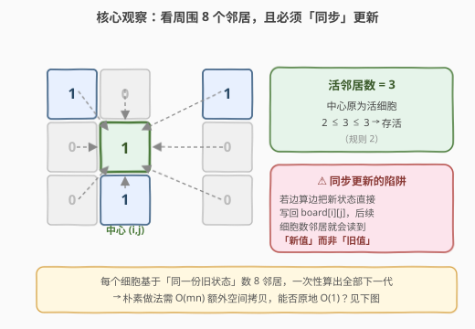
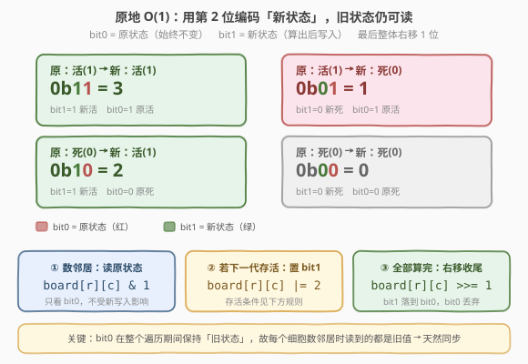
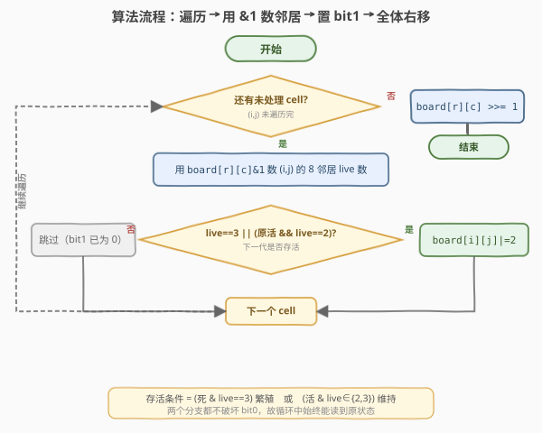
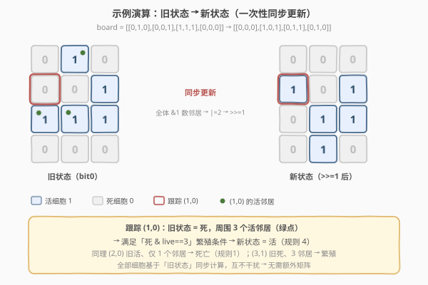

# 生命游戏

- **题目名称**：生命游戏
- **链接**：[289. 生命游戏](https://leetcode.cn/problems/game-of-life/)
- **难度**：中等
- **标签**：数组、矩阵、位运算、原地算法、模拟

## 1. 题目概述

给定一个 `m × n` 的二维棋盘 `board`，每个格子有两种状态：`1` 为**活细胞**，`0` 为**死细胞**。每个细胞根据其**周围八个邻居**（水平、垂直、对角）的活细胞数，**同步**演化到下一代：

1. 活细胞，邻居数 `< 2` → **死亡**（人口稀少，under-population）
2. 活细胞，邻居数为 `2` 或 `3` → **存活**
3. 活细胞，邻居数 `> 3` → **死亡**（人口过剩，over-population）
4. 死细胞，邻居数 `== 3` → **复活**（繁殖，reproduction）

**关键约束**：所有细胞的下一代状态必须基于**同一份当前状态**同时计算，不能边算边改（否则后算的细胞会读到已被更新的邻居值）。题目要求**原地**更新 `board`，不返回新矩阵。

**示例 1**：

```text
输入：board = [[0,1,0],[0,0,1],[1,1,1],[0,0,0]]
输出：[[0,0,0],[1,0,1],[0,1,1],[0,1,0]]
```

**示例 2**：

```text
输入：board = [[1,1],[1,0]]
输出：[[1,1],[1,1]]
```

**约束条件**：

- `m == board.length`
- `n == board[i].length`
- `1 <= m, n <= 25`
- `board[i][j]` 为 `0` 或 `1`

> 💡 数据规模很小（`≤ 25×25`），但这题考的不是规模，而是**「如何在原地、且不破坏旧状态的前提下完成同步更新」**。这是一类经典问题的模板。

---

## 2. 解题思路

### 2.1 暴力思路：拷贝一份旧状态

最直接的做法：先深拷贝 `board` 得到 `old`，遍历每个细胞 `(i,j)`，用 `old` 数邻居、算出下一代，写回 `board[i][j]`。

- 时间复杂度 $O(mn)$，空间复杂度 $O(mn)$（多了一份拷贝）。

这能过，但**没有满足「原地」的精神**。面试官会追问：能否做到 $O(1)$ 额外空间？

### 2.2 核心观察：8 邻居计数 + 同步更新的陷阱

每个细胞只看周围 8 个邻居的活细胞数。难点不在数邻居，而在**「同步」**——所有细胞必须基于旧状态计算，如果直接把新状态写回 `board[i][j]`，后续细胞数邻居时就会读到新值，导致结果错误。



上图揭示了矛盾：我们既要在原地把新状态写进去，又不能让新状态污染「数邻居」的过程。解决办法是**复合状态编码**——让一个格子同时持有「旧状态」和「新状态」两份信息。

### 2.3 原地 O(1)：用第 2 位编码新状态

一个 `int` 有多个 bit，而题目只用了 `0/1`（即 bit0）。我们可以**借用 bit1 来存新状态**，bit0 始终保留旧状态不变。这样：

- **数邻居时**只读 bit0（`board[r][c] & 1`），永远拿到旧值，天然同步；
- **算出新状态后**，若下一代存活就把 bit1 置 1（`board[r][c] |= 2`）；
- **全部遍历完后**，每个格子整体右移 1 位（`board[r][c] >>= 1`），新状态落到 bit0，旧状态丢弃。

四种状态编码如下（bit1=新状态，bit0=旧状态）：

| 旧状态 | 新状态 | 编码 `0b<新><旧>` | 十进制 | 含义 |
|--------|--------|-------------------|--------|------|
| 活(1) | 活(1) | `0b11` | 3 | 存活 |
| 活(1) | 死(0) | `0b01` | 1 | 死亡 |
| 死(0) | 活(1) | `0b10` | 2 | 繁殖 |
| 死(0) | 死(0) | `0b00` | 0 | 维持死亡 |



**存活条件的统一**：把 4 条规则压缩成一句话——**「下一代存活 ⇔ 邻居数为 3，或（当前活且邻居数为 2）」**。即 `live == 3 || (orig == 1 && live == 2)`。满足则 `|=2`，不满足则不动（bit1 默认为 0，即新状态为死）。

> 💡 这个「借用未使用的高位暂存新状态、读完旧值后再整体右移」的套路，是**原地同步更新**类问题的通用模板：只要新状态依赖于「原始」邻居值，且每个元素只用了部分 bit，就可以这样原地完成，无需额外矩阵。

### 2.4 算法流程图



### 2.5 示例演算

以示例 1 `board = [[0,1,0],[0,0,1],[1,1,1],[0,0,0]]` 为例，跟踪 `(1,0)` 这个细胞：



| 细胞 | 旧状态 | 活邻居数 | 命中规则 | 新状态 | 编码过程 |
|------|--------|----------|----------|--------|----------|
| `(1,0)` | 死(0) | 3（`(0,1)`,`(2,0)`,`(2,1)`） | 规则4 繁殖 | 活(1) | `0 |= 2 → 0b10=2` |
| `(2,0)` | 活(1) | 1（`(2,1)`） | 规则1 稀少 | 死(0) | 不动 → `0b01=1` |
| `(3,1)` | 死(0) | 3（`(2,0)`,`(2,1)`,`(2,2)`） | 规则4 繁殖 | 活(1) | `0 |= 2 → 0b10=2` |
| `(2,1)` | 活(1) | 3 | 规则2 存活 | 活(1) | `1 |= 2 → 0b11=3` |

全部细胞算完后，统一 `board[r][c] >>= 1`，编码 `2/3` → `1`（活），编码 `0/1` → `0`（死），得到最终棋盘 `[[0,0,0],[1,0,1],[0,1,1],[0,1,0]]`，与示例一致。

> ⚠️ 注意 `(1,1)` 这种**既不在边界、也不是重点跟踪**的细胞：它旧状态为死、邻居数 `1`，不满足繁殖，新状态仍为死，编码保持 `0b00=0`。遍历时这类「无变化」格子最多，`|=2` 只对真正复活的少数格子触发。

---

## 3. 参考代码

### 方法一：原地 O(1) 空间（位编码，推荐）

### C++

```cpp
class Solution {
  public:
    void gameOfLife(vector<vector<int>>& board) {
        int m = board.size(), n = board[0].size();
        // 8 个方向
        const int dx[8] = {-1, -1, -1, 0, 0, 1, 1, 1};
        const int dy[8] = {-1, 0, 1, -1, 1, -1, 0, 1};

        for (int i = 0; i < m; ++i) {
            for (int j = 0; j < n; ++j) {
                int live = 0;
                for (int k = 0; k < 8; ++k) {
                    int ni = i + dx[k], nj = j + dy[k];
                    if (ni >= 0 && ni < m && nj >= 0 && nj < n) {
                        live += board[ni][nj] & 1; // 只读 bit0 = 旧状态
                    }
                }
                // 下一代存活 ⇔ live==3 或 (原活 && live==2)
                if (live == 3 || (board[i][j] & 1 && live == 2)) {
                    board[i][j] |= 2;             // 置 bit1 = 新活
                }
            }
        }
        // 收尾：新状态落到 bit0
        for (int i = 0; i < m; ++i)
            for (int j = 0; j < n; ++j)
                board[i][j] >>= 1;
    }
};
```

### Python

```python
class Solution:
    def gameOfLife(self, board: List[List[int]]) -> None:
        m, n = len(board), len(board[0])
        dirs = [(-1, -1), (-1, 0), (-1, 1),
                (0, -1),           (0, 1),
                (1, -1),  (1, 0),  (1, 1)]

        for i in range(m):
            for j in range(n):
                live = 0
                for di, dj in dirs:
                    ni, nj = i + di, j + dj
                    if 0 <= ni < m and 0 <= nj < n:
                        live += board[ni][nj] & 1  # 只读 bit0 = 旧状态
                # 下一代存活 ⇔ live==3 或 (原活 && live==2)
                if live == 3 or (board[i][j] & 1 and live == 2):
                    board[i][j] |= 2               # 置 bit1 = 新活

        # 收尾：新状态落到 bit0
        for i in range(m):
            for j in range(n):
                board[i][j] >>= 1
```

### 方法二：拷贝旧状态（直观，O(mn) 空间）

### Python

```python
import copy

class Solution:
    def gameOfLife(self, board: List[List[int]]) -> None:
        m, n = len(board), len(board[0])
        old = copy.deepcopy(board)
        dirs = [(-1,-1),(-1,0),(-1,1),(0,-1),(0,1),(1,-1),(1,0),(1,1)]

        for i in range(m):
            for j in range(n):
                live = sum(old[i+di][j+dj]
                           for di, dj in dirs
                           if 0 <= i+di < m and 0 <= j+dj < n)
                if old[i][j] == 1:
                    board[i][j] = 1 if live in (2, 3) else 0
                else:
                    board[i][j] = 1 if live == 3 else 0
```

> 💡 方法二用 `old` 读、`board` 写，天然隔离新旧状态，逻辑最不易出错；方法一用位编码省掉了这份拷贝。面试时先讲方法二说清题意，再用方法一展示「原地」优化，节奏最佳。

---

## 4. 复杂度分析

| 维度 | 方法 | 复杂度 | 说明 |
|------|------|--------|------|
| 时间复杂度 | 位编码 | $O(mn)$ | 每个细胞检查 8 邻居，常数 8 倍 |
| 空间复杂度 | 位编码 | $O(1)$ | 仅常数个变量，状态编码在原数组内 |
| 时间复杂度 | 拷贝法 | $O(mn)$ | 同上 |
| 空间复杂度 | 拷贝法 | $O(mn)$ | 额外一份 `old` 棋盘 |

> ⚠️ 这里「$O(1)$ 空间」指**额外空间**。输入 `board` 本身被原地改写，借用了它未使用的 bit1。如果题目把状态改成任意整数（而非 0/1），就不能用位编码，需回到拷贝法或换用其它标记（如负数、特殊哨兵值）。

---

## 5. 扩展：无限棋盘与稀疏表示

康威生命游戏在无限大棋盘上更常见。当活细胞**极其稀疏**时，遍历整个 `m×n` 网格会大量浪费。改进思路：

- **只存活细胞坐标**：用集合 `live = {(i,j), ...}`，下一代只需考察「当前活细胞 + 它们的邻居」这一小圈候选格子。
- 对每个候选格统计 8 邻居里在 `live` 集合中的个数，按 4 条规则判定，得到下一代活集合。

这样时间复杂度取决于活细胞数 $L$（约 $O(L)$），与棋盘总面积无关。LeetCode 289 规模小（`25×25`）用不到，但这是 [生命游戏进阶题](https://leetcode.cn/problems/game-of-life/) 与系统设计「无限网格」场景的标准做法。

---

## 6. 面试要点

1. **为什么不能边算边写回 `board`？**
   - 因为每个细胞的新状态依赖邻居的**旧状态**。若 `(0,0)` 先被更新，`(0,1)` 数邻居时就会读到 `(0,0)` 的新值，破坏同步性。

2. **位编码为什么用 bit1 存新状态、bit0 保留旧状态？**
   - `board[i][j]` 本来只用 bit0（0/1）。借 bit1 存新状态后，`& 1` 永远取到未被动过的旧值，于是遍历中数邻居始终基于旧状态，天然同步；最后右移 1 位即可收尾。

3. **4 条规则如何压缩成一行判断？**
   - 「下一代存活 ⇔ `live == 3 || (orig == 1 && live == 2)`」。即死细胞只有 `live==3` 复活，活细胞只在 `live∈{2,3}` 存活，其余皆死。

4. **如果题目改成状态是任意整数而非 0/1，还能用位编码吗？**
   - 不能直接用 bit1。可改用拷贝法，或约定特殊哨兵值（如 `-1` 表示「旧死新活」、`2` 表示「旧活新死」）做原地标记，思路同构。

5. **边界细胞怎么处理？**
   - 越界邻居视为不存在（不计数）。代码里用 `0 <= ni < m && 0 <= nj < n` 过滤即可。

6. **能否不写最后的 `>>=1` 循环？**
   - 不行。位编码只是「临时」存新状态，最终 `board` 必须只含 `0/1`。少了右移，留下的 `2/3` 会破坏后续调用与题目约定。

---

## 7. 同类练习题

- [73. 矩阵置零](https://leetcode.cn/problems/set-matrix-zeroes/)：同类「原地同步更新」套路——用首行首列当标记数组存「哪些行列要清零」，O(1) 空间
- [289. 生命游戏](https://leetcode.cn/problems/game-of-life/)：本文题，位编码原地更新模板
- [130. 被围绕的区域](https://leetcode.cn/problems/surrounded-regions/)（[题解](../0101-0200/130_被围绕的区域.md)）：棋盘网格 + DFS/BFS 标记，与 8 邻居计数互补的「网格搜索」套路
- [994. 腐烂的橘子](https://leetcode.cn/problems/rotting-oranges/)（[题解](../0901-1000/994_腐烂的橘子.md)）：网格 + 多源 BFS 同步扩散，与生命游戏的「同步演化」思想相通
- [54. 螺旋矩阵](https://leetcode.cn/problems/spiral-matrix/)：矩阵遍历方向控制练习，巩固二维下标操作手感
