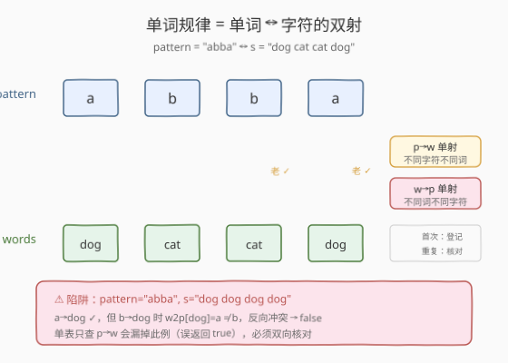
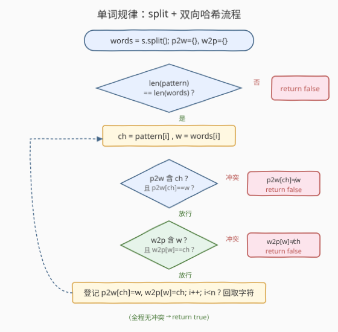
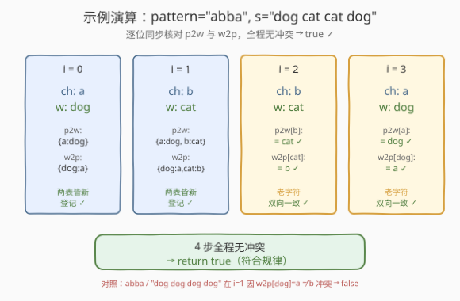

# LeetCode 单词规律 题解

## 1. 题目概述

- **标题 / 题号**：单词规律（#290，easy）
- **链接**：https://leetcode.cn/problems/word-pattern/
- **难度**：简单
- **标签**：哈希表、字符串

**题意**：给定一种规律 `pattern` 和一个字符串 `s`，判断 `s` 是否与 `pattern` **遵循相同的规律**。

「遵循相同规律」是指：`pattern` 中的每个字符与 `s` 中的每个**单词**之间存在**一一对应的双射**——

1. **同一个字符每次出现都映射到同一个单词**——不能这次换 `dog` 下次换 `cat`；
2. **不同字符不能映射到同一个单词**——两个不同字符不能挤到同一个单词上（即映射是**双射**）；
3. 字符与单词按出现顺序逐位对齐。

> 💡 本题是 [205 同构字符串](../0201-0300/205_同构字符串.md)的**单词级版本**——把 205 的「字符 ↔ 字符」换成「字符 ↔ 单词」，模板完全一致。唯一新增步骤是先把 `s` 按空格切分成单词列表，再做双射判定。

**示例 1**：

```text
输入：pattern = "abba", s = "dog cat cat dog"
输出：true
解释：a → dog，b → cat；两个 b 都映射到 cat，两个 a 都映射到 dog，一一对应。
```

**示例 2**：

```text
输入：pattern = "abba", s = "dog cat cat fish"
输出：false
解释：a → dog，b → cat 之后，最后一个 a 应映射到 dog，
      但 s 的最后一个单词是 fish，与既有映射 a → dog 冲突。
```

**示例 3**：

```text
输入：pattern = "aaaa", s = "dog cat cat dog"
输出：false
解释：a 在第 1 位映射到 dog，但第 2 位 a 要映射到 cat，破坏了「同字符同映射」。
```

**约束**：

- `1 <= pattern.length <= 300`
- `pattern` 只包含小写英文字母。
- `1 <= s.length <= 3000`
- `s` 只包含小写英文字母和空格。
- `s` 不含前导或尾随空格，所有单词间以**单个空格**分隔。

## 2. 解题思路

### 2.1 暴力思路：只建一张 pattern→word 的映射表

最直觉的做法：把 `s` 按空格切分成单词列表 `words`，用哈希表 `p2w` 记录 `pattern[i] → words[i]` 的映射。遇到新字符就登记，遇到老字符就核对是否和已登记的一致，不一致立刻返回 `false`。

```text
words = s.split(' ')
p2w = {}
for i in range(len(pattern)):
    ch, w = pattern[i], words[i]
    if ch in p2w and p2w[ch] != w: return false
    p2w[ch] = w
return true
```

但这只保证了 **`pattern→word` 是单射**（同一个字符不会映射到两个不同的单词），却漏掉了反向：`word→pattern` 方向可能 **多对一**——两个不同字符映射到了同一个单词。

反例：`pattern = "abba"`，`s = "dog dog dog dog"`。

| `i` | `ch` | `w` | `p2w` 登记结果 |
|-----|------|-----|----------------|
| 0 | a | dog | `a→dog` |
| 1 | b | dog | `b` 没登记过，登记 `b→dog` |
| 2 | b | dog | `p2w[b]==dog` ✓ |
| 3 | a | dog | `p2w[a]==dog` ✓ |

单表扫完不报错，返回 `true`。但 `a→dog` 和 `b→dog` 意味着 `pattern` 中的 `a`、`b` 两个不同字符都映射到了 `dog`，**不是双射**，正确答案应是 `false`。

> ⚠️ 单表的陷阱与 [205 同构字符串](../0201-0300/205_同构字符串.md)完全相同：只查了「同一个源是否换了不同目标」，没查「不同源是否换了同一目标」。要保证双射，必须**双向都查**。此外，暴力思路还忽略了**长度检查**——若 `pattern` 有 3 个字符而 `s` 有 4 个单词，不加长度检查就会漏判。

### 2.2 核心观察：双射 = 两个方向的单射

双射（一一对应）等价于：**`pattern→word` 单射** 且 **`word→pattern` 单射**。两个方向各建一张哈希表，扫描时同步核对即可：

- `p2w[ch]` 存在 → 必须等于 `w`；不存在 → 登记 `p2w[ch] = w`；
- `w2p[w]` 存在 → 必须等于 `ch`；不存在 → 登记 `w2p[w] = ch`；
- 任一方向冲突 → 返回 `false`；
- 全程无冲突 → 返回 `true`。

> 💡 **与 205 的关系**：核心套路完全一致——双向哈希同步核对。唯一的区别在于映射的两端：205 是「字符 ↔ 字符」，290 是「字符 ↔ 单词」。因此只需在 205 的骨架前加一步 `s.split()` 和长度检查，其余逻辑原封不动。



### 2.3 算法流程图

相比 205，本题在进入双射判定循环之前多了两步：**切分** `s` 得到 `words`，以及**长度检查** `len(pattern) == len(words)`。长度不等直接返回 `false`——这是 290 独有的前置关卡，漏掉会导致后续 `zip` 或下标访问静默截断或越界。



一次遍历 $O(n)$（$n$ 为 `pattern` 长度即单词个数），两张哈希表 $O(k)$ 空间（$k$ 为不同映射对数，不超过 $n$）。

### 2.4 示例演算

以 `pattern = "abba"`、`s = "dog cat cat dog"` 为例（符合规律，全程无冲突）：



| `i` | `ch` | `w` | `p2w`（核对后） | `w2p`（核对后） | 动作 |
|-----|------|-----|-----------------|-----------------|------|
| 0 | a | dog | `{a:dog}` | `{dog:a}` | 两边都新，登记 |
| 1 | b | cat | `{a:dog, b:cat}` | `{dog:a, cat:b}` | 两边都新，登记 |
| 2 | b | cat | `p2w[b]==cat` ✓ | `w2p[cat]==b` ✓ | 老字符，双向往返一致 |
| 3 | a | dog | `p2w[a]==dog` ✓ | `w2p[dog]==a` ✓ | 老字符，双向往返一致 |

全程无冲突 → 返回 `true`。

**反例演算**：`pattern = "abba"`、`s = "dog dog dog dog"`。

| `i` | `ch` | `w` | 核对结果 |
|-----|------|-----|----------|
| 0 | a | dog | 登记 `a→dog`、`dog→a` |
| 1 | b | dog | `w2p[dog]==a`，但当前 `ch=b`，**`w→p` 方向冲突** → 返回 `false` |

`b` 想映到 `dog`，但 `dog` 已被 `a` 占用，破坏了 `word→pattern` 单射。这正是单表会漏掉的反例。

## 3. 参考代码

### C++

```cpp
// 单词规律.cpp —— 双向哈希双射判定，O(n) 时间 / O(k) 空间
// 编译: g++ -O2 -std=c++17 单词规律.cpp -o wp
class Solution {
  public:
    bool wordPattern(string pattern, string s) {
        // 1. 切分 s 为单词列表
        vector<string> words;
        stringstream ss(s);
        string word;
        while (ss >> word) words.push_back(word);

        // 2. 长度检查（前置关卡）
        if (pattern.size() != words.size()) return false;

        // 3. 双向哈希同步核对
        unordered_map<char, string> p2w;
        unordered_map<string, char> w2p;
        for (int i = 0; i < (int)pattern.size(); ++i) {
            char ch = pattern[i];
            const string& w = words[i];
            if (p2w.count(ch) && p2w[ch] != w) return false;   // pattern→word 单射被破坏
            if (w2p.count(w) && w2p[w] != ch) return false;   // word→pattern 单射被破坏
            p2w[ch] = w;
            w2p[w] = ch;
        }
        return true;
    }
};
```

### Python

```python
class Solution:
    def wordPattern(self, pattern: str, s: str) -> bool:
        words = s.split()
        if len(pattern) != len(words):
            return False
        p2w, w2p = {}, {}
        for ch, w in zip(pattern, words):
            if p2w.get(ch, w) != w:              # pattern→word 方向核对
                return False
            if w2p.get(w, ch) != ch:              # word→pattern 方向核对
                return False
            p2w[ch] = w
            w2p[w] = ch
        return True
```

> 💡 Python 用 `p2w.get(ch, w) != w` 一行同时覆盖「未登记时默认值是 `w`（必相等，放行去登记）」和「已登记时取旧值与 `w` 比较」两种情况，省去 `in` 判断。注意默认值必须取**当前目标 `w`**——这与 [205 同构字符串](../0201-0300/205_同构字符串.md)的 `s2t.get(a, b) != b` 是完全同一手法，只不过 205 的两端都是字符，290 的一端是字符一端是字符串。
>
> ⚠️ **长度检查不可省**：`zip(pattern, words)` 在两者长度不等时会静默截断到较短的一方，导致多出的字符/单词被忽略。例如 `pattern = "a"`、`s = "dog cat"`，不加长度检查会只比对 `a↔dog` 然后返回 `true`，但正确答案是 `false`。

## 4. 复杂度分析

| 维度 | 双向哈希 | 首次出现位置法 |
|------|----------|----------------|
| **时间复杂度** | $O(n + m)$ | $O(n + m)$ |
| **空间复杂度** | $O(k)$，$k$ 为不同映射对数 | $O(k)$ |
| **实现难度** | 直观，推荐面试首选 | 巧妙但需理解转换原理 |
| **扩展性** | 易推广到 205/890 | 适合同构判定 |

> ⚠️ **时间 $O(n + m)$ 的来源**：`s.split()` 扫描整个 `s` 耗时 $O(m)$（$m$ 为 `s` 长度）；双向哈希循环遍历 `pattern` 耗时 $O(n)$（$n$ 为 `pattern` 长度即单词个数），每次哈希操作 $O(1)$。总时间 $O(n + m)$。空间上两张哈希表最多各存 $k$ 个条目（$k \leq \min(n, \text{字符集大小})$），因 `pattern` 只含小写字母（至多 26 种字符），$k \leq 26$，故空间可视为 $O(\min(n, 26))$。

## 5. 扩展：首次出现位置法（单表转下标）

与 [205 同构字符串](../0201-0300/205_同构字符串.md)的第 5 节一样，还有一种等价但更「绕」的判定法：**把每个元素替换成它首次出现的位置**，`pattern` 与 `words` 符合相同规律当且仅当它们转换后的下标序列**完全相同**。

思路：规律的本质是「**出现模式相同**」——同一位置上的元素，在各自序列里是不是「第一次出现」。如果 `pattern[i]` 第一次出现的位置和 `words[i]` 第一次出现的位置始终一致，两者就有相同的结构模式。

```python
class Solution:
    def wordPattern(self, pattern: str, s: str) -> bool:
        words = s.split()
        if len(pattern) != len(words):
            return False
        def first_seen(seq):
            seen = {}
            return [seen.setdefault(x, i) for i, x in enumerate(seq)]
        return first_seen(pattern) == first_seen(words)
```

> ⚠️ 这个方法把「双射」问题转换成「**模式编码相同**」问题——和 205 的巧解完全同源，只是 `seq` 从字符序列变成了单词序列。代码短但需要解释「为什么位置序列相等 ⇔ 符合规律」，面试推荐先用双向哈希讲清双射，再提此法作为巧解。

## 6. 面试要点

1. **为什么单张 `pattern→word` 映射表不够？**

   - 单表只保证「同一个字符始终映到同一个单词」，即 `pattern→word` 单射。
   - 但双射要求**两个方向都是单射**：`pattern→word` 单射 + `word→pattern` 单射。漏掉 `word→pattern` 方向，会出现「两个不同字符映到同一单词」的反例（如 `pattern="abba"`、`s="dog dog dog dog"`），误判为 `true`。
   - 修复：再加一张 `w2p` 表，双向同步核对。与 [205 同构字符串](../0201-0300/205_同构字符串.md)的修复方式完全一致。

2. **为什么必须做长度检查？`zip` 不够吗？**

   - `zip(pattern, words)` 在长度不等时会**静默截断**到较短的一方，多出的元素被忽略。
   - 反例：`pattern = "a"`、`s = "dog cat"`，不加长度检查只比对 `a↔dog` 就返回 `true`，但正确答案是 `false`（1 个字符对 2 个单词，无法一一对应）。
   - 修复：循环前先 `if len(pattern) != len(words): return False`。

3. **本题和 205 同构字符串的区别？**

   - **同**：核心都是「**双向哈希同步核对**判定双射」，模板完全一致。
   - **异**：205 是字符到字符（`s[i] ↔ t[i]`），两端都是单字符；290 是**字符到单词**（`pattern[i] ↔ words[i]`），需要先 `split` 切分 `s`，且要做长度检查。
   - 一句话：**同一套双射模板，换了映射的两端对象 + 加了一步预处理**。

4. **能不能只用一张表 + 一个集合做到？**

   - 可以。`p2w` 表负责 `pattern→word` 单射；额外用一个 `used` 集合记录「已被某个字符占用的单词」。登记 `p2w[ch]=w` 前，若 `w` 已在 `used` 中（说明别的字符占了它），返回 `false`。
   - 这等价于双向哈希——`w2p` 表的「值是否存在」就是 `used` 集合。两种写法等价，双向哈希更对称易读。

5. **如果 `s` 有多个连续空格或前导空格怎么办？**

   - 题目约束保证 `s` 不含前导/尾随空格且单词间只有单个空格，所以 `s.split()` 和 `s.split(' ')` 结果一致。
   - 但如果约束放宽，`s.split()`（无参数）会自动合并连续空格并去除首尾空格，更稳健；`s.split(' ')` 则会保留空字符串。面试中可以提一句「用无参 `split()` 更防御性」。

> 💡 **一句话总结**：单词规律 = 205 同构字符串的单词级版本。核心套路是**双向哈希同步核对**——`p2w` 与 `w2p` 两张表，任一方向映射不一致即返回 `false`。相比 205 只多了一步 `split` 和长度检查。与 205、890 合称双射判定三件套。

## 同类练习题

| # | 题目 | 与本题的关联 |
|---|------|-------------|
| 205 | [同构字符串](https://leetcode.cn/problems/isomorphic-strings/)（[题解](../0201-0300/205_同构字符串.md)） | 字符 ↔ 字符的双射，290 的字符级原版，模板完全一致 |
| 890 | [查找和替换模式](https://leetcode.cn/problems/find-and-replace-pattern/) | 对列表中每个词跑一次 205 判定，筛出所有同构于 `pattern` 的词 |
| 1 | [两数之和](https://leetcode.cn/problems/two-sum/)（[题解](../0001-0100/1_两数之和.md)） | 同样「一次遍历边查边插」的哈希套路，单向查找对照本题双向核对 |
| 211 | [添加与搜索单词](https://leetcode.cn/problems/design-add-and-search-words-data-structure/) | 哈希表按模式分组检索，思想可迁移到「模式匹配」场景 |
