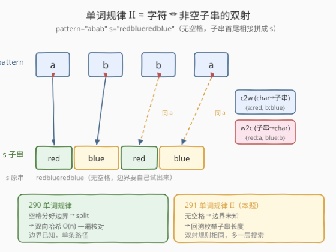
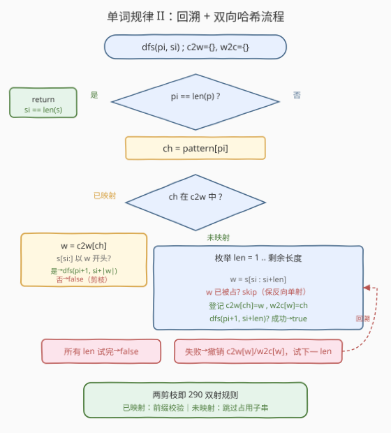
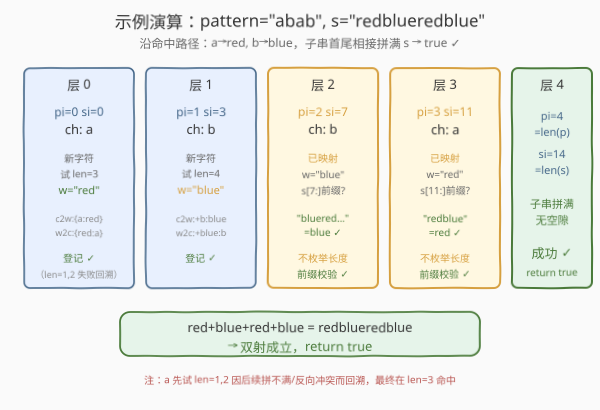

# LeetCode 单词规律II 题解

## 1. 题目概述

- **标题 / 题号**：单词规律II（#291，medium）
- **链接**：https://leetcode.cn/problems/word-pattern-ii/
- **难度**：中等
- **标签**：回溯、哈希表、字符串

**题意**：给定一种规律 `pattern` 和一个字符串 `s`，判断 `s` 是否与 `pattern` 遵循相同的规律。

「遵循相同规律」是指：`pattern` 中的每个字符与 `s` 中的某个**非空子串**之间存在**一一对应的双射**——

1. **同一个字符每次出现都映射到同一个子串**；
2. **不同字符不能映射到同一个子串**（即映射是**双射**）；
3. 这些子串按出现顺序**首尾相接**恰好拼成完整的 `s`，无空隙也无重叠。

> 💡 本题是 [290 单词规律](../0201-0300/290_单词规律.md)的**进阶版**——290 的 `s` 用空格分好了单词边界，做一次 `split` 即可逐位核对双射；本题的 `s` **没有空格**，单词边界被抹掉了，必须**自己试出每个字符对应多长的子串**。因此 290 的 $O(n)$ 双向哈希一次扫描不再适用，需要用**回溯**枚举所有切分方式。

**示例 1**：

```text
输入：pattern = "abab", s = "redblueredblue"
输出：true
解释：a → "red"，b → "blue"；"red"+"blue"+"red"+"blue" = "redblueredblue"，双射成立。
```

**示例 2**：

```text
输入：pattern = "aaaa", s = "asdasdasdasd"
输出：true
解释：a → "asd"，重复 4 次拼成 "asdasdasdasd"。
```

**示例 3**：

```text
输入：pattern = "aabb", s = "xyzabcxzyabc"
输出：false
解释：不存在一组双射使 a、b 分别对应某子串并首尾相接拼成 s。
```

**约束**：

- `1 <= pattern.length <= 20`
- `1 <= s.length <= 20`
- `pattern` 和 `s` 只包含小写英文字母。

## 2. 解题思路

### 2.1 暴力思路：枚举所有切分点

最朴素的办法：在 `s` 的字符之间插「刀」，把 `s` 切成恰好 `len(pattern)` 段非空子串，然后像 290 一样做一次双向哈希核对。长度为 $m$ 的 `s` 切成 $n$ 段的方案数是 $\binom{m-1}{n-1}$，再乘以每次核对 $O(m)$，最坏 $m=20, n=20$ 时复杂度尚可接受，但实现笨重、剪枝弱。

### 2.2 核心观察：回溯 + 双向哈希（290 的双射搬到搜索树上）



关键直觉：**双射规则与 290 完全一致**（`char→substr` 与 `substr→char` 两个方向都单射），区别只在于子串边界未知。于是把 290 的「逐位核对」改造成「逐位试探」：

- 用指针 `pi` 扫 `pattern`、`si` 扫 `s`，**同步推进**；
- 对当前字符 `ch = pattern[pi]`，分两种情况：
  - **已映射过**（`ch` 在 `char2word` 中）：取出它绑定的子串 `w`，检查 `s[si:]` 是否以 `w` 开头。是则跳过 `w` 的长度继续递归 `dfs(pi+1, si+len(w))`；否则本分支失败，回溯。
  - **未映射过**：枚举子串长度 `len`（从 $1$ 到剩余可用长度），截取候选 `w = s[si:si+len]`。要求 `w` **未被别的字符占用**（即 `w` 不在 `word2char` 中，保证 `substr→char` 单射）；然后登记双向映射，递归 `dfs(pi+1, si+len)`，失败则撤销登记。
- 递归终点：`pi == len(pattern)` 时，必须同时 `si == len(s)`（子串恰好拼满 `s`）才算成功。

> 💡 **与 290 的关系**：290 是「边界已知，逐位核对」，$O(n)$ 一遍过；291 是「边界未知，逐位试探」，回溯搜索。两者的**双射规则、两张哈希表完全相同**，只是 291 多了一层「枚举长度 + 失败回溯」的搜索外壳。可以把 290 看成 291 的一个**特例**——当所有子串长度被空格提前定死时，回溯退化为单条路径的核对。

### 2.3 算法流程图



### 2.4 示例演算

以 `pattern = "abab"`、`s = "redblueredblue"` 为例，沿着**命中答案的那条搜索路径**展开：



| 层 | `pi` | `si` | `ch` | 动作 | `char2word` | `word2char` |
|----|------|------|------|------|-------------|-------------|
| 0 | 0 | 0 | a | 新字符，试 `len=3`，`w="red"` 未被占用 | `{a:red}` | `{red:a}` |
| 1 | 1 | 3 | b | 新字符，试 `len=4`，`w="blue"` 未被占用 | `{a:red, b:blue}` | `{red:a, blue:b}` |
| 2 | 2 | 7 | b | 已映射，`w="blue"`，`s[7:]="blueredblue"` 前缀 ✓ | 不变 | 不变 |
| 3 | 3 | 11 | a | 已映射，`w="red"`，`s[11:]="redblue"` 前缀 ✓ | 不变 | 不变 |
| 4 | 4 | 14 | — | `pi==4==len(pattern)` 且 `si==14==len(s)` → **成功** | — | — |

> ⚠️ 上述只是「恰好猜对」的路径。实际搜索中，`a` 会先试 `len=1,2` 失败回溯，`b` 也会试多个长度，最终在 `len=3/4` 命中。剪枝（已映射字符的前缀校验、未映射子串的占用校验）会在深度较浅处砍掉大量无效分支。

## 3. 参考代码

### C++

```cpp
class Solution {
  public:
    bool wordPatternMatch(string pattern, string s) {
        unordered_map<char, string> c2w;
        unordered_map<string, char> w2c;
        return dfs(pattern, 0, s, 0, c2w, w2c);
    }

  private:
    bool dfs(const string& p, int pi, const string& s, int si,
             unordered_map<char, string>& c2w,
             unordered_map<string, char>& w2c) {
        if (pi == (int)p.size()) return si == (int)s.size();
        char ch = p[pi];
        if (c2w.count(ch)) {
            const string& w = c2w[ch];
            if (s.compare(si, w.size(), w) == 0)
                return dfs(p, pi + 1, s, si + w.size(), c2w, w2c);
            return false;
        }
        for (int len = 1; si + len <= (int)s.size(); ++len) {
            string w = s.substr(si, len);
            if (w2c.count(w)) continue;
            c2w[ch] = w;
            w2c[w] = ch;
            if (dfs(p, pi + 1, s, si + len, c2w, w2c)) return true;
            c2w.erase(ch);
            w2c.erase(w);
        }
        return false;
    }
};
```

### Python

```python
class Solution:
    def wordPatternMatch(self, pattern: str, s: str) -> bool:
        c2w, w2c = {}, {}

        def dfs(pi: int, si: int) -> bool:
            if pi == len(pattern):
                return si == len(s)
            ch = pattern[pi]
            if ch in c2w:
                w = c2w[ch]
                if s.startswith(w, si):
                    return dfs(pi + 1, si + len(w))
                return False
            for end in range(si + 1, len(s) + 1):
                w = s[si:end]
                if w in w2c:
                    continue
                c2w[ch] = w
                w2c[w] = ch
                if dfs(pi + 1, end):
                    return True
                del c2w[ch]
                del w2c[w]
            return False

        return dfs(0, 0)
```

> 💡 **两个剪枝点即 290 的双射规则**：① 已映射字符走前缀校验（对应 290 的 `p2w[ch]==w` 核对）；② 未映射字符枚举子串时跳过已占用的 `w`（对应 290 的 `w2p[w]==ch` 反向核对）。把 290 的两张哈希表搬进回溯框架，本题即解。
>
> ⚠️ **回溯撤销要成对**：登记时 `c2w[ch]=w` 与 `w2c[w]=ch` 一起做，撤销时 `del c2w[ch]` 与 `del w2c[w]` 也必须一起做，否则反向表残留会让后续分支误判某子串「已占用」。

## 4. 复杂度分析

| 维度 | 复杂度 | 说明 |
|------|--------|------|
| 时间复杂度 | $O(n \cdot m^n)$ 最坏，实际远低 | 每个未映射字符至多枚举 $m$ 种长度，共 $n$ 层；双射剪枝与前缀校验大幅削减分支 |
| 空间复杂度 | $O(n + m)$ | 递归栈深 $O(n)$，两张哈希表存至多 $n$ 条映射，子串切片临时占用 $O(m)$ |

> 💡 约束 $n, m \leq 20$，最坏 $20^{20}$ 看似爆炸，但双射约束极强：每个新字符的子串必须互不相同，且已映射字符靠前缀校验瞬间剪枝，实际搜索树很小。本题是「指数最坏 + 强剪枝」的典型回溯题。

## 5. 扩展：优化技巧

### 5.1 剩余长度剪枝

枚举子串长度时，上下界可收紧：

- **下界**：未映射字符至少占 $1$ 个字符；
- **上界**：当前子串最长不能让剩余字符「不够分」——剩余 `pattern` 中未映射的字符（含当前 `ch`）各至少 $1$ 字符，已映射字符需预留其固定长度。据此算出 `len` 的最大值，避免无谓的长子串试探。

### 5.2 按字符出现频率排序

先处理 `pattern` 中**出现次数最多**的字符，能更早确定它的子串长度，从而在搜索树浅层就为其他位置提供强约束（前缀校验更快触发失败）。这需要重排 `pattern` 的处理顺序并保持映射一致，实现略复杂，作为进阶优化。

> 💡 这两类优化与 [39. 组合总和](../0001-0100/39_组合总和.md)的「剩余和剪枝」、[47. 全排列 II](../0001-0100/47_全排列II.md)的「排序后同层跳过」同属回溯剪枝家族——本质都是**尽早砍掉注定失败的分支**。

## 6. 面试要点

1. **本题和 290 单词规律的区别？**

   - **同**：双射规则完全一致——`char↔word` 两个方向都单射，用 `c2w`/`w2c` 两张表同步核对。
   - **异**：290 的 `s` 用空格分好了单词边界，一次 `split` + $O(n)$ 核对即可；291 的 `s` **无空格**，边界未知，必须回溯枚举每个字符对应多长的子串。
   - 一句话：**291 = 290 的双射规则 + 回溯搜索外壳**。

2. **为什么需要两张哈希表？一张不行吗？**

   - 单张 `c2w` 只保证「同字符同子串」（`char→word` 单射），漏掉「不同字符挤到同一子串」。反例：`pattern="ab"`、`s="xx"`，单表会记 `a→x`、`b→x` 误判成功。加 `w2c` 反向表，枚举 `b` 的子串 `x` 时发现已被 `a` 占用即跳过，保证双射。与 290 的单表陷阱同理。

3. **已映射字符和未映射字符的处理有何不同？**

   - **已映射**：不枚举长度，直接取绑定的子串 `w`，检查 `s[si:]` 前缀是否等于 `w`，是则跳过 `len(w)` 递归，否则本分支失败。这是最强剪枝——一个前缀校验 $O(|w|)$ 就能砍掉一整棵子树。
   - **未映射**：枚举所有可能长度，候选子串必须未被占用，登记后递归，失败则撤销。

4. **终点判定的 `si == len(s)` 能省吗？**

   - 不能。`pi == len(pattern)` 只说明 `pattern` 用完了，但若子串拼起来短于 `s`（有剩余字符没被消费）或长于 `s`（越界），都不是合法匹配。必须同时 `si == len(s)` 保证子串首尾相接**恰好**拼满 `s`。

5. **回溯撤销时为什么两张表都要清？**

   - 登记 `c2w[ch]=w` 与 `w2c[w]=ch` 是双向的。若只清 `c2w` 不清 `w2c`，下次别的字符想用子串 `w` 时会被 `w2c` 残留挡住，漏掉合法分支。撤销必须成对，与登记成对对称。

> 💡 **一句话总结**：单词规律 II = 290 的双射规则 + 回溯枚举子串边界。已映射走前缀校验、未映射枚举长度跳过占用，两张哈希表随回溯登记/撤销。与 290 合称「单词规律双题」，是「已知边界核对」到「未知边界搜索」的自然升级。

## 同类练习题

| # | 题目 | 与本题的关联 |
|---|------|-------------|
| 290 | [单词规律](https://leetcode.cn/problems/word-pattern/)（[题解](../0201-0300/290_单词规律.md)） | 本题的边界已知版，`split` + 双向哈希 $O(n)$ 一遍过，291 的双射规则直接来源于此 |
| 205 | [同构字符串](https://leetcode.cn/problems/isomorphic-strings/)（[题解](../0201-0300/205_同构字符串.md)） | 字符↔字符的双射判定，290/291 双射模板的字符级原版 |
| 39 | [组合总和](https://leetcode.cn/problems/combination-sum/)（[题解](../0001-0100/39_组合总和.md)） | 回溯 + 剪枝的母题，291 的「枚举长度 + 失败回溯」骨架与其同源 |
| 10 | [正则表达式匹配](https://leetcode.cn/problems/regular-expression-matching/)（[题解](../0001-0100/10_正则表达式匹配.md)） | 同样在字符串上做匹配搜索，对比「回溯枚举」与「DP 记忆化」两种范式 |
