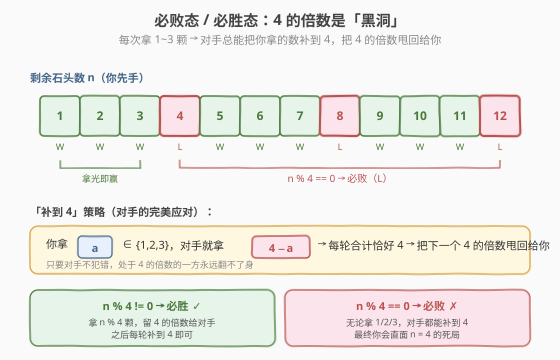
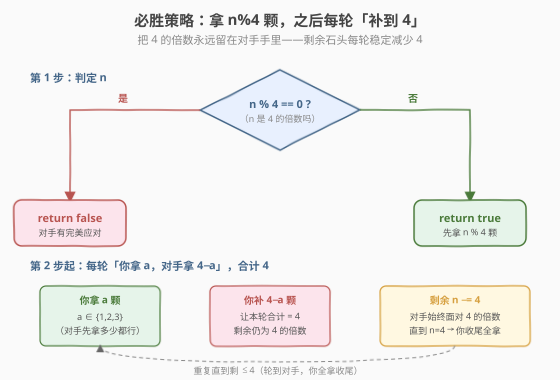

# LeetCode Nim 游戏 题解

## 1. 题目概述

- **标题 / 题号**：Nim 游戏（#292，easy）
- **链接**：https://leetcode.cn/problems/nim-game/
- **难度**：简单
- **标签**：数学、博弈、脑筋急转弯

**题意**：你和你的朋友玩 Nim 游戏：桌上有一堆石头，每回合一名玩家拿走 **1~3 颗**石头，**拿走最后一颗石头的人获胜**。你**先手**，双方都采取**最优策略**。给定石头总数 `n`，判断你能否获胜。

**示例 1**：

```text
输入：n = 4
输出：false
解释：无论你拿 1/2/3 颗，剩下的都会被对手一次拿光，对手获胜。
```

**示例 2**：

```text
输入：n = 1
输出：true
解释：你拿 1 颗，直接获胜。
```

**示例 3**：

```text
输入：n = 7
输出：true
解释：你拿 3 颗剩 4，对手拿 a 颗剩 4−a，你拿光剩余即可获胜。
```

**约束**：

- `1 <= n <= 2³¹ - 1`

> 💡 这道题是 **博弈论 + 数学找规律** 的招牌题。`n` 高达 $2^{31}-1$，模拟/DP 都会爆，必须从「**必胜态 / 必败态**」的递推里看出周期为 $4$ 的规律。核心一句话：**只要 $n$ 是 $4$ 的倍数，先手必败；否则必胜**。它与 [877 石子游戏](../0801-0900/877_石子游戏.md)（博弈区间 DP）、[1025 除数博弈](https://leetcode.cn/problems/divisor-game/)（爱丽丝鲍勃找规律）同属「博弈 + 数学」家族。

## 2. 解题思路

### 2.1 暴力思路：DP / 记忆化搜索

定义 `dp[i]` 为「当前轮到的人面对 `i` 颗石头能否获胜」。状态转移：

$$
\text{dp}[i] = \bigvee_{j=1}^{3} \neg\, \text{dp}[i-j]
$$

即「存在一种拿法 $j \in \{1,2,3\}$，把对手送进必败态 $\text{dp}[i-j]=\text{false}$」。边界 `dp[0] = false`（轮到你但没石头可拿，算你输）。

```text
dp[0] = false
for i in 1..n:
    dp[i] = (i>=1 and !dp[i-1]) or (i>=2 and !dp[i-2]) or (i>=3 and !dp[i-3])
return dp[n]
```

时间 $O(n)$，空间 $O(n)$（可滚动到 $O(1)$）。**但 $n \le 2^{31}-1$，$O(n)$ 直接超时超内存**——必须从转移式里找数学规律。

### 2.2 核心观察：4 的倍数是必败态

把前几个值手推一遍：

| $i$ | 能否让对手进必败态？ | `dp[i]` |
|-----|---------------------|---------|
| 0 | —（没石头） | false（必败） |
| 1 | 拿 1 → 对手面对 0（败） | **true** |
| 2 | 拿 2 → 对手面对 0（败） | **true** |
| 3 | 拿 3 → 对手面对 0（败） | **true** |
| 4 | 拿 1/2/3 → 对手面对 3/2/1（全胜） | **false（必败）** |
| 5 | 拿 1 → 对手面对 4（败） | **true** |
| 6 | 拿 2 → 对手面对 4（败） | **true** |
| 7 | 拿 3 → 对手面对 4（败） | **true** |
| 8 | 拿 1/2/3 → 对手面对 7/6/5（全胜） | **false（必败）** |

规律浮现：**`dp[i] = false` 当且仅当 $i$ 是 $4$ 的倍数**。即

$$
\text{dp}[i] = (i \bmod 4 \ne 0)
$$



**为什么是 4？** 因为每回合最多拿 $3$ 颗，所以「$4$」是一个**无法翻身的死局**：

- 面对 $n=4$ 时，你拿 $a \in \{1,2,3\}$，剩余 $4-a \in \{3,2,1\}$，对手一次拿光即胜——**你怎么选都输**。
- 一旦对手能把局面**永远维持在 $4$ 的倍数**，每轮「你拿 $a$，对手补 $4-a$」，剩余稳定减少 $4$，最终你会直面 $n=4$ 的死局。

> 💡 **「补到 $k+1$」是关键**：本题每次最多拿 $k=3$ 颗，死局周期就是 $k+1=4$。对手只要每轮把你拿的数量补足到 $4$，就能锁死胜局。反过来，**只要开局 $n$ 不是 $4$ 的倍数**，你拿 $n \bmod 4$ 颗，就能把第一个 $4$ 的倍数甩给对手，之后照搬「补到 4」即可必胜。

### 2.3 算法流程图



流程很简洁：

1. 若 $n \bmod 4 = 0$ → 先手必败，返回 `false`。
2. 否则先手拿 $n \bmod 4$ 颗，让剩余变成 $4$ 的倍数交给对手；之后每轮「对手拿 $a$，你补 $4-a$」，返回 `true`。

### 2.4 示例演算


**n = 7（必胜）**：$7 \bmod 4 = 3$，你开局拿 $3$ 颗剩 $4$。

| 轮次 | 操作 | 剩余 |
|------|------|------|
| 第 1 轮（你） | 拿 3 颗（= $n \bmod 4$） | 4 |
| 第 2 轮（对手） | 拿 $a$ 颗（1/2/3 任选） | $4-a$ |
| 第 3 轮（你） | 拿 $4-a$ 颗（全拿） | 0 → **你赢 ✓** |

举例 $a=2$：你拿 3 → 剩 4 → 对手拿 2 → 剩 2 → 你拿 2 收尾。

**n = 8（必败）**：$8 \bmod 4 = 0$，无论你拿多少都输。

| 轮次 | 操作 | 剩余 |
|------|------|------|
| 第 1 轮（你） | 拿 $a$（1/2/3 任选） | $8-a$ |
| 第 2 轮（对手） | 补 $4-a$ 颗 | 4 |
| 第 3 轮（你） | 拿 $b$（1/2/3 任选） | $4-b$ |
| 第 4 轮（对手） | 拿 $4-b$（全拿） | 0 → **你输 ✗** |

举例 $a=1$：你拿 1 → 剩 7 → 对手拿 3 → 剩 4 → 你拿 $b$ → 对手全拿。对手每轮都「补到 4」，你始终被钉在 $4$ 的倍数上。

## 3. 参考代码

### C++

```cpp
// Nim 游戏.cpp —— 数学找规律：4 的倍数必败
// 编译: g++ -O2 -std=c++17 Nim游戏.cpp -o nim
class Solution {
  public:
    bool canWinNim(int n) {
        return n % 4 != 0;
    }
};
```

### Python

```python
class Solution:
    def canWinNim(self, n: int) -> bool:
        return n % 4 != 0
```

> 💡 **面试加分写法**：先讲清 DP 状态转移 $\text{dp}[i] = \bigvee_{j=1}^{3} \neg\,\text{dp}[i-j]$，再指出前 $8$ 个值的周期规律，最后落到 `n % 4 != 0` 一行。能体现「从暴力到优化的推导过程」，比直接背公式更有说服力。

> ⚠️ 注意 `%` 在不同语言对负数的行为不同，但本题 $n \ge 1$，无需担心负数取模。

## 4. 复杂度分析

| 维度 | 数学公式法 | DP / 记忆化 |
|------|-----------|-------------|
| **时间复杂度** | $O(1)$ | $O(n)$ |
| **空间复杂度** | $O(1)$ | $O(n)$（滚动可 $O(1)$） |
| **能否通过 $n=2^{31}-1$** | ✅ | ✗（超时/超内存） |

> ⚠️ DP 的 $O(n)$ 在 $n \le 2^{31}-1$ 时不可行；数学法只做一次取模，常数时间空间，是本题唯一可 AC 的解法。

## 5. 扩展：通用 Nim 博弈

### 5.1 单堆 Nim：拿 $k$ 颗的通用公式

本题是单堆 Nim 的特例：每回合最多拿 $k=3$ 颗。通用结论是：

$$
\text{先手必胜} \iff n \bmod (k+1) \ne 0
$$

- 死局周期从 $4$ 推广到 $k+1$：对手每轮把你拿的数量补足到 $k+1$，剩余稳定减少 $k+1$。
- 本题 $k=3$，代入得 $n \bmod 4 \ne 0$，与第 2 节结论一致。

### 5.2 多堆 Nim：Nim-sum（异或）

若有多堆石头，每次只能从**某一堆**拿任意多颗，则**先手必胜当且仅当所有堆大小的异或和非零**：

$$
\text{先手必胜} \iff x_1 \oplus x_2 \oplus \cdots \oplus x_m \ne 0
$$

这是经典 **Bouton 定理**。本题是 $m=1$（单堆）且「单堆上限 $k$」的退化情形，故退化为取模判据而非异或。若面试官追问「不限每次拿多少的单堆 Nim」，答案就是「$n \ne 0$ 即必胜」（一次拿光）——对应异或判据 $x_1 = n \ne 0$。

> 💡 [877 石子游戏](../0801-0900/877_石子游戏.md) 是另一类博弈（固定从两端取，博弈型区间 DP + Minimax），与本题的「找规律」思路不同，但都属于「先手必胜态判定」的博弈家族。

## 6. 面试要点

1. **为什么 $4$ 是必败态？**

   - 每回合最多拿 $3$ 颗，面对 $n=4$ 时无论拿 $1/2/3$，剩余 $3/2/1$ 都会被对手一次拿光。
   - 所以 $4$ 是「任何合法操作都会把对手送进必胜态」的死局，即必败态。

2. **如何从 DP 推导出 $n \bmod 4$ 的规律？**

   - 写出转移 $\text{dp}[i] = \bigvee_{j=1}^{3} \neg\,\text{dp}[i-j]$，手推 $i=0..8$。
   - 发现 `false` 恰好出现在 $i=0,4,8$，周期为 $4$，归纳即得 $\text{dp}[i] = (i \bmod 4 \ne 0)$。

3. **为什么 $n$ 不是 $4$ 的倍数时必胜？怎么操作？**

   - 开局拿 $n \bmod 4$ 颗，把剩余变成 $4$ 的倍数交给对手。
   - 之后每轮「对手拿 $a$，你补 $4-a$」，剩余稳定减 $4$，对手始终面对 $4$ 的倍数，最终直面 $n=4$ 死局。

4. **如果每次能拿 $k$ 颗，结论如何变？**

   - 死局周期变成 $k+1$：先手必胜 $\iff n \bmod (k+1) \ne 0$。
   - 对手每轮补到 $k+1$ 即可锁死。本题 $k=3$ 代入得 $n \bmod 4 \ne 0$。

5. **这道题和博弈 DP（如 877 石子游戏）有什么区别？**

   - 本题状态转移**只依赖一个维度**（剩余石头数），规律简单可解析化为 $O(1)$ 公式。
   - 877 的状态依赖**两端区间**，无法化简为公式，必须区间 DP。
   - 一句话：**能找周期/解析规律的就数学化，找不出规律才上 DP**。

> 💡 **一句话总结**：Nim 游戏是「博弈 + 找规律」的入门招牌——每回合最多拿 $k$ 颗时，死局周期为 $k+1$，先手必胜当且仅当 $n \bmod (k+1) \ne 0$。本题 $k=3$，故 `return n % 4 != 0`。

## 同类练习题

| # | 题目 | 与本题的关联 |
|---|------|-------------|
| 877 | [石子游戏](https://leetcode.cn/problems/stone-game/)（[题解](../0801-0900/877_石子游戏.md)） | 博弈型区间 DP + Minimax，状态依赖两端区间，无法解析化，对照本题「能找规律就数学化」 |
| 1025 | [除数博弈](https://leetcode.cn/problems/divisor-game/) | 爱丽丝鲍勃轮流选因数，同样「手推前几个值 → 发现 $n \bmod 2$ 周期」的找规律套路 |
| 486 | [预测赢家](https://leetcode.cn/problems/predict-the-winner/) | 两端取数博弈，区间 DP 判定先手净胜，与 877 同模板 |
| 293 | [翻转游戏](https://leetcode.cn/problems/flip-game/)（[题解](../0201-0300/293_翻转游戏.md)） | 字符串枚举所有合法翻转，本题同区间的相邻题，难度更轻的模拟热身 |
