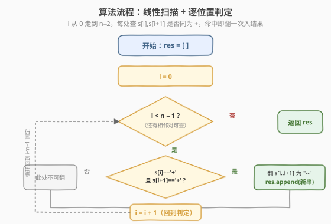
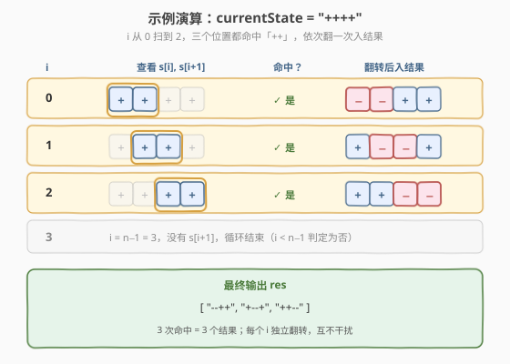

# 翻转游戏

- **题目名称**：翻转游戏
- **链接**：[293. 翻转游戏](https://leetcode.cn/problems/flip-game/)
- **难度**：简单
- **标签**：字符串、枚举、模拟

## 1. 题目概述

你和你的朋友玩翻转游戏：给定一个只包含 `'+'` 和 `'-'` 两种字符的字符串 `currentState`，双方轮流把**两个连续的 `"++"`** 翻成 `"--"`。无法做出合法翻转的人判负。**你先手**。

本题要求：写出函数，计算**一次合法移动后**字符串所有可能的状态。若没有合法移动，返回空列表。

**示例 1**：

```text
输入：currentState = "++++"
输出：["--++","+--+","++--"]
解释：有 3 处相邻 "++"，分别翻转得到上述三种状态。
```

**示例 2**：

```text
输入：currentState = "+"
输出：[]
解释：长度不足 2，无合法移动。
```

**示例 3**：

```text
输入：currentState = "+++"
输出：["--+","+--"]
解释：位置 [0,1] 与 [1,2] 均为 "++"，翻转后分别得到 "--+" 与 "+--"。
```

**约束条件**：

- `1 <= currentState.length <= 500`
- `currentState[i]` 为 `'+'` 或 `'-'`

> 💡 这道题是**字符串线性枚举**的招牌热身题：一次合法移动的本质就是「在某个位置把一对 `++` 改成 `--`」，于是答案数量恰好等于**相邻 `++` 出现的次数**。它是 [294. 翻转游戏 II](https://leetcode.cn/problems/flip-game-ii/)（判定先手必胜）的枚举子模块——294 的博弈 DP 正是基于本题枚举出的所有后继状态做 Minimax 递推。

---

## 2. 解题思路

### 2.1 暴力思路：枚举所有位置对

最直接的思路：对每个起始下标 $i \in [0, n-2]$，检查 `s[i]` 与 `s[i+1]` 是否同时为 `'+'`。若是，则构造一个新字符串，把这两个字符改成 `'-'`，加入结果列表。

```text
res = []
for i in 0 .. n-2:
    if s[i] == '+' and s[i+1] == '+':
        res.append(s[:i] + "--" + s[i+2:])
return res
```

这已经是**最优解**——每个位置只看一次，无法再省。题目本身没有更深的数学结构可挖，关键在于**边界处理**和**「位置可重叠」的细节**。

### 2.2 核心观察：每个 `++` 起点是独立的一步移动


两个要点：

- **逐位置独立判定**：下标 $i$ 处的 `++` 和 $i+1$ 处的 `++`（当三者连成 `+++` 时）是**两步不同的移动**，各自产生一个结果。因此循环步长恒为 $1$，**命中后不能跳过 $i+1$**。
- **结果天然有序且不重复**：因为不同 $i$ 翻转的位置不同，产出的字符串必然不同（被改动的那一对在原串中的下标集合不同）。所以**无需去重**，按 $i$ 从小到大收集即为题目期望顺序。

> ⚠️ 常见误区：有人以为翻转后要「跳两格」`i += 2` 避免重叠——那是**连续翻转多次**的逻辑。本题只翻**一次**，每个起点独立，必须步长 $1$。

### 2.3 算法流程图



流程很简洁：

1. 初始化空列表 `res`。
2. $i$ 从 $0$ 到 $n-2$：若 `s[i] == '+'` 且 `s[i+1] == '+'`，把 `s[:i] + "--" + s[i+2:]` 加入 `res`。
3. 返回 `res`。

### 2.4 示例演算



以 `currentState = "++++"`（$n=4$）为例，$i$ 取 $0,1,2,3$：

| $i$ | 查看 `s[i],s[i+1]` | 命中？ | 翻转后入结果 |
|-----|--------------------|--------|--------------|
| 0 | `+,+`（位置 0,1） | ✓ | `"--++"` |
| 1 | `+,+`（位置 1,2） | ✓ | `"+--+"` |
| 2 | `+,+`（位置 2,3） | ✓ | `"++--"` |
| 3 | 无 `s[4]`，循环终止 | — | — |

最终输出 `["--++", "+--+", "++--"]`，共 3 个结果，恰好等于相邻 `++` 出现次数。

再看 `currentState = "++-++"`（$n=5$）：$i=0$ 命中得 `"--+ +"`→`"--+-++"`，$i=3$ 命中得 `"++---"`，中间 $i=1,2$ 因 `+-`/`-+` 不命中而跳过，输出 `["--+-++", "++---"]`。

---

## 3. 参考代码

### C++

```cpp
// 翻转游戏.cpp —— 线性枚举每个相邻 "++"
// 编译: g++ -O2 -std=c++17 翻转游戏.cpp -o flipgame
class Solution {
  public:
    vector<string> generatePossibleNextMoves(string currentState) {
        vector<string> res;
        int n = currentState.size();
        for (int i = 0; i + 1 < n; ++i) {
            if (currentState[i] == '+' && currentState[i + 1] == '+') {
                string t = currentState;
                t[i] = t[i + 1] = '-';
                res.push_back(t);
            }
        }
        return res;
    }
};
```

### Python

```python
class Solution:
    def generatePossibleNextMoves(self, currentState: str) -> List[str]:
        res = []
        for i in range(len(currentState) - 1):
            if currentState[i] == '+' and currentState[i + 1] == '+':
                res.append(currentState[:i] + '--' + currentState[i + 2:])
        return res
```

> 💡 **Python 切片写法**：`s[:i] + '--' + s[i+2:]` 一行完成「前缀 + 翻转 + 后缀」拼接，无需显式 `list(s)` 转字符数组。C++ 中字符串可按下标直接改写，故先复制一份 `t` 再就地修改两位即可。

> ⚠️ Python 中 `range(len(s) - 1)` 当 `len(s) == 1` 时为 `range(0)`，自然跳过循环返回空列表，**无需单独判空**。C++ 的 `i + 1 < n` 在 `n <= 1` 时同样不进循环，边界天然安全。

---

## 4. 复杂度分析

| 维度 | 复杂度 | 说明 |
|------|--------|------|
| **时间复杂度** | $O(n^2)$ | 最坏情况（全 `+`）有 $n-1$ 次命中，每次构造长度 $n$ 的新串耗时 $O(n)$，合计 $O(n^2)$；判定本身为 $O(n)$ |
| **空间复杂度** | $O(n^2)$ | 最坏存放 $n-1$ 条长度为 $n$ 的结果，输出空间 $O(n^2)$；不计输出则 $O(1)$ 额外空间 |

> ⚠️ 时间复杂度看似 $O(n^2)$ 偏高，但 $n \le 500$ 时 $n^2 = 2.5 \times 10^5$，完全在限内。瓶颈在于「必须输出所有结果」，结果本身就有 $O(n^2)$ 规模，故该复杂度已是输出敏感意义上的最优。

---

## 5. 扩展：从枚举到博弈（294. 翻转游戏 II）

本题只要求「枚举一次移动的所有后继状态」，而 [294. 翻转游戏 II](https://leetcode.cn/problems/flip-game-ii/) 进一步问「**双方轮流翻，先手能否必胜**」。两者的关系是：

- **293 是 294 的状态转移函数**：`generatePossibleNextMoves(s)` 给出的就是当前局面 $s$ 的所有后继局面。
- **294 在此基础上做博弈 DP**：定义 `canWin(s)` 为「面对 $s$ 的先手能否必胜」，则

$$
\text{canWin}(s) = \bigvee_{t \in \text{next}(s)} \neg\, \text{canWin}(t)
$$

即「存在一步移动 $t$，使对手面对 $t$ 时必败」。这正是一般博弈 Minimax 的「能找到一个必败后继即获胜」判据。294 的难点在于用**记忆化搜索 + 状态压缩**把指数级递归压到可接受范围（$n \le 60$ 时平方分解 + 对称剪枝可过）。

> 💡 把 293 写成独立的 `next(s)` 函数后，294 的核心就只剩 `canWin` 递归 + `memo` 缓存——293 是 294 的「积木」。

---

## 6. 面试要点

1. **这道题有更优解吗？**

   - 没有。结果规模本身就是 $O(n)$ 条、每条 $O(n)$，构造输出至少 $O(n^2)$。线性扫描判定已是最优，无法低于结果规模。

2. **位置可以重叠吗？为什么步长是 1 不是 2？**

   - 可以重叠。当出现 `+++` 时，位置 $[0,1]$ 与 $[1,2]$ 都是合法的「一次翻转」，是两步**不同**的移动。
   - 步长 2 是「连续翻转多次直到无法再翻」的逻辑（如 294 的模拟），而本题只翻**一次**，每个起点独立，必须步长 1。

3. **结果需要去重或排序吗？**

   - 不需要。不同 $i$ 翻转的位置集合不同，产出的字符串必然不同；按 $i$ 从小到大收集天然有序，正是题目期望的输出顺序。

4. **边界情况有哪些？**

   - $n = 1$（无相邻对）→ 空列表；`range(n-1)` 与 `i+1 < n` 都自然跳过，无需特判。
   - 全 `-` 或无 `++` → 空列表。
   - 全 `+` → $n-1$ 个结果，是命中最多的情形，用于压力测试。

5. **和 294 翻转游戏 II 的关系？**

   - 293 枚举后继状态，是 294 博弈 DP 的状态转移函数。294 用 `canWin(s) = ∃ t∈next(s), ¬canWin(t)` 判定先手必胜，配合记忆化搜索压指数。

> 💡 **一句话总结**：翻转游戏就是「线性扫描每个相邻 `++`，翻一次入结果」——步长 1 不跳格，每个起点独立一步移动，结果天然有序不重复，$O(n^2)$ 是输出敏感意义下的最优。

---

## 7. 同类练习题

- [294. 翻转游戏 II](https://leetcode.cn/problems/flip-game-ii/)：本题的博弈升级版——枚举后继状态后做 Minimax 记忆化搜索判定先手必胜，293 是其状态转移「积木」
- [292. Nim 游戏](../0201-0300/292_Nim游戏.md)（[题解](../0201-0300/292_Nim游戏.md)）：同区间的相邻博弈题，但 Nim 是「数学找规律」一招制胜，对比本题「枚举所有后继」的纯模拟
- [22. 括号生成](../0001-0100/22_括号生成.md)（[题解](../0001-0100/22_括号生成.md)）：同样是「枚举所有合法结果」的回溯题，对比本题的「线性枚举无需回溯」
- [290. 单词规律](../0201-0300/290_单词规律.md)（[题解](../0201-0300/290_单词规律.md)）：字符串扫描 + 逐位匹配判定，同属字符串线性处理家族
