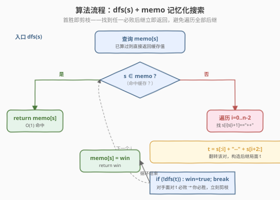
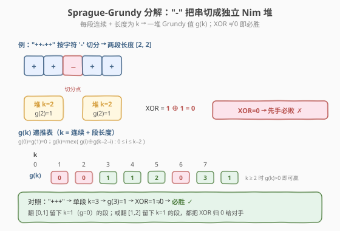

# 翻转游戏 II

- **题目名称**：翻转游戏 II
- **链接**：[294. 翻转游戏 II](https://leetcode.cn/problems/flip-game-ii/)
- **难度**：中等
- **标签**：记忆化搜索、博弈、Minimax、回溯

## 1. 题目概述

你和你的朋友玩翻转游戏：给定一个只包含 `'+'` 和 `'-'` 两种字符的字符串 `currentState`，双方轮流把**两个连续的 `"++"`** 翻成 `"--"`。**无法做出合法翻转的人判负**。**你先手**，双方都采取**最优策略**。判断你能否必胜。

**示例 1**：

```text
输入：currentState = "++++"
输出：true
解释：先手翻位置 [1,2] 得到 "+--+"，对手面对 "+--+" 已无 "++" 可翻，先手必胜。
```

**示例 2**：

```text
输入：currentState = "+"
输出：false
解释：长度不足 2，开局即无合法移动，先手判负。
```

**示例 3**：

```text
输入：currentState = "++-++"
输出：false
解释：先手无论翻左段还是右段，都留下一处 "++" 给对手翻掉，对手翻完后先手无路可走，先手必败。
```

**约束条件**：

- `1 <= currentState.length <= 60`
- `currentState[i]` 为 `'+'` 或 `'-'`

> 💡 这道题是 [293. 翻转游戏](https://leetcode.cn/problems/flip-game/)（[题解](../0201-0300/293_翻转游戏.md)）的**博弈升级版**：293 只要求枚举「一次移动后的所有后继状态」，本题则进一步问「双方轮流翻，先手能否必胜」。293 的 `generatePossibleNextMoves(s)` 正是本题的状态转移函数 `next(s)`——本题在其之上做 **Minimax 记忆化搜索**：`canWin(s) = ∃ t∈next(s), ¬canWin(t)`。它与 [292. Nim 游戏](../0201-0300/292_Nim游戏.md)（数学找规律的博弈）、[877. 石子游戏](../0801-0900/877_石子游戏.md)（区间 DP 博弈）同属「先手必胜判定」家族，但本题状态空间大、无解析周期，是**记忆化搜索**的招牌题。

---

## 2. 解题思路

### 2.1 暴力思路：纯回溯枚举所有对局

最朴素的思路：对当前局面 `s`，枚举每一个可翻的 `"++"`，翻转得到后继 `t`，然后**递归判断对手面对 `t` 能否必胜**。若存在一个 `t` 使对手必败（`!canWin(t)`），则当前先手必胜。

```text
canWin(s):
    for i in 0..n-2:
        if s[i]=='+' and s[i+1]=='+':
            t = s[:i] + "--" + s[i+2:]
            if not canWin(t):        # 对手面对 t 必败
                return true          # 当前先手必胜
    return false                     # 所有后继都让对手必胜 → 必败
```

这就是 **Minimax** 的「能找到一个必败后继即获胜」判据。问题在于：同一局面 `s` 会在不同对局路径上被**反复递归**，纯回溯的时间是**指数级**的——`n=60` 全 `'+'` 时根本跑不完。必须加**记忆化**把重复子问题的答案缓存起来。

### 2.2 核心观察：Minimax + 记忆化


两个要点：

- **状态判据（Minimax）**：定义 `canWin(s)` 为「面对 `s` 的先手能否必胜」。
  - **必胜态 W**：存在至少一个后继 `t` 是必败态 L（「能把对手送进 L」即胜）。
  - **必败态 L**：所有后继都是必胜态 W（怎么走对手都能赢），或无后继可走（无 `"++"` 即开局判负）。
  
  即 $\text{canWin}(s) = \bigvee_{t \in \text{next}(s)} \neg\, \text{canWin}(t)$。这与 [292 Nim 游戏](../0201-0300/292_Nim游戏.md) 的转移 $\text{dp}[i] = \bigvee_{j=1}^{3} \neg\,\text{dp}[i-j]$ 同构，只是「后继集合」从「拿 $j$ 颗后的剩余数」换成了「翻转某对 `++` 后的字符串」。

- **记忆化剪枝**：用一个哈希表 `memo` 把每个**局面字符串** `s` 的 `canWin(s)` 缓存。同一 `s` 第二次到达时直接 $O(1)$ 返回。配合「**首胜即剪枝**」——找到任一必败后继立即 `break` 返回 `true`，不必遍历全部后继——实测 $n \le 60$ 在 LeetCode 时限内可过。

> ⚠️ **为何不直接 DP？** Nim 游戏的状态是一维整数 `i`（剩余石头数），天然可顺序 DP；本题的状态是**字符串**，没有线性的「下一步」关系，无法用一维数组按序递推。记忆化搜索是处理这类「状态空间为字符串」博弈的标准工具——本质上是**自顶向下带缓存的 DP**。

### 2.3 算法流程图



流程要点：

1. **入口** `dfs(s)`：先查 `memo[s]`，命中则 $O(1)$ 返回缓存值。
2. **遍历** $i$ 从 $0$ 到 $n-2$：若 `s[i]==s[i+1]=='+'`，构造后继 `t = s[:i] + "--" + s[i+2:]`。
3. **递归判定**：若 `!dfs(t)`（对手面对 `t` 必败），则 `win = true` 并 `break`（首胜即剪枝）。
4. **存缓存**：`memo[s] = win`，返回 `win`。

### 2.4 示例演算


**`s = "++++"`（必胜 true）**：枚举三步移动——

| 翻转位置 | 后继 `t` | `canWin(t)`？ | 说明 |
|----------|----------|---------------|------|
| `[0,1]` | `"--++"` | **true**（对手胜） | 对手翻 `[2,3]→"----"`，你再无路 |
| `[1,2]` | `"+--+"` | **false**（对手败） | `" +--+"` 无 `"++"` 可翻，对手开局判负 |
| `[2,3]` | `"++--"` | **true**（对手胜） | 对称于 `[0,1]` |

存在一个 L 后继 `"+--+"` → `canWin("++++") = true`，必胜手即翻 `[1,2]`。

**`s = "++-++"`（必败 false）**：只有两步移动——

| 翻转位置 | 后继 `t` | `canWin(t)`？ | 说明 |
|----------|----------|---------------|------|
| `[0,1]` | `"--+-++"` | **true** | 对手翻 `[4,5]→"--+---"`，你无路 |
| `[3,4]` | `"++---"` | **true** | 对手翻 `[0,1]→"-----"`，你无路 |

两个后继都是 W（对手胜）→ `canWin("++-++") = false`，先手必败。直观理解：两段等长 `++` 形成**对称镜像**，后手只需「镜像复制」先手的操作，先手永远先无路可走（见第 5 节 SG 分解的更深层解释）。

---

## 3. 参考代码

### C++

```cpp
// 翻转游戏 II.cpp —— Minimax + 记忆化搜索（字符串状态）
// 编译: g++ -O2 -std=c++17 翻转游戏II.cpp -o flipgame2
class Solution {
  public:
    bool canWin(string currentState) {
        unordered_map<string, bool> memo;
        return dfs(currentState, memo);
    }
  private:
    bool dfs(const string& s, unordered_map<string, bool>& memo) {
        auto it = memo.find(s);
                if (it != memo.end()) return it->second;          // 命中缓存
        bool win = false;
        int n = s.size();
        for (int i = 0; i + 1 < n; ++i) {
            if (s[i] == '+' && s[i + 1] == '+') {
                string t = s;
                t[i] = t[i + 1] = '-';                    // 翻转该对
                if (!dfs(t, memo)) {                      // 对手面对 t 必败
                    win = true;
                    break;                                // 首胜即剪枝
                }
            }
        }
        memo[s] = win;
        return win;
    }
};
```

### Python

```python
class Solution:
    def canWin(self, currentState: str) -> bool:
        memo: dict[str, bool] = {}

        def dfs(s: str) -> bool:
            if s in memo:
                return memo[s]
            win = False
            for i in range(len(s) - 1):
                if s[i] == '+' and s[i + 1] == '+':
                    t = s[:i] + '--' + s[i + 2:]          # 翻转该对
                    if not dfs(t):                        # 对手面对 t 必败
                        win = True
                        break                              # 首胜即剪枝
            memo[s] = win
            return win

        return dfs(currentState)
```

> 💡 **状态转移函数复用**：把 293 的 `generatePossibleNextMoves(s)` 内联进循环即可——`t = s[:i] + '--' + s[i+2:]` 正是 293 里枚举出的后继串。可以说 **293 是 294 的「积木」**：293 负责「造后继」，294 负责「在后继上做 Minimax」。

> ⚠️ **Python `dict[str, bool]` 类型注解**需 Python 3.9+；旧版本可去掉注解或用 `Dict[str, bool]`（`from typing import Dict`）。C++ 中 `unordered_map<string, bool>` 的键是字符串拷贝，$n \le 60$ 时单次哈希 $O(n)$，整体可接受。

---

## 4. 复杂度分析

| 维度 | 记忆化搜索 | 纯回溯（无 memo） | 说明 |
|------|-----------|-------------------|------|
| **时间复杂度** | $O(S \cdot n^2)$ | $O(2^n)$ 指数级 | $S$ 为可达的不同局面数；每状态 $O(n)$ 找 `++` × $O(n)$ 构造后继串，$n \le 60$ 实测可过 |
| **空间复杂度** | $O(S \cdot n)$ | $O(n)$ 递归栈 | `memo` 存 $S$ 条长度 $n$ 的字符串；递归深度最深 $O(n)$ |

> ⚠️ **$S$ 的规模**：每个局面是长度 $n$ 的 `'+'/'-'` 串，理论上限 $2^n$，但**实际可达**的局面子集远小于此（翻转不可逆、对称剪枝、首胜即返回共同压缩搜索空间）。最坏情况（全 `'+'`）是测试中状态数最多的输入，记忆化后 $n=60$ 仍能在 LeetCode 时限内通过。若追求理论最坏 $O(2^n)$ 上界更紧的解法，可用第 5 节的 **Sprague-Grundy 分解**把状态压成段长，$O(n^2)$ 预处理 $g$ 表后 $O(n)$ 查询。

> 💡 **为何不滚动到 $O(1)$ 空间？** Nim 游戏能从转移式里发现周期 $4$ 化为 $O(1)$，但本题状态是字符串、无解析周期（$g(k)$ 序列虽最终周期化但周期长 $34$、不适合面试手推），故记忆化是「面试可写、可过」的标准解法。

---

## 5. 扩展：Sprague-Grundy 分解（O(n) 最优解）

### 5.1 关键观察：「`-`」是不可逆的分割符

翻转 `"++"`→`"--"` 是**不可逆**的：一旦某位置变成 `'-'`，再也不会变回 `'+'`。于是 `'-'` 字符就像一道道**永久隔墙**，把原串切成若干段**独立的连续 `'+'` 段**。每段的博弈互不影响——在一段里翻一对 `++`，只影响这一段本身（被进一步切成两个更短的子段），不会触碰其它段。

这正是一个 **Nim 和**结构：每段长度 $k$ 对应一堆大小为 $g(k)$ 的 Nim 堆，整个局面的胜负由各段 $g(k)$ 的**异或和**决定。



### 5.2 Grundy 值递推

设 $g(k)$ 为长度 $k$ 的连续 `'+'` 段的 Grundy 值（即「这一段单独存在时，等价的 Nim 堆大小」）：

- $g(0) = 0$（空段，无操作）
- $g(1) = 0$（单个 `+`，无 `++` 可翻）
- $g(k) = \operatorname{mex}\{\, g(i) \oplus g(k-2-i) \mid 0 \le i \le k-2 \,\}$，$k \ge 2$

其中 $i$ 表示「在第 $i, i+1$ 位翻 `++`」，翻转后该段被切成左段长度 $i$ 与右段长度 $k-2-i$ 两段**独立**子段，其组合 Grundy 值为两子段 $g$ 的异或；$\operatorname{mex}$ 取所有后继异或值中「未出现的最小非负整数」。

前若干值手推如下：

| $k$ | 0 | 1 | 2 | 3 | 4 | 5 | 6 | 7 |
|-----|---|---|---|---|---|---|---|---|
| $g(k)$ | 0 | 0 | 1 | 1 | 2 | 0 | 3 | 1 |

**胜负判据**：把 `currentState` 按 `'-'` 切分得到各段长度 $k_1, k_2, \dots, k_m$，则

$$
\text{先手必胜} \iff g(k_1) \oplus g(k_2) \oplus \cdots \oplus g(k_m) \ne 0
$$

这正是经典 **Sprague-Grundy 定理**在本题的直接应用。验证示例 3：`"++-++"` 切成 $[2,2]$，$g(2) \oplus g(2) = 1 \oplus 1 = 0$ → 必败，与第 2.4 节演算一致。

### 5.3 实现与复杂度

```python
class Solution:
    def canWin(self, currentState: str) -> bool:
        n = len(currentState)
        g = [0] * (n + 1)                       # g[0]=g[1]=0
        for k in range(2, n + 1):
            seen = set()
            for i in range(k - 1):              # 翻 i,i+1 → 左段 i，右段 k-2-i
                seen.add(g[i] ^ g[k - 2 - i])
            mex = 0
            while mex in seen:
                mex += 1
            g[k] = mex
        xor = 0
        for seg in currentState.split('-'):     # 按 '-' 切段
            xor ^= g[len(seg)]
        return xor != 0
```

- 预处理 $g$ 表 $O(n^2)$（每个 $k$ 枚举 $k-1$ 种翻法），查询 $O(n)$（切段 + 异或）。
- $n \le 60$ 时 $g$ 表极小；若 $n$ 放大到 $10^5$，可利用「$g(k)$ 自某项起周期为 $34$」的已知结论把预处理压到 $O(\text{period})$（该周期结论源自对 $g$ 序列的计算观察，面试一般不要求，了解即可）。

> 💡 **SG 法与记忆化法的关系**：记忆化在「字符串状态」上做缓存，$S$ 个状态各 $O(n^2)$；SG 法把状态**压缩成段长**，消除了「段排列顺序」这一冗余维度（不同排列但段长多重集相同的局面在 SG 下等价），从而把指数级状态数降到 $O(n)$ 段长。SG 法是记忆化法的「降维优化」。

---

## 6. 面试要点

1. **Minimax 的状态判据怎么写？**

   - 必胜态 W：存在至少一个后继 $t$ 是必败态 L，即 $\text{canWin}(s) = \exists\, t \in \text{next}(s),\, \neg\,\text{canWin}(t)$。
   - 必败态 L：所有后继都是必胜态 W，或无后继可走（开局即无 `++`）。

2. **为什么必须加记忆化？不加会怎样？**

   - 同一局面 `s` 会在不同对局路径上被反复递归到，纯回溯是 $O(2^n)$ 指数级。
   - 加 `memo` 缓存后，每个不同局面只算一次，配合「首胜即 `break`」剪枝，$n \le 60$ 可过。

3. **记忆化的键为什么是字符串而不是别的？**

   - 局面的完整状态就是 `'+'/'-'` 串本身，字符串天然可哈希、可作键。
   - 进阶可把串按 `'-'` 切段、只记段长多重集（SG 法），但面试中字符串键最直观、最不易出错。

4. **`"++-++"` 为什么先手必败？**

   - 两段等长 `++` 形成**对称镜像**：先手翻任一段，对手只需翻另一段等长处，先手永远先无路可走。
   - 用 SG 解释：$g(2) \oplus g(2) = 1 \oplus 1 = 0$，异或和为零即必败。

5. **和 293 翻转游戏、292 Nim 游戏的关系？**

   - **293 是 294 的「状态转移积木」**：293 的 `generatePossibleNextMoves(s)` 给出 `next(s)`，294 在其上做 Minimax 记忆化。
   - **292 同为博弈但能数学化**：292 的状态是一维剩余数，可手推出周期 4 化为 $O(1)$；294 状态是字符串、无简短周期，只能记忆化或 SG 分解。一句话：**能找周期就数学化，找不到就上记忆化/SG**。

> 💡 **一句话总结**：翻转游戏 II 是「Minimax + 记忆化搜索」的招牌——`canWin(s) = ∃ t∈next(s), ¬canWin(t)`，用 `memo` 缓存字符串状态、首胜即剪枝即可 $O(S·n²)$ 过 $n≤60$；进阶用 Sprague-Grundy 按 `'-'` 切段降维到 $O(n²)$ 预处理 + $O(n)$ 查询。

---

## 7. 同类练习题

- [293. 翻转游戏](https://leetcode.cn/problems/flip-game/)（[题解](../0201-0300/293_翻转游戏.md)）：本题的枚举热身版——`generatePossibleNextMoves(s)` 正是本题的状态转移函数 `next(s)`，是 294 的「积木」
- [292. Nim 游戏](https://leetcode.cn/problems/nim-game/)（[题解](../0201-0300/292_Nim游戏.md)）：同区间博弈题，转移式同构 `dp[i]=∨¬dp[i-j]`，但 Nim 状态是一维数可手推周期 4 化为 $O(1)$，对照本题「状态是字符串、无周期、须记忆化」
- [877. 石子游戏](https://leetcode.cn/problems/stone-game/)（[题解](../0801-0900/877_石子游戏.md)）：博弈型区间 DP + Minimax，状态依赖两端区间无法解析化，与本题同属「无简短规律的博弈 DP」家族
- [464. 我能赢吗](https://leetcode.cn/problems/can-i-win/)：两人轮流选数字累加先到目标者胜，同样是「Minimax + 状态压缩记忆化」，状态用 bitmask 而非字符串，对照本题的记忆化键选择
