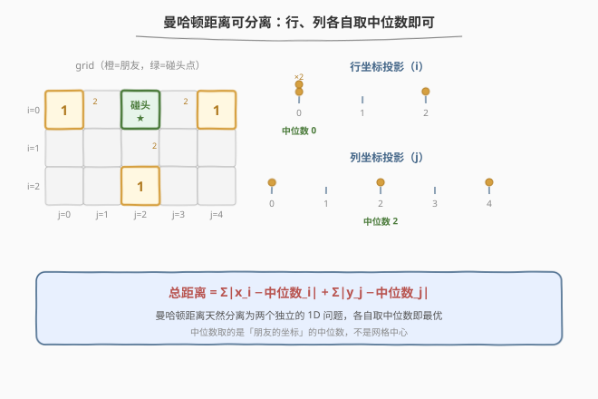
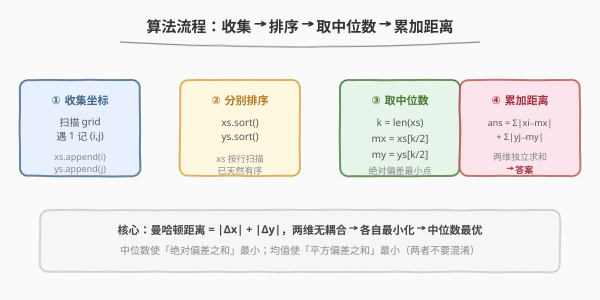
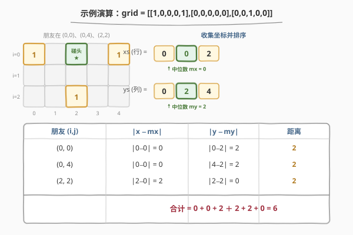

# 最佳碰头地点

- **题目名称**：最佳碰头地点
- **链接**：[296. 最佳碰头地点](https://leetcode.cn/problems/best-meeting-point/)
- **难度**：困难
- **标签**：数组、数学、中位数、曼哈顿距离、分治

## 1. 题目概述

给定一个 `m x n` 的二进制网格 `grid`，其中 `1` 表示一位朋友的家。朋友们要选一个**碰头点**（网格中任意一格，不必是某个朋友的家），使所有朋友到该点的**曼哈顿距离之和最小**。返回这个最小总距离。

曼哈顿距离定义为：

$$\text{distance}((x_1,y_1),(x_2,y_2)) = |x_1-x_2| + |y_1-y_2|$$

**示例 1**：

```text
输入：grid = [[1,0,0,0,1],[0,0,0,0,0],[0,0,1,0,0]]
输出：6
解释：朋友在 (0,0)、(0,4)、(2,2)。选碰头点 (0,2)，
      距离 = 2 + 2 + 2 = 6。
```

```text
1  0  0  0  1
0  0  0  0  0
0  0  1  0  0
```

**约束条件**：

- `m == grid.length`
- `n == grid[i].length`
- `1 <= m, n <= 200`
- `grid[i][j]` 为 `0` 或 `1`
- 至少有一个 `1`

---

## 2. 解题思路

### 2.1 暴力思路：枚举每个格子

枚举网格中每个格子作为碰头点，对每个点累加所有朋友到它的曼哈顿距离，取最小值。复杂度 $O((mn)^2)$：$200 \times 200 = 4 \times 10^4$ 个候选格 × 最多 $4 \times 10^4$ 个朋友 $\approx 1.6 \times 10^9$，会 TLE。

### 2.2 核心观察：曼哈顿距离可分离 + 中位数最优



**洞察 1：曼哈顿距离可分离**。由于 $|x_1-x_2| + |y_1-y_2|$ 中行、列分量相加且彼此无耦合，目标函数可拆成两个独立子问题：

$$\sum_i \bigl(|x_i - r| + |y_i - c|\bigr) = \sum_i |x_i - r| + \sum_i |y_i - c|$$

总距离 = 行方向距离之和 + 列方向距离之和，两者可**分别**最小化再相加。

**洞察 2：使绝对偏差之和最小的点就是中位数**。对于一维点集 $\{x_i\}$，使 $\sum_i |x_i - r|$ 最小的 $r$ 恰是 $\{x_i\}$ 的**中位数**。

> 💡 **为什么是中位数？** 中位数把数据分成数量相等的两半。若 $r$ 从中位数向右移动 $\delta$，右侧每个点的距离减少 $\delta$、左侧每个点的距离增加 $\delta$；当左右数量相等（或左侧不少于右侧）时净变化 $\ge 0$，所以任何偏离都不会让总和变小。这是「**绝对偏差之和最小化 $\Rightarrow$ 中位数**」的经典结论。
>
> ⚠️ 不要和「平方偏差之和最小化 $\Rightarrow$ 均值」混淆：均值最小化方差（$\sum (x_i-\bar{x})^2$），中位数最小化绝对偏差（$\sum |x_i - m|$）。本题是绝对偏差，故用中位数。

> 💡 **承接 [295. 数据流的中位数](../0201-0300/295_数据流的中位数.md)**：295 用双堆**动态维护**中位数以支持 $O(\log N)$ 插入 + $O(1)$ 查询「中间值」；本题利用中位数的**最优化性质**——它是使绝对偏差之和最小的点。两者是中位数这一概念的两面：一个是「如何维护/查询」，一个是「为什么有用」。

### 2.3 算法流程图



### 2.4 示例演算



以 `grid = [[1,0,0,0,1],[0,0,0,0,0],[0,0,1,0,0]]` 为例，朋友在 $(0,0)$、$(0,4)$、$(2,2)$：

1. **收集并排序坐标**：`xs = [0, 0, 2]`（行，已有序）、`ys = [0, 2, 4]`（列，排序后）。
2. **取中位数**：$k=3$，下标 $k//2 = 1$，故 $m_x = xs[1] = 0$、$m_y = ys[1] = 2$，碰头点 $(0,2)$。
3. **累加距离**：

| 朋友 $(i,j)$ | $\|x - m_x\|$ | $\|y - m_y\|$ | 距离 |
|---|---|---|---|
| $(0,0)$ | $\|0-0\|=0$ | $\|0-2\|=2$ | 2 |
| $(0,4)$ | $\|0-0\|=0$ | $\|4-2\|=2$ | 2 |
| $(2,2)$ | $\|2-0\|=2$ | $\|2-2\|=0$ | 2 |

合计 $= (0+0+2) + (2+2+0) = 6$。

> 💡 注意 $m_x = 0$ 并非网格「中心」，而是**朋友行坐标**的中位数——两人在第 0 行、一人在第 2 行，中位数落在 0。这正是「碰头点跟着人走，而非跟着网格走」的体现。

---

## 3. 参考代码

### C++

```cpp
class Solution {
public:
    int minTotalDistance(vector<vector<int>>& grid) {
        vector<int> xs, ys;
        int m = grid.size(), n = grid[0].size();
        for (int i = 0; i < m; ++i)
            for (int j = 0; j < n; ++j)
                if (grid[i][j] == 1) {
                    xs.push_back(i);   // i 递增，xs 天然有序
                    ys.push_back(j);
                }
        sort(ys.begin(), ys.end());     // xs 已有序，仅 ys 需排序
        int mx = xs[xs.size() / 2];
        int my = ys[ys.size() / 2];
        int ans = 0;
        for (int x : xs) ans += abs(x - mx);
        for (int y : ys) ans += abs(y - my);
        return ans;
    }
};
```

### Python

```python
class Solution:
    def minTotalDistance(self, grid: List[List[int]]) -> int:
        xs, ys = [], []
        for i in range(len(grid)):
            for j in range(len(grid[0])):
                if grid[i][j] == 1:
                    xs.append(i)        # i 递增，xs 天然有序
                    ys.append(j)
        xs.sort()
        ys.sort()
        mx, my = xs[len(xs) // 2], ys[len(ys) // 2]
        return sum(abs(x - mx) for x in xs) + sum(abs(y - my) for y in ys)
```

> 💡 Python 版对 `xs` 也调用 `sort()` 保持代码对称，虽非必要但无害（`xs` 已有序，排序为线性扫描）。C++ 版省去对 `xs` 的排序以体现「行扫描天然有序」这一观察。取中位数用 `len // 2`（下中位数），偶数个点时取上、下中位数结果相同。

---

## 4. 复杂度分析

| 维度 | 复杂度 | 说明 |
|------|--------|------|
| 时间 | $O(mn + k \log k)$ | 扫描网格收集坐标 $O(mn)$；排序 $ys$ 为 $O(k \log k)$，$k$ 为朋友数；累加 $O(k)$。最坏 $k = mn$ 即 $O(mn \log(mn))$ |
| 空间 | $O(k)$ | 存放 $k$ 个朋友的行、列坐标 |

> 💡 $k$ 为网格中 `1` 的个数，$k \le mn$。可优化到 $O(mn)$：见第 5 节。

---

## 5. 扩展：$O(mn)$ 做法 + 偶数个点时的取值

**$O(mn)$ 优化**：行坐标按行扫描天然有序，**列坐标按列扫描**也天然有序——只需用两次扫描分别收集 `xs`（按 `i` 递增）与 `ys`（按 `j` 递增），即可完全避免排序，整体 $O(mn)$：

```cpp
// 按列扫描收集 ys，天然按 j 递增
for (int j = 0; j < n; ++j)
    for (int i = 0; i < m; ++i)
        if (grid[i][j] == 1) ys.push_back(j);
```

**偶数个点时为何任取一中间值都最优**：设 $k$ 为偶数，下中位数 $m_L$ 与上中位数 $m_R$ 之间的任意整数 $r$ 都使 $\sum |x_i - r|$ 取到同一最小值。因为这段区间内每侧点的「拉扯」恰好平衡，移动不会改变总和。所以代码里 `len // 2`（下中位数）与 `len // 2 - 1` 都正确。

> 💡 **若题目要求碰头点必须是某个朋友的家**：中位数点本身就是数据点（奇数个时必然命中；偶数个时 $[m_L, m_R]$ 之间至少含一个数据点），仍取中位数即可，结论不变。

---

## 6. 面试要点

1. **为什么曼哈顿距离可以分离？**

   - 因为 $|x_1-x_2|+|y_1-y_2|$ 中行、列分量相加且无耦合，目标函数可拆成两个独立子问题分别求最小，再相加。换成欧氏距离 $\sqrt{(x_1-x_2)^2+(y_1-y_2)^2}$ 就**不能**分离了。

2. **为什么中位数使绝对偏差之和最小？**

   - 中位数两侧点数相等（或左不少于右）；偏离中位数时一侧受益、一侧受损，因数量相等净变化非负。对比：均值最小化**平方**偏差之和（方差），中位数最小化**绝对**偏差之和——两者适用场景不同，别混淆。

3. **偶数个点时中位数怎么取？**

   - 取下中位数或上中位数都得到相同的最小总距离；两中位数之间的任意整数点都最优，因为该区间内两侧拉扯平衡。

4. **和 295 双堆求中位数是什么关系？**

   - 295 用双堆**动态维护**中位数以支持流式插入 + $O(1)$ 查询；本题利用中位数的**最优化性质**（使绝对偏差之和最小）。两者是中位数应用的两面：一个回答「如何维护/查询」，一个回答「为什么这样选最优」。

5. **能否做到 $O(mn)$？**

   - 可以。行扫描得有序 `xs`，列扫描得有序 `ys`，避免排序即 $O(mn)$。空间也可压到 $O(1)$（边扫描边用双指针配对统计距离，但代码更复杂，面试中 $O(k)$ 空间已足够）。

---

## 7. 同类练习题

- [295. 数据流的中位数](https://leetcode.cn/problems/find-median-from-data-stream/)（[题解](../0201-0300/295_数据流的中位数.md)）：中位数的动态维护，与本题共同构成中位数应用的两面
- [462. 最小操作次数使数组元素相等 II](https://leetcode.cn/problems/minimum-moves-to-equal-array-elements-ii/)：中位数最小化绝对偏差之和的纯一维数组版，骨架完全一致
- [317. 离建筑物最近的距离](https://leetcode.cn/problems/shortest-distance-from-all-buildings/)：碰头点变体——碰头点必须是空地且需 BFS 累加可达距离，加上了可达性约束
- [2033. 最小操作次数使网格图变为同一值](https://leetcode.cn/problems/minimum-operations-to-make-a-univalue-grid/)：网格 + 中位数 + 操作次数，曼哈顿可分离思想在「使网格同值」上的应用
