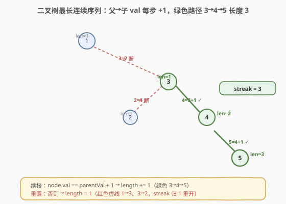
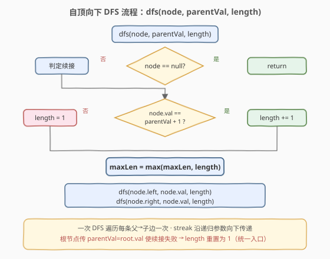
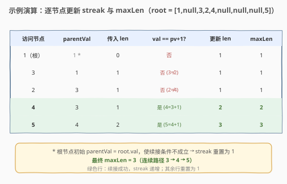

# 二叉树最长连续序列

- **题目名称**：二叉树最长连续序列
- **链接**：[298. 二叉树最长连续序列](https://leetcode.cn/problems/binary-tree-longest-consecutive-sequence/)
- **难度**：中等
- **标签**：树、二叉树、深度优先搜索

## 1. 题目概述

给定一棵二叉树的根节点 `root`，返回树中**最长连续序列路径**的长度。

> **连续序列路径**：沿**父→子**方向连接的路径，路径上节点的值**严格递增 1**（即每个节点的值等于父节点值 + 1）。

路径方向只能从父到子（自顶向下），不需要经过根。

**示例 1**：

```text
输入：root = [1,null,3,2,4,null,null,null,5]
输出：3

       1
        \
         3
        / \
       2   4
            \
             5
```

最长连续序列为 `3 → 4 → 5`（`4 == 3+1`，`5 == 4+1`），长度为 3。`1 → 3` 不连续（`3 != 1+1`），`3 → 2` 也不连续（`2 != 3+1`）。

**示例 2**：

```text
输入：root = [2,null,3,null,4,null,5,null,6]
输出：5

   2
    \
     3
      \
       4
        \
         5
          \
           6
```

最长连续序列为 `2 → 3 → 4 → 5 → 6`，长度为 5。

**约束条件**：

- 树中节点数目范围 `[0, 2 * 10^4]`
- `-3 * 10^4 <= Node.val <= 3 * 10^4`

> 💡 本题是「**自顶向下 DFS + 参数携带状态**」的招牌题。连续性沿父→子方向传递，天然适合把「父节点值 + 当前 streak 长度」作为递归参数向下传，每走一步判定续接或重置。

---

## 2. 解题思路

### 2.1 暴力思路：每个节点重新探索

最直观的做法：以每个节点为起点，向下 DFS 探索所有分支，数出从该节点出发的最长 +1 链。遍历所有 $n$ 个节点，每次探索最坏 $O(n)$（退化链），总时间 $O(n^2)$，空间 $O(h)$ 递归栈。

问题在于**重复探索**：从父节点出发探索时已经走过子链，子节点作为起点又重新走一遍。父→子的连续关系是**沿路径连续传递**的，根本没有必要在每个节点重新开始。

### 2.2 核心观察：自顶向下传 streak



**关键洞察**：连续 streak 是**沿父→子边逐段传递**的状态——

> 走到节点 `node` 时，若 `node.val == parentVal + 1`，则 streak 在父节点 streak 基础上 **+1**；否则当前 streak **重置为 1**（以 `node` 自身为新序列起点）。

于是只需**一次 DFS**，把 `(parentVal, length)` 作为参数向下传：

- **续接**：`node.val == parentVal + 1` → `length += 1`；
- **重置**：否则 → `length = 1`；
- 每个节点用更新后的 `length` 更新全局 `maxLen`，再把 `(node.val, length)` 传给左右孩子。

每条父→子边只走一次，$O(n)$ 完成。

> ⚠️ **方向是父→子（自顶向下）**：题目要求严格递增 +1，路径只能从父走到子。因此 streak 状态**从父传给子**最自然——这与 [250. 统计同值子树](../0201-0300/250_统计同值子树.md)「自底向上传递子树结论」方向相反，是树形 DFS 的另一类范式（详见第 5 节对照）。

### 2.3 算法流程图



**DFS 完整步骤**（函数 `dfs(node, parentVal, length)`）：

1. **空节点**：直接返回；
2. **判定续接**：若 `node.val == parentVal + 1` → `length += 1`；否则 → `length = 1`；
3. **更新最值**：`maxLen = max(maxLen, length)`；
4. **向下递归**：`dfs(node.left, node.val, length)` 与 `dfs(node.right, node.val, length)`。

> 💡 **根节点的初始调用**：根无父节点，传 `parentVal = root.val`（使续接条件必然失败）与 `length = 0`，根节点自然得到 `length = 1`。也可特判根单独调用，但统一入口更简洁。

### 2.4 示例演算

以 `root = [1,null,3,2,4,null,null,null,5]` 为例，DFS 访问顺序（先左后右，左子为空即跳过）：



| 访问节点 | parentVal | 传入 length | val == pv+1? | 更新 length | maxLen |
|---------|-----------|------------|--------------|------------|--------|
| 1（根） | 1\* | 0 | 否（1≠2） | 1 | 1 |
| 3 | 1 | 1 | 否（3≠2） | 1 | 1 |
| 2 | 3 | 1 | 否（2≠4） | 1 | 1 |
| 4 | 3 | 1 | 是（4=3+1） | 2 | 2 |
| 5 | 4 | 2 | 是（5=4+1） | 3 | 3 |

\* 根节点初始 `parentVal` 设为 `root.val`，使续接条件不成立，streak 重置为 1。

最终 `maxLen = 3`（路径 `3 → 4 → 5`）。注意 `1 → 3` 虽是父子边，但 `3 != 1+1`，streak 在 3 处重置；直到 `3 → 4` 才重新续接成 `length = 2`，`4 → 5` 续接到 `length = 3`。

> 💡 **观察重置点的「断流」**：streak 不是只增不减——遇到不连续的父子边就立刻归 1，从当前节点重新累积。这正是「参数携带状态」相比「全局单调累加」的灵活性：每条边独立判定续接与否。

---

## 3. 参考代码

### C++

```cpp
class Solution {
  public:
    int maxLen = 0;

    int longestConsecutive(TreeNode* root) {
        if (!root) return 0;
        dfs(root, root->val, 0);      // 根无父：parentVal=root.val 使续接失败，length=0→1
        return maxLen;
    }

    void dfs(TreeNode* node, int parentVal, int length) {
        if (!node) return;
        if (node->val == parentVal + 1) length += 1;   // 续接
        else length = 1;                                // 重置
        maxLen = max(maxLen, length);
        dfs(node->left, node->val, length);
        dfs(node->right, node->val, length);
    }
};
```

### Python

```python
class Solution:
    def longestConsecutive(self, root: Optional[TreeNode]) -> int:
        max_len = 0

        def dfs(node: Optional[TreeNode], parent_val: int, length: int) -> None:
            nonlocal max_len
            if not node:
                return
            if node.val == parent_val + 1:      # 续接
                length += 1
            else:                                # 重置
                length = 1
            max_len = max(max_len, length)
            dfs(node.left, node.val, length)
            dfs(node.right, node.val, length)

        if not root:
            return 0
        dfs(root, root.val, 0)
        return max_len
```

> 💡 两版等价。`dfs` 不返回值——结果通过 `maxLen` 副作用记录，状态通过参数向下传递。这种「**参数传状态 + 副作用记最值**」是自顶向下树形最值题的通用模板，与 [543. 二叉树的直径](https://leetcode.cn/problems/diameter-of-binary-tree/)「返回值传状态 + 副作用记最值」的自底向上模板互为镜像。

---

## 4. 复杂度分析

| 维度 | 复杂度 | 说明 |
|------|--------|------|
| 时间复杂度 | $O(n)$ | 每个节点访问一次，每次 $O(1)$ 比较与更新 |
| 空间复杂度 | $O(h)$ | 递归栈深度 = 树高 $h$；平衡树 $O(\log n)$，退化链 $O(n)$ |
| 最坏情况 | $O(n)$ 空间 | 树退化为单侧链时递归深度达 $n$ |

> ⚠️ 暴力法 $O(n^2)$ 的浪费在于：从父节点出发探索时已走过子链，子节点作起点又重走一遍。自顶向下传 streak 把「连续性」压缩成一个沿递归参数传递的整数，避免了重复探索——这与 [250. 统计同值子树](../0201-0300/250_统计同值子树.md) 用布尔返回值避免重复扫描子树是同一优化思想，只是传递方向相反。

---

## 5. 扩展：自底向上后序版（对照 250 / 543 家族）

自顶向下版把状态**沿参数下传**；也可写成**自底向上**的后序版——`dfs` 返回「以本节点为起点的向下连续链长度」，与 [250](../0201-0300/250_统计同值子树.md)、[543. 二叉树的直径](https://leetcode.cn/problems/diameter-of-binary-tree/)、[687. 最长同值路径](https://leetcode.cn/problems/longest-univalue-path/) 同属「后序 + 返回值传递」家族。

```python
class Solution:
    def longestConsecutive(self, root: Optional[TreeNode]) -> int:
        max_len = 0

        def dfs(node: Optional[TreeNode]) -> int:
            nonlocal max_len
            if not node:
                return 0
            left = dfs(node.left)
            right = dfs(node.right)
            cur = 1                                  # 至少含自身
            if node.left and node.left.val == node.val + 1:
                cur = max(cur, left + 1)
            if node.right and node.right.val == node.val + 1:
                cur = max(cur, right + 1)
            max_len = max(max_len, cur)
            return cur

        dfs(root)
        return max_len
```

> 💡 **两种范式对照**：
> - **自顶向下（参数传状态）**：父先算好 streak，子节点读参数决定续接/重置。适合「状态由父决定」的题，如本题、[112. 路径总和](../0101-0200/112_路径总和.md)。
> - **自底向上（返回值传状态）**：子先算好结果，父节点聚合孩子的返回值。适合「状态由子决定」的题，如 [250](../0201-0300/250_统计同值子树.md)、[543](https://leetcode.cn/problems/diameter-of-binary-tree/)、[124. 二叉树中的最大路径和](https://leetcode.cn/problems/binary-tree-maximum-path-sum/)。
>
> 本题两种都能 $O(n)$；自顶向下版代码更短、续接/重置逻辑更直白，**面试推荐自顶向下**。后序版的优势在于能与 250/543 家族统一记忆模板。

---

## 6. 面试要点

1. **路径方向是父→子还是任意方向？**

   > 题目要求严格递增 +1，路径只能从父走到子（自顶向下）。若改为「任意方向连续」（如 [549. 二叉树中最长连续序列 II](https://leetcode.cn/problems/binary-tree-longest-consecutive-sequence-ii/)），则需同时维护递增和递减两个方向，用后序返回 `(inc, dec)` 聚合。

2. **为什么用自顶向下而不是后序？**

   > 连续性由父→子方向决定——父节点的值决定了子节点能否续接。把 `(parentVal, length)` 作为参数向下传，子节点立刻知道该续接还是重置，逻辑直白。后序版需先拿到孩子的链长，再判断孩子值是否 = 自身 +1，多一层间接，但同样 $O(n)$。

3. **根节点为什么要传 `parentVal = root.val`？**

   > 根没有父节点，续接条件 `root.val == parentVal + 1` 无意义。把 `parentVal` 设为 `root.val` 使条件必然为假（`root.val != root.val + 1`），streak 自然重置为 1——根作为新序列的起点。这样无需为根单独写一套逻辑，统一入口。

4. **暴力 $O(n^2)$ 和最优 $O(n)$ 的本质区别？**

   > 暴力法以每个节点为起点独立向下探索，子链被多个祖先重复扫描。最优法把连续 streak 作为递归参数向下传，每条父→子边只判定一次续接/重置，状态沿路径流动而不重复计算。本质是「**避免重复探索**」，与 250 用布尔返回值避免重复扫描子树同理。

5. **如果允许路径在节点处「拐弯」（连左右两子）怎么改？**

   > 这就变成 [687. 最长同值路径](https://leetcode.cn/problems/longest-univalue-path/) 的结构——用后序 DFS，`dfs` 返回以本节点为端点向下的连续链长，在节点处把左右两条同向连续链拼接更新全局答案。本题限制路径只能走一条父→子链（不拐弯），所以自顶向下传单个 streak 即可。

> 💡 **一句话总结**：298 的灵魂是「**自顶向下 DFS + 参数携带 streak 状态**」——走到每个节点判定续接 +1 或重置为 1，一次遍历 $O(n)$ 求最长连续链。与 250/543 的「后序 + 返回值」是树形最值题的两面镜子，方向互补、思想同源。

---

## 7. 同类练习题

- [250. 统计同值子树](https://leetcode.cn/problems/count-univalue-subtrees/)（[题解](../0201-0300/250_统计同值子树.md)）：后序 + 布尔返回值传递子树同值性，自底向上范式对照
- [549. 二叉树中最长连续序列 II](https://leetcode.cn/problems/binary-tree-longest-consecutive-sequence-ii/)：双向连续（递增 + 递减），后序返回 `(inc, dec)` 聚合拐弯路径
- [687. 最长同值路径](https://leetcode.cn/problems/longest-univalue-path/)：后序返回同值链长，节点处拼接左右，同值版本的「拐弯路径」
- [543. 二叉树的直径](https://leetcode.cn/problems/diameter-of-binary-tree/)：后序返回深度，节点处拼接左右深度，经典「后序 + 返回值 + 副作用」模板
- [112. 路径总和](https://leetcode.cn/problems/path-sum/)（[题解](../0101-0200/112_路径总和.md)）：自顶向下传剩余目标和，同属「参数携带状态」范式
