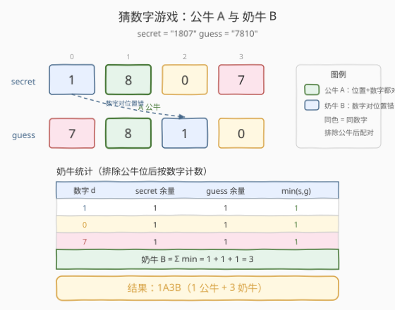
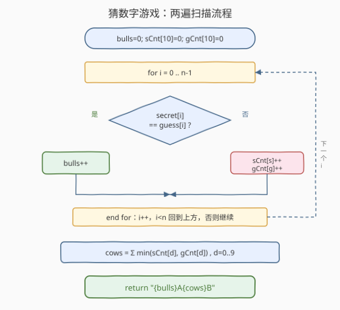
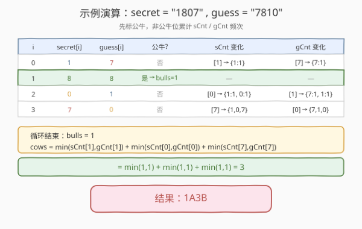

# LeetCode 猜数字游戏 题解

## 1. 题目概述

- **标题 / 题号**：猜数字游戏（#299，medium）
- **链接**：https://leetcode.cn/problems/bulls-and-cows/
- **难度**：中等
- **标签**：哈希表、字符串、计数

**题意**：你在和朋友玩 **猜数字（Bulls and Cows）** 游戏：你写下一个秘密数字 `secret`，朋友给出一个猜测 `guess`，你需要返回一个**提示**。提示格式为 `"xAyB"`：

- **`x`（公牛 Bulls）**：数字和**位置都猜对**的位数；
- **`y`（奶牛 Cows）**：数字猜对但**位置不对**的位数，且每位数字只能被统计一次（已经算作公牛的位不再参与奶牛统计）。

> 💡 一句话：**公牛 = 完全命中，奶牛 = 数字对但站错位置**。奶牛统计前必须先排除公牛位，否则同一格会被重复计数。

**示例 1**：

```text
输入：secret = "1807", guess = "7810"
输出："1A3B"
解释：位置 1 的 "8" 数字位置都对 → 1 头公牛；
      其余 3 位（1/0/7）数字都出现在对方里但位置错 → 3 头奶牛。
```

**示例 2**：

```text
输入：secret = "1123", guess = "0111"
输出："1A1B"
解释：位置 1 的 "1" 数字位置都对 → 1 头公牛；
      非公牛 secret = {1,2,3}，非公牛 guess = {0,1,1}；
      只有数字 "1" 能再配 1 对 → 1 头奶牛（guess 多出的两个 "1" 没有对应的 secret "1"）。
```

**约束**：

- `1 <= secret.length, guess.length <= 1000`
- `secret.length == guess.length`
- `secret` 和 `guess` 仅由数字组成。

## 2. 解题思路

### 2.1 暴力思路：逐位配对 + 标记

最直觉的做法：先扫一遍标出公牛（`secret[i] == guess[i]`）。对剩下的非公牛位，对每个 `guess` 数字去 `secret` 里**找一个未被占用且数字相同的位**，找到就计一头奶牛并标记该 `secret` 位已用。

```text
bulls = 0
used = [false] * n               # secret 的位是否已被奶牛配对
for i in range(n):
    if secret[i] == guess[i]:
        bulls += 1
        used[i] = true            # 公牛位也标记，避免被奶牛重复用
for i in range(n):
    if secret[i] == guess[i]: continue
    for j in range(n):
        if not used[j] and secret[j] == guess[i]:
            cows += 1
            used[j] = true
            break
return f"{bulls}A{cows}B"
```

> ⚠️ 暴力法有两个问题：
> 1. **时间 $O(n^2)$**——对每个非公牛 `guess` 位都要线性扫描 `secret`，$n$ 可达 1000，最坏 $10^6$ 次比较，虽能过但不够优雅；
> 2. **配对顺序无关**——同一数字的多个位本质可互换，逐个 `break` 配对虽能算对个数，但完全没必要逐位找，因为**相同数字之间任意配对结果都一样**。这正是优化的切入点。

### 2.2 核心观察：频次计数 + 取最小

公牛好算（逐位比相等即可）。难点在奶牛：**奶牛数 = 非公牛 secret 数字集合 与 非公牛 guess 数字集合（作为多重集）的「最大配对数」**。

由于「数字相同即可配对，与具体位置无关」，同一数字的多个位完全可互换。因此对每个数字 $d \in \{0,\dots,9\}$：

- 设非公牛 `secret` 中 $d$ 出现 $s_d$ 次，非公牛 `guess` 中 $d$ 出现 $g_d$ 次；
- $d$ 能配出的奶牛对数就是 $\min(s_d, g_d)$（被较少的一方卡住）。

**奶牛总数**：

$$\text{cows} = \sum_{d=0}^{9} \min(s_d, g_d)$$

> 💡 **为什么是 min 而不是直接相减？** 因为配对要求**两边都有**该数字。`secret` 有 3 个 `1`、`guess` 有 5 个 `1`，最多配 3 对，多出的 2 个 `1` 找不到对应的 `secret` `1`，作废。`min` 正好捕获「两边都有的最少份数」。这与 [242 有效的字母异位词](../0201-0300/242_有效的字母异位词.md)的频次比对、[383 赎金信](https://leetcode.cn/problems/ransom-note/)的「子集判定」同属**频次计数家族**，只是这里要的是「交集大小」即 min 之和。



### 2.3 算法流程图

两遍扫描：第一遍逐位判公牛，**同时**对非公牛位累计 `sCnt`/`gCnt` 两个频次表；第二遍对 0–9 求每个数字的 `min` 之和得奶牛。一遍循环 + 一次固定 10 项求和。



时间 $O(n)$，空间 $O(1)$（两个大小恒为 10 的频次数组）。

### 2.4 示例演算

以 `secret = "1807"`、`guess = "7810"` 为例，逐位走一遍：



| `i` | `secret[i]` | `guess[i]` | 公牛? | `sCnt` 变化 | `gCnt` 变化 |
|-----|-------------|------------|-------|-------------|-------------|
| 0 | 1 | 7 | 否 | `[1]++` → `{1:1}` | `[7]++` → `{7:1}` |
| 1 | 8 | 8 | 是 → `bulls=1` | — | — |
| 2 | 0 | 1 | 否 | `[0]++` → `{1:1, 0:1}` | `[1]++` → `{7:1, 1:1}` |
| 3 | 7 | 0 | 否 | `[7]++` → `{1,0,7}` | `[0]++` → `{7,1,0}` |

循环结束：`bulls = 1`；

$$\text{cows} = \min(1,1) + \min(1,1) + \min(1,1) = 3$$

结果 `"1A3B"`。

## 3. 参考代码

### C++

```cpp
// 猜数字游戏.cpp —— 两遍扫描频次计数，O(n) 时间 / O(1) 空间
// 编译: g++ -O2 -std=c++17 猜数字游戏.cpp -o bc
class Solution {
  public:
    string getHint(string secret, string guess) {
        int n = secret.size();
        int bulls = 0;
        int sCnt[10] = {0}, gCnt[10] = {0};
        // 第一遍：标公牛 + 非公牛位累计频次
        for (int i = 0; i < n; ++i) {
            if (secret[i] == guess[i]) {
                ++bulls;
            } else {
                ++sCnt[secret[i] - '0'];
                ++gCnt[guess[i] - '0'];
            }
        }
        // 第二遍：奶牛 = 各数字 min(sCnt, gCnt) 之和
        int cows = 0;
        for (int d = 0; d < 10; ++d) {
            cows += min(sCnt[d], gCnt[d]);
        }
        return to_string(bulls) + "A" + to_string(cows) + "B";
    }
};
```

### Python

```python
class Solution:
    def getHint(self, secret: str, guess: str) -> str:
        bulls = 0
        s_cnt, g_cnt = [0] * 10, [0] * 10
        for s, g in zip(secret, guess):
            if s == g:
                bulls += 1
            else:
                s_cnt[int(s)] += 1
                g_cnt[int(g)] += 1
        cows = sum(min(s_cnt[d], g_cnt[d]) for d in range(10))
        return f"{bulls}A{cows}B"
```

> 💡 **两个易错点**：
> 1. **奶牛统计必须排除公牛位**——若不区分，公牛位的数字会同时进 `sCnt`/`gCnt`，导致奶牛被重复计算。做法是 `else` 分支只对非公牛位累加，公牛位 `continue` 跳过。
> 2. **`min` 而非 `max`/相减**——配对数受「较少一方」约束，多出的数字无人可配。`sum(min(...))` 正是多重集交集大小。

## 4. 复杂度分析

| 维度 | 两遍频次计数 | 单数组一次遍历（见第 5 节） |
|------|--------------|----------------------------|
| **时间复杂度** | $O(n)$ | $O(n)$ |
| **空间复杂度** | $O(1)$（两个大小 10 的数组） | $O(1)$（一个大小 10 的数组） |
| **遍历次数** | 1 次主循环 + 1 次 10 项求和 | 1 次主循环，奶牛在循环内累计 |
| **可读性** | 直观，推荐面试首选 | 巧妙，需解释正负号含义 |

> ⚠️ **空间 $O(1)$ 的依据**：数字只有 0–9 共 10 种，频次表大小恒为 10，与 $n$ 无关。即使 $n = 10^6$，额外空间仍是常数。时间上主循环对每位做 $O(1)$ 工作（两次数组自增），求和循环固定 10 次，总计 $O(n)$。

## 5. 扩展：单数组一次遍历（正负抵消法）

两遍法用了两张频次表。其实可以**合并成一张** `cnt[10]`：约定 `secret` 贡献 `+1`、`guess` 贡献 `-1`。遍历时：

- 对非公牛位的 `s`（secret 数字）：若 `cnt[s] < 0`，说明 `guess` 之前对 `s` 有「盈余」（即 `guess` 出现过 `s` 但还没遇到对应的 `secret` `s`），此刻正好配对 → `cows++`；然后 `cnt[s] += 1`。
- 对非公牛位的 `g`（guess 数字）：若 `cnt[g] > 0`，说明 `secret` 之前对 `g` 有「盈余」，此刻配对 → `cows++`；然后 `cnt[g] -= 1`。

> 💡 **直觉**：`cnt[d] > 0` 表示 `secret` 这边积压了 `d` 等待 `guess` 来认领；`cnt[d] < 0` 表示 `guess` 这边积压了 `d` 等待 `secret` 来认领。每当对面来一个相同的 `d`，就消掉一份积压并产生一头奶牛。这和 [49 字母异位词分组](https://leetcode.cn/problems/group-anagrams/)里「频次差恒为零判异位」是同一套正负抵消思想。

```python
class Solution:
    def getHint(self, secret: str, guess: str) -> str:
        bulls = cows = 0
        cnt = [0] * 10
        for s, g in zip(secret, guess):
            if s == g:
                bulls += 1
            else:
                ds, dg = int(s), int(g)
                if cnt[ds] < 0:      # guess 之前积压了 ds，配对
                    cows += 1
                cnt[ds] += 1
                if cnt[dg] > 0:      # secret 之前积压了 dg，配对
                    cows += 1
                cnt[dg] -= 1
        return f"{bulls}A{cows}B"
```

> ⚠️ 单数组法**奶牛在循环内即时累计**，无需第二遍求和，但代码逻辑依赖正负号语义，面试时建议**先讲清两遍法的 min 思路**（易解释、易写对），再提此法作为「压缩到一张表」的优化。两者结果完全等价。

## 6. 面试要点

1. **奶牛数为什么是 `Σ min(sCnt, gCnt)` 而不是直接数相同数字？**

   - 奶牛要求**两边都出现**该数字才能配成一对。`secret` 有 3 个 `1`、`guess` 有 5 个 `1`，只能配 3 对，多出的 2 个 `1` 找不到对应 `secret` 的 `1`，作废。
   - `min(s_d, g_d)` 恰好是「两边都有的最少份数」，对所有数字求和即多重集的交集大小。

2. **为什么必须排除公牛位再统计奶牛？**

   - 公牛位的数字「数字和位置都对」，已经计入 `x`。若再把它放进 `sCnt`/`gCnt`，同一格的数字会被算两次（一次公牛 + 一次奶牛）。
   - 示例 2 的 `secret="1123"`、`guess="0111"`：位置 1 的 `1` 是公牛，若不排除，`sCnt[1]` 会变成 2，`gCnt[1]` 变成 3，多算出 1 头奶牛，得到错误的 `"1A2B"`。

3. **暴力逐位配对和频次计数的结果一致吗？为什么？**

   - 一致。同一数字的多个位**本质可互换**，无论先配哪个 `secret` 位和哪个 `guess` 位，配对总数都等于 `min(s_d, g_d)`。
   - 暴力法用 `break` + `used` 标记本质就是在算这个 min，只是用 $O(n^2)$ 的方式；频次计数把它降到 $O(n)$。

4. **如果数字范围不是 0–9 而是任意字符（如字母）怎么办？**

   - 把大小为 10 的数组换成 `Counter` / `unordered_map<char,int>` 即可，逻辑不变。
   - 本题退化到 0–9 是为了用定长数组实现 $O(1)$ 严格空间；扩展到字母（如 [383 赎金信](https://leetcode.cn/problems/ransom-note/) 的 26 小写字母）同样可用定长数组。

5. **单数组正负抵消法的 `cnt[d]` 正负各代表什么？**

   - `cnt[d] > 0`：`secret` 这边对 `d` 有盈余（已出现但未被 `guess` 配掉的 `d`），等待 `guess` 来认领。
   - `cnt[d] < 0`：`guess` 这边对 `d` 有盈余，等待 `secret` 来认领。
   - 每当「对面」来一个相同的 `d`，盈余减一并产生一头奶牛；盈余归零后继续累加则转换为另一边的盈余。

> 💡 **一句话总结**：先标公牛，再对非公牛位按数字做频次计数，奶牛 = `Σ min(sCnt[d], gCnt[d])`。本质是求两个多重集的交集大小，$O(n)/O(1)$。与 242/383 同属频次计数家族。

## 同类练习题

| # | 题目 | 与本题的关联 |
|---|------|-------------|
| 242 | [有效的字母异位词](https://leetcode.cn/problems/valid-anagram/)（[题解](../0201-0300/242_有效的字母异位词.md)） | 两张频次表逐位相等判定，本题的「判等」退化版（本题要的是交集大小 min 之和） |
| 383 | [赎金信](https://leetcode.cn/problems/ransom-note/) | 频次计数 + 子集判定（`ransom` 每个字符频次 `<=` `magazine`），与本题的 min 配对同源 |
| 49 | [字母异位词分组](https://leetcode.cn/problems/group-anagrams/) | 频次 tuple 作为哈希键，与单数组正负抵消法同属频次思想的应用 |
| 2287 | [重排字符形成目标字符串](https://leetcode.cn/problems/rearrange-characters-to-make-target-string/) | 频次计数求「最多能拼出几个目标串」，min 之比的扩展 |
| 451 | [根据字符出现频率排序](https://leetcode.cn/problems/sort-characters-by-frequency/) | 频次计数 + 按频次排序，频次统计的下游应用 |
