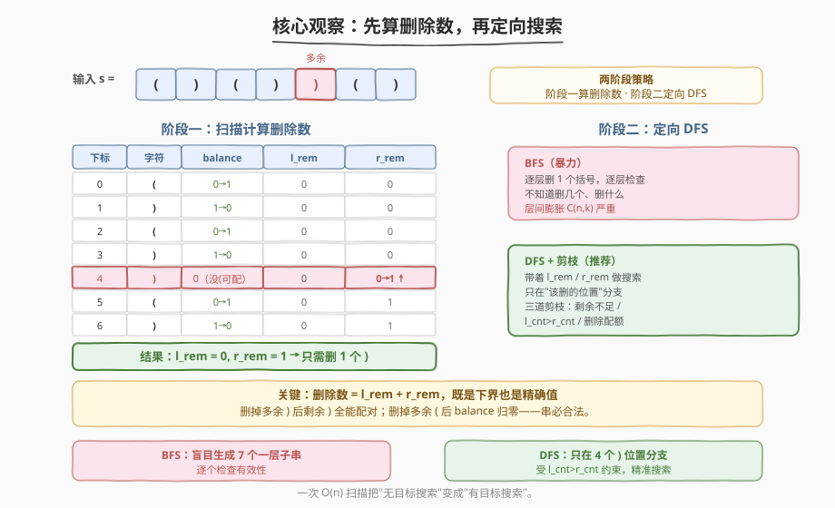
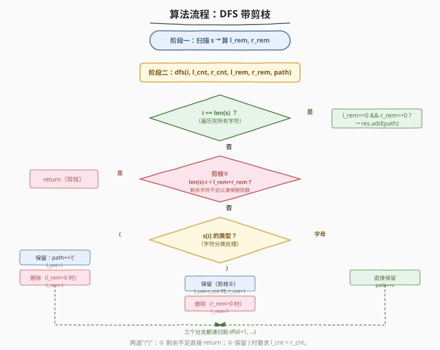
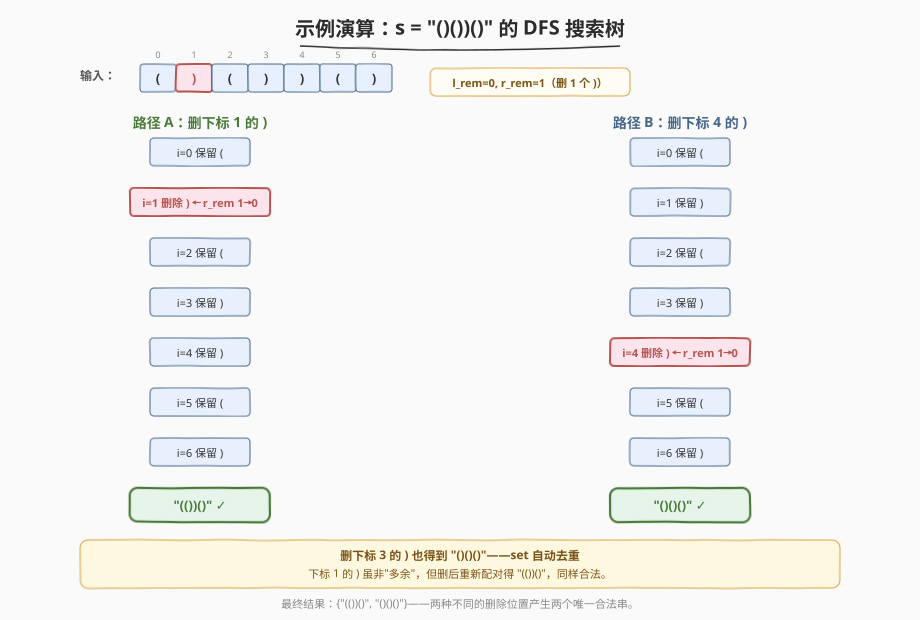

# LeetCode 删除无效的括号 题解

## 1. 题目概述

- **标题 / 题号**：删除无效的括号（#301，hard）
- **链接**：https://leetcode.cn/problems/remove-invalid-parentheses/
- **难度**：困难
- **标签**：回溯、广度优先搜索、字符串、剪枝

**题意**：给你一个由括号和字母组成的字符串 `s`，请你删除**最少数量的无效括号**，使得剩下的字符串有效。返回**所有可能的结果**。答案中的每个字符串都是唯一的。

> 一个括号字符串有效，当且仅当：每个 `(` 都有对应的 `)` 与之匹配，且 `)` 不会出现在与之匹配的 `(` 之前。字母字符不影响有效性。

**示例 1**：

```text
输入：s = "()())()"
输出：["(())()","()()()"]
解释：只需删 1 个 ')'。删掉下标 1 的 ')' 得 "(())()"；
     删掉下标 3 或 4 的 ')' 都得 "()()()"（去重后只列一次）。
```

**示例 2**：

```text
输入：s = "(a)())()"
输出：["(a())()","(a)()()"]
```

**示例 3**：

```text
输入：s = ")("
输出：[""]
解释：两个括号都无效，全删后得到空串 ""，也是合法结果。
```

**约束**：

- $1 \leq \text{s.length} \leq 25$
- `s` 由小写英文字母以及括号 `(` 和 `)` 组成
- `s` 中至多包含 20 个括号字符

> 💡 本题的难点不在"判断有效性"（一遍扫描即可），而在"**返回所有结果**"+"**删除数最少**"两个约束叠加后，如何**高效剪枝**避免暴力枚举 $2^n$ 种删除方案。核心思路是：**先用一次扫描算出确切的左/右删除数，再带着这两个数字做定向 DFS**——把无目标的盲目搜索变成有目标的精准删除。

## 2. 解题思路

### 2.1 暴力思路：BFS 逐层删除

最直观的暴力是 **BFS 逐层枚举**：第 0 层是原串 `s`，第 $k$ 层是"从第 $k-1$ 层每个字符串中删掉一个括号"得到的全部子串。逐层检查有效性，**第一个出现合法串的层即为最少删除数**，该层所有合法串就是答案。

```text
Level 0: { "()())()" }              — 无合法串
Level 1: { "(())()", "()()()", ... } — 出现合法串，停止！
```

> ⚠️ BFS 的痛点是**层间膨胀**：每个长度为 $n$ 的串可衍生 $n$ 个子串（删任意一个位置），第 $k$ 层最多有 $C(n, k)$ 个串。虽然用 `visited` 集合可以去重，但 $n=25$ 时中间层的规模仍然巨大——大量子串根本不可能合法，却被白白生成和检查了。

### 2.2 核心观察：先算删除数 + 定向 DFS 剪枝



BFS 之所以慢，是因为它**不知道该删几个、删什么**，只能逐层试错。如果我们能**提前算出确切的左、右删除数**，就能带着目标做 DFS——只在"该删的位置"上分支，搜索空间急剧缩小。

**第一步：计算删除数（一次扫描）**

维护一个 `balance` 计数器，模拟括号匹配：

- 遇到 `(`：`balance++`（记一个待匹配的左括号）；
- 遇到 `)`：
  - 若 `balance > 0`：`balance--`（与前面的 `(` 配对成功）；
  - 若 `balance == 0`：`right_remove++`（这个 `)` 多余，必须删）；
- 遇到字母：跳过。

扫描结束后，`balance` 的值就是**多余的 `(`** 数量，即 `left_remove`。

> ⚠️ 这一步算出的 `left_remove` 和 `right_remove` 是**下界**——任何合法方案至少要删这么多。而它们恰好也是**精确值**——只需删这么多就能让串合法（因为删掉多余的 `)` 后，剩下的 `)` 都能匹配到 `(`；而多余的 `(` 删掉后恰好平衡）。所以"最少删除"= `left_remove + right_remove`，无需更多。

**第二步：DFS 带剪枝（定向搜索）**

知道了 `left_remove` 和 `right_remove`，逐字符决定"保留 or 删除"：

| 字符 | 保留条件 | 删除条件 |
|------|----------|----------|
| `(` | 总是保留 | `left_remove > 0` 时可删 |
| `)` | `l_cnt > r_cnt`（前面有未匹配的 `(`） | `right_remove > 0` 时可删 |
| 字母 | 总是保留 | — |

**三道剪枝**：

1. **剩余不足剪枝**：若 `剩余字符数 < left_remove + right_remove`，删不够了，直接 return；
2. **右括号保留剪枝**：保留 `)` 时要求 `l_cnt > r_cnt`，保证 `)` 不会变成多余的；
3. **去重**：用 `set` 收集结果，天然消除"删不同位置的同类括号得到相同串"的重复。

> 💡 **为什么"先算删除数"是关键加速**？以 `s = "()())()"` 为例：BFS 盲目生成 $C(7,1)=7$ 个一层子串再逐个检查；而定向 DFS 只在 4 个 `)` 位置上分支（因为 `right_remove=1, left_remove=0`），且 `)` 的保留还受 `l_cnt > r_cnt` 约束——搜索树从"宽度优先的爆炸"变成了"深度优先的精准"。

### 2.3 算法流程图



**整体两阶段**：

**阶段一**：扫描 `s`，计算 `left_remove`、`right_remove`。

**阶段二**：DFS 递归 `dfs(i, l_cnt, r_cnt, l_rem, r_rem, path)`：

1. **终止**：`i == len(s)` 时，若 `l_rem == 0 && r_rem == 0`，收集 `path`；
2. **剪枝**：`len(s) - i < l_rem + r_rem` → return；
3. 按字符类型分支（见上表），保留/删除二选一或只保留；
4. 递归到下一位置。

### 2.4 示例演算

以 `s = "()())()"` 为例（扫描得 `left_remove=0, right_remove=1`，即只需删 1 个 `)`）：



两条通往合法结果的路径：

| 路径 | 删除位置 | path 演变 | 最终结果 |
|------|----------|-----------|----------|
| A | 下标 1 的 `)` | `(` → `(` → `((` → `(()` → `(())` → `(())(` → `(())()` | `"(())()"` |
| B | 下标 4 的 `)` | `(` → `()` → `()(` → `()()` → `()()` → `()()(` → `()()()` | `"()()()"` |

> ⚠️ **下标 3 和 4 的 `)` 删哪个都得到 `"()()()"`**——`set` 自动去重。而下标 1 的 `)` 虽然在扫描时并非"多余的"（它匹配了下标 0 的 `(`），但删掉它后下标 0 的 `(` 会改与下标 2 的 `)` 前半部分... 实际上下标 0 的 `(` 与下标 4 之后的重新配对，最终 `(())()` 也是合法的。这正是"返回所有结果"的意义：删除位置不唯一，合法方案可能多种。

## 3. 参考代码

### C++（DFS + 剪枝）

```cpp
class Solution {
  public:
    vector<string> removeInvalidParentheses(string s) {
        // 阶段一：计算需要删除的左、右括号数量
        int l_rem = 0, r_rem = 0;
        for (char c : s) {
            if (c == '(') {
                l_rem++;
            } else if (c == ')') {
                if (l_rem > 0) l_rem--;    // 与前面的 ( 配对
                else r_rem++;              // 多余的 )，必须删
            }
        }

        // 阶段二：DFS 定向搜索
        unordered_set<string> res;
        string path;
        dfs(s, 0, 0, 0, l_rem, r_rem, path, res);
        return vector<string>(res.begin(), res.end());
    }

  private:
    // i: 当前下标  l_cnt/r_cnt: 已保留的左/右括号数
    // l_rem/r_rem: 还需删除的左/右括号数  path: 当前拼接的串
    void dfs(const string& s, int i, int l_cnt, int r_cnt,
             int l_rem, int r_rem, string& path,
             unordered_set<string>& res) {
        if (i == (int)s.size()) {
            if (l_rem == 0 && r_rem == 0) res.insert(path);
            return;
        }
        // 剪枝①：剩余字符不足以凑够删除数
        if ((int)s.size() - i < l_rem + r_rem) return;

        char c = s[i];
        if (c == '(') {
            // 保留
            path.push_back('(');
            dfs(s, i + 1, l_cnt + 1, r_cnt, l_rem, r_rem, path, res);
            path.pop_back();
            // 删除（还需删左括号时）
            if (l_rem > 0)
                dfs(s, i + 1, l_cnt, r_cnt, l_rem - 1, r_rem, path, res);
        } else if (c == ')') {
            // 保留（剪枝②：仅当前面有未匹配的 ( 时）
            if (l_cnt > r_cnt) {
                path.push_back(')');
                dfs(s, i + 1, l_cnt, r_cnt + 1, l_rem, r_rem, path, res);
                path.pop_back();
            }
            // 删除（还需删右括号时）
            if (r_rem > 0)
                dfs(s, i + 1, l_cnt, r_cnt, l_rem, r_rem - 1, path, res);
        } else {
            // 字母：直接保留
            path.push_back(c);
            dfs(s, i + 1, l_cnt, r_cnt, l_rem, r_rem, path, res);
            path.pop_back();
        }
    }
};
```

### Python

```python
class Solution:
    def removeInvalidParentheses(self, s: str) -> List[str]:
        # 阶段一：计算需要删除的左、右括号数量
        l_rem = r_rem = 0
        for ch in s:
            if ch == '(':
                l_rem += 1
            elif ch == ')':
                if l_rem > 0:
                    l_rem -= 1       # 与前面的 ( 配对
                else:
                    r_rem += 1       # 多余的 )，必须删

        # 阶段二：DFS 定向搜索
        res = set()

        def dfs(i, l_cnt, r_cnt, l_rem, r_rem, path):
            if i == len(s):
                if l_rem == 0 and r_rem == 0:
                    res.add(path)
                return
            # 剪枝①：剩余字符不足以凑够删除数
            if len(s) - i < l_rem + r_rem:
                return

            ch = s[i]
            if ch == '(':
                dfs(i + 1, l_cnt + 1, r_cnt, l_rem, r_rem, path + '(')  # 保留
                if l_rem > 0:                                           # 删除
                    dfs(i + 1, l_cnt, r_cnt, l_rem - 1, r_rem, path)
            elif ch == ')':
                if l_cnt > r_cnt:                                       # 保留（剪枝②）
                    dfs(i + 1, l_cnt, r_cnt + 1, l_rem, r_rem, path + ')')
                if r_rem > 0:                                           # 删除
                    dfs(i + 1, l_cnt, r_cnt, l_rem, r_rem - 1, path)
            else:
                dfs(i + 1, l_cnt, r_cnt, l_rem, r_rem, path + ch)      # 字母保留

        dfs(0, 0, 0, l_rem, r_rem, "")
        return list(res)
```

> 💡 **去重策略**：代码用 `set` 收集结果，简单可靠。还有一种更高效的**连续相同括号只删第一个**的去重技巧——当 `s[i] == s[i-1]` 且上一字符选择"删除"时跳过本字符的删除分支——可省去 `set`，但逻辑稍复杂，面试中 `set` 方案已足够（$n \le 25$）。

## 4. 复杂度分析

| 维度 | 复杂度 | 说明 |
|------|--------|------|
| 时间复杂度 | $O(2^n)$ 最坏 | 每个括号字符有"保留/删除"两种选择，最坏展开 $2^n$ 个节点；但三道剪枝（剩余不足、`l_cnt>r_cnt`、删除配额）大幅削减实际搜索量 |
| 空间复杂度 | $O(n)$ | 递归栈深度 $\le n$，`path` 长度 $\le n$；结果集不计入 |

> ⚠️ **为何最坏 $O(2^n)$ 但 $n \le 25$ 可过**？关键在于 `left_remove + right_remove` 通常远小于 $n$——删除数等于"多余括号数"，大多数字符是"必须保留"的字母或已匹配的括号，分支只在少数位置展开。即使全括号串如 `"(((((((((((((((((((((((""`（25 个 `(`），`left_remove=25` 但 `right_remove=0`，每个 `(` 都必须删，实际上只有一条路径（全删）。真正卡指数的是 `"(()()()()()()()()()()"` 这类"多种合法删法"的串，但结果集本身也大，无法避免。

## 5. 扩展：BFS 逐层删除

BFS 的优势是**思路极简**——不需要预计算删除数，逐层删一个括号直到出现合法串：

```python
def removeInvalidParentheses(self, s: str) -> List[str]:
    def is_valid(t):
        bal = 0
        for c in t:
            if c == '(':
                bal += 1
            elif c == ')':
                bal -= 1
            if bal < 0:
                return False
        return bal == 0

    level = {s}
    while True:
        valid = [t for t in level if is_valid(t)]
        if valid:
            return valid
        next_level = set()
        for t in level:
            for i in range(len(t)):
                if t[i] in '()':
                    next_level.add(t[:i] + t[i + 1:])
        level = next_level
```

两种方法对比：

| 方法 | 时间 | 空间 | 特点 |
|------|------|------|------|
| DFS + 剪枝（推荐） | $O(2^n)$ 最坏，实际更优 | $O(n)$ | 预计算删除数，定向搜索，剪枝充分 |
| BFS 逐层删除 | $O(C(n,k) \cdot n)$ | $O(C(n,k) \cdot n)$ | 思路最简，无需预计算；但层间膨胀严重 |

> 💡 面试推荐 DFS + 剪枝：它展示了对"搜索空间"的理解——不是盲目枚举，而是先用一次 $O(n)$ 扫描把问题从"无目标搜索"变成"有目标搜索"，这是回溯剪枝的精髓。

## 6. 面试要点

1. **为什么要先算 `left_remove` 和 `right_remove`？**
   - 两个作用：一是确定**最少删除数**（保证最优），二是给 DFS **精确的删除配额**——每个分支只有在"还需删该类括号"时才走"删除"分支，避免生成大量注定无效的中间状态。没有这一步，DFS 退化成对每个括号"删/不删"的盲目枚举。

2. **`l_cnt > r_cnt` 这个剪枝的含义？**
   - 它保证"保留 `)` 时前面一定有未匹配的 `(`"。如果不满足还保留，这个 `)` 就成了多余的，最终串一定不合法——这条分支整棵子树都是废的，尽早剪掉。这是"**保留分支也要剪枝**"的典型，不只是删除分支才剪。

3. **为什么用 `set` 去重？什么时候不够高效？**
   - 连续相同的括号（如 `))` ）删哪个都得到相同子串，`set` 天然消除重复。$n \le 25$ 时 `set` 完全够用。若追求极致效率，可用"连续相同括号只删第一个"的规则——在 `s[i] == s[i-1]` 且前一个相同字符已选择删除时跳过，省去哈希开销。

4. **BFS 和 DFS 各适合什么场景？**
   - BFS 天然按删除数递增搜索，**第一个找到合法串的层就是最优解**，适合"只求一个结果"或"删除数未知"时；DFS 需要预知删除数，但配合剪枝后搜索更精准，适合"求所有结果"且删除数可快速计算的场景。本题两者都能用，但 DFS 更优。

5. **`left_remove + right_remove` 一定是最小删除数吗？**
   - 是的。扫描时 `right_remove` 统计的是"无法匹配的 `)`"，这些**必须删**（添加 `(` 也不行，因为题目只允许删除）；`left_remove`（即扫描结束时的 `balance`）是"没有 `)` 配对的 `(`"，也**必须删**。两者之和是下界，而删掉它们后串一定合法（剩下的括号全部配对成功），所以也是精确值。

## 同类练习题

| # | 题目 | 与本题的关联 |
|---|------|-------------|
| 1249 | [移除无效的括号](https://leetcode.cn/problems/minimum-remove-to-make-valid-parentheses/) | 本题的"只求一个结果"简化版，同样的扫描思路，无需 DFS |
| 921 | [使括号有效的最少添加](https://leetcode.cn/problems/minimum-add-to-make-parentheses-valid/) | 与本题第一步完全相同的扫描，但改为"添加"而非"删除" |
| 678 | [有效的括号字符串](https://leetcode.cn/problems/valid-parenthesis-string/) | 引入 `*` 可当 `(` / `)` / 空白，贪心区间判定合法 |
| 22 | [括号生成](https://leetcode.cn/problems/generate-parentheses/)（[题解](../0001-0100/22_括号生成.md)） | 回溯生成所有合法括号组合，对比"生成"与"删除"两个方向 |
| 20 | [有效的括号](https://leetcode.cn/problems/valid-parentheses/)（[题解](../0001-0100/20_有效的括号.md)） | 括号有效性判定的栈模板，本题 `is_valid` 函数的基础 |
