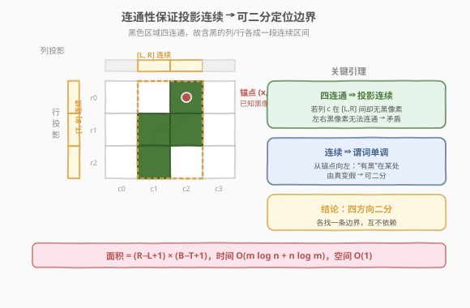
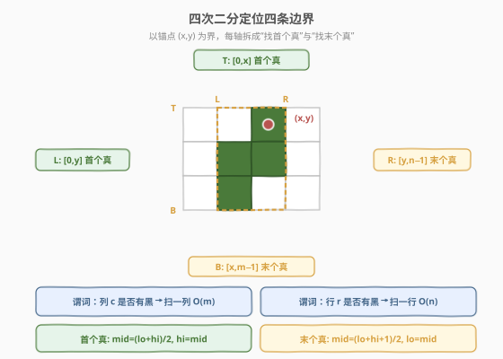
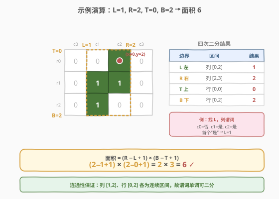

# 包含黑色像素的最小矩形

- **题目名称**：包含黑色像素的最小矩形
- **链接**：[302. 包含黑色像素的最小矩形](https://leetcode.cn/problems/smallest-rectangle-enclosing-black-pixels/)
- **难度**：困难
- **标签**：二分查找、深度优先搜索、矩阵

## 1. 题目概述

给定一个用二维二值矩阵 `image` 表示的图像，其中 `'0'` 表示白色像素、`'1'` 表示黑色像素。**所有黑色像素在四方向（上下左右）上连通**，即整张图只有一个黑色连通区域。再给定其中一个黑色像素的坐标 `(x, y)`，要求返回**能包围所有黑色像素的最小轴对齐矩形**的面积。

**示例 1**：

```text
输入：image = [["0","0","1","0"],["0","1","1","0"],["0","1","0","0"]], x = 0, y = 2
输出：6

解释：
图像（3 行 4 列）
  0 0 1 0
  0 1 1 0
  0 1 0 0
黑色像素位于 (0,2)、(1,1)、(1,2)、(2,1)，它们连通。
最小包围矩形：行 0..2、列 1..2，面积 = 3 × 2 = 6。
```

**示例 2**：

```text
输入：image = [["1"]], x = 0, y = 0
输出：1
```

**约束条件**：

- `m == image.length`，`n == image[i].length`
- `1 <= m, n <= 100`
- `image[i][j]` 为 `'0'` 或 `'1'`
- `0 <= x < m`，`0 <= y < n`
- `image[x][y] == '1'`
- 黑色像素在图中只形成一个连通区域

> ⚠️ 注意：题目**额外赠送**了一个已知黑色像素 `(x, y)`。它不是用来验证答案的，而是作为**二分搜索的锚点**——以它为起点向四个方向二分，就能定位矩形的四条边界。这是本题从 $O(mn)$ 优化到 $O(m \log n + n \log m)$ 的关键。

---

## 2. 解题思路

### 2.1 暴力思路

遍历整张矩阵的每个格子，记录所有 `image[i][j] == '1'` 的行、列极值：

$$
\text{top} = \min i,\quad \text{bottom} = \max i,\quad \text{left} = \min j,\quad \text{right} = \max j
$$

面积即为 $(\text{right} - \text{left} + 1) \times (\text{bottom} - \text{top} + 1)$。时间 $O(m \cdot n)$，空间 $O(1)$。`m, n ≤ 100` 时 `mn ≤ 10^4`，能 AC，但**完全没有利用「连通」与「已知锚点」两个条件**。

> 💡 另一种改进是 **DFS/BFS**：从锚点 `(x, y)` 出发，四方向搜索连通的黑色像素，途中维护四个极值。复杂度 $O(\text{黑色像素数}) \le O(mn)$，区域小时优于暴力，但区域大时仍退化为 $O(mn)$，且需要原地标记或访问数组。真正用上「连通 + 锚点」的是下面的二分。

### 2.2 核心观察：连通性保证投影连续 → 四方向二分



把黑色像素**投影**到行轴和列轴上：

- **列投影**：所有「至少含一个黑像素的列」组成的集合；
- **行投影**：所有「至少含一个黑像素的行」组成的集合。

**关键引理**：因为黑色区域四方向连通，所以列投影必然是一段**连续区间** $[L, R]$，行投影必然是一段连续区间 $[T, B]$。

> **反证**：假设列投影不连续，即存在某列 $c$ 满足 $L < c < R$ 且列 $c$ 没有任何黑像素。那么任何从「列 $< c$ 的黑像素」到「列 $> c$ 的黑像素」的四方向路径，都必须在某一刻从列 $c-1$ 横向跨到列 $c+1$——这在四连通下不可能不经过列 $c$，矛盾。故 $[L, R]$ 之间每一列都至少有一个黑像素。行投影同理。

**这意味着**：判定「某列/某行是否有黑像素」这一谓词，在锚点所在区间内是**单调的**（从锚点向左走，"有黑像素"在某处由真变假；向右、向上、向下同理）。于是可以分别对四个方向**二分查找**边界：

| 边界 | 搜索区间 | 谓词 | 目标 |
|------|----------|------|------|
| 左 $L$ | 列 $[0,\, y]$ | 列 $c$ 是否有黑像素 | 第一个为真（最左） |
| 右 $R$ | 列 $[y,\, n{-}1]$ | 列 $c$ 是否有黑像素 | 最后一个为真（最右） |
| 上 $T$ | 行 $[0,\, x]$ | 行 $r$ 是否有黑像素 | 第一个为真（最上） |
| 下 $B$ | 行 $[x,\, m{-}1]$ | 行 $r$ 是否有黑像素 | 最后一个为真（最下） |

> 💡 **为什么以 `(x, y)` 划分区间**？因为 `image[x][y] == '1'`，所以列 $y$ 必在 $[L, R]$ 内、行 $x$ 必在 $[T, B]$ 内。在 $[0, y]$ 上找 $L$ 时，列 $y$ 的谓词为真，保证了答案存在；在 $[y, n{-}1]$ 上找 $R$ 同理。锚点把每个轴干净地切成「找首个真」与「找末个真」两半。

### 2.3 算法流程图



四个二分相互独立，可按任意顺序执行。每次「谓词检查」需要扫描一整列（$O(m)$）或一整行（$O(n)$），而二分迭代 $\log$ 次，故总时间 $O(m \log n + n \log m)$。

> ⚠️ **两个二分模板**：找「第一个真」用 `mid = (lo+hi)/2`，命中则 `hi = mid`；找「最后一个真」用 `mid = (lo+hi+1)/2`（上取整避免死循环），命中则 `lo = mid`。两者都是 `while lo < hi`，循环结束时 `lo == hi` 即为答案。

### 2.4 示例演算

以示例 1 的 `3×4` 图像、锚点 `(x=0, y=2)` 为例，四次二分结果如下：



| 边界 | 搜索区间 | 各列/行是否有黑像素 | 结果 |
|------|----------|---------------------|------|
| 左 $L$ | 列 $[0, 2]$ | 列0=否，列1=是，列2=是 | 首个真 → $L=1$ |
| 右 $R$ | 列 $[2, 3]$ | 列2=是，列3=否 | 末个真 → $R=2$ |
| 上 $T$ | 行 $[0, 0]$ | 行0=是（含 `(0,2)`） | 首个真 → $T=0$ |
| 下 $B$ | 行 $[0, 2]$ | 行0=是，行1=是，行2=是 | 末个真 → $B=2$ |

$$
\text{面积} = (R - L + 1) \times (B - T + 1) = (2 - 1 + 1) \times (2 - 0 + 1) = 2 \times 3 = 6 \quad \checkmark
$$

---

## 3. 参考代码

### C++

```cpp
class Solution {
  public:
    int minArea(vector<vector<char>>& image, int x, int y) {
        int m = image.size(), n = image[0].size();
        int L = firstCol(image, 0, y, m);      // [0, y] 找最左有黑的列
        int R = lastCol(image, y, n - 1, m);   // [y, n-1] 找最右有黑的列
        int T = firstRow(image, 0, x, n);      // [0, x] 找最上有黑的行
        int B = lastRow(image, x, m - 1, n);   // [x, m-1] 找最下有黑的行
        return (R - L + 1) * (B - T + 1);
    }

  private:
    // [lo, hi] 内第一个“该列含黑像素”的列
    int firstCol(vector<vector<char>>& img, int lo, int hi, int m) {
        while (lo < hi) {
            int mid = lo + (hi - lo) / 2;
            if (colHas(img, mid, m)) hi = mid;
            else lo = mid + 1;
        }
        return lo;
    }
    // [lo, hi] 内最后一个“该列含黑像素”的列
    int lastCol(vector<vector<char>>& img, int lo, int hi, int m) {
        while (lo < hi) {
            int mid = lo + (hi - lo + 1) / 2;   // 上取整，防死循环
            if (colHas(img, mid, m)) lo = mid;
            else hi = mid - 1;
        }
        return lo;
    }
    // [lo, hi] 内第一个“该行含黑像素”的行
    int firstRow(vector<vector<char>>& img, int lo, int hi, int n) {
        while (lo < hi) {
            int mid = lo + (hi - lo) / 2;
            if (rowHas(img, mid, n)) hi = mid;
            else lo = mid + 1;
        }
        return lo;
    }
    // [lo, hi] 内最后一个“该行含黑像素”的行
    int lastRow(vector<vector<char>>& img, int lo, int hi, int n) {
        while (lo < hi) {
            int mid = lo + (hi - lo + 1) / 2;
            if (rowHas(img, mid, n)) lo = mid;
            else hi = mid - 1;
        }
        return lo;
    }

    bool colHas(vector<vector<char>>& img, int c, int m) {
        for (int i = 0; i < m; ++i)
            if (img[i][c] == '1') return true;
        return false;
    }
    bool rowHas(vector<vector<char>>& img, int r, int n) {
        for (int j = 0; j < n; ++j)
            if (img[r][j] == '1') return true;
        return false;
    }
};
```

### Python

```python
class Solution:
    def minArea(self, image: List[List[str]], x: int, y: int) -> int:
        m, n = len(image), len(image[0])

        def col_has(c: int) -> bool:
            return any(image[i][c] == '1' for i in range(m))

        def row_has(r: int) -> bool:
            return any(image[r][j] == '1' for j in range(n))

        def first(lo: int, hi: int, check) -> int:   # [lo, hi] 内首个真
            while lo < hi:
                mid = (lo + hi) // 2
                if check(mid):
                    hi = mid
                else:
                    lo = mid + 1
            return lo

        def last(lo: int, hi: int, check) -> int:    # [lo, hi] 内末个真
            while lo < hi:
                mid = (lo + hi + 1) // 2              # 上取整，防死循环
                if check(mid):
                    lo = mid
                else:
                    hi = mid - 1
            return lo

        L = first(0, y, col_has)
        R = last(y, n - 1, col_has)
        T = first(0, x, row_has)
        B = last(x, m - 1, row_has)
        return (R - L + 1) * (B - T + 1)
```

---

## 4. 复杂度分析

| 维度 | 复杂度 | 说明 |
|------|--------|------|
| 时间复杂度 | $O(m \log n + n \log m)$ | 左右两次列二分各 $\log n$ 轮、每轮扫一列 $O(m)$；上下两次行二分各 $\log m$ 轮、每轮扫一行 $O(n)$ |
| 空间复杂度 | $O(1)$ | 只用常数个边界变量，原地查询，不修改矩阵 |

> 💡 对比：暴力 / DFS 为 $O(mn)$；当 $m = n = 100$ 时 $mn = 10^4$，而 $m\log n + n\log m \approx 2 \times 100 \times 7 = 1400$。规模越大二分优势越明显，且无需修改输入、无需额外栈空间。

---

## 5. 扩展：DFS 暴搜与连通性失效场景

**DFS 做法**：从锚点出发四方向递归，原地标记访问过的格子，途中维护四个极值。

```cpp
class Solution {
  public:
    int minArea(vector<vector<char>>& image, int x, int y) {
        int m = image.size(), n = image[0].size();
        int top = x, bottom = x, left = y, right = y;
        dfs(image, x, y, m, n, top, bottom, left, right);
        return (right - left + 1) * (bottom - top + 1);
    }

  private:
    void dfs(vector<vector<char>>& img, int i, int j, int m, int n,
             int& top, int& bottom, int& left, int& right) {
        if (i < 0 || i >= m || j < 0 || j >= n || img[i][j] != '1') return;
        img[i][j] = '0';                      // 原地标记
        top = min(top, i); bottom = max(bottom, i);
        left = min(left, j); right = max(right, j);
        dfs(img, i - 1, j, m, n, top, bottom, left, right);
        dfs(img, i + 1, j, m, n, top, bottom, left, right);
        dfs(img, i, j - 1, m, n, top, bottom, left, right);
        dfs(img, i, j + 1, m, n, top, bottom, left, right);
    }
};
```

| 解法 | 时间 | 空间 | 何时用 |
|------|------|------|--------|
| 全量扫描 | $O(mn)$ | $O(1)$ | 没有「连通」保证时的保底做法 |
| DFS/BFS | $O(\text{黑像素数})$ | $O(\text{栈/队列})$，需修改输入 | 区域小且不规则时最快 |
| 四方向二分 | $O(m\log n + n\log m)$ | $O(1)$，不改输入 | **有连通保证 + 锚点时的最优解** |

> ⚠️ **若去掉「连通」条件**：投影就不再连续，谓词失去单调性，二分失效，只能退回全量扫描或 DFS。面试中被追问「能不能更快」时，务必先确认连通性前提是否成立。

---

## 6. 面试要点

1. **为什么一定要给锚点 `(x, y)`？**
   - 锚点把每个轴切成「找首个真」与「找末个真」两段，且保证搜索区间内一定存在真值（因为锚点本身为真）。没有锚点就只能对 $[0, n{-}1]$ 整体二分找左右边界，逻辑虽也能写，但题目给锚点正是暗示「以它为起点四方向二分」。

2. **连通性是怎么保证投影连续的？**
   - 四连通下，若列 $c$ 在 $[L, R]$ 之间却无黑像素，则左右两侧的黑像素无法连通，矛盾。所以 $[L, R]$ 每一列都有黑像素，列投影是连续区间；行投影同理。这正是谓词单调、可二分的根。

3. **「找首个真」和「找末个真」的 `mid` 为什么不同？**
   - 找首个真用 `mid = (lo+hi)/2`，命中时把 `hi` 收到 `mid`（往左继续找更早的）；找末个真用 `mid = (lo+hi+1)/2` 上取整，命中时把 `lo` 抬到 `mid`（往右继续找更晚的）。上取整是为了在 `lo+1 == hi` 时让 `mid = hi`，避免死循环。

4. **二分的谓词检查为什么是 $O(m)$ 或 $O(n)$？**
   - 判断「某列是否有黑」需扫描该列全部 $m$ 行；判断「某行是否有黑」需扫描该行全部 $n$ 列。可以预处理每行/每列的前缀和把检查降到 $O(1)$，但预处理本身 $O(mn)$，反而抹平了二分的优势，得不偿失。

5. **不修改输入为什么重要？**
   - 二分解法全程只读、$O(1)$ 额外空间；DFS 要把访问过的格子改成 `'0'`（破坏原数据），除非最后还原或用额外访问矩阵。面试中若被要求「不能修改输入」，二分是首选。

---

## 7. 同类练习题

- [34. 在排序数组中查找元素的第一个和最后一个位置](https://leetcode.cn/problems/find-first-and-last-position-of-element-in-sorted-array/)（[题解](../0001-0100/34_在排序数组中查找元素的第一个和最后一个位置.md)）：同款「找首个真 / 找末个真」双二分模板，一维基础版
- [378. 有序矩阵中第 K 小的元素](https://leetcode.cn/problems/kth-smallest-element-in-a-sorted-matrix/)（[题解](../0301-0400/378_有序矩阵中第K小的元素.md)）：矩阵上的二分值域 + 左下角计数，对比「二分值域」与「二分下标」两种思路
- [200. 岛屿数量](https://leetcode.cn/problems/number-of-islands/)（[题解](../0101-0200/200_岛屿数量.md)）：网格 DFS/BFS 连通区域的鼻祖题，理解「连通」的形态
- [79. 单词搜索](https://leetcode.cn/problems/word-search/)（[题解](../0001-0100/79_单词搜索.md)）：网格 DFS + 回溯 + 原地标记，对照 DFS 解法的标记技巧
- [74. 搜索二维矩阵](https://leetcode.cn/problems/search-a-2d-matrix/)（[题解](../0001-0100/74_搜索二维矩阵.md)）：矩阵二分的入门题，二维一维化思路
