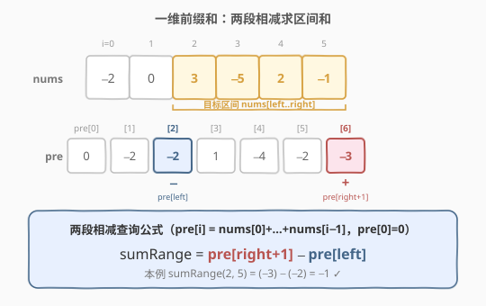
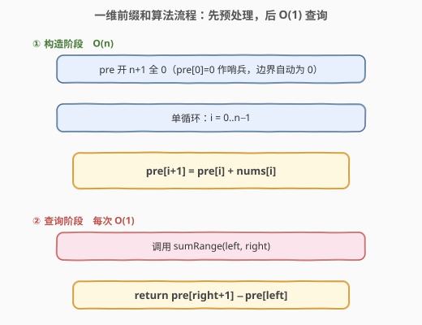
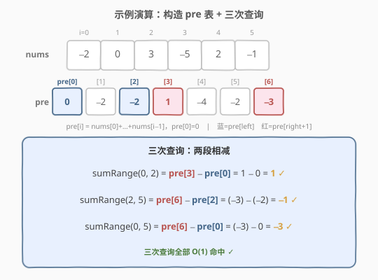

# 区域和检索 - 数组不可变

- **题目名称**：区域和检索 - 数组不可变
- **链接**：[303. 区域和检索 - 数组不可变](https://leetcode.cn/problems/range-sum-query-immutable/)
- **难度**：简单
- **标签**：设计、数组、前缀和

## 1. 题目概述

给定一个整数数组 `nums`，要求实现 `NumArray` 类，能够**多次**查询任意区间的元素之和：

- `NumArray(int[] nums)`：用数组初始化对象。
- `int sumRange(int left, int right)`：返回 `nums[left..right]`（**闭区间**）的元素之和。

**示例 1**：

```text
输入：
["NumArray", "sumRange", "sumRange", "sumRange"]
[[[-2, 0, 3, -5, 2, -1]], [0, 2], [2, 5], [0, 5]]
输出：[null, 1, -1, -3]

解释：
NumArray numArray = new NumArray([-2, 0, 3, -5, 2, -1]);
numArray.sumRange(0, 2); // 返回 (-2) + 0 + 3 = 1
numArray.sumRange(2, 5); // 返回 3 + (-5) + 2 + (-1) = -1
numArray.sumRange(0, 5); // 返回 (-2) + 0 + 3 + (-5) + 2 + (-1) = -3
```

**约束条件**：

- `1 <= nums.length <= 10^4`
- `-10^5 <= nums[i] <= 10^5`
- `0 <= left <= right < nums.length`
- 最多调用 `sumRange` **`10^4`** 次

> ⚠️ 注意：数组**不可变**且查询次数高达 `10^4`——这是「预处理一次、每次查询 `O(1)`」的典型信号，正是**一维前缀和**的标准应用场景。

---

## 2. 解题思路

### 2.1 暴力思路

每次 `sumRange` 直接遍历 `nums[left..right]` 累加。单次查询最坏 $O(n)$，`10^4` 次查询累计可达 $10^4 \cdot 10^4 = 10^8$ 量级，必然超时。

### 2.2 核心观察：一维前缀和 + 两段相减



定义 `pre[i]` 为 `nums[0] + nums[1] + ... + nums[i-1]`（即前 `i` 个元素之和），并令 `pre[0] = 0` 作为哨兵。这样 `pre` 数组长度为 `n+1`，且 `pre[i]` 恰好落在 `nums[i]` 的左边界——直观上表示「`nums[i]` 左侧所有元素之和」。

**构造递推**：

$$
\text{pre}[i+1] = \text{pre}[i] + \text{nums}[i]
$$

即「前 $i+1$ 个元素之和 = 前 $i$ 个元素之和 + 第 $i$ 个元素」。

**查询公式**（两段相减）：

$$
\text{sumRange}(\text{left}, \text{right}) = \text{pre}[\text{right}+1] - \text{pre}[\text{left}]
$$

直观上：`pre[right+1]` 是「到 `nums[right]` 为止的前缀和」（覆盖 `nums[0..right]`），`pre[left]` 是「到 `nums[left-1]` 为止的前缀和」（覆盖 `nums[0..left-1]`），二者相减恰好剩下 `nums[left..right]` 这一段。

> 💡 **关键转化**：构造花 $O(n)$ 一次，之后每次查询只需读 2 个数做 1 次减法——$O(1)$。这正是「数据不可变 + 大量重复查询」的最佳模板，与二维前缀和（[304. 二维区域和检索](../0301-0400/304_二维区域和检索 - 数组不可变.md)）一脉相承，只是把容斥从「四角加减」退化到「两端相减」。

### 2.3 算法流程图



> ⚠️ **下标偏移**：`pre` 比 `nums` 多开一个位置，`nums[i]` 对应 `pre[i+1]`。查询时用 `right+1` 取「到 `right` 为止的前缀」、用 `left` 取「到 `left-1` 为止的前缀」——多开的那一个 `pre[0]=0` 让 `left=0` 的边界查询无需特判。

### 2.4 示例演算

以 `nums = [-2, 0, 3, -5, 2, -1]` 为例，构造出的 `pre` 数组（长度 7，`pre[0]=0`）：

| i            | 0 | 1  | 2  | 3 | 4  | 5  | 6  |
|--------------|---|----|----|---|----|----|----|
| **nums[i−1]** | — | −2 | 0  | 3 | −5 | 2  | −1 |
| **pre[i]**   | 0 | −2 | −2 | 1 | −4 | −2 | −3 |



三次查询对照（蓝 = `pre[left]` 被减，红 = `pre[right+1]` 被加）：

| 查询 | 公式 | 计算 | 结果 |
|------|------|------|------|
| `sumRange(0, 2)` | `pre[3] − pre[0]` | `1 − 0` | `1` ✓ |
| `sumRange(2, 5)` | `pre[6] − pre[2]` | `(−3) − (−2)` | `−1` ✓ |
| `sumRange(0, 5)` | `pre[6] − pre[0]` | `(−3) − 0` | `−3` ✓ |

---

## 3. 参考代码

### C++

```cpp
class NumArray {
  public:
    NumArray(vector<int>& nums) {
        int n = nums.size();
        pre.assign(n + 1, 0);          // pre[0]=0 作哨兵，边界自动为 0
        for (int i = 0; i < n; ++i) {
            pre[i + 1] = pre[i] + nums[i];
        }
    }

    int sumRange(int left, int right) {
        return pre[right + 1] - pre[left];
    }

  private:
    vector<int> pre; // pre[i] = nums[0] + ... + nums[i-1]
};
```

### Python

```python
class NumArray:
    def __init__(self, nums: List[int]):
        # pre[0]=0 作哨兵，边界自动为 0
        self.pre = [0] * (len(nums) + 1)
        for i, x in enumerate(nums):
            self.pre[i + 1] = self.pre[i] + x

    def sumRange(self, left: int, right: int) -> int:
        return self.pre[right + 1] - self.pre[left]
```

> 💡 Python 还可用 `itertools.accumulate` 一行建表：`self.pre = [0] + list(accumulate(nums))`，语义完全等价。

---

## 4. 复杂度分析

| 维度 | 复杂度 | 说明 |
|------|--------|------|
| 构造时间 | $O(n)$ | 单循环遍历 `nums` 每个元素一次，做 $O(1)$ 加法 |
| 单次查询 | $O(1)$ | 只读 2 个数、做 1 次减法 |
| 空间复杂度 | $O(n)$ | `pre` 数组长度 $n+1$，不计输入数组 |

> 💡 若查询次数与数组长度同级（本题 $10^4$ 次查询 vs $10^4$ 元素），$O(1)$ 查询把总时间从暴力的 $O(n \cdot q) \approx O(n^2)$ 压缩到 $O(n + q)$。

---

## 5. 扩展：前缀和家族与可变场景

本题数组**不可变**，纯前缀和就够。一旦支持修改，前缀和就要整体重建：

- **一维可变**（[307. 区域和检索 - 数组可变](../0301-0400/307_区域和检索 - 数组可变.md)）：改用**树状数组（BIT）**，单点更新 $O(\log n)$、区间和 $O(\log n)$。
- **二维不可变**（[304. 二维区域和检索 - 数组不可变](../0301-0400/304_二维区域和检索 - 数组不可变.md)）：把一维前缀和升维，查询从容斥的「两端相减」升级到「四角加减」。
- **差分数组**：前缀和的逆运算。给一段区间都加常数只需改两个端点 $O(1)$，最后前缀和还原（对应 [1109. 航班预订统计](../1101-1200/1109_航班预订统计.md)）。

> 💡 选择信号：**只读 + 大量查询** → 前缀和；**带修改 + 查询** → 树状数组/线段树；**离线区间加 + 最后查询** → 差分数组。

---

## 6. 面试要点

1. **为什么 `pre` 要多开一个位置？**
   - 让 `pre[0] = 0` 成为天然的「空前缀」，查询公式 `pre[right+1] - pre[left]` 在 `left = 0` 时无需特判，代码更简洁、不易越界。

2. **查询公式里为什么是 `right+1` 而不是 `right`？**
   - `pre[i]` 表示的是前 $i$ 个元素之和（到 `nums[i-1]` 为止）。要取「到 `right` 为止的前缀」必须用 `pre[right+1]`；而「到 `left-1` 为止的前缀」用 `pre[left]`。

3. **前缀和能处理负数吗？**
   - 完全可以。前缀和只做加法，不依赖元素非负。本题 `nums` 含负数（如 `-2`、`-5`），`pre` 序列也不单调，但「两段相减」依然成立。注意这与**滑动窗口**（要求元素非负以保证窗口单调性）有本质区别。

4. **如果数组会修改怎么办？**
   - 纯前缀和每次修改要 $O(n)$ 重建。改用树状数组：单点更新与区间查询均为 $O(\log n)$，详见 [307](../0301-0400/307_区域和检索 - 数组可变.md)。

5. **前缀和还有哪些常见变体？**
   - **前缀和 + 哈希**：数和为 K 的子数组个数（[560. 和为 K 的子数组](../0501-0600/560_和为K的子数组.md)）、连续数组（[525](../0501-0600/525_连续数组.md)）、和可被 K 整除的子数组（[974](../0901-1000/974_和可被K整除的子数组.md)）——把「一次区间和查询」升级为「统计满足某条件的区间数」。
   - **差分数组**：区间加 + 点查询的逆运算（[1109](../1101-1200/1109_航班预订统计.md)）。
   - **二维前缀和**：子矩阵和（[304](../0301-0400/304_二维区域和检索 - 数组不可变.md)）。

---

## 7. 同类练习题

- [304. 二维区域和检索 - 数组不可变](https://leetcode.cn/problems/range-sum-query-2d-immutable/)（[题解](../0301-0400/304_二维区域和检索 - 数组不可变.md)）：二维版本，把「两端相减」升级到「四角容斥」
- [307. 区域和检索 - 数组可变](https://leetcode.cn/problems/range-sum-query-mutable/)（[题解](../0301-0400/307_区域和检索 - 数组可变.md)）：带修改的版本，对比前缀和 vs 树状数组的取舍
- [560. 和为 K 的子数组](https://leetcode.cn/problems/subarray-sum-equals-k/)（[题解](../0501-0600/560_和为K的子数组.md)）：前缀和 + 哈希，把「区间和查询」升级到「数和为 K 的区间个数」
- [525. 连续数组](https://leetcode.cn/problems/contiguous-array/)（[题解](../0501-0600/525_连续数组.md)）：前缀和 + 哈希，把 0 当 −1 转化为等价前缀和问题
- [1109. 航班预订统计](https://leetcode.cn/problems/corporate-flight-bookings/)（[题解](../1101-1200/1109_航班预订统计.md)）：差分数组，前缀和的逆运算，对照学习
