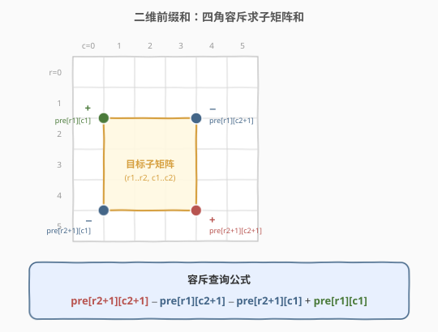
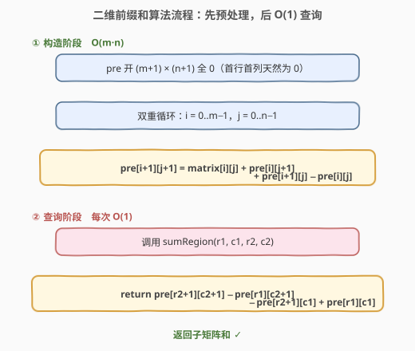
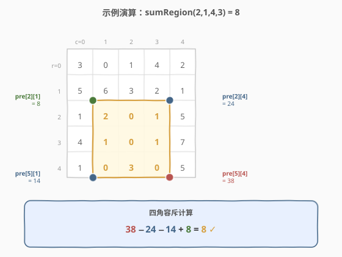

# 二维区域和检索 - 数组不可变

- **题目名称**：二维区域和检索 - 数组不可变
- **链接**：[304. 二维区域和检索 - 数组不可变](https://leetcode.cn/problems/range-sum-query-2d-immutable/)
- **难度**：中等
- **标签**：设计、数组、矩阵、前缀和

## 1. 题目概述

给定一个二维矩阵 `matrix`，要求实现 `NumMatrix` 类，能够**多次**查询任意子矩阵的元素和：

- `NumMatrix(vector<vector<int>>& matrix)`：用矩阵初始化对象。
- `int sumRegion(int row1, int col1, int row2, int col2)`：返回左上角 `(row1, col1)`、右下角 `(row2, col2)`（**包含两端**）的子矩阵元素之和。

**示例 1**：

```text
输入：
["NumMatrix", "sumRegion", "sumRegion", "sumRegion"]
[[[[3,0,1,4,2],[5,6,3,2,1],[1,2,0,1,5],[4,1,0,1,7],[1,0,3,0,5]]],
 [2,1,4,3], [1,1,2,2], [1,2,2,4]]
输出：[null, 8, 11, 12]

解释：
矩阵
  3 0 1 4 2
  5 6 3 2 1
  1 2 0 1 5
  4 1 0 1 7
  1 0 3 0 5
sumRegion(2,1,4,3) = 2+0+1 + 1+0+1 + 0+3+0 = 8
sumRegion(1,1,2,2) = 6+3 + 2+0           = 11
sumRegion(1,2,2,4) = 3+2+1 + 0+1+5       = 12
```

**约束条件**：

- `m == matrix.length`，`n == matrix[i].length`
- `1 <= m, n <= 200`
- `-10^5 <= matrix[i][j] <= 10^5`
- `0 <= row1 <= row2 < m`，`0 <= col1 <= col2 < n`
- 最多调用 `sumRegion` **`10^4`** 次

> ⚠️ 注意：矩阵**不可变**且查询次数高达 `10^4`——这是「预处理一次、每次查询 `O(1)`」的典型信号，正是**二维前缀和**的标准应用场景。

---

## 2. 解题思路

### 2.1 暴力思路

每次 `sumRegion` 直接双重循环遍历 `(row1..row2) × (col1..col2)` 累加。单次查询最坏 `O(m·n)`，`10^4` 次查询可达 `200·200·10^4 = 4·10^8` 量级，必然超时。

### 2.2 核心观察：二维前缀和 + 容斥原理



把一维前缀和推广到二维：定义 `pre[i][j]` 为子矩阵 `(0,0) → (i-1, j-1)` 的元素之和（即左上角 `m·n` 块的总和）。为统一边界，给 `pre` 多开一行一列，令 `pre[0][*] = pre[*][0] = 0`。

**构造递推**（容斥）：

$$
\text{pre}[i+1][j+1] = \text{matrix}[i][j] + \text{pre}[i][j+1] + \text{pre}[i+1][j] - \text{pre}[i][j]
$$

直观上：`pre[i+1][j+1]` 等于当前格子 `matrix[i][j]`，加上「上方那块」`pre[i][j+1]` 与「左方那块」`pre[i+1][j]`，再**减去被重复加了一次的左上角重叠块** `pre[i][j]`。

**查询公式**（容斥）：

$$
\text{sumRegion}(r_1,c_1,r_2,c_2) = \text{pre}[r_2{+}1][c_2{+}1] - \text{pre}[r_1][c_2{+}1] - \text{pre}[r_2{+}1][c_1] + \text{pre}[r_1][c_1]
$$

即「以 `(r2,c2)` 为右下角的大块」减去「目标上方那块」、减去「目标左方那块」，再**加回被多减一次的左上角重叠块」。

> 💡 **关键转化**：构造花 `O(m·n)` 一次，之后每次查询只需读 4 个数做 3 次加减——`O(1)`。这正是「数据不可变 + 大量重复查询」的最佳模板，与一维前缀和（[560. 和为 K 的子数组](../0501-0600/560_和为K的子数组.md)）一脉相承，只是把容斥从「两段相减」升级到「四角加减」。

### 2.3 算法流程图



> ⚠️ **下标偏移**：`pre` 的行列都比 `matrix` 多 1，`matrix[i][j]` 对应 `pre[i+1][j+1]`。查询时用 `r2+1`、`c2+1` 取右下角的「大块」，用 `r1`、`c1` 取左上角——多开的那一行一列让 `(0,*)`、`(*,0)` 这些边界查询无需特判。

### 2.4 示例演算

以上面的 `5×5` 矩阵为例，构造出的 `pre` 表（`6×6`，第一行/第一列为 `0`）：

| | c=0 | c=1 | c=2 | c=3 | c=4 | c=5 |
|------|------|------|------|------|------|------|
| **r=0** | 0 | 0 | 0 | 0 | 0 | 0 |
| **r=1** | 0 | 3 | 3 | 4 | 8 | 10 |
| **r=2** | 0 | 8 | 14 | 18 | 24 | 27 |
| **r=3** | 0 | 9 | 17 | 21 | 28 | 36 |
| **r=4** | 0 | 13 | 22 | 26 | 34 | 49 |
| **r=5** | 0 | 14 | 23 | 30 | 38 | 58 |



查询 `sumRegion(2,1,4,3)`（目标子矩阵：行 `2..4`，列 `1..3`）：

| 角点 | 含义 | 值 |
|------|------|----|
| `pre[r2+1][c2+1] = pre[5][4]` | `(0,0)→(4,3)` 大块 | 38 |
| `pre[r1][c2+1]   = pre[2][4]` | 目标上方一块 | 24 |
| `pre[r2+1][c1]   = pre[5][1]` | 目标左方一块 | 14 |
| `pre[r1][c1]     = pre[2][1]` | 左上角重叠块 | 8 |

$$
\text{sumRegion} = 38 - 24 - 14 + 8 = 8 \quad \checkmark
$$

---

## 3. 参考代码

### C++

```cpp
class NumMatrix {
  public:
    NumMatrix(vector<vector<int>>& matrix) {
        int m = matrix.size(), n = matrix[0].size();
        pre.assign(m + 1, vector<int>(n + 1, 0)); // 多开一行一列，边界自动为 0
        for (int i = 0; i < m; ++i) {
            for (int j = 0; j < n; ++j) {
                pre[i + 1][j + 1] =
                    matrix[i][j] + pre[i][j + 1] + pre[i + 1][j] - pre[i][j];
            }
        }
    }

    int sumRegion(int row1, int col1, int row2, int col2) {
        return pre[row2 + 1][col2 + 1] - pre[row1][col2 + 1]
             - pre[row2 + 1][col1] + pre[row1][col1];
    }

  private:
    vector<vector<int>> pre; // pre[i][j] = matrix[0..i-1][0..j-1] 之和
};
```

### Python

```python
class NumMatrix:
    def __init__(self, matrix: List[List[int]]):
        m, n = len(matrix), len(matrix[0])
        # 多开一行一列，边界自动为 0
        self.pre = [[0] * (n + 1) for _ in range(m + 1)]
        for i in range(m):
            for j in range(n):
                self.pre[i + 1][j + 1] = (
                    matrix[i][j]
                    + self.pre[i][j + 1]
                    + self.pre[i + 1][j]
                    - self.pre[i][j]
                )

    def sumRegion(self, row1: int, col1: int, row2: int, col2: int) -> int:
        return (
            self.pre[row2 + 1][col2 + 1]
            - self.pre[row1][col2 + 1]
            - self.pre[row2 + 1][col1]
            + self.pre[row1][col1]
        )
```

---

## 4. 复杂度分析

| 维度 | 复杂度 | 说明 |
|------|--------|------|
| 构造时间 | $O(m \cdot n)$ | 双重循环遍历矩阵每个元素一次，做 `O(1)` 容斥计算 |
| 单次查询 | $O(1)$ | 只读 4 个数、做 3 次加减 |
| 空间复杂度 | $O(m \cdot n)$ | `pre` 表 `(m+1)×(n+1)`，不计输入矩阵 |

> 💡 若查询次数远多于元素数（本题 `10^4` 次 vs `4·10^4` 元素），`O(1)` 查询带来的收益足以摊平构造开销。

---

## 5. 扩展：可变场景与前缀和家族

本题矩阵**不可变**，所以纯前缀和就够了。一旦支持修改，前缀和就要整体重建：

- **一维可变**（[307. 区域和检索 - 数组可变](../0301-0400/307_区域和检索 - 数组可变.md)）：改用**树状数组（BIT）**，单点更新 `O(log n)`、区间和 `O(log n)`。
- **二维可变**（308. 二维区域和检索 - 可变）：用**二维树状数组**，单点更新 `O(log m·log n)`、子矩阵和 `O(log m·log n)`。
- **二维区间加 + 点查询**：推广**二维差分**，子矩阵加常数用四个角点修改 `O(1)`，再二维前缀和还原（对应一维的 [1109. 航班预订统计](../1101-1200/1109_航班预订统计.md)）。

> 💡 选择信号：**只读 + 大量查询** → 前缀和；**带修改 + 查询** → 树状数组/线段树；**离线区间加 + 最后查询** → 差分数组。

---

## 6. 面试要点

1. **为什么 `pre` 要多开一行一列？**
   - 让 `pre[0][*] = pre[*][0] = 0` 成为天然的「空块」，构造递推和查询公式都无需对 `i=0`、`j=0`、`r1=0`、`c1=0` 做边界特判，代码更简洁、不易越界。

2. **构造公式里为什么要减 `pre[i][j]`？**
   - `pre[i][j+1]`（上方块）和 `pre[i+1][j]`（左方块）都包含了左上角 `pre[i][j]` 那一块，加起来会重复算一次，必须减去。这正是容斥原理的核心。

3. **查询公式里为什么要加回 `pre[r1][c1]`？**
   - 同理：`pre[r1][c2+1]`（目标上方）和 `pre[r2+1][c1]`（目标左方）都包含了左上角 `pre[r1][c1]`，减了两次多减了一份，需要加回。

4. **下标为什么是 `r2+1`、`c2+1` 而不是 `r2`、`c2`？**
   - `pre[i][j]` 表示的是到 `(i-1, j-1)` 为止的块。要取「以 `(r2,c2)` 为右下角的大块」，必须用 `pre[r2+1][c2+1]`；而取「目标上方一块」用 `pre[r1][c2+1]`（到第 `r1-1` 行为止）。

5. **如果矩阵会修改怎么办？**
   - 纯前缀和每次修改要 `O(m·n)` 重建。改用二维树状数组：单点更新与子矩阵查询均为 `O(log m·log n)`，详见 308。

---

## 7. 同类练习题

- [303. 区域和检索 - 数组不可变](https://leetcode.cn/problems/range-sum-query-immutable/)：一维版本，本题的退化基础，先掌握再上二维
- [307. 区域和检索 - 数组可变](https://leetcode.cn/problems/range-sum-query-mutable/)（[题解](../0301-0400/307_区域和检索 - 数组可变.md)）：一维可变，对比前缀和 vs 树状数组的取舍
- [1314. 矩阵区域和](https://leetcode.cn/problems/matrix-block-sum/)：二维前缀和的直接变体，把矩形改成 `k×k` 邻域
- [1074. 元素和为目标值的子矩阵数量](https://leetcode.cn/problems/number-of-submatrices-that-sum-to-target/)：二维前缀和 + 哈希，把 [560](../0501-0600/560_和为K的子数组.md) 升维
- [1109. 航班预订统计](https://leetcode.cn/problems/corporate-flight-bookings/)（[题解](../1101-1200/1109_航班预订统计.md)）：差分数组，前缀和的逆运算，对照学习
