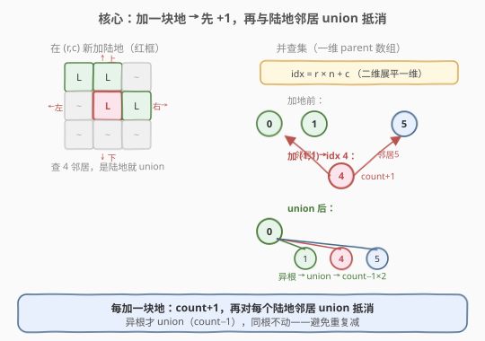
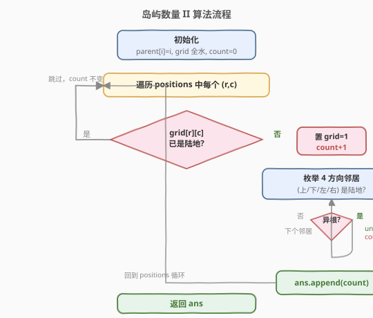
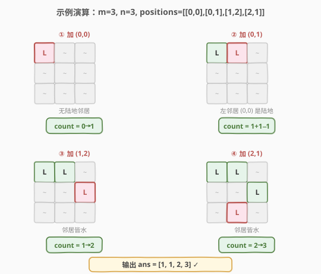

# 岛屿数量 II

- **题目名称**：岛屿数量 II
- **链接**：[305. 岛屿数量 II](https://leetcode.cn/problems/number-of-islands-ii/)
- **难度**：困难
- **标签**：并查集、图、数组

## 1. 题目概述

给定一个 `m × n` 的二维网格，初始**全为水**（`0`）。接下来依次执行若干次 `addLand` 操作，每次把指定位置 `(row, col)` 的水变成陆地。要求在**每次操作之后**，返回当前网格中岛屿的数量。

岛屿由**水平/垂直**相邻的陆地连接而成，被水包围。可假定网格四条边外都是水。

**示例 1**：

```text
输入：m = 3, n = 3, positions = [[0,0],[0,1],[1,2],[2,1]]
输出：[1,1,2,3]

解释：
  操作 (0,0)：新增 1 岛          → 1
  操作 (0,1)：与左邻居 (0,0) 合并 → 1
  操作 (1,2)：四周皆水           → 2
  操作 (2,1)：四周皆水           → 3
```

**示例 2**：

```text
输入：m = 1, n = 2, positions = [[0,0],[0,1]]
输出：[1,1]
```

**约束条件**：

- `1 <= m, n <= 100`
- `1 <= positions.length <= 10^4`
- `positions[i] == [row_i, col_i]`
- `0 <= row_i < m`，`0 <= col_i < n`
- 操作可能**重复**落在同一位置（此时岛屿数不变）

> ⚠️ 关键信号：陆地是**逐块加入**的，且每次都要回答「当前岛屿数」——这是**动态连通性**的招牌场景。朴素做法是每次加地后整体 DFS/BFS 重算连通分量，但 `10^4` 次操作 × 每次 `O(m·n)` 会达到 `10^8` 量级，必然超时。并查集能把每次操作压到近似 $O(\alpha(m \cdot n)) \approx O(1)$。

---

## 2. 解题思路

### 2.1 暴力思路

每次 `addLand` 后，把整个网格当静态图跑一遍 [200. 岛屿数量](../0101-0200/200_岛屿数量.md) 的 DFS 沉岛法（或并查集全量建图），单次 $O(m \cdot n)$，总复杂度 $O(k \cdot m \cdot n)$（$k$ 为操作数）。当 $k = 10^4$、$m = n = 100$ 时约 $10^8$，会超时，且每次都重做大量重复工作。

### 2.2 核心观察：增量并查集——加一块地，先 +1 再抵消



关键洞察是**只看本次新增的那一块地与已有陆地的关系**，而不必重算全局：

1. **加地时先假设它独立成岛**，`count + 1`。
2. 再看它的**四个方向邻居**，凡是已经是陆地的，就尝试 `union`：
   - 若邻居与新地**原本不在同一集合**（异根）→ 合并，`count - 1`（抵消刚才多算的）。
   - 若邻居与新地**已在同一集合**（同根）→ 跳过，**不能重复减**（否则会少算）。
3. 处理完 4 个邻居后，`count` 即为本次操作后的岛屿数。

> 💡 **为什么「先 +1 再抵消」是对的？** 新地要么开辟新岛（无陆地邻居，`+1` 即终值），要么与已有陆地连通（有 $t$ 个异根邻居，`+1` 后被抵消 $t$ 次，净变化 $1 - t$）。对于一块新地，它的 4 个邻居若分属 $g$ 个不同集合，最终会把这 $g$ 个集合与新地合并成 1 个，岛屿数变化恰为 $1 - g$，与「$+1$ 后抵消 $g$ 次」完全一致。

### 2.3 二维坐标一维化

并查集用**一维 `parent` 数组**最简洁。把二维坐标 `(r, c)` 映射为一维下标：

$$
\text{idx} = r \times n + c
$$

其中 $n$ 是列数。这样 `parent` 数组长度为 $m \cdot n$，初始化 `parent[i] = i`。

> ⚠️ **「是否为陆地」必须单独记录**：并查集的 `parent[i] = i` 只是「自成一棵树」的初始态，不代表该格已是陆地。需额外用 `grid[r][c]`（或一个布尔数组）标记哪些格已加地，避免：① 重复加同一格时误判为新增岛屿；② 对水邻居误做 `union`（水格虽 `parent[i]=i` 但不该参与合并）。

### 2.4 算法流程图



> ⚠️ **去重至关重要**：① 同一 `position` 重复出现时，`grid[r][c]` 已是陆地则直接跳过，`count` 不变；② 邻居 `union` 前用 `find` 判同根，同根不 `union`、不 `count-1`，否则会把本就在同一岛内的格子重复抵消导致少算。

### 2.5 示例演算

以 `m=3, n=3, positions=[[0,0],[0,1],[1,2],[2,1]]` 为例：



| 步骤 | 操作 | 邻居情况 | count 变化 | 结果 |
|------|------|----------|------------|------|
| ① | 加 (0,0) | 四周皆水 | $0 \to 1$ | `1` |
| ② | 加 (0,1) | 左邻居 (0,0) 是陆地，异根 → union | $1+1-1 = 1$ | `1` |
| ③ | 加 (1,2) | 邻居皆水 | $1 \to 2$ | `2` |
| ④ | 加 (2,1) | 邻居皆水 | $2 \to 3$ | `3` |

最终输出 `[1, 1, 2, 3]`。

---

## 3. 参考代码

### C++

```cpp
class UnionFind {
  public:
    vector<int> parent;
    vector<int> rank_;
    int count; // 当前岛屿数

    UnionFind(int n) : count(0), parent(n), rank_(n, 0) {
        for (int i = 0; i < n; i++) parent[i] = i;
    }

    int find(int x) {
        if (parent[x] != x) parent[x] = find(parent[x]); // 路径压缩
        return parent[x];
    }

    // 合并 x、y 所在集合；返回是否真的合并了（异根才算）
    bool unite(int x, int y) {
        int rx = find(x), ry = find(y);
        if (rx == ry) return false;          // 同根，不合并
        if (rank_[rx] < rank_[ry]) parent[rx] = ry;
        else if (rank_[rx] > rank_[ry]) parent[ry] = rx;
        else { parent[ry] = rx; rank_[rx]++; }
        return true;
    }
};

class Solution {
    int dx[4] = {0, 0, 1, -1};
    int dy[4] = {1, -1, 0, 0};

  public:
    vector<int> numIslands2(int m, int n, vector<vector<int>>& positions) {
        UnionFind uf(m * n);
        vector<vector<int>> grid(m, vector<int>(n, 0)); // 标记是否已加地
        vector<int> ans;
        ans.reserve(positions.size());

        for (auto& pos : positions) {
            int r = pos[0], c = pos[1];
            if (grid[r][c]) {                 // 重复位置，跳过
                ans.push_back(uf.count);
                continue;
            }
            grid[r][c] = 1;
            uf.count++;                       // 先假设独立成岛
            int idx = r * n + c;
            for (int d = 0; d < 4; d++) {     // 枚举 4 邻居
                int nr = r + dx[d], nc = c + dy[d];
                if (nr < 0 || nr >= m || nc < 0 || nc >= n) continue;
                if (!grid[nr][nc]) continue;  // 水邻居跳过
                int nidx = nr * n + nc;
                if (uf.unite(idx, nidx))      // 异根才合并并 count--
                    uf.count--;
            }
            ans.push_back(uf.count);
        }
        return ans;
    }
};
```

### Python

```python
class Solution:
    def numIslands2(self, m: int, n: int, positions: List[List[int]]) -> List[int]:
        parent = list(range(m * n))
        rank_ = [0] * (m * n)
        grid = [[0] * n for _ in range(m)]
        count = 0
        ans = []
        dirs = [(0, 1), (0, -1), (1, 0), (-1, 0)]

        def find(x):
            while parent[x] != x:
                parent[x] = parent[parent[x]]  # 路径压缩（隔代压缩）
                x = parent[x]
            return x

        def unite(x, y) -> bool:
            rx, ry = find(x), find(y)
            if rx == ry:
                return False
            if rank_[rx] < rank_[ry]:
                parent[rx] = ry
            elif rank_[rx] > rank_[ry]:
                parent[ry] = rx
            else:
                parent[ry] = rx
                rank_[rx] += 1
            return True

        for r, c in positions:
            if grid[r][c]:               # 重复位置
                ans.append(count)
                continue
            grid[r][c] = 1
            count += 1                   # 先假设独立成岛
            idx = r * n + c
            for dr, dc in dirs:
                nr, nc = r + dr, c + dc
                if 0 <= nr < m and 0 <= nc < n and grid[nr][nc]:
                    if unite(idx, nr * n + nc):  # 异根才合并
                        count -= 1
            ans.append(count)
        return ans
```

---

## 4. 复杂度分析

| 维度 | 复杂度 | 说明 |
|------|--------|------|
| 时间复杂度 | $O(k \cdot \alpha(m \cdot n))$ | $k$ 次操作，每次至多 4 次 `find`/`union`，均摊 $O(\alpha)$ ≈ 常数 |
| 空间复杂度 | $O(m \cdot n)$ | `parent`、`rank` 数组及 `grid` 标记矩阵 |

> 💡 由于 $\alpha(n) \le 5$（本题规模内），实际等同于 $O(k)$，相比暴力 $O(k \cdot m \cdot n)$ 快了约 $m \cdot n$ 倍。若 $m \cdot n$ 很大但 $k$ 很小，可改用哈希表存 `parent`，空间降到 $O(k)$。

---

## 5. 扩展：哈希表版并查集（稀疏场景）

当 $m \cdot n$ 很大（如 $10^9$）而操作数 $k$ 较小时，开 $O(m \cdot n)$ 数组不现实。此时**只对真正加过地的格子建并查集节点**，用哈希表（`dict` / `unordered_map`）存 `parent`：

```cpp
unordered_map<int, int> parent, rank_;
int find(int x) {
    if (parent.find(x) == parent.end()) parent[x] = x; // 首次出现，自成一棵树
    if (parent[x] != x) parent[x] = find(parent[x]);
    return parent[x];
}
```

空间降到 $O(k)$，每次操作仍是 $O(\alpha)$。这种「按需建点」的并查集在大网格、稀疏加点的题目中很常见（如 [721. 账户合并](https://leetcode.cn/problems/accounts-merge/) 的字符串节点版）。

---

## 6. 面试要点

1. **为什么不每次加地后整体 DFS 重算？**
   - 每次 DFS $O(m \cdot n)$，$k$ 次操作 $O(k \cdot m \cdot n)$，$k=10^4$、$m=n=100$ 时约 $10^8$ 会超时。并查集每次只处理新地与 4 个邻居，$O(k \cdot \alpha) \approx O(k)$，快约 $m \cdot n$ 倍。本质是利用「每次只增量改变一处」避免全量重算。

2. **为什么加地时先 `count+1` 再对邻居 `union` 抵消？**
   - 新地的最终归属取决于它与已有陆地的关系，事先未知。先假设它独立（`+1`）是最保守的初值；再看邻居，每发现一个**异根**邻居就合并并 `count-1` 抵消。这比「先数邻居再决定 `count` 变化」更不易写错，且天然处理「邻居分属多个不同集合」的情况。

3. **为什么 `union` 前要先 `find` 判同根？同根不 `count-1` 有什么后果？**
   - 新地的 4 个邻居可能本就同属一岛（同根）。若不判同根直接 `count-1`，会把同一集合重复抵消，导致岛屿数少算。例如新地左、上邻居已在同一岛内，错误地 `count-1` 两次会少算 1 个岛。`unite` 返回是否真的合并（异根才 true）正是为此。

4. **重复 position 怎么处理？**
   - 用 `grid[r][c]` 标记是否已加地。若已加地，本次操作不改变任何状态，直接把当前 `count` 塞进答案即可。漏掉这步会导致对同一格重复 `count+1` 并与已合并的邻居「再 union 一次」（虽同根不会真合并，但 `count+1` 已多算）。

5. **二维坐标为什么用 `idx = r*n + c` 一维化？**
   - 并查集本质是「元素到代表元」的映射，与维度无关。一维化后 `parent` 是一维数组，`find`/`union` 代码与 [547. 省份数量](../0501-0600/547_省份数量.md) 完全一致，无需为二维特化模板；列数 $n$ 是行优先展平的步长。

---

## 7. 同类练习题

- [200. 岛屿数量](https://leetcode.cn/problems/number-of-islands/)（[题解](../0101-0200/200_岛屿数量.md)）：静态一次性求连通分量，本题的「单次快照」版，对照 DFS/并查集的取舍
- [547. 省份数量](https://leetcode.cn/problems/number-of-provinces/)（[题解](../0501-0600/547_省份数量.md)）：并查集模板母题，掌握 `find`/`union`/路径压缩/按秩合并的基础
- [684. 冗余连接](https://leetcode.cn/problems/redundant-connection/)：动态加边并查集判环，与本题「逐条加点」同构
- [1319. 连通网络的操作次数](https://leetcode.cn/problems/number-of-operations-to-make-network-connected/)：并查集统计连通分量，求最少接线数
- [721. 账户合并](https://leetcode.cn/problems/accounts-merge/)：哈希表版并查集（字符串节点），对应本题扩展部分的稀疏场景
