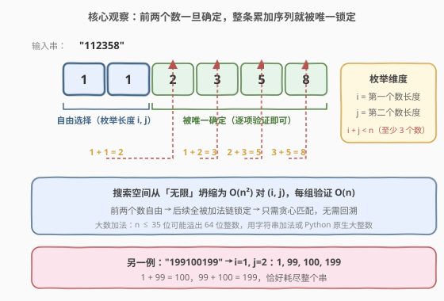
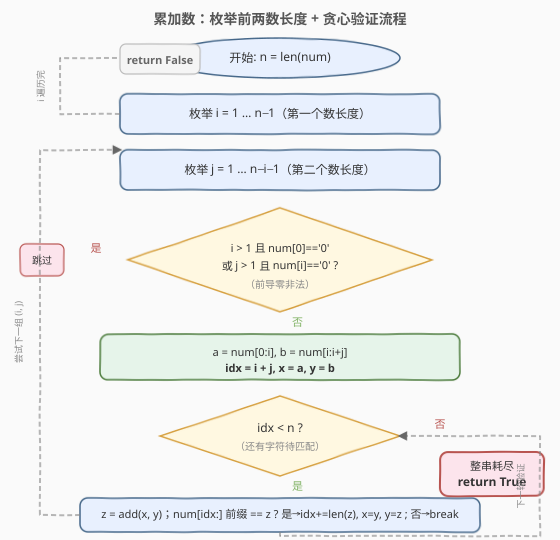
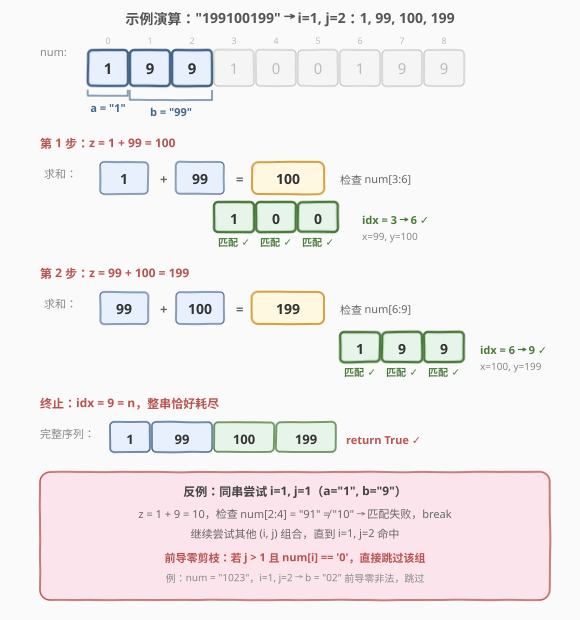

# 累加数

- **题目名称**：累加数
- **链接**：[306. 累加数](https://leetcode.cn/problems/additive-number/)
- **难度**：中等
- **标签**：字符串、回溯、枚举

## 1. 题目概述

**累加数**是一个字符串，其各位数字可以构成一个**累加序列**。一个合法的累加序列至少包含**三个数**，除前两个数外，每个数都等于它前面两个数之和。

给定一个**只含数字**的字符串 `num`，判断它是否是累加数。

**示例 1**：

```text
输入：num = "112358"
输出：true
解释：累加序列为 1, 1, 2, 3, 5, 8
  1 + 1 = 2
  1 + 2 = 3
  2 + 3 = 5
  3 + 5 = 8
```

**示例 2**：

```text
输入：num = "199100199"
输出：true
解释：累加序列为 1, 99, 100, 199
  1  + 99  = 100
  99 + 100 = 199
```

**约束条件**：

- `1 <= num.length <= 35`
- `num` 仅由数字 `0-9` 组成

> ⚠️ 注意两点：①序列至少 **3 个数**，所以前两个数的长度之和必须小于 `n`；②`n ≤ 35` 意味着单个数可能达到十几位，**溢出 64 位整数**，必须用字符串加法（C++）或原生大整数（Python）。

---

## 2. 解题思路

### 2.1 暴力思路：枚举所有切分方式

最朴素的想法是枚举字符串的所有切分点，把 `num` 拆成若干段数字，再逐个验证是否满足累加关系。但切分方式是指数级的，且前两个数之后的切分位置并不自由——一旦前两个数确定，后续每个数都是前两数之和，长度和值都被锁死。盲目枚举全部切分会做大量无用功。

### 2.2 核心观察：前两个数确定整条序列



关键洞察：**累加序列由前两个数完全决定**。给定第一个数 `a` 和第二个数 `b`，第三个数必定是 `a + b`，第四个必定是 `b + (a+b)`，依此类推——后续每一项都被加法链唯一锁定，没有任何自由度。

因此问题从「枚举所有切分」坍缩为：

1. **枚举前两个数的长度** `(i, j)`：第一个数占 `num[0:i]`，第二个数占 `num[i:i+j]`。
2. **贪心验证**：从 `idx = i + j` 起，反复计算 `z = x + y`，检查 `num` 在 `idx` 处是否以 `z` 开头。匹配则 `idx` 前移、滚动 `x, y`；不匹配则该组 `(i, j)` 失败。
3. 若最终 `idx == n`（整串恰好耗尽），则返回 `true`。

> 💡 **为什么是贪心而非回溯？** 因为前两个数固定后，后续没有任何「选择」可做——`z = x + y` 是唯一的，匹配或不匹配是确定的。无需回退尝试别的分支，一条路走到底即可。这与 [93. 复原 IP 地址](../0001-0100/93_复原IP地址.md) 的「每段都有多种合法切法、需回溯」形成对比。

**前导零剪枝**：一个长度大于 1 的数不能以 `'0'` 开头（如 `"02"` 非法，但 `"0"` 本身合法）。在提取 `a`、`b` 后立即检查，可大量减少无效枚举。

**枚举范围**：第三个数的长度 $\ge \max(i, j)$（两数之和至少与较大者同位），所以 $i + j + \max(i, j) \le n$。实际只需 `i` 从 `1` 到 `n-1`、`j` 从 `1` 到 `n-i-1`，由验证函数自然剪枝。$n \le 35$ 时 $O(n^2)$ 组合每组 $O(n)$ 验证，总计 $\sim 4 \times 10^4$ 量级，轻松通过。

### 2.3 算法流程图



**完整步骤**：

1. **双重循环枚举** `(i, j)`：`i` 为第一个数长度，`j` 为第二个数长度，保证 `i + j < n`。
2. **前导零检查**：`i > 1` 且 `num[0] == '0'` → 跳过；`j > 1` 且 `num[i] == '0'` → 跳过。
3. **初始化**：`x = num[0:i]`，`y = num[i:i+j]`，`idx = i + j`。
4. **贪心验证循环**（`idx < n` 时）：
   - 计算 `z = add(x, y)`（字符串大数加法）。
   - 若 `num` 从 `idx` 开始的子串前缀等于 `z`：`idx += len(z)`，滚动 `x = y, y = z`。
   - 否则：`break`，当前 `(i, j)` 失败。
5. **终止判定**：循环退出后若 `idx == n`，返回 `true`；否则继续下一组 `(i, j)`。
6. 所有组合遍历完毕无命中，返回 `false`。

> ⚠️ **大数加法**：`n ≤ 35`，单个数可达 $\sim 12$ 位（超过 `INT_MAX` 的 10 位），在 C++ 中必须用字符串加法（承接 [415. 字符串相加](../0001-0100/415_字符串相加.md)）。Python 原生支持大整数，直接 `int()` 转换相加即可。

### 2.4 示例演算

以 `num = "199100199"` 为例，演示 `i=1, j=2` 的完整验证过程。



**逐步追踪**：

| 步骤 | x | y | z = x + y | 检查区间 | num 子串 | 结果 | idx 变化 |
|------|------|------|-----------|----------|----------|------|----------|
| 初始 | "1" | "99" | — | — | — | — | 3 |
| 1 | 1 | 99 | 100 | `[3:6]` | "100" | ✓ | 3 → 6 |
| 2 | 99 | 100 | 199 | `[6:9]` | "199" | ✓ | 6 → 9 |
| 终止 | 100 | 199 | — | — | — | idx=9=n | return True |

**反例**（同串 `i=1, j=1`）：

| 步骤 | x | y | z = x + y | 检查区间 | num 子串 | 结果 |
|------|------|------|-----------|----------|----------|------|
| 初始 | "1" | "9" | — | — | — | — |
| 1 | 1 | 9 | 10 | `[2:4]` | "91" | ✗ break |

`i=1, j=1` 失败后继续枚举，直到 `i=1, j=2` 命中。前导零剪枝会跳过 `j=2` 且 `num[1]=='0'` 之类的情况，加速搜索。

---

## 3. 参考代码

### C++

```cpp
class Solution {
  public:
    bool isAdditiveNumber(string num) {
        int n = num.size();
        for (int i = 1; i < n; ++i) {
            for (int j = 1; j < n - i; ++j) {
                if (check(num, i, j)) return true;
            }
        }
        return false;
    }

  private:
    bool check(const string& num, int i, int j) {
        if (i > 1 && num[0] == '0') return false;
        if (j > 1 && num[i] == '0') return false;
        string x = num.substr(0, i);
        string y = num.substr(i, j);
        int idx = i + j;
        while (idx < (int)num.size()) {
            string z = addStrings(x, y);
            if (num.compare(idx, z.size(), z) != 0) return false;
            idx += z.size();
            x = y;
            y = z;
        }
        return idx == (int)num.size();
    }

    string addStrings(const string& a, const string& b) {
        string res;
        int i = a.size() - 1, j = b.size() - 1, carry = 0;
        while (i >= 0 || j >= 0 || carry) {
            int sum = carry;
            if (i >= 0) sum += a[i--] - '0';
            if (j >= 0) sum += b[j--] - '0';
            res.push_back((sum % 10) + '0');
            carry = sum / 10;
        }
        reverse(res.begin(), res.end());
        return res;
    }
};
```

### Python

```python
class Solution:
    def isAdditiveNumber(self, num: str) -> bool:
        n = len(num)
        for i in range(1, n):
            for j in range(1, n - i):
                if self._check(num, i, j):
                    return True
        return False

    def _check(self, num: str, i: int, j: int) -> bool:
        if i > 1 and num[0] == '0':
            return False
        if j > 1 and num[i] == '0':
            return False
        x = int(num[:i])
        y = int(num[i:i + j])
        idx = i + j
        while idx < len(num):
            z = x + y
            zs = str(z)
            if not num.startswith(zs, idx):
                return False
            idx += len(zs)
            x, y = y, z
        return idx == len(num)
```

> 💡 **Python vs C++ 差异**：Python 原生大整数让加法零成本，`int()` 直接转换即可；C++ 必须手写 `addStrings`（逻辑同 [415. 字符串相加](../0001-0100/415_字符串相加.md)，从末位起逐位相加、`sum % 10` 写位、`sum / 10` 进位）。`num.compare(idx, z.size(), z)` 一步完成「取出子串并比较」，若 `idx + z.size()` 越界则子串更短、自然不匹配。

---

## 4. 复杂度分析

| 维度 | 复杂度 | 说明 |
|------|--------|------|
| **时间复杂度** | $O(n^3)$ | 枚举 $O(n^2)$ 组 $(i, j)$，每组验证 $O(n)$ 次、每次加法 $O(n)$；$n \le 35$ 时约 $4 \times 10^4$ 量级 |
| **空间复杂度** | $O(n)$ | 存放当前参与加法的字符串 `x`、`y`、`z`，长度均不超过 $n$ |

> 💡 前导零剪枝与「第三个数长度 $\ge \max(i,j)$」的隐式约束将实际搜索空间远小于理论上界。若需进一步优化，可将 `i` 上界收紧为 $n/2$、`j` 上界按 $i + j + \max(i, j) \le n$ 限制。

---

## 5. 扩展：842. 将数组拆分成斐波那契序列

本题的进阶版 [842. 将数组拆分成斐波那契序列](https://leetcode.cn/problems/split-array-into-fibonacci-sequence/) 要求**返回任意一组合法拆分**（而非仅判 true/false），且每个数不超过 $2^{31} - 1$。

**改动要点**：

- 验证函数从返回 `bool` 改为返回**路径列表**，命中时记录所有数。
- 加法结果有上界 $2^{31} - 1$，超出即剪枝（C++ 中可用 `stoll` 配合溢出检测）。
- 其余骨架完全一致：枚举前两数长度 → 贪心验证。

```python
class Solution:
    def splitIntoFibonacci(self, num: str) -> List[int]:
        n = len(num)
        UPPER = 2 ** 31 - 1
        for i in range(1, n):
            for j in range(1, n - i):
                path = self._check(num, i, j, UPPER)
                if path:
                    return path
        return []

    def _check(self, num, i, j, upper):
        if i > 1 and num[0] == '0':
            return None
        if j > 1 and num[i] == '0':
            return None
        x = int(num[:i])
        y = int(num[i:i + j])
        if x > upper or y > upper:
            return None
        path = [x, y]
        idx = i + j
        while idx < len(num):
            z = x + y
            if z > upper:
                return None
            zs = str(z)
            if not num.startswith(zs, idx):
                return None
            path.append(z)
            idx += len(zs)
            x, y = y, z
        return path if (idx == len(num) and len(path) >= 3) else None
```

> 💡 842 是 306 的「构造版」——判定向构造的升级只需把 `return True` 换成 `return path`，加上值域上界剪枝。两题共享同一套「枚举前两数 + 贪心验证」骨架。

---

## 6. 面试要点

1. **为什么说前两个数确定整条序列？**

   - 累加序列的递推关系为 $F_k = F_{k-1} + F_{k-2}$。给定 $F_1 = a$、$F_2 = b$，$F_3 = a+b$、$F_4 = b+(a+b)$……每一项都是前两项之和，没有自由度。所以只需枚举前两个数的**长度**，后续用加法链贪心匹配即可。

2. **为什么用贪心验证而非回溯？**

   - 前两个数固定后，每个后续数 `z = x + y` 是唯一确定的值。在 `num` 的 `idx` 位置，要么子串前缀恰好等于 `z`（匹配，继续），要么不等（失败，无需尝试别的长度）。没有分支可选，自然不需要回溯。对比 [93. 复原 IP 地址](../0001-0100/93_复原IP地址.md) 中每段长度有多种选择才需要回溯。

3. **前导零规则是什么？为什么 `"0"` 合法而 `"02"` 非法？**

   - 题目要求数字不能有前导零（除非数字本身就是 `0`）。`"0"` 是合法的单 digit 数；`"02"` 以 `0` 开头但长度 `> 1`，会被解读为 `2`，与字符串原意不符，非法。实现中：`i > 1 && num[0] == '0'` 或 `j > 1 && num[i] == '0'` 时直接跳过该组。

4. **为什么 C++ 要用字符串加法？Python 不需要吗？**

   - `n ≤ 35`，前两个数可能各占 $\sim 11$ 位，相加结果可达 12 位（$\sim 10^{12}$），而 `INT_MAX` 约 $2.1 \times 10^9$（10 位），`LONG_MAX` 在 32 位平台上也可能不够。C++ 没有原生大整数，需手写字符串加法（同 [415](../0001-0100/415_字符串相加.md)）。Python 的 `int` 天然支持任意精度，直接 `int()` + `+` 即可。

5. **枚举范围能否进一步收紧？**

   - 可以。第三个数 $z = x + y$ 的位数 $\ge \max(\text{len}(x), \text{len}(y))$，所以 $i + j + \max(i, j) \le n$。将 `i` 上界设为 $n // 2$（第一个数不可能超过半串），`j` 循环条件加上 `i + j + max(i, j) <= n`，可减少无效组合。不过 $n \le 35$ 时不优化也能通过。

---

## 7. 同类练习题

- [842. 将数组拆分成斐波那契序列](https://leetcode.cn/problems/split-array-into-fibonacci-sequence/)：本题的构造版，返回任意一组合法拆分，加上 $2^{31}-1$ 值域上界，骨架完全一致
- [415. 字符串相加](https://leetcode.cn/problems/add-strings/)（[题解](../0001-0100/415_字符串相加.md)）：大数字符串加法母题，本题 C++ 实现的 `addStrings` 直接复用其逻辑
- [93. 复原 IP 地址](https://leetcode.cn/problems/restore-ip-addresses/)（[题解](../0001-0100/93_复原IP地址.md)）：字符串切分 + 回溯，对比理解「每段有选择→回溯」vs「前两数锁定→贪心」的差异
- [91. 解码方法](https://leetcode.cn/problems/decode-methods/)：字符串切分 + DP，另一种「如何把数字串切成合法段」的视角
