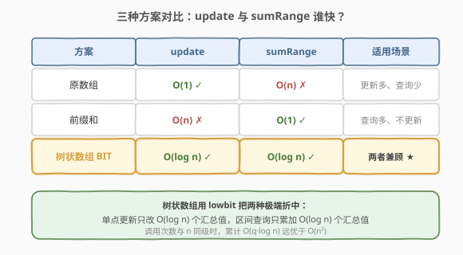
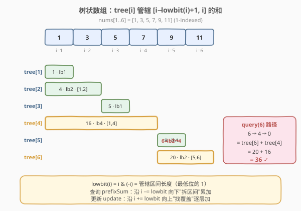
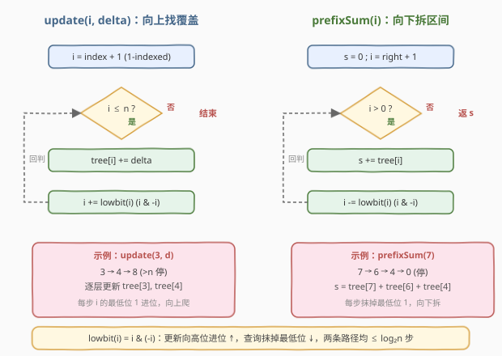
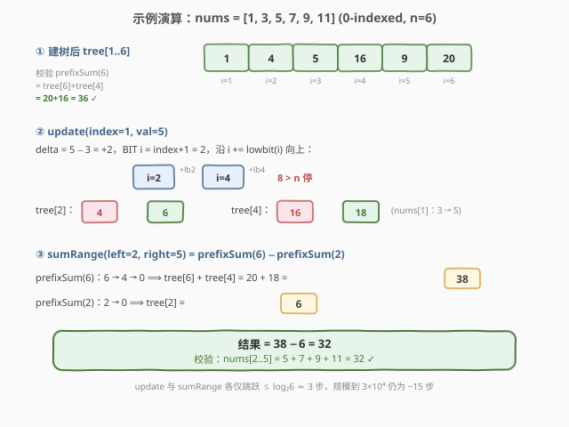

# LeetCode 区域和检索 - 数组可变 题解

## 1. 题目概述

- **标题 / 题号**：区域和检索 - 数组可变（#307，medium）
- **链接**：https://leetcode.cn/problems/range-sum-query-mutable/
- **难度**：中等
- **标签**：设计、树状数组、数组、前缀和

**题意**：给定一个整数数组 `nums`，请实现 `NumArray` 类：

- `NumArray(int[] nums)`：用数组初始化对象。
- `void update(int index, int val)`：将 `nums[index]` 更新为 `val`。
- `int sumRange(int left, int right)`：返回 `nums[left..right]` 的元素和（闭区间）。

**示例**：

```text
输入：
["NumArray", "sumRange", "update", "sumRange"]
[[[1, 3, 5]], [0, 2], [1, 2], [0, 2]]
输出：
[null, 9, null, 8]

解释：
NumArray numArray = new NumArray([1, 3, 5]);
numArray.sumRange(0, 2); // 返回 1 + 3 + 5 = 9
numArray.update(1, 2);   // nums = [1, 2, 5]
numArray.sumRange(0, 2); // 返回 1 + 2 + 5 = 8
```

**约束**：

- `1 <= nums.length <= 3 * 10^4`
- `-100 <= nums[i] <= 100`
- `0 <= index < nums.length`
- `0 <= left <= right < nums.length`
- `update` 与 `sumRange` 的调用总次数 **最多 `3 * 10^4` 次**

> ⚠️ 调用次数与数组长度同级，意味着 `update` 和 `sumRange` 都必须快于 $O(n)$，否则累计 $O(n^2)$ 会超时。

## 2. 解题思路

### 2.1 暴力思路：两种"顾此失彼"的方案



最直观的两种做法各有软肋：

- **原数组**：`update` 直接改一个数 $O(1)$；但 `sumRange` 要把 `left..right` 累加一遍 $O(n)$。查询多时累计 $O(n \cdot q) \approx O(n^2)$ 超时。
- **前缀和** `pre[i] = nums[0]+...+nums[i-1]`：`sumRange = pre[right+1] - pre[left]` $O(1)$；但一次 `update` 会让其后所有前缀和失效，需重建 $O(n)$。更新多时同样退化到 $O(n^2)$。

二者分别把"改一个数"和"求一段和"做到极致，却把对方拖到 $O(n)$。优化方向：找一个**分块存储**结构，让单点更新只改少数几个汇总值、区间查询只累加少数几个汇总值——理想情况下两侧都 $O(\log n)$。这正是**树状数组 (Binary Indexed Tree / Fenwick Tree)**。

### 2.2 核心观察：树状数组的 lowbit 分解



树状数组用一个 1-indexed 的辅助数组 `tree[]`，其中 `tree[i]` 管 **原数组中下标区间 `[i - lowbit(i) + 1, i]` 的和**，`lowbit(i) = i & (-i)` 取 `i` 二进制最低位的 1。

以 `nums[1..6] = [1, 3, 5, 7, 9, 11]` 为例（1-indexed）：

| i  | 二进制 | lowbit | tree[i] 管辖区间 | tree[i] 值     |
|----|--------|--------|------------------|----------------|
| 1  | 001    | 1      | [1, 1]           | 1              |
| 2  | 010    | 2      | [1, 2]           | 1 + 3 = 4      |
| 3  | 011    | 1      | [3, 3]           | 5              |
| 4  | 100    | 4      | [1, 4]           | 1+3+5+7 = 16   |
| 5  | 101    | 1      | [5, 5]           | 9              |
| 6  | 110    | 2      | [5, 6]           | 9 + 11 = 20    |

关键直觉：

- **`tree[i]` 的管辖区间长度恰为 `lowbit(i)`**。`lowbit` 把 `1..n` 切成大小为 1、2、4、8… 的"职责块"，每个原下标被若干层 `tree` 覆盖。
- **前缀和查询 `prefixSum(i)`**：从 `i` 出发，每次 `s += tree[i]` 后 `i -= lowbit(i)`，把 `[1, i]` 拆成若干个互不重叠的 `tree` 块。例如 `prefixSum(6) = tree[6] + tree[4] = 20 + 16 = 36`（路径 `6 → 4 → 0`）。
- **单点更新 `update(i, delta)`**：从 `i` 出发，每次 `tree[i] += delta` 后 `i += lowbit(i)`，沿"覆盖 `i` 的所有祖先"向上爬。例如改 `nums[3]`：`3 → 4 → 8(越界停)`，更新 `tree[3]`、`tree[4]`。

> 💡 一句话：**查询沿 `i -= lowbit(i)` 向下"拆区间"，更新沿 `i += lowbit(i)` 向上"找覆盖"**。两条路径每步都消去/增加一个二进制位，最多 $\log n$ 步。

### 2.3 算法流程图



两个 `while` 循环结构对称、互为镜像：更新向高位走、查询向低位走。每个节点至多被访问 $O(\log n)$ 次。

> ⚠️ **下标约定**：树状数组必须 1-indexed（`lowbit(0) = 0` 会导致死循环）。LeetCode 本题是 0-indexed，因此内部把 `index + 1` 再操作，`sumRange(l, r) = prefixSum(r+1) - prefixSum(l)`。

### 2.4 示例演算



沿用 `nums = [1, 3, 5, 7, 9, 11]`（长度 6），建树后 `tree[1..6] = [1, 4, 5, 16, 9, 20]`。

**操作 1 `update(index=1, val=5)`**（0-indexed，即把 `nums[1]` 从 3 改成 5）：

- `delta = 5 - 3 = 2`，BIT 下标 `i = 1 + 1 = 2`。
- `i = 2 → 4 → 8(>6 停)`：`tree[2]: 4 → 6`，`tree[4]: 16 → 18`。
- 更新后 `nums = [1, 5, 5, 7, 9, 11]`，`tree = [1, 6, 5, 18, 9, 20]`。

**操作 2 `sumRange(left=2, right=5)`**（求 `nums[2..5] = 5+7+9+11`）：

- `prefixSum(6) = tree[6] + tree[4] = 20 + 18 = 38`（路径 `6 → 4 → 0`）。
- `prefixSum(2) = tree[2] = 6`（路径 `2 → 0`）。
- 结果 `= 38 - 6 = 32`，与 `5+7+9+11 = 32` 吻合 ✓。

## 3. 参考代码

### C++

```cpp
class NumArray {
    vector<int> tree;
    int n;

    int lowbit(int x) { return x & (-x); }

    void add(int i, int delta) {        // 1-indexed: tree[i] 及其祖先 += delta
        while (i <= n) {
            tree[i] += delta;
            i += lowbit(i);
        }
    }

    int prefixSum(int i) {              // 1-indexed: sum of nums[1..i]
        int s = 0;
        while (i > 0) {
            s += tree[i];
            i -= lowbit(i);
        }
        return s;
    }

  public:
    NumArray(vector<int>& nums) {
        n = nums.size();
        tree.assign(n + 1, 0);
        for (int i = 0; i < n; ++i)
            add(i + 1, nums[i]);        // O(n log n) 建树
    }

    void update(int index, int val) {
        int old = prefixSum(index + 1) - prefixSum(index);  // 取旧值
        add(index + 1, val - old);                          // 加差量
    }

    int sumRange(int left, int right) {
        return prefixSum(right + 1) - prefixSum(left);
    }
};
```

> 💡 上面的 `update` 用两次 `prefixSum` 取旧值（$O(\log n)$），简洁但稍慢。可额外维护一份原数组 `nums`，`old = nums[index]` $O(1)$ 取值后再 `add`，并把 `nums[index] = val` 同步更新——这是工程上更常用的写法，见下方 Python 版。

### Python

```python
class NumArray:
    def __init__(self, nums: List[int]):
        self.n = len(nums)
        self.nums = nums[:]                 # 保留原数组，O(1) 取旧值
        self.tree = [0] * (self.n + 1)
        for i, v in enumerate(nums):
            self._add(i + 1, v)

    def _lowbit(self, x: int) -> int:
        return x & (-x)

    def _add(self, i: int, delta: int) -> None:
        while i <= self.n:
            self.tree[i] += delta
            i += self._lowbit(i)

    def _prefix(self, i: int) -> int:
        s = 0
        while i > 0:
            s += self.tree[i]
            i -= self._lowbit(i)
        return s

    def update(self, index: int, val: int) -> None:
        delta = val - self.nums[index]
        self.nums[index] = val
        self._add(index + 1, delta)

    def sumRange(self, left: int, right: int) -> int:
        return self._prefix(right + 1) - self._prefix(left)
```

## 4. 复杂度分析

| 维度 | 复杂度 | 说明 |
|------|--------|------|
| 时间 · 建树 | $O(n \log n)$ | 逐个 `add`，每个 $O(\log n)$；可用线性建树优化到 $O(n)$ |
| 时间 · `update` | $O(\log n)$ | `i += lowbit(i)` 每步把最低位的 1 进位，最多 $\log n$ 步 |
| 时间 · `sumRange` | $O(\log n)$ | 两次 `prefixSum`，每次 $\log n$ |
| 空间 | $O(n)$ | `tree` 数组长度 $n+1$ |

> 💡 **线性建树**：先令 `tree[i] = nums[i]`，再 `tree[i] += tree[i - lowbit(i)]`（把紧邻的下一层块累加上来），整体 $O(n)$。面试中 $O(n \log n)$ 建树已足够，线性建树作为加分项提一句即可。

## 5. 扩展：线段树 vs 树状数组

树状数组能处理的操作本质是**可结合、可差分**的运算（和、异或、积；最值因不能差分需谨慎）。当需要"区间更新 + 区间查询"（如给一段都加 `delta` 再查区间和），树状数组需用**差分 + 二阶前缀**推广；而**线段树 (Segment Tree)** 用懒标记天然支持区间更新，适用面更广但代码更长。

选择经验：

- 只需**单点更新 + 区间查询** → 树状数组（代码短、常数小）。
- 需要**区间更新**或维护复杂信息（最值、历史值）→ 线段树。
- 需要**动态第 K 小 / 名次** → 树状数组 + 值域（或权值线段树）。

## 6. 面试要点

1. **为什么树状数组必须 1-indexed？**
   - `lowbit(0) = 0`，`update` 中 `i += 0` 死循环、`prefixSum` 中 `i -= 0` 也死循环。故下标从 1 起，0 作为循环终止哨兵。

2. **`lowbit(i) = i & (-i)` 的原理？**
   - `-i` 是 `i` 的补码（按位取反加一），与 `i` 相与后只剩最低位的 1。例如 `i = 6 (110)`，`-i` 的低位为 `...010`，`6 & -6 = 2 (010)`。

3. **`update` 和 `sumRange` 为什么是 $O(\log n)$？**
   - `i += lowbit(i)` 每步把最低位的 1 进位到更高位，最高位逐步升高，最多 $\log n$ 步到越界；`i -= lowbit(i)` 每步抹掉最低位的 1，1 的数量严格递减，最多 $\log n$ 步到 0。

4. **如何处理"改成 `val`"而非"加 `delta`"？**
   - 维护一份原数组 `nums`，`delta = val - nums[index]`，更新后 `nums[index] = val`。若不维护原数组，可用 `prefixSum(index+1) - prefixSum(index)` 取旧值，但多花一次查询。

5. **树状数组能求"区间最大值"吗？**
   - 单点更新 + 区间最大可以（`tree[i]` 存 `max`），但**不能差分**，故 `sumRange` 那种"前缀相减"不适用；区间最大一般用线段树或 ST 表。这是树状数组的边界。

## 同类练习题

| # | 题目 | 与本题的关联 |
|---|------|-------------|
| 303 | [区域和检索 - 数组不可变](https://leetcode.cn/problems/range-sum-query-immutable/) | 无 `update`，前缀和即可，是本题的"静态版"铺垫 |
| 308 | [二维区域和检索 - 数组可变](https://leetcode.cn/problems/range-sum-query-2d-mutable/) | 把树状数组推广到二维，思路类比 |
| 315 | [计算右侧小于当前元素的个数](https://leetcode.cn/problems/count-of-smaller-numbers-after-self/) | 树状数组求逆序对，按值域离散化后单点更新 + 前缀查询 |
| 327 | [区间和的个数](https://leetcode.cn/problems/count-of-range-sum/) | 前缀和 + 树状数组（或归并）计数，含负数的进阶版 |
| 493 | [翻转对](https://leetcode.cn/problems/reverse-pairs/) | 归并或树状数组计数，与 315 同套路 |
