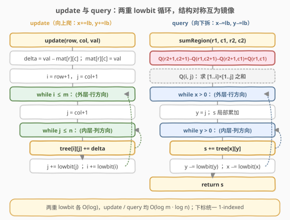
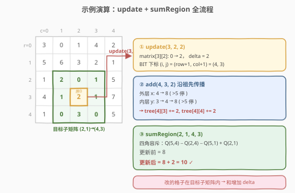

# 二维区域和检索 - 矩阵可修改

- **题目名称**：二维区域和检索 - 矩阵可修改
- **链接**：[308. 二维区域和检索 - 矩阵可修改](https://leetcode.cn/problems/range-sum-query-2d-mutable/)
- **难度**：困难
- **标签**：设计、树状数组、二维、矩阵、前缀和

## 1. 题目概述

给定一个二维矩阵 `matrix`，要求实现 `NumMatrix` 类，支持**单点修改**与**多次**子矩阵求和查询：

- `NumMatrix(vector<vector<int>>& matrix)`：用矩阵初始化对象。
- `void update(int row, int col, int val)`：将 `matrix[row][col]` 更新为 `val`。
- `int sumRegion(int row1, int col1, int row2, int col2)`：返回左上角 `(row1, col1)`、右下角 `(row2, col2)`（**包含两端**）的子矩阵元素之和。

> ⚠️ 本题是 [304（不可变版）](../0301-0400/304_二维区域和检索%20-%20数组不可变.md) 的进阶：矩阵从「只读」变成「可单点修改」。304 的纯二维前缀和在此失效，因为一次 `update` 会让其后的前缀和整体失效。

**示例 1**：

```text
输入：
["NumMatrix", "sumRegion", "update", "sumRegion"]
[[[[3,0,1,4,2],[5,6,3,2,1],[1,2,0,1,5],[4,1,0,1,7],[1,0,3,0,5]]],
 [2,1,4,3], [3,2,2], [2,1,4,3]]
输出：[null, 8, null, 10]

解释：
矩阵
  3 0 1 4 2
  5 6 3 2 1
  1 2 0 1 5
  4 1 0 1 7
  1 0 3 0 5
sumRegion(2,1,4,3) = 2+0+1 + 1+0+1 + 0+3+0 = 8
update(3,2,2)       // matrix[3][2] 由 0 改为 2
sumRegion(2,1,4,3) = 2+0+1 + 1+2+1 + 0+3+0 = 10
```

**约束条件**：

- `m == matrix.length`，`n == matrix[i].length`
- `1 <= m, n <= 200`
- `-10^5 <= matrix[i][j] <= 10^5`
- `0 <= row < m`，`0 <= col < n`
- `0 <= row1 <= row2 < m`，`0 <= col1 <= col2 < n`
- `update` 与 `sumRegion` 的调用总次数 **最多 `10^4`** 次

> ⚠️ 修改与查询交替出现、且总次数与元素量同级（`10^4` vs `200×200=4·10^4`）。这意味着两种操作都必须快于 $O(m \cdot n)$，否则累计到 $O(m \cdot n \cdot q)$ 量级必然超时。这正是「带修改的区间查询」的典型信号——**二维树状数组**的标准应用场景。

---

## 2. 解题思路

### 2.1 暴力思路：两种"顾此失彼"的方案

沿用 [307（一维可变）](../0301-0400/307_区域和检索%20-%20数组可变.md) 的分析，把一维的两种极端方案各升一维：

- **原矩阵**：`update` 直接改一个格子 $O(1)$；但 `sumRegion` 要双重循环遍历 `(r1..r2) × (c1..c2)` 累加，单次最坏 $O(m \cdot n)$，$10^4$ 次累计约 $4 \cdot 10^8$ 超时。
- **二维前缀和**（304 的做法）：`sumRegion` 四角容斥 $O(1)$；但一次 `update` 会让其右下方所有 `pre` 失效，重建需 $O(m \cdot n)$，更新多时同样退化到 $O(m \cdot n \cdot q)$。

二者分别把"改一格"和"求一块和"做到极致，却把对方拖到 $O(m \cdot n)$。优化方向与 307 完全一致：找一个**分块存储**结构，让单点更新只改少数汇总值、子矩阵查询只累加少数汇总值——理想情况下两侧都 $O(\log m \cdot \log n)$。把一维树状数组再升一维，就是**二维树状数组**。

### 2.2 核心观察：二维树状数组 = 行 BIT × 列 BIT

![二维树状数组：tree[i][j] 管辖一个矩形区域](../images/rsq2dm_concept.svg)

把一维树状数组推广到二维：用 1-indexed 的辅助矩阵 `tree[i][j]`，其中 `tree[i][j]` 管辖**原矩阵中矩形区域 `[i - lowbit(i) + 1, i] × [j - lowbit(j) + 1, j]` 的元素之和**。

也就是说，`tree[i][j]` 管辖的矩形**宽为 `lowbit(i)`、高为 `lowbit(j)`**（以「行数 × 列数」计）。这恰好是一维 `tree[i]` 管辖长度 `lowbit(i)` 的笛卡尔积——**二维 BIT 本质上是"行方向套一层 BIT、列方向再套一层 BIT"**。

> 💡 **关键直觉**：一维 BIT 里 `tree[i]` 管的是「一根长度为 `lowbit(i)` 的线段」；二维 BIT 里 `tree[i][j]` 管的是「一块 `lowbit(i) × lowbit(j)` 的矩形」。两维的 `lowbit` 分解互相独立，因此查询和更新都只需把一维的 `while` 循环**嵌套**起来。

**前缀查询 `query(i, j)`**（1-indexed，求 `[1..i] × [1..j]` 之和）：外层沿 `x -= lowbit(x)` 把行方向拆成若干 `tree` 行，内层沿 `y -= lowbit(y)` 把每个 `tree` 行的列方向再拆——两重循环各 $O(\log)$，合计 $O(\log m \cdot \log n)$。

**单点更新 `add(i, j, delta)`**（1-indexed）：外层沿 `x += lowbit(x)` 找覆盖第 `i` 行的所有祖先行，内层沿 `y += lowbit(y)` 找覆盖第 `j` 列的所有祖先列，逐一 `+= delta`——同样是两重 $O(\log)$。

**子矩阵查询**（容斥，与 304 的四角公式同构）：

$$
\text{sumRegion}(r_1,c_1,r_2,c_2) = Q(r_2{+}1,\,c_2{+}1) - Q(r_1,\,c_2{+}1) - Q(r_2{+}1,\,c_1) + Q(r_1,\,c_1)
$$

其中 $Q(i,j)$ 即上面的 `query(i,j)`。注意：304 的 `pre[i][j]` 是 $O(1)$ 直接读表，这里的 $Q(i,j)$ 是 $O(\log^2)$ 在线计算——这是「可变」换来的代价。

### 2.3 算法流程图



两个操作的结构高度对称，与 307 的一维版本一脉相承，只是每个 `while` 里再嵌一个 `while`：

- **`update`（向上爬）**：`x += lowbit(x)` / `y += lowbit(y)`，沿"覆盖该格的所有祖先矩形"逐层加 `delta`。
- **`query`（向下拆）**：`x -= lowbit(x)` / `y -= lowbit(y)`，把 `[1..i]×[1..j]` 拆成若干互不重叠的 `tree` 矩形累加。

> ⚠️ **下标约定**：与一维 BIT 相同，二维 BIT 必须 1-indexed（`lowbit(0)=0` 会导致死循环）。LeetCode 本题是 0-indexed，因此 `update(r,c)` 内部用 `(r+1, c+1)` 操作；`sumRegion` 用 `r2+1`、`c2+1` 取右下角大块，与 304 的下标偏移完全一致。

### 2.4 示例演算



沿用示例的 `5×5` 矩阵，建树后 `tree` 是 `(5+1)×(5+1)` 的 1-indexed 表。

**操作 1 `sumRegion(2, 1, 4, 3)`**（查询行 `2..4`、列 `1..3` 的子矩阵和）：

按四角容斥拆成 4 次 `query`（均 1-indexed）：

| 角点 | 调用 | 含义 |
|------|------|------|
| 右下大块 | `Q(5, 4)` | `(0,0)→(4,3)` 大块 |
| 目标上方 | `Q(2, 4)` | 到第 `1` 行为止 |
| 目标左方 | `Q(5, 1)` | 到第 `0` 列为止 |
| 左上重叠 | `Q(2, 1)` | 左上角小块 |

$$
\text{sumRegion} = Q(5,4) - Q(2,4) - Q(5,1) + Q(2,1) = 8 \quad \checkmark
$$

**操作 2 `update(3, 2, 2)`**（把 `matrix[3][2]` 从 `0` 改成 `2`）：

- `delta = 2 - 0 = 2`，同步 `mat[3][2] = 2`。
- BIT 下标 `i = 3+1 = 4`，`j = 2+1 = 3`。
- 外层 `x = 4 → 8(>5 停)`；内层对每个 `x`，`y = 3 → 4 → 8(>5 停)`。
- 仅触及 `tree[4][3]` 和 `tree[4][4]`（各 `+= 2`），共 $2 \times 2 = 4$ 个节点中最末两个——可见更新成本远低于重建整张前缀和表。

**操作 3 `sumRegion(2, 1, 4, 3)`**（再次查询同一区域）：

由于 `matrix[3][2]` 落在目标子矩阵内（行 `2..4`、列 `1..3`），和增加了 `delta = 2`：

$$
\text{sumRegion} = 8 + 2 = 10 \quad \checkmark
$$

---

## 3. 参考代码

### C++

```cpp
class NumMatrix {
    vector<vector<int>> tree;
    vector<vector<int>> mat;   // 原矩阵副本，O(1) 取旧值
    int m, n;

    int lowbit(int x) { return x & (-x); }

    void add(int i, int j, int delta) {        // 1-indexed: tree[i][j] 及其祖先 += delta
        for (int x = i; x <= m; x += lowbit(x))
            for (int y = j; y <= n; y += lowbit(y))
                tree[x][y] += delta;
    }

    int query(int i, int j) {                   // 1-indexed: sum of [1..i] x [1..j]
        int s = 0;
        for (int x = i; x > 0; x -= lowbit(x))
            for (int y = j; y > 0; y -= lowbit(y))
                s += tree[x][y];
        return s;
    }

  public:
    NumMatrix(vector<vector<int>>& matrix) {
        m = matrix.size();
        n = matrix[0].size();
        tree.assign(m + 1, vector<int>(n + 1, 0));
        mat.assign(m, vector<int>(n, 0));
        for (int i = 0; i < m; ++i)
            for (int j = 0; j < n; ++j) {
                mat[i][j] = matrix[i][j];
                add(i + 1, j + 1, matrix[i][j]);   // O(m·n·log m·log n) 建树
            }
    }

    void update(int row, int col, int val) {
        int delta = val - mat[row][col];
        mat[row][col] = val;
        add(row + 1, col + 1, delta);
    }

    int sumRegion(int row1, int col1, int row2, int col2) {
        return query(row2 + 1, col2 + 1)
             - query(row1, col2 + 1)
             - query(row2 + 1, col1)
             + query(row1, col1);
    }
};
```

### Python

```python
class NumMatrix:
    def __init__(self, matrix: List[List[int]]):
        self.m, self.n = len(matrix), len(matrix[0])
        self.tree = [[0] * (self.n + 1) for _ in range(self.m + 1)]
        self.mat = [[0] * self.n for _ in range(self.m)]
        for i in range(self.m):
            for j in range(self.n):
                self.mat[i][j] = matrix[i][j]
                self._add(i + 1, j + 1, matrix[i][j])

    def _lowbit(self, x: int) -> int:
        return x & (-x)

    def _add(self, i: int, j: int, delta: int) -> None:
        x = i
        while x <= self.m:
            y = j
            while y <= self.n:
                self.tree[x][y] += delta
                y += self._lowbit(y)
            x += self._lowbit(x)

    def _query(self, i: int, j: int) -> int:
        s = 0
        x = i
        while x > 0:
            y = j
            while y > 0:
                s += self.tree[x][y]
                y -= self._lowbit(y)
            x -= self._lowbit(x)
        return s

    def update(self, row: int, col: int, val: int) -> None:
        delta = val - self.mat[row][col]
        self.mat[row][col] = val
        self._add(row + 1, col + 1, delta)

    def sumRegion(self, row1: int, col1: int, row2: int, col2: int) -> int:
        return (
            self._query(row2 + 1, col2 + 1)
            - self._query(row1, col2 + 1)
            - self._query(row2 + 1, col1)
            + self._query(row1, col1)
        )
```

> 💡 **为何维护 `mat` 副本？** `update` 需要算 `delta = val - 旧值`。若不存原矩阵，就得用 `query(r+1,c+1) - query(r,c+1) - query(r+1,c) + query(r,c)` 反算单格旧值（4 次 $O(\log^2)$ 查询），既慢又绕。维护一份 `mat` 用 $O(1)$ 取旧值，是工程上更简洁的写法——这与 307 的处理完全一致。

---

## 4. 复杂度分析

| 维度 | 复杂度 | 说明 |
|------|--------|------|
| 时间 · 建树 | $O(m \cdot n \cdot \log m \cdot \log n)$ | 逐格 `add`，每格 $O(\log m \cdot \log n)$；可用"先填底层再逐层累加"优化到 $O(m \cdot n)$ |
| 时间 · `update` | $O(\log m \cdot \log n)$ | 两重 `lowbit` 上升循环，每重最多 $\log$ 步 |
| 时间 · `sumRegion` | $O(\log m \cdot \log n)$ | 4 次 `query`，每次两重 `lowbit` 下降循环 |
| 空间 | $O(m \cdot n)$ | `tree` 矩阵 $(m+1) \times (n+1)$ + `mat` 副本 $m \times n$ |

> 💡 本题 $m, n \le 200$，$\log_2 200 \approx 7.6$，故单次操作约 $8 \times 8 = 64$ 步，$10^4$ 次操作约 $6.4 \cdot 10^5$ 步，远在时限内。对比暴力 `sumRegion` $O(m \cdot n) = 4 \cdot 10^4$、$10^4$ 次累计 $4 \cdot 10^8$，二维 BIT 带来约 $600\times$ 的提速。

---

## 5. 扩展：二维线段树与区间更新

二维树状数组擅长**单点更新 + 子矩阵查询**。当需求更强时：

- **子矩阵加 + 点查询**：推广**二维差分**。给子矩阵 `(r1,c1)→(r2,c2)` 整体加 `v`，只需在四个角点修改 `diff[r1][c1]+=v, diff[r2+1][c1]-=v, diff[r1][c2+1]-=v, diff[r2+1][c2+1]+=v`，再二维前缀和还原——单次 $O(1)$，离线最后查询。这是一维 [1109. 航班预订统计](../1101-1200/1109_航班预订统计.md) 的升维。
- **子矩阵加 + 子矩阵和**：二维差分 + 二阶前缀的树状数组推广，或改用**二维线段树（四叉树结构）**。线段树用懒标记天然支持区间更新，但代码量大、常数高，面试中能讲清思路即可。
- **动态第 K 小（二维）**：可用树状数组套权值线段树（CDQ 分治亦可）。

> 💡 选择信号（二维版）：**只读 + 大量查询** → 二维前缀和（304）；**单点改 + 查询** → 二维树状数组（308）；**离线子矩阵加 + 最后查** → 二维差分；**在线子矩阵加 + 子矩阵查** → 二维线段树。

---

## 6. 面试要点

1. **为什么不能用 304 的二维前缀和？**
   - 前缀和表 `pre[i][j]` 依赖其左上方所有格子。改 `(r,c)` 一格，会让 `pre[i][j]`（`i>r, j>c`）全部失效，重建 $O(m \cdot n)$。修改与查询交替时累计到 $O(m \cdot n \cdot q)$ 超时。需要分块结构让更新只动少数汇总值——二维树状数组。

2. **二维树状数组为什么是 $O(\log m \cdot \log n)$ 而不是 $O(\log(m \cdot n))$？**
   - 两维的 `lowbit` 分解互相独立：外层行方向最多 $\log m$ 步，每步内层列方向最多 $\log n$ 步，相乘得 $\log m \cdot \log n$。这与一维 BIT 的 $O(\log n)$ 本质相同，只是多套了一层。

3. **`tree[i][j]` 管辖的矩形怎么确定？**
   - 行方向管 `[i - lowbit(i) + 1, i]`，列方向管 `[j - lowbit(j) + 1, j]`，笛卡尔积得 `lowbit(i) × lowbit(j)` 的矩形。这是一维 `tree[i]` 管辖 `lowbit(i)` 长线段的自然推广。

4. **`sumRegion` 的四角公式与 304 有何异同？**
   - 形式完全一致（容斥：右下大块 − 上方 − 左方 + 左上重叠）。区别仅在 `Q(i,j)` 的取法：304 是 $O(1)$ 查表，308 是 $O(\log^2)$ 在线计算。下标偏移规则（`r2+1`、`c2+1`）也完全沿用 304。

5. **建树能否优化到 $O(m \cdot n)$？**
   - 可以。先令 `tree[i][j] = matrix[i-1][j-1]`，再对每个 `i` 把 `tree[i][j] += tree[i][j - lowbit(j)]`（列方向合并），最后对每个 `j` 把 `tree[i][j] += tree[i - lowbit(i)][j]`（行方向合并），整体 $O(m \cdot n)$。面试中 $O(m \cdot n \cdot \log^2)$ 建树已足够，线性建树作为加分项提一句即可。

---

## 7. 同类练习题

- [304. 二维区域和检索 - 数组不可变](https://leetcode.cn/problems/range-sum-query-2d-immutable/)（[题解](../0301-0400/304_二维区域和检索%20-%20数组不可变.md)）：不可变版，纯二维前缀和 $O(1)$ 查询，是本题的"静态版"铺垫
- [307. 区域和检索 - 数组可变](https://leetcode.cn/problems/range-sum-query-mutable/)（[题解](../0301-0400/307_区域和检索%20-%20数组可变.md)）：一维可变，先掌握一维 BIT 再升维到本题
- [303. 区域和检索 - 数组不可变](https://leetcode.cn/problems/range-sum-query-immutable/)：一维不可变，前缀和家族的最简起点
- [1314. 矩阵区域和](https://leetcode.cn/problems/matrix-block-sum/)：二维前缀和变体，把矩形改成 `k×k` 邻域
- [1109. 航班预订统计](https://leetcode.cn/problems/corporate-flight-bookings/)（[题解](../1101-1200/1109_航班预订统计.md)）：一维差分，理解后可推广到二维差分做"子矩阵加 + 点查询"
