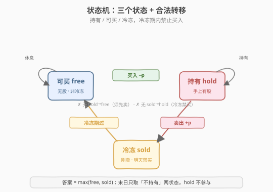
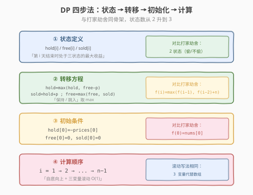

# LeetCode 买卖股票的最佳时机含冷冻期 题解

## 1. 题目概述

- **标题 / 题号**：买卖股票的最佳时机含冷冻期（#309，medium）
- **链接**：https://leetcode.cn/problems/best-time-to-buy-and-sell-stock-with-cooldown/
- **难度**：中等
- **标签**：动态规划、状态机

**题意**：给定一个整数数组 `prices`，其中 `prices[i]` 表示第 `i` 天的股票价格。你可以完成**尽可能多的交易**（多次买卖），但必须遵守规则：**卖出股票后第二天无法买入**（即有一天冷冻期）。求能获得的最大利润。

**示例 1**：

```text
输入：prices = [1,2,3,0,2]
输出：3
解释：第 0 天买入（1），第 1 天卖出（2）→ 收益 1；
     第 1 天卖出后第 2 天冷冻，第 3 天买入（0），第 4 天卖出（2）→ 收益 2。
     总收益 = 1 + 2 = 3。
```

**示例 2**：

```text
输入：prices = [1]
输出：0
解释：只有一天，无法完成交易，收益 0。
```

**约束**：

- `1 <= prices.length <= 5000`
- `0 <= prices[i] <= 1000`

> 💡 这是「股票系列」里最经典的 **状态机 DP** 入门题。和 [198. 打家劫舍](../0101-0200/198_打家劫舍.md) 的「偷/不偷」两状态相比，本题因为**冷冻期**多出一个状态——「刚卖完、明天不能买」。掌握这三状态机，就能统一理解整个股票系列（122/123/188/714），也可顺带打通打家劫舍系列。**一道题学一个模板**，正是本题的价值。

## 2. 解题思路

### 2.1 暴力思路：DFS 枚举每天操作

每天有三种选择：买入、卖出、休息。用 DFS 枚举所有合法序列（卖出后必须休息一天），取最大收益：

```text
dfs(i, holding, cooldown):
    if i == n: return 0
    best = dfs(i+1, holding, false)           # 休息
    if holding:
        best = max(best, prices[i] + dfs(i+1, false, true))   # 卖出 → 进冷冻
    elif not cooldown:
        best = max(best, -prices[i] + dfs(i+1, true, false))  # 买入（冷冻期不可买）
    return best
```

每天最多 2 个分支，状态空间 `O(n × 2 × 2)`，看似可记忆化，但暴力写法没有提炼出「状态」的本质，转移不清晰。`n=5000` 时常数大、易错。

> ⚠️ 暴力法的真正问题不在超时（记忆化后是 `O(n)`），而在于**状态定义不直观**——用 `(holding, cooldown)` 两个布尔拼出 4 种组合，其中「持有且冷冻」是非法的废状态。把合法的 3 种组合提炼成**命名状态**，就是状态机 DP 的起点。

### 2.2 核心观察：三状态机

把任一交易日结束时所处的「处境」归为**三个互斥状态**：

| 状态 | 含义 | 明天能做什么 |
|------|------|------------|
| **`hold`（持有）** | 手上有股票 | 卖出 / 继续持有 |
| **`free`（可买）** | 手上无股票、且不在冷冻期 | 买入 / 继续休息 |
| **`sold`（冷冻）** | 手上无股票、且**今天刚卖** | 只能休息（明天转为可买） |

> 关键洞察：「冷冻」是一个**独立状态**而非附加标记。因为「刚卖出」和「早就空仓」虽然都是「不持有」，但**明天能不能买**不同——前者不能、后者能。把二者拆成 `sold` 与 `free` 两个状态，转移就变得干净。

状态之间的合法转移（带收益变化）：



- `free → hold`：买入，收益 `-prices[i]`
- `hold → sold`：卖出，收益 `+prices[i]`
- `sold → free`：冷冻期结束，回到可买
- `free → free`、`hold → hold`：原地休息

注意：**没有 `hold → free` 的直接边**（持有想变空仓必须先卖出，进入 `sold`）；**没有 `sold → hold` 的边**（冷冻期不能买）。这两条禁边正是冷冻期的体现。

### 2.3 算法流程图



**四步法**（与打家劫舍同骨架，状态数从 2 升到 3）：

1. **状态定义**：`hold[i] / free[i] / sold[i]` 分别表示第 `i` 天结束时处于三状态的最大收益。
2. **转移方程**（每个状态取「保持」与「跳入」两者较大值）：

   $$\text{hold}[i] = \max(\text{hold}[i-1],\ \text{free}[i-1] - \text{prices}[i])$$

   $$\text{sold}[i] = \text{hold}[i-1] + \text{prices}[i]$$

   $$\text{free}[i] = \max(\text{free}[i-1],\ \text{sold}[i-1])$$

3. **初始条件**：第 0 天只能「买入」或「休息」——`hold[0] = -prices[0]`、`free[0] = 0`、`sold[0] = 0`。
4. **计算顺序**：`i = 1 → n-1` 自底向上；三个变量滚动即 `O(1)` 空间。

> 💡 **答案不是 `hold`**：末日还持有股票显然不优（买入未卖出只会亏）。所以答案是 $\max(\text{free}[n-1],\ \text{sold}[n-1])$，即两种「不持有」状态的较大值。

### 2.4 示例演算

以 `prices = [1,2,3,0,2]` 为例：

![示例演算：三个状态数组递推到 sold[4]=3](../images/stock_cooldown_walkthrough.svg)

| i | prices[i] | 操作 | hold[i] | free[i] | sold[i] | 说明 |
|---|-----------|------|---------|---------|---------|------|
| 0 | 1 | 买入 | **-1** | 0 | 0 | 初值：买入花 1；空仓 0 |
| 1 | 2 | 卖出 | -1 | 0 | **1** | sold=hold[0]+2=1（卖在 2） |
| 2 | 3 | 冷冻 | -1 | **1** | 2 | free=max(0,1)=1；hold 不动；sold=−1+3=2 |
| 3 | 0 | 买入 | **1** | 2 | -1 | hold=max(−1, 1−0)=1（抄底买入） |
| 4 | 2 | 卖出 | 1 | 2 | **3** | sold=hold[3]+2=1+2=3（卖在 2） |

最终 `max(free[4], sold[4]) = max(2, 3) = 3`，对应操作序列：**买@1 → 卖@2 → 冷冻 → 买@0 → 卖@2**，收益 `1 + 2 = 3`。

> 💡 看第 3 天：`hold` 从 `-1` 跳到 `1`，是因为 `free[2]=1`（卖在 3 赚的 1 块）减去 `prices[3]=0`——**用前面的利润在低点重新建仓**。这正是多次交易复利的关键，状态机把「先用利润再投入」自然编码进 `free - prices[i]`。

## 3. 参考代码

### C++

```cpp
// 买卖股票的最佳时机含冷冻期.cpp —— 状态机 DP + 三变量滚动
// 编译: g++ -O2 -std=c++17 买卖股票的最佳时机含冷冻期.cpp -o cooldown
#include <vector>
#include <algorithm>
using namespace std;

// 版本 1：三状态数组（O(n) 空间，便于理解）
class Solution {
  public:
    int maxProfit(vector<int>& prices) {
        int n = prices.size();
        if (n == 1) return 0;
        vector<int> hold(n), free(n), sold(n);
        hold[0] = -prices[0];
        free[0] = 0;
        sold[0] = 0;
        for (int i = 1; i < n; ++i) {
            hold[i] = max(hold[i - 1], free[i - 1] - prices[i]);
            sold[i] = hold[i - 1] + prices[i];
            free[i] = max(free[i - 1], sold[i - 1]);
        }
        return max(free[n - 1], sold[n - 1]);
    }
};

// 版本 2：三变量滚动（O(1) 空间，推荐）
class Solution2 {
  public:
    int maxProfit(vector<int>& prices) {
        int hold = -prices[0]; // 持有
        int free = 0;          // 可买（不持有且非冷冻）
        int sold = 0;          // 冷冻（刚卖出）
        for (int i = 1; i < (int)prices.size(); ++i) {
            int prev_hold = hold, prev_free = free, prev_sold = sold;
            hold = max(prev_hold, prev_free - prices[i]); // 保持 / 从可买入场
            sold = prev_hold + prices[i];                 // 卖出 → 进冷冻
            free = max(prev_free, prev_sold);             // 保持 / 冷冻期结束
        }
        return max(free, sold);
    }
};
```

### Python

```python
class Solution:
    def maxProfit(self, prices: list[int]) -> int:
        hold, free, sold = -prices[0], 0, 0   # 持有 / 可买 / 冷冻
        for p in prices[1:]:
            # 同时赋值：右侧用旧值计算，避免引入临时变量
            hold, free, sold = (
                max(hold, free - p),   # 保持持有 / 从可买入场
                max(free, sold),        # 保持可买 / 冷冻期结束
                hold + p,               # 卖出 → 进冷冻
            )
        return max(free, sold)
```

> ⚠️ Python 的元组同时赋值 `a, b, c = expr1, expr2, expr3` 中，**右侧三个表达式都使用旧值**，天然等价于 C++ 里先存 `prev_*` 再更新，无需临时变量。但若写成三行顺序赋值就会出错——`hold` 更新后再算 `sold = hold + p` 就用了新值。这是状态机 DP 最常见的踩坑点。

## 4. 复杂度分析

| 维度 | 复杂度 | 说明 |
|------|--------|------|
| **时间复杂度** | `O(n)` | 单层循环，每天 3 次状态计算 |
| **空间复杂度（数组版）** | `O(n)` | 三个长度为 `n` 的数组 |
| **空间复杂度（滚动版）** | `O(1)` | 只用 `hold / free / sold` 三个变量 |

## 5. 扩展：股票系列的状态机统一框架

股票系列（121/122/123/188/309/714）本质都是**同一台状态机加不同约束**，掌握本题的三状态机后可统一迁移：

| 题目 | 约束 | 状态机差异 |
|------|------|-----------|
| 121 仅一次 | 至多 1 次交易 | 状态 = `{交易次数 0/1} × {持有/不持有}`，2 状态 |
| 122 多次 | 无限次、无冷冻 | 状态 = `{持有/不持有}`，2 状态（贪心也可） |
| **309 冷冻** | **无限次 + 冷冻期** | **状态 = `{持有/可买/冷冻}`，3 状态（本题）** |
| 714 手续费 | 无限次 + 每笔手续费 | 卖出边减 `fee`：`sold = hold + p − fee` |
| 188 至多 k 次 | 至多 k 次交易 | 状态 = `{已用次数 0..k} × {持有/不持有}`，`2(k+1)` 状态 |
| 123 至多 2 次 | 至多 2 次交易 | 188 的 `k=2` 特例 |

> 💡 **统一视角**：状态机的节点 =「与未来决策相关的全部历史信息」的压缩。冷冻期之所以要新状态，是因为「刚卖」这个历史会影响「明天能否买」；手续费、交易次数限制同理——每个影响未来决策的约束，都对应一个状态维度。**先列约束 → 再定状态维度**，是解所有股票题的标准起手式。

### 5.1 与打家劫舍的骨架对比

打家劫舍（198）和本题都是「状态机 DP」，骨架完全相同，只是状态数不同：

| 维度 | 打家劫舍（198） | 股票冷冻期（309） |
|------|----------------|------------------|
| 状态数 | 2（偷 / 不偷） | 3（持有 / 可买 / 冷冻） |
| 多出状态的原因 | — | 「不持有」要细分为「可买」与「冷冻」 |
| 转移 | `f(i)=max(f(i−1), f(i−2)+nums[i])` | `hold=max(hold, free−p)` 等 3 式 |
| 滚动变量 | 2 个 | 3 个 |
| 空间 | `O(1)` | `O(1)` |

> 💡 198 的两状态是「选/不选」最简形态；本题把它升级为「选了之后有冷却」的三状态。理解了「为什么多一个约束就多一个状态」，就能自然写出 337（树形打家劫舍）、213（环形）乃至所有股票变体。

## 6. 面试要点

1. **为什么是三个状态，而不是用「持有 + 冷冻标记」两个状态？**

   - 「冷冻标记」本质就是把 `free` 和 `sold` 合并描述。但「刚卖出（sold）」和「早已空仓（free）」虽然都「不持有」，**明天能否买入**不同——前者不能、后者能。若合并成一个状态，转移时无法区分，会写出允许「卖出第二天立刻买入」的非法转移。
   - 拆成 `free` 与 `sold` 两个命名状态后，买入边只从 `free` 出发（`hold = max(hold, free − p)`），冷冻禁边就被状态结构自然排除了，比加 `if` 判断更不易错。

2. **`sold[0] = 0` 严谨吗？第 0 天不可能「刚卖出」啊？**

   - 严格说 `sold[0]` 应为 $-\infty$（非法状态）。但本题用 `0` 安全：`sold[0]` 只在 `free[1] = max(free[0], sold[0])` 中被引用，而 `free[0] = 0`，故 `sold[0] = 0 ≤ free[0]`，不会让 `free` 取到非法的更大值。
   - 若题目改成「第 0 天有初始持仓成本」等变体，$-\infty$ 更稳妥。面试时说清「非法状态用 $-\infty$，本题因 `free[0]=0` 兜底故用 0 等价」即可展现严谨性。

3. **为什么买入是 `free − prices[i]` 而不是 `sold − prices[i]`？**

   - 冷冻期规定**卖出后第二天不能买**。`sold` 表示「今天刚卖」，明天还在冷冻，不能作为买入的来源；只有 `free`（冷冻已过）能买。
   - 这正是冷冻期约束在转移方程里的唯一落点——把买入来源从「任意不持有」收紧到 `free`，就实现了冷冻。

4. **如何把空间优化到 `O(1)`？**

   - 三个状态都只依赖前一天的同名/相邻状态，无更远依赖。用 `hold / free / sold` 三个变量滚动，每轮用「旧值」算「新值」。C++ 先存 `prev_*`；Python 用元组同时赋值 `a,b,c = ...`（右侧整体求值后再绑定）。
   - 这是「无后效性」的直接体现——未来只依赖最近一天的历史。

5. **这题和股票系列其它题怎么联系？**

   - 都是状态机 DP：先列约束（次数/冷冻/手续费），再定状态维度。本题是「加冷冻维度」的代表；714 是「卖出边减 fee」；188 是「加交易次数维度」。把 309 的三状态机改成 `2(k+1)` 状态就是 188。**面试遇到股票题，先问清约束，再套状态机框架**，比每题背一个转移方程稳得多。

> 💡 **一句话总结**：买卖股票含冷冻期是「状态机 DP」的入门模板——把每天的处境压缩成「持有 / 可买 / 冷冻」三状态，转移就是状态间带收益的跳转。掌握它，你就拿到了整个股票系列（122/123/188/714）和打家劫舍系列的万能钥匙：**每多一个影响未来决策的约束，就多一个状态维度**。

## 同类练习题

| # | 题目 | 与本题的关联 |
|---|------|-------------|
| 198 | [打家劫舍](https://leetcode.cn/problems/house-robber/)（[题解](../0101-0200/198_打家劫舍.md)） | 两状态机 DP 入门，骨架相同状态更少 |
| 122 | [买卖股票的最佳时机 II](https://leetcode.cn/problems/best-time-to-buy-and-sell-stock-ii/) | 去掉冷冻期的两状态机，可贪心可 DP |
| 714 | [买卖股票的最佳时机含手续费](https://leetcode.cn/problems/best-time-to-buy-and-sell-stock-with-transaction-fee/) | 三状态机，卖出边减手续费 |
| 188 | [买卖股票的最佳时机 IV](https://leetcode.cn/problems/best-time-to-buy-and-sell-stock-iv/) | 状态机通用版，加「交易次数」维度 |
