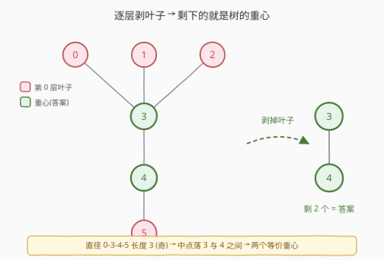
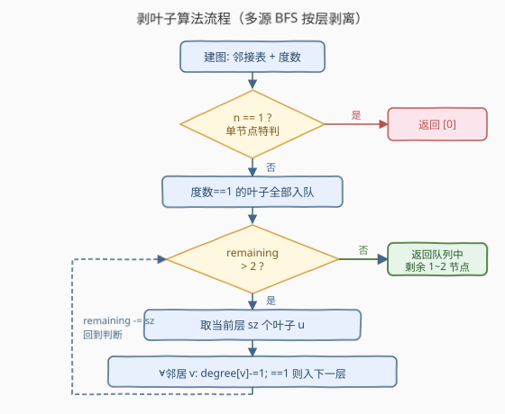
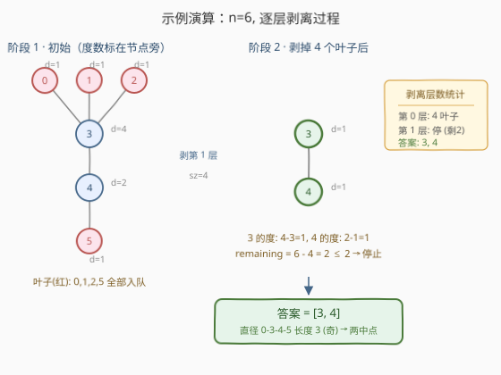

# LeetCode 最小高度树 题解

## 1. 题目概述

- **标题 / 题号**：最小高度树（#310，medium）
- **链接**：https://leetcode.cn/problems/minimum-height-trees/
- **难度**：中等
- **标签**：广度优先搜索、图、拓扑排序

**题意**：给定一棵有 `n` 个节点的树，节点编号为 `0` 到 `n-1`，由 `edges` 给出无向边。树中**任意节点**都可作为根，将其提起来后得到一棵以该节点为根的有根树，其**高度**定义为从根到最远叶子的边数。要求返回**所有能令树高最小的根节点**。

**示例 1**：

```text
输入：n = 4, edges = [[1,0],[1,2],[1,3]]
输出：[1]
解释：如下图所示，以 1 为根时高度为 1，是最小可能值。
           0
           |
           1
          / \
         2   3
```

**示例 2**：

```text
输入：n = 6, edges = [[3,0],[3,1],[3,2],[3,4],[5,4]]
输出：[3,4]
解释：以 3 或 4 为根时树高均为 2，且不存在高度更小的根。
         0   1   2
          \  |  /
            3
            |
            4
            |
            5
```

**约束**：

- `1 <= n <= 2 * 10^4`
- `edges.length == n - 1`
- `0 <= ai, bi < n`
- `ai != bi`
- 输入保证是一棵连通无向树（无环、无重边）

## 2. 解题思路

### 2.1 暴力思路

最直观的做法是**枚举每个节点作为根**，对其做一次 BFS/DFS 求树高，最后取出高度最小的那些根。

问题显而易见：求一次树高是 $O(n)$，枚举 $n$ 个根共 $O(n^2)$。当 $n=2\times 10^4$ 时达 $4\times 10^8$ 量级，必然超时。而且这种做法完全没有利用「树的直径」与「重心」的结构性质——答案其实只与树的**最长路径**有关。

> 💡 **关键卡点**：树高最小的根，一定落在树的**直径**（最长路径）的**中点**上。当直径长度为偶数时中点唯一，为奇数时有两个相邻中点。这就是「树的重心」概念，它把 $O(n^2)$ 的枚举压缩到 $O(n)$ 的剥叶子。

### 2.2 核心观察：剥叶子找重心



**直觉**：把树想象成一张悬在空中的网，叶子节点（度数为 1）离中心最远、提起来时必然让树变高。如果**一层一层地把当前所有叶子同时剥掉**，剩下的节点会越来越靠近「中心」。剥到只剩 1 个或 2 个节点时停下——它们就是答案。

**为什么对？** 设树的直径两端为 $u, v$，直径长度为 $D$。以直径中点 $c$ 为根时，任意节点 $x$ 到 $c$ 的距离 $\le \lceil D/2\rceil$，故树高恰好是 $\lceil D/2\rceil$，这是全局最小值。而「逐层剥叶子」的过程，本质就是在**同时从直径两端向内收缩**：每剥一层，直径两端各向中心走一步；剥到最后剩下的 1（$D$ 偶）或 2（$D$ 奇）个节点，正是直径的中点。

> ⚠️ **易错点**：剥叶子必须**按层批量剥离**（像 BFS 一样，同一轮处理当前所有叶子），不能剥一个再找下一个再剥。否则可能把非直径方向上的叶子先剥光，导致提前结束、答案错误。类比拓扑排序的「同层入度归零」。

### 2.3 算法流程图



核心骨架是「初始化度数 + 多源 BFS 按层剥离」：

1. **建图**：用邻接表 `adj` 存无向边，统计每个节点的度数 `degree`。
2. **边界**：`n == 1` 直接返回 `[0]`（单节点没有边，度数为 0，是天然重心）。
3. **入队**：把所有度数为 1 的叶子节点全部入队，作为第 0 层。
4. **按层剥离**：当**剩余节点数 `remaining > 2`** 时循环：
   - 取出当前层全部 `sz` 个叶子；
   - 对每个叶子 `u`，遍历其邻居 `v`，执行 `degree[v] -= 1`（相当于删掉边 `u-v`）；
   - 若 `v` 的度数降为 1，说明它成了新一轮的叶子，入下一层队列；
   - `remaining -= sz`。
5. **收尾**：队列里最终剩下的 1~2 个节点即为重心，返回它们。

### 2.4 示例演算



以示例 2 `n = 6, edges = [[3,0],[3,1],[3,2],[3,4],[5,4]]` 为例，初始度数与剥离过程如下：

| 阶段 | 当前叶子（度数=1） | 剥离动作 | 剥后度数变化 | 剩余节点数 |
|------|---------------------|----------|--------------|------------|
| 初始 | — | 建图统计度数 | 0:1, 1:1, 2:1, 3:4, 4:2, 5:1 | 6 |
| 第 1 层 | 0, 1, 2, 5 | 删 0-3 / 1-3 / 2-3 / 5-4 | 3: 4→3→2→1, 4: 2→1 | 6-4 = 2 |
| 停止 | 3, 4 | `remaining=2 ≤ 2`，停止 | — | 2 |

第 1 层一次性剥掉 4 个叶子后，`3` 的度数从 4 降到 1（被 0、1、2 三个叶子各削一次），`4` 的度数从 2 降到 1（被 5 削一次）。此时 `remaining = 2`，停止剥离，队列中残留 `3` 和 `4`，正是答案 `[3, 4]`。

> 💡 **为什么是两个？** 本树直径为 `0-3-4-5`（长度 3，奇数），中点落在中间两个节点 `3` 与 `4` 之间，故有两个等价重心。若直径长度为偶数（如示例 1 直径 `2-1-0` 长度 2），则只剩 1 个中点 `[1]`。

## 3. 参考代码

### C++

```cpp
class Solution {
public:
    vector<int> findMinHeightTrees(int n, vector<vector<int>>& edges) {
        if (n == 1) return {0};                       // 单节点特判
        vector<vector<int>> adj(n);
        vector<int> degree(n, 0);
        for (auto& e : edges) {
            adj[e[0]].push_back(e[1]);
            adj[e[1]].push_back(e[0]);
            degree[e[0]]++;
            degree[e[1]]++;
        }
        queue<int> q;
        for (int i = 0; i < n; ++i)
            if (degree[i] == 1) q.push(i);            // 初始叶子全部入队

        int remaining = n;
        while (remaining > 2) {                       // 剥到只剩 1~2 个重心
            int sz = q.size();
            remaining -= sz;
            for (int i = 0; i < sz; ++i) {
                int u = q.front(); q.pop();
                for (int v : adj[u])
                    if (--degree[v] == 1) q.push(v);  // 邻居变叶子，入下一层
            }
        }
        vector<int> ans;
        while (!q.empty()) { ans.push_back(q.front()); q.pop(); }
        return ans;
    }
};
```

### Python

```python
class Solution:
    def findMinHeightTrees(self, n: int, edges: List[List[int]]) -> List[int]:
        if n == 1:
            return [0]
        adj = [[] for _ in range(n)]
        degree = [0] * n
        for u, v in edges:
            adj[u].append(v)
            adj[v].append(u)
            degree[u] += 1
            degree[v] += 1

        q = deque(i for i in range(n) if degree[i] == 1)   # 初始叶子全部入队
        remaining = n
        while remaining > 2:                                # 剥到只剩 1~2 个重心
            sz = len(q)
            remaining -= sz
            for _ in range(sz):
                u = q.popleft()
                for v in adj[u]:
                    degree[v] -= 1
                    if degree[v] == 1:                      # 邻居变叶子，入下一层
                        q.append(v)
        return list(q)
```

> 💡 **细节**：`remaining > 2` 的判断必须在每层开始前检查，保证「同一层叶子全部处理完」才看是否停止——这正是「按层剥离」的精髓。若误写成「队列里只剩 2 个就停」（即 `q.size() <= 2` 时停），会因叶子入队顺序不同而提前停在中途，得到错误答案。

## 4. 复杂度分析

| 维度 | 复杂度 | 说明 |
|------|--------|------|
| 时间复杂度 | $O(n)$ | 建图遍历 $n-1$ 条边；每个节点最多入队一次、每条无向边在剥离时被访问两次（两端各一次），总计 $O(n)$ |
| 空间复杂度 | $O(n)$ | 邻接表存 $2(n-1)$ 条有向边 $O(n)$；度数数组与队列 $O(n)$ |

## 5. 扩展：两次 BFS 求直径 + 中点

剥叶子是「同时从两端向中心收缩」的隐式做法。也可以**显式**求出直径再取中点：先从任意节点 $s$ 做 BFS 找到最远节点 $u$，再从 $u$ 做 BFS 找到最远节点 $v$，则 $u\to v$ 即为直径；最后在 $u\to v$ 路径上取中点即可。

- **优点**：思路直接对应「直径中点」的数学定义，便于讲解。
- **缺点**：需要记录 BFS 前驱以还原 $u\to v$ 路径，代码更长；且两次 BFS 常数略大于一次剥叶子。两者复杂度同为 $O(n)$，面试中剥叶子写法更简洁，是首选。

## 6. 面试要点

1. **为什么答案最多 2 个？**
   - 答案是树直径的中点。直径长度为偶数时中点唯一，为奇数时落在一条边上、有两个相邻中点。故答案个数 $\in \{1, 2\}$。

2. **为什么剥叶子能得到直径中点？**
   - 每剥一层，所有当前叶子同时消失，相当于直径两端各向中心走一步。剥到无法继续（剩 1~2 个）时，剩下的就是中心。这与「拓扑排序逐层删入度为 0 节点」是同一套多源 BFS 思想。

3. **为什么必须按层批量剥离？**
   - 若逐个剥离（剥一个立刻找下一个），可能先把某条非直径短枝剥光，导致剩下的节点偏在直径一侧，错过真正的中点。按层保证「同时从所有外沿向内收缩」，几何上等价于直径两端同步逼近。

4. **`n == 1` 为什么要特判？**
   - 单节点没有边，度数为 0，不会被「度数 == 1」的入队条件选中，队列初始为空，`while` 不执行，返回空列表——但正确答案是 `[0]`。故需特判。

5. **能否用 DFS 求每个节点树高再取最小？**
   - 可以但为 $O(n^2)$，$n=2\times 10^4$ 时超时。剥叶子利用了树的直径结构把问题降到 $O(n)$，是必须掌握的优化。

6. **度和拓扑排序的入度有何区别？**
   - 本题是无向树，「度数」是无向度；剥叶子时删边会让**两端度数同时减 1**，所以 `degree[v] -= 1` 即可。有向图拓扑排序则是「删入边只减指向节点的入度」，方向性不同，但「同层入度归零入队」的骨架完全一致。

## 同类练习题

| # | 题目 | 与本题的关联 |
|---|------|-------------|
| 207 | [课程表](https://leetcode.cn/problems/course-schedule/)（[题解](../0201-0300/207_课程表.md)） | 拓扑排序模板题，本题剥叶子的「同层入度归零入队」即源于此 |
| 329 | [矩阵中的最长递增路径](https://leetcode.cn/problems/longest-increasing-path-in-a-matrix/)（[题解](../0301-0400/329_矩阵中的最长递增路径.md)） | DAG 上的多源 BFS 分层剥离，求最长路径层数，骨架与本题一致 |
| 994 | [腐烂的橘子](https://leetcode.cn/problems/rotting-oranges/) | 多源 BFS 按层扩散，对照本题「按层向内收缩」的方向差异 |
| 1245 | [树的直径](https://leetcode.cn/problems/tree-diameter/) | 两次 BFS 求无向树直径，是本题「直径中点」理论的母题 |
| 2246 | [相邻字符不同的最长路径](https://leetcode.cn/problems/longest-path-with-different-adjacent-characters/) | 在带限制的树上求最长路径，可用树形 DP / 换根，对照本题的直径思路 |
