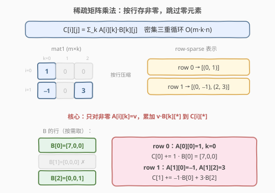
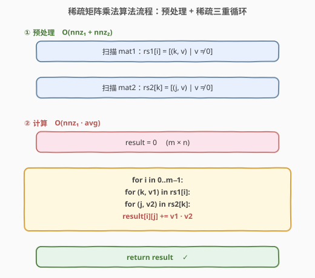
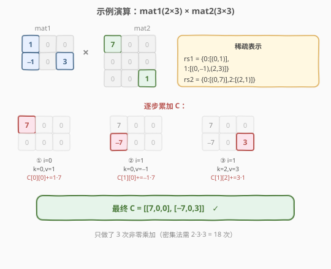

# 稀疏矩阵的乘法

- **题目名称**：稀疏矩阵的乘法
- **链接**：[311. 稀疏矩阵的乘法](https://leetcode.cn/problems/sparse-matrix-multiplication/)
- **难度**：中等
- **标签**：数组、矩阵、稀疏存储

## 1. 题目概述

给定两个**稀疏矩阵** `mat1`（大小 `m × k`）和 `mat2`（大小 `k × n`），返回它们的矩阵乘积 `mat1 × mat2`。可假设乘法总是可行的（即 `mat1` 的列数等于 `mat2` 的行数）。

**示例 1**：

```text
输入：mat1 = [[1,0,0],[-1,0,3]], mat2 = [[7,0,0],[0,0,0],[0,0,1]]
输出：[[7,0,0],[-7,0,3]]

解释：
mat1 (2×3)          mat2 (3×3)          结果 (2×3)
  1  0  0             7  0  0             7  0  0
 -1  0  3             0  0  0            -7  0  3
                       0  0  1
C[0][0] = 1·7 + 0·0 + 0·0 = 7
C[1][0] = -1·7 + 0·0 + 3·0 = -7
C[1][2] = -1·0 + 0·0 + 3·1 = 3
其余位置 = 0
```

**示例 2**：

```text
输入：mat1 = [[0]], mat2 = [[0]]
输出：[[0]]
```

**约束条件**：

- `m == mat1.length`，`k == mat1[i].length == mat2.length`，`n == mat2[i].length`
- `1 <= m, n, k <= 100`
- `-100 <= mat1[i][j], mat2[i][j] <= 100`

> ⚠️ 注意：题目明确两个矩阵都是**稀疏**的——大部分元素为 0。朴素三重循环 `O(m·k·n)` 会在大量 `0 × 任意 = 0` 的乘法上白费功夫，这正是「按非零元组织计算」的典型信号。

---

## 2. 解题思路

### 2.1 暴力思路

直接套用矩阵乘法定义：

$$
C[i][j] = \sum_{k=0}^{k-1} \text{mat1}[i][k] \cdot \text{mat2}[k][j]
$$

三重循环 `i → k → j`，时间 $O(m \cdot k \cdot n)$。最坏 `100·100·100 = 10^6`，量级上能过，但对稀疏矩阵而言，绝大多数 `mat1[i][k]` 或 `mat2[k][j]` 为 0，对应的乘法纯属浪费——「**任何一边为 0 的乘法结果必为 0**，没必要算」。

### 2.2 核心观察：按行稀疏存储，跳过零元素



关键转化：**只对 `mat1` 中的非零元触发计算**。把 `mat1` 按行压缩成稀疏表 `rs1`：对每一行 `i`，仅记录 `(列号 k, 值 v)` 中 `v ≠ 0` 的项。同理把 `mat2` 按行压缩成 `rs2`：对每一行 `k`，仅记录 `(列号 j, 值 v)` 中 `v ≠ 0` 的项。

于是乘法变成：

$$
C[i][j] = \sum_{\substack{(k, v_1) \in \text{rs1}[i] \\ (j, v_2) \in \text{rs2}[k]}} v_1 \cdot v_2
$$

即：遍历 `rs1[i]` 中每个非零 `(k, v1)`，再遍历 `rs2[k]` 中每个非零 `(j, v2)`，把 `v1 · v2` 累加到 `C[i][j]`。**两边都跳过零**，只做「真正会产生非零贡献」的乘加。

> 💡 **为什么按行存？** 矩阵乘法天然按 `mat1` 的行组织输出（`C` 的第 `i` 行只依赖 `mat1` 的第 `i` 行）。把 `mat1` 按行存稀疏，外层遍历某行非零元时，内层正好要取 `mat2` 的「第 k 行」——所以 `mat2` 也按行存稀疏（即 CSR 风格的 row-pointer + col-index），两层稀疏表完美对齐，无需转置。

### 2.3 算法流程图



> ⚠️ **顺序无关性**：累加是可交换的，所以遍历 `rs1[i]` 与 `rs2[k]` 的顺序不影响结果。但建议按 `k` 升序遍历，缓存更友好（`mat2` 的行按行号顺序访问）。

### 2.4 示例演算



以示例 1 为例：

- `rs1 = {0: [(0,1)], 1: [(0,-1), (2,3)]}`
- `rs2 = {0: [(0,7)], 1: [], 2: [(2,1)]}`（`mat2` 第 1 行全零，`rs2[1]` 为空）

| 步骤 | `i` | `(k, v1)` | `rs2[k]` | 累加 | `C` 状态 |
|------|-----|-----------|----------|------|----------|
| ① | 0 | (0, 1) | [(0,7)] | `C[0][0] += 1·7 = 7` | `[[7,0,0],[0,0,0]]` |
| ② | 1 | (0, −1) | [(0,7)] | `C[1][0] += −1·7 = −7` | `[[7,0,0],[−7,0,0]]` |
| ③ | 1 | (2, 3) | [(2,1)] | `C[1][2] += 3·1 = 3` | `[[7,0,0],[−7,0,3]]` |

全程只做了 **3 次非零乘加**，而朴素三重循环要做 `2·3·3 = 18` 次——稀疏优化直接省掉 15 次无意义的 `×0`。

---

## 3. 参考代码

### C++

```cpp
class Solution {
  public:
    vector<vector<int>> multiply(vector<vector<int>>& mat1,
                                 vector<vector<int>>& mat2) {
        int m = mat1.size(), k = mat2.size(), n = mat2[0].size();
        // 预处理：按行存非零 (col, val)
        vector<vector<pair<int, int>>> rs1(m), rs2(k);
        for (int i = 0; i < m; ++i)
            for (int c = 0; c < k; ++c)
                if (mat1[i][c] != 0) rs1[i].emplace_back(c, mat1[i][c]);
        for (int r = 0; r < k; ++r)
            for (int j = 0; j < n; ++j)
                if (mat2[r][j] != 0) rs2[r].emplace_back(j, mat2[r][j]);
        // 稀疏三重循环
        vector<vector<int>> C(m, vector<int>(n, 0));
        for (int i = 0; i < m; ++i)
            for (auto& [c, v1] : rs1[i])
                for (auto& [j, v2] : rs2[c])
                    C[i][j] += v1 * v2;
        return C;
    }
};
```

### Python

```python
class Solution:
    def multiply(self, mat1: List[List[int]], mat2: List[List[int]]) -> List[List[int]]:
        m, k, n = len(mat1), len(mat2), len(mat2[0])
        # 按行存非零
        rs1 = [[(c, v) for c, v in enumerate(row) if v != 0] for row in mat1]
        rs2 = [[(j, v) for j, v in enumerate(row) if v != 0] for row in mat2]
        C = [[0] * n for _ in range(m)]
        for i in range(m):
            for c, v1 in rs1[i]:
                for j, v2 in rs2[c]:
                    C[i][j] += v1 * v2
        return C
```

---

## 4. 复杂度分析

| 维度 | 复杂度 | 说明 |
|------|--------|------|
| 预处理时间 | $O(\text{nnz}_1 + \text{nnz}_2)$ | 扫描两个矩阵各一遍，收集非零元（`nnz` = 非零元个数） |
| 计算时间 | $O(\text{nnz}_1 \cdot \overline{\text{nnz}_2})$ | 每个 `mat1` 非零元触发一次对其对应 `mat2` 行的稀疏遍历；$\overline{\text{nnz}_2}$ 为 `mat2` 每行平均非零数 |
| 空间复杂度 | $O(\text{nnz}_1 + \text{nnz}_2)$ | 两个稀疏表 `rs1`、`rs2`（不计输出 `C` 的 $O(m \cdot n)$） |

> 💡 **退化对照**：当矩阵稠密（`nnz ≈ m·k`）时，稀疏法退化为 $O(m \cdot k \cdot n)$，且多了预处理与稀疏表的开销，反而不如朴素法。稀疏法只在 `nnz ≪ m·k` 时才有意义——这正是题目「稀疏」二字的含金量。

---

## 5. 扩展：CSR/CSC 与稠密场景

- **CSR / CSC 格式**：本题的「按行存 `(列, 值)` 列表」就是 **CSR（Compressed Sparse Row）** 的雏形。工业级实现（如 SciPy `scipy.sparse`）用三个数组 `row_ptr / col_idx / vals` 压得更紧、缓存更友好；若按列存则是 **CSC**。选 CSR 还是 CSC 取决于访问方向：按行遍历用 CSR，按列遍历用 CSC。
- **只稀疏一边**：如果只有 `mat1` 稀疏、`mat2` 稠密，只需对 `mat1` 建稀疏表，内层照常遍历 `mat2[k]` 整行——`O(nnz1 · n)`。反之同理。本题两边都稀疏，故两边都压缩收益最大。
- **稠密矩阵乘法**：当矩阵不稀疏时，朴素三重循环的瓶颈在缓存命中率。经典优化是**分块矩阵乘法（tiling）** + 循环重排 `i-k-j`（让最内层连续访问 `mat2` 的行），再配合 SIMD 向量化，可达理论峰值带宽的相当比例。

> 💡 **选择信号**：`nnz / (m·k) < ~20%` 时稀疏法显著优于稠密法；否则朴素法更稳。本题约束 `m,n,k ≤ 100`，数据量小，两种写法都能 AC，但稀疏法体现了「利用数据特性降复杂度」的工程思维。

---

## 6. 面试要点

1. **为什么按行存稀疏而不是按列？**
   - 矩阵乘法 `C[i][*]` 只依赖 `mat1[i][*]`，外层天然按 `mat1` 的行推进；内层要取 `mat2` 的「第 k 行」做点积，所以 `mat2` 也按行存（CSR）正好对齐。若按列存 `mat2`，内层遍历会跳列、缓存不友好，还需转置预处理。

2. **稀疏法的复杂度怎么刻画？为什么不是 `O(m·k·n)`？**
   - 外层只遍历 `mat1` 的非零元（共 `nnz1` 个），内层只遍历对应 `mat2` 行的非零元。总乘加次数 = 「真正非零贡献」数，远小于 `m·k·n`。形式化为 $O(\text{nnz}_1 \cdot \overline{\text{nnz}_2})$。

3. **两边都稀疏 vs 只稀疏一边，有什么区别？**
   - 两边都稀疏：`O(nnz1 · avg_nnz2)`，最优。只稀疏 `mat1`：内层遍历 `mat2[k]` 整行（含零），`O(nnz1 · n)`。当 `mat2` 也稀疏时，再压缩 `mat2` 才能省掉内层的 `×0`。

4. **如果矩阵是稠密的，这方法还好吗？**
   - 不好。`nnz ≈ m·k` 时稀疏法退化为 `O(m·k·n)` 且多出预处理与稀疏表开销，不如朴素 `i-k-j` 循环 + 缓存优化。稀疏法是「**用空间换对零元的跳过**」，零元少时收益消失。

5. **能否不预处理，直接在原矩阵上跳零？**
   - 可以：外层 `i`，中层遍历 `mat1[i]`，遇到 `mat1[i][k] == 0` 直接 `continue`。这等价于「隐式稀疏」，省了 `rs1` 的空间，但仍需内层遍历 `mat2[k]` 整行（无法跳 `mat2` 的零）。要两边都跳零，就必须把 `mat2` 也预存成稀疏表——空间换时间。

---

## 7. 同类练习题

- [304. 二维区域和检索 - 数组不可变](https://leetcode.cn/problems/range-sum-query-2d-immutable/)（[题解](../0301-0400/304_二维区域和检索 - 数组不可变.md)）：矩阵预处理思想对照——一个用前缀和预处理换 `O(1)` 查询，一个用稀疏表预处理换跳零乘法
- [240. 搜索二维矩阵 II](https://leetcode.cn/problems/search-a-2d-matrix-ii/)：利用矩阵结构特性（行列单调）降复杂度，同为「挖掘矩阵数据特性」的套路
- [378. 有序矩阵中第 K 小的元素](https://leetcode.cn/problems/kth-smallest-element-in-a-sorted-matrix/)（[题解](../0301-0400/378_有序矩阵中第K小的元素.md)）：矩阵结构特性 + 二分值域，对照「按特性降复杂度」家族
- [73. 矩阵置零](https://leetcode.cn/problems/set-matrix-zeroes/)：用矩阵自身首行首列当标记位，原地 `O(1)` 空间，矩阵操作的常驻考点
- [54. 螺旋矩阵](https://leetcode.cn/problems/spiral-matrix/)：矩阵遍历方向控制，与本题的「按行/列组织访问」互补的矩阵基本功
