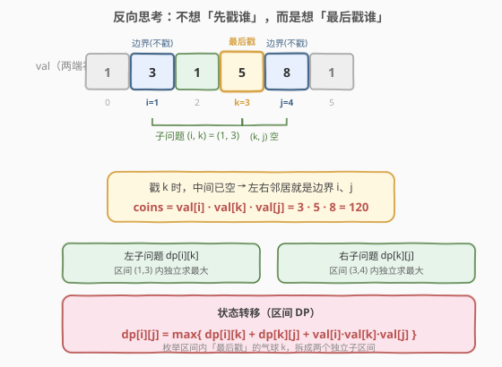
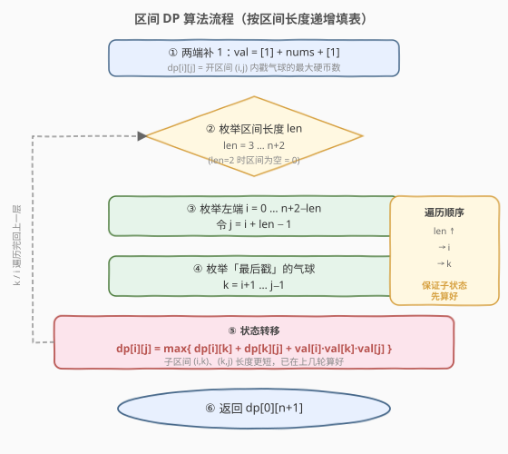
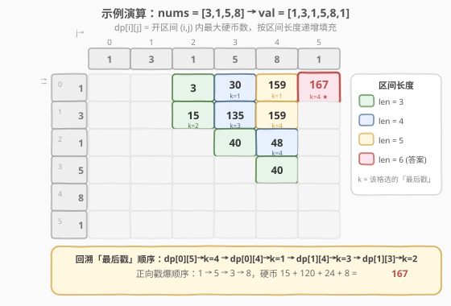

# LeetCode 戳气球 题解

## 1. 题目概述

- **标题 / 题号**：戳气球（#312，hard）
- **链接**：https://leetcode.cn/problems/burst-balloons/
- **难度**：困难
- **标签**：数组、动态规划、区间 DP

**题意**：有 `n` 个气球，编号 `0 ~ n-1`，每个气球上标有一个数字 `nums[i]`。每次戳破气球 `i`，获得 `nums[i-1] * nums[i] * nums[i+1]` 枚硬币（`i-1`、`i+1` 是此时与 `i` 相邻的气球；若越界则视为数字 `1`）。戳破后该气球消失，左右两侧气球变为相邻。求按某顺序把所有气球戳破后能获得的**最大硬币数**。

**示例 1**：

```text
输入：nums = [3,1,5,8]
输出：167
解释：戳爆顺序 1 → 5 → 3 → 8
     戳 1：3*1*5 = 15，剩 [3,5,8]
     戳 5：3*5*8 = 120，剩 [3,8]
     戳 3：1*3*8 = 24，剩 [8]
     戳 8：1*8*1 = 8，剩 []
     合计 15 + 120 + 24 + 8 = 167
```

**示例 2**：

```text
输入：nums = [1,5]
输出：10
解释：先戳 1（1*1*5=5），再戳 5（1*5*1=5），合计 10。
```

**约束**：

- `n == nums.length`
- `1 <= n <= 300`
- `0 <= nums[i] <= 100`

## 2. 解题思路

### 2.1 暴力思路

最直接的做法是**枚举所有戳破顺序**（全排列），对每种顺序模拟计算硬币数取最大。`n` 个气球有 $n!$ 种排列，`n=300` 时是天文数字，必然超时。

困难在于「正向思考」：先戳哪个？一旦戳掉 `i`，它的左右邻居 `i-1`、`i+1` 就**变成相邻**，后续步骤的相邻关系随之改变——子问题之间相互纠缠，状态难以干净地定义。

> 💡 **关键卡点**：正向思考时，戳掉中间气球会改变两侧的相邻关系，导致左右两段不再独立。要打破纠缠，必须换一个视角，让「分治后的子问题彼此无关」。

### 2.2 核心观察：反向思考「最后戳谁」+ 区间 DP



破局的关键是**反过来想——不问「先戳谁」，而问「最后戳谁」**。

考虑开区间 $(i, j)$ 内的一排气球（不含边界 `i`、`j`）。设其中**最后被戳破**的气球是 $k$（$i < k < j$）。因为 `k` 是最后戳的，此时 $(i, k)$ 与 $(k, j)$ 内的气球**都已被戳光**，`k` 的左右邻居就只剩边界 `i` 与 `j`，于是戳 `k` 的贡献为：

$$\text{coins} = \text{val}[i] \cdot \text{val}[k] \cdot \text{val}[j]$$

而「`k` 之前」要先把 $(i,k)$ 与 $(k,j)$ 两段各自戳光——这两段**完全独立**（互不影响相邻关系），可分别求最大值。这就得到了区间 DP 的状态与转移。

为统一处理「越界视为 1」的规则，在 `nums` **两端各补一个 `1`**，得到 `val = [1] + nums + [1]`。设 $m = n + 2$，则所有戳破行为都发生在 `val` 的开区间 $(0, m-1)$ 内，边界 `val[0]`、`val[m-1]` 永不戳破，自然充当 `1`。

**状态定义**：

$$dp[i][j] = \text{戳破开区间 } (i, j) \text{ 内所有气球能获得的最大硬币数},\quad 0 \le i < j \le m-1$$

**状态转移**（枚举区间内「最后戳」的 $k$）：

$$dp[i][j] = \max_{i < k < j} \Big\{\, dp[i][k] + dp[k][j] + \text{val}[i]\cdot\text{val}[k]\cdot\text{val}[j] \,\Big\}$$

**边界**：当 $j \le i + 1$ 时开区间为空，$dp[i][j] = 0$（无气球可戳）。

**答案**：$dp[0][m-1]$。

> 💡 **为什么反向就能独立、正向就不行？** 正向「先戳 `k`」后，`k` 两侧的段会拼到一起变成相邻，子问题耦合；反向「最后戳 `k`」时，`k` 是 $(i,j)$ 内唯一的「连接点」，戳它之前左右两段各自闭合在 $(i,k)$、$(k,j)$ 里、互不接触，所以独立。这是所有**区间 DP** 的共同套路：在区间内选一个分点，让左右子区间互不干扰。

> ⚠️ **易错点**：`dp[i][j]` 是**开区间**，不含 `i`、`j` 本身。`i`、`j` 只是「当前段两侧的虚拟邻居」，它们在戳 `k` 时贡献乘积、自己永不被戳。补 `1` 正是为了让最外层 $(0, m-1)$ 也有这样的虚拟邻居。

### 2.3 算法流程图



核心是**按区间长度递增**填表：$dp[i][j]$ 依赖更短的子区间 $(i,k)$ 与 $(k,j)$，二者长度都严格小于 $j-i+1$。因此外层按 `len` 从小到大遍历，可保证转移时子状态已算好——这是区间 DP 通用遍历范式。

1. 两端补 `1`：`val = [1] + nums + [1]`，`m = n + 2`。
2. 按 `len = 3 … m` 枚举区间长度（`len = 2` 时开区间为空，值为 `0`，跳过）。
3. 对每个左端 `i`，令 `j = i + len - 1`。
4. 枚举「最后戳」的 `k = i+1 … j-1`。
5. 转移：$dp[i][j] = \max(dp[i][j],\ dp[i][k] + dp[k][j] + \text{val}[i]\text{val}[k]\text{val}[j])$。
6. 返回 $dp[0][m-1]$。

### 2.4 示例演算



以 `nums = [3,1,5,8]` 为例，`val = [1,3,1,5,8,1]`（下标 `0..5`），`m = 6`，求 $dp[0][5]$。下表只列 `j >= i+2` 的有效格（按长度递增填充）：

| 区间长度 | (i,j) | 枚举 k 的取值 | dp[i][j] | 选定 k |
|----------|-------|---------------|----------|--------|
| 3 | (0,2) | k=1: 1·3·1=3 | 3 | 1 |
| 3 | (1,3) | k=2: 3·1·5=15 | 15 | 2 |
| 3 | (2,4) | k=3: 1·5·8=40 | 40 | 3 |
| 3 | (3,5) | k=4: 5·8·1=40 | 40 | 4 |
| 4 | (0,3) | k=1: dp[0][1]+dp[1][3]+1·3·5=0+15+15=30；k=2: dp[0][2]+dp[2][3]+1·1·5=3+0+5=8 | 30 | 1 |
| 4 | (1,4) | k=2: 0+40+3·1·8=64；k=3: 15+0+3·5·8=135 | 135 | 3 |
| 4 | (2,5) | k=3: 0+40+1·5·1=45；k=4: 40+0+1·8·1=48 | 48 | 4 |
| 5 | (0,4) | k=1: 0+135+1·3·8=159；k=2: 3+40+1·1·8=51；k=3: 30+0+1·5·8=70 | 159 | 1 |
| 5 | (1,5) | k=2: 0+48+3·1·1=51；k=3: 15+40+3·5·1=70；k=4: 135+0+3·8·1=159 | 159 | 4 |
| 6 | (0,5) | k=1: 0+159+1·3·1=162；k=2: 3+48+1·1·1=52；k=3: 30+40+1·5·1=75；k=4: 159+0+1·8·1=167 | **167** | 4 |

**回溯「最后戳」顺序**：$dp[0][5]\xrightarrow{k=4} dp[0][4]\xrightarrow{k=1} dp[1][4]\xrightarrow{k=3} dp[1][3]\xrightarrow{k=2}$，即「最后戳」依次是下标 4、1、3、2。反转即得**正向戳爆顺序**：先 2（值 1）→ 3（值 5）→ 1（值 3）→ 4（值 8），硬币 $15+120+24+8=167$。

## 3. 参考代码

### 方法一：区间 DP（自底向上递推，推荐）

### C++

```cpp
class Solution {
  public:
    int maxCoins(vector<int>& nums) {
        int n = nums.size();
        vector<int> val(n + 2, 1);          // 两端补 1
        for (int i = 0; i < n; ++i)
            val[i + 1] = nums[i];
        int m = n + 2;

        // dp[i][j]：开区间 (i,j) 内戳气球的最大硬币数
        vector<vector<long long>> dp(m, vector<long long>(m, 0));

        for (int len = 3; len <= m; ++len) {            // 区间长度
            for (int i = 0; i + len - 1 < m; ++i) {     // 左端
                int j = i + len - 1;                    // 右端
                for (int k = i + 1; k < j; ++k) {       // 枚举「最后戳」的 k
                    long long cur = dp[i][k] + dp[k][j]
                                  + (long long)val[i] * val[k] * val[j];
                    dp[i][j] = max(dp[i][j], cur);
                }
            }
        }
        return (int)dp[0][m - 1];
    }
};
```

### Python

```python
class Solution:
    def maxCoins(self, nums: List[int]) -> int:
        val = [1] + nums + [1]                 # 两端补 1
        m = len(val)
        dp = [[0] * m for _ in range(m)]

        for length in range(3, m + 1):         # 区间长度
            for i in range(m - length + 1):    # 左端
                j = i + length - 1             # 右端
                for k in range(i + 1, j):      # 枚举「最后戳」的 k
                    cur = dp[i][k] + dp[k][j] + val[i] * val[k] * val[j]
                    dp[i][j] = max(dp[i][j], cur)
        return dp[0][m - 1]
```

> ⚠️ **三个易错点**：
> 1. **两端必须补 `1`**：否则最外层气球被戳时没有「虚拟邻居」，需大量边界特判；补 `1` 后统一为 `val[i]*val[k]*val[j]`，代码最简洁。
> 2. **按区间长度递增填表**：`dp[i][j]` 依赖更短的 `(i,k)`、`(k,j)`，必须先算短区间。若按 `i` 从小到大、`j` 从小到大直接遍历也能过（因为 `k` 在 `(i,j)` 内、`(i,k)` 与 `(k,j)` 的 `j`/`i` 都更靠内），但**按长度遍历是区间 DP 的标准范式**，不易出错。
> 3. **C++ 乘积用 `long long`**：`val[i]*val[k]*val[j]` 最大 $100^3=10^6$，累加最多 $\sim 300$ 次 $\sim 3\times10^8$，虽不溢出 `int`，但中间相加过程用 `long long` 更稳妥；Python 无此问题。

## 4. 复杂度分析

| 维度 | 复杂度 | 说明 |
|------|--------|------|
| 时间复杂度 | $O(n^3)$ | 三重循环：区间长度 $O(n)$ × 左端 $O(n)$ × 枚举 $k$ $O(n)$ |
| 空间复杂度 | $O(n^2)$ | $m \times m$ 的 DP 表，$m = n+2$ |

> 💡 `n=300` 时 $n^3 \approx 2.7\times10^7$，远低于时间限制，轻松通过。区间 DP 几乎无法把空间降到 $O(n)$（转移同时需要 `dp[i][k]` 和 `dp[k][j]`，两个方向都依赖），$O(n^2)$ 是此类问题的固有代价。

## 5. 扩展：记忆化搜索（自顶向下）

区间 DP 也可写成**自顶向下的分治 + 记忆化**：`dfs(i, j)` 表示戳光开区间 $(i,j)$ 的最大硬币数，枚举「最后戳」的 `k`，递归求解 $(i,k)$、$(k,j)$。逻辑上与递推完全等价，且更贴近「最后戳 `k`」的直觉，写起来不易在遍历顺序上出错。

### C++

```cpp
class Solution {
    vector<vector<long long>> memo;
    vector<int> val;
  public:
    int maxCoins(vector<int>& nums) {
        int n = nums.size();
        val.assign(n + 2, 1);
        for (int i = 0; i < n; ++i) val[i + 1] = nums[i];
        int m = n + 2;
        memo.assign(m, vector<long long>(m, -1));
        return (int)dfs(0, m - 1);
    }
    long long dfs(int i, int j) {
        if (j <= i + 1) return 0;                 // 开区间为空
        if (memo[i][j] != -1) return memo[i][j];
        long long best = 0;
        for (int k = i + 1; k < j; ++k) {
            long long cur = dfs(i, k) + dfs(k, j)
                          + (long long)val[i] * val[k] * val[j];
            best = max(best, cur);
        }
        return memo[i][j] = best;
    }
};
```

> 💡 **递推 vs 记忆化**：递推无递归栈、常数更小；记忆化更直观、只算真正用到的状态。本题 `n=300` 递归深度最坏 $300$，远低于默认栈限制，两种写法都能 AC，面试中**记忆化更易一遍写对**，可先写记忆化再优化为递推。

## 6. 面试要点

1. **为什么要「反向思考」（最后戳谁）而非正向（先戳谁）？**

   - 正向「先戳 `k`」会让 `k` 两侧的段拼到一起、变成相邻，左右子问题相互耦合，状态无法干净定义。
   - 反向「最后戳 `k`」时，戳 `k` 之前 $(i,k)$ 与 $(k,j)$ 各自闭合、互不接触，`k` 的左右邻居就是边界 `i`、`j`，两个子问题完全独立——这才满足 DP 的「最优子结构 + 无后效性」。

2. **为什么要两端补 `1`？**

   - 题目规定越界邻居视为 `1`。补 `1` 后，最外层气球被戳时也有「虚拟邻居」可乘，无需对边界做特判，转移统一为 `val[i]*val[k]*val[j]`。补 `1` 后答案即 `dp[0][m-1]`。

3. **DP 表为什么按「区间长度递增」遍历？**

   - $dp[i][j]$ 依赖更短的子区间 $(i,k)$、$(k,j)$（长度均 $< j-i+1$）。按长度从短到长填表，保证转移时子状态已算好。这是**所有区间 DP 的通用遍历范式**，记忆化写法天然满足此顺序。

4. **`dp[i][j]` 为何是「开区间」而非闭区间？**

   - 开区间意味着 `i`、`j` 是「当前段两侧的虚拟邻居」，自己永不被戳，只在戳 `k` 时参与乘积。这样「最后戳 `k`」的两侧天然是 `i`、`j`，转移干净。若用闭区间，戳 `k` 后两侧邻居不确定（可能是已被戳的内部点），状态会混乱。

5. **能用记忆化搜索吗？和递推如何取舍？**

   - 能。`dfs(i,j)` 枚举 `k` 递归，加 `memo`。逻辑等价递推，且只算实际用到的状态、更贴近直觉，面试常先写记忆化。递推无栈、常数小，追求性能时再换。`n=300` 两者均 AC。

6. **复杂度能优化到 $O(n^2)$ 吗？**

   - 经典区间 DP 为 $O(n^3)$。本题满足**四边形不等式**，最优分点 `k` 关于区间端点单调，可用 **Knuth 优化**把内层 `k` 的枚举从 $O(n)$ 摊到 $O(1)$，降到 $O(n^2)$。但证明复杂、面试不要求，掌握 $O(n^3)$ 模板足够。

## 同类练习题

| # | 题目 | 与本题的关联 |
|---|------|-------------|
| 1000 | [合并石头的最低成本](https://leetcode.cn/problems/minimum-cost-to-merge-stones/) | 区间 DP + 「k 堆合并」，状态需额外记录当前堆数维度，本题的进阶版 |
| 664 | [奇怪的打印机](https://leetcode.cn/problems/strange-printer/) | 区间 DP，按「首字符」分段，转移时讨论两端是否同色 |
| 1039 | [多边形三角剖分的最低得分](https://leetcode.cn/problems/minimum-score-triangulation-of-polygon/) | 区间 DP，选 `k` 作为顶点把多边形切成两半，骨架与本题几乎一致 |
| 375 | [猜数字大小 II](https://leetcode.cn/problems/guess-number-higher-or-lower-ii/) | 区间 DP + minimax，求最坏情况下最少代价，转移取 `max(左右)` |
| 546 | [移除盒子](https://leetcode.cn/problems/remove-boxes/) | 区间 DP 进阶，需三维状态 `dp[i][j][k]` 记录尾部同色连缀长度，难度更高的同族题 |
