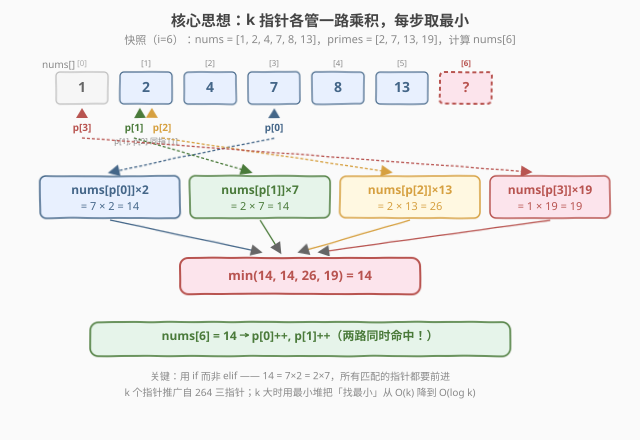
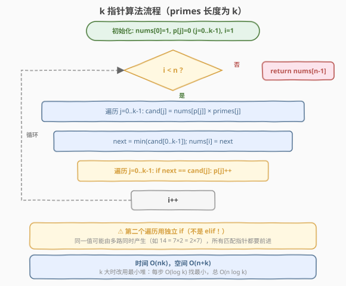
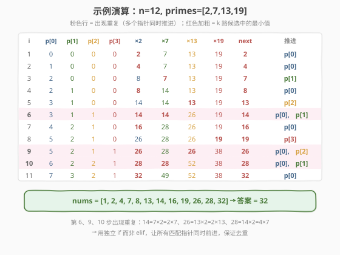

# LeetCode 超级丑数 题解

## 1. 题目概述

- **标题 / 题号**：超级丑数（#313，medium）
- **链接**：https://leetcode.cn/problems/super-ugly-number/
- **难度**：中等
- **标签**：动态规划、多路归并、堆、k 指针

**超级丑数** 是一个正整数，其所有质因数都出现在给定质数数组 `primes` 中。给定整数 `n` 和一个按升序排列的质数数组 `primes`，返回第 `n` 个超级丑数。

**示例 1**：

```text
输入：n = 12, primes = [2,7,13,19]
输出：32
解释：给定长度为 4 的质数数组 primes = [2,7,13,19]，前 12 个超级丑数的序列为：
[1, 2, 4, 7, 8, 13, 14, 16, 19, 26, 28, 32]。
```

**示例 2**：

```text
输入：n = 1, primes = [2,3,5]
输出：1
解释：1 不含任何质因数，因此所有质因数都在 primes 中，视为超级丑数。
```

**约束**：

- `1 <= n <= 10^6`
- `1 <= primes.length <= 100`
- `2 <= primes[i] <= 1000`
- `primes` 按升序排列
- 题目数据保证第 `n` 个超级丑数在 32 位有符号整数范围内

> 💡 当 `primes = [2, 3, 5]` 时，本题退化为 [264. 丑数 II](https://leetcode.cn/problems/ugly-number-ii/)。可以把 313 看作 264 的「`k` 路推广版」——把固定的 3 个质因数换成可变长度的质数数组。

## 2. 解题思路

### 2.1 暴力思路：逐个检查

从 `1` 起逐个检查每个正整数：将其反复除以 `primes` 中的质数，若最终得 `1` 则是超级丑数。数够 `n` 个即返回。

> ⚠️ 问题：第 `n` 个超级丑数可能达到 $10^9$ 量级，而超级丑数在整数中的密度极低（特别是 `primes` 较少时）。逐个检查绝大多数都失败，时间不可接受。

换思路：与其**检查**每个数是不是超级丑数，不如直接**生成**超级丑数。

### 2.2 核心观察：k 指针多路归并



承接 [264. 丑数 II](https://leetcode.cn/problems/ugly-number-ii/) 的三指针思路，把它推广到 `k` 个质数：

1. **超级丑数序列有序**：从小到大排列。
2. **每个丑数由更小的丑数生成**：除 `1` 外，每个超级丑数 = 某个更小的超级丑数 × `primes` 中某个质数。
3. **k 路乘积流**：可以看作 `k` 条有序流的归并——
   - 第 `j` 路（对应质数 `primes[j]`）：`1×primes[j], nums[1]×primes[j], nums[2]×primes[j], ...`
4. **去重**：同一值可能由多路同时产生（如 `primes=[2,3]` 时，`6 = 3×2 = 2×3`），只保留一份。

> 💡 这正是「合并 K 个有序链表」的思路。`k=3` 时三指针足够；`k` 较大时维护 `k` 个指针仍是 `O(nk)`，但可以用**最小堆**把「找最小」从 `O(k)` 降到 `O(log k)`，得到 `O(n log k)`。

**k 指针方案**：

- 维护数组 `nums[]` 存已生成的超级丑数（有序），`nums[0] = 1`。
- 指针数组 `p[j]` 表示「下一个该乘 `primes[j]` 的丑数在 `nums` 中的索引」，初值全 `0`。
- 每步取 $\min_j (\text{nums}[p[j]] \times \text{primes}[j])$ 作为下一个丑数。
- **所有满足等式的指针都 +1**（独立 `if`，处理去重）。

### 2.3 算法流程图



### 2.4 示例演算

以 `n = 12, primes = [2, 7, 13, 19]` 为例，逐步展示每步的指针状态、4 路候选与推进情况：



| 步骤 i | p[0] | p[1] | p[2] | p[3] | ×2 | ×7 | ×13 | ×19 | next | 推进 |
|--------|------|------|------|------|----|----|-----|-----|------|------|
| 1 | 0 | 0 | 0 | 0 | 2 | 7 | 13 | 19 | 2 | p[0] |
| 2 | 1 | 0 | 0 | 0 | 4 | 7 | 13 | 19 | 4 | p[0] |
| 3 | 2 | 0 | 0 | 0 | 8 | 7 | 13 | 19 | 7 | p[1] |
| 4 | 2 | 1 | 0 | 0 | 8 | 14 | 13 | 19 | 8 | p[0] |
| 5 | 3 | 1 | 0 | 0 | 14 | 14 | 13 | 19 | 13 | p[2] |
| 6 | 3 | 1 | 1 | 0 | 14 | 14 | 26 | 19 | 14 | p[0], p[1] |
| 7 | 4 | 2 | 1 | 0 | 16 | 28 | 26 | 19 | 16 | p[0] |
| 8 | 5 | 2 | 1 | 0 | 26 | 28 | 26 | 19 | 19 | p[3] |
| 9 | 5 | 2 | 1 | 1 | 26 | 28 | 26 | 38 | 26 | p[0], p[2] |
| 10 | 6 | 2 | 2 | 1 | 28 | 28 | 52 | 38 | 28 | p[0], p[1] |
| 11 | 7 | 3 | 2 | 1 | 32 | 49 | 52 | 38 | 32 | p[0] |

> 💡 **第 6、9、10 步出现重复**：`14 = 7×2 = 2×7`（步骤 6，`nums[3]×2 = nums[1]×7`）、`26 = 13×2 = 2×13`（步骤 9，`nums[5]×2 = nums[1]×13`）、`28 = 14×2 = 4×7`（步骤 10，`nums[6]×2 = nums[2]×7`）。必须用**独立 `if`** 让所有匹配的指针同时前进，否则下一轮会产生重复值。

最终 `nums = [1, 2, 4, 7, 8, 13, 14, 16, 19, 26, 28, 32]`，第 12 个超级丑数为 `32`。

## 3. 参考代码

### C++（k 指针，$O(nk)$）

```cpp
class Solution {
  public:
    int nthSuperUglyNumber(int n, vector<int>& primes) {
        int k = primes.size();
        vector<int> nums(n);
        nums[0] = 1;
        vector<int> p(k, 0);
        for (int i = 1; i < n; i++) {
            int next = INT_MAX;
            for (int j = 0; j < k; j++) {
                next = min(next, nums[p[j]] * primes[j]);
            }
            nums[i] = next;
            for (int j = 0; j < k; j++) {
                if (next == nums[p[j]] * primes[j]) {
                    p[j]++;
                }
            }
        }
        return nums[n - 1];
    }
};
```

### Python（最小堆，$O(n \log k)$）

```python
import heapq

class Solution:
    def nthSuperUglyNumber(self, n: int, primes: List[int]) -> int:
        k = len(primes)
        nums = [1] * n
        p = [0] * k
        heap = [(primes[j], j) for j in range(k)]
        heapq.heapify(heap)

        for i in range(1, n):
            nxt, j = heap[0]
            nums[i] = nxt
            while heap and heap[0][0] == nxt:
                _, jj = heapq.heappop(heap)
                p[jj] += 1
                heapq.heappush(heap, (nums[p[jj]] * primes[jj], jj))

        return nums[-1]
```

> ⚠️ **去重的关键**：Python 堆版本用 `while heap[0][0] == nxt` 循环弹出所有最小值相等的候选，把对应指针全部推进后再压入新候选，避免下一轮产生重复。C++ 指针版本同理，用独立 `if` 而非 `else if`。

> 💡 **避免重复入堆**：堆中每路最多保留一个候选。当指针 `p[j]` 前进后，立即把新候选 `nums[p[j]] * primes[j]` 压回堆，覆盖旧值。整个过程中堆的大小始终为 `k`。

## 4. 复杂度分析

| 维度 | k 指针 | 最小堆 |
|------|--------|--------|
| 时间复杂度 | $O(nk)$ | $O(n \log k)$ |
| 空间复杂度 | $O(n + k)$ | $O(n + k)$ |
| 单步「找最小」 | $O(k)$ 线性扫描 | $O(\log k)$ 堆顶 |
| 适用场景 | `k` 较小（如 $k \le 10$） | `k` 较大（如 $k \le 100$） |

> 💡 本题 `n \le 10^6, k \le 100`，$nk = 10^8$ 在 Python 下 `k` 指针容易 TLE；最小堆 $n \log k \approx 7 \times 10^6$，Python 也能轻松通过。C++ 两种写法均可 AC。

## 5. 扩展：堆解法详解与对比

### 5.1 堆解法的核心

把「找 `k` 个候选中的最小」这一步用最小堆优化：

1. 初始化时把 `(primes[j] * nums[0], j) = (primes[j], j)` 全部入堆，即每路的首个候选。
2. 每轮：堆顶 `(val, j)` 即当前最小候选，赋给 `nums[i]`。
3. **去重**：用 `while` 循环弹出所有堆顶值等于 `val` 的元素，对每个弹出的 `j` 推进 `p[j]` 并压入新候选 `nums[p[j]] * primes[j]`。
4. 重复 `n-1` 轮，返回 `nums[n-1]`。

### 5.2 三种方法对比

| 方法 | 时间 | 空间 | 备注 |
|------|------|------|------|
| **k 指针（线性扫描）** | $O(nk)$ | $O(n+k)$ | 264 的直接推广，思路最直观 |
| **最小堆** | $O(n \log k)$ | $O(n+k)$ | `k` 大时最优，通用解法 |
| **预存候选 + 线性扫描** | $O(nk)$ | $O(n+k)$ | 缓存 `cand[j] = nums[p[j]] * primes[j]`，避免重复乘法；渐进复杂度不变，常数更小 |

> 💡 「预存候选」是对 k 指针的常数优化：每轮不必重新算所有 `nums[p[j]] * primes[j]`，只更新被推进的那几路。当 `k` 大但每轮命中的指针少时，常数显著降低。

## 6. 面试要点

1. **313 和 264 的关系是什么？**

   - 264 是 313 在 `primes = [2, 3, 5]` 时的特例。313 把「3 个固定质因数」推广到「`k` 个任意质因数」，对应地把「三指针」推广为「`k` 指针」或「最小堆」。理解 264 是理解 313 的前提。

2. **为什么 k 指针方法在 `k` 大时不如堆？**

   - k 指针每步需线性扫描 `k` 个候选找最小，总时间 $O(nk)$。当 `k=100, n=10^6` 时约 $10^8$ 次操作。最小堆每步「找最小 + 推进」是 $O(\log k)$，总时间 $O(n \log k)$，约 $7 \times 10^6$ 次操作，快一个数量级。

3. **为什么必须用独立 `if` 而非 `else if`？**

   - 同一丑数可能由多路同时产生（如 `primes=[2,7]` 时 `14 = 7×2 = 2×7`，两路同时命中）。若用 `else if` 只推进第一个匹配的指针，另一个不动，下一轮会再次产生同样的值，导致 `nums` 出现重复。独立 `if` 保证所有匹配指针同时前进，天然去重。

4. **堆解法中，为什么用 `while` 而不是 `if` 弹堆？**

   - 同一最小值可能被多路同时产生（堆中可能有多个相同 `val` 的候选）。必须用 `while` 把所有等于当前最小值的候选全部弹出，对应指针全部推进，否则去重不彻底。这与指针版的「独立 `if`」思想一致。

5. **堆中会有重复元素吗？如何处理？**

   - 堆中同一时刻可能有多个 `(val, j)` 具有相同的 `val`（不同 `j`），这是正常的——表示多路同时产生了这个值。但每路 `j` 在堆中只有一个候选（指针前进后旧候选被弹出、新候选被压入），所以堆大小始终为 `k`，不会无限膨胀。无需额外的 `seen` 集合。

## 同类练习题

| # | 题目 | 与本题的关联 |
|---|------|-------------|
| 264 | [丑数 II](https://leetcode.cn/problems/ugly-number-ii/) | 313 的特例（`k=3`），三指针 `O(n)`，理解 264 是理解 313 的前提 |
| 263 | [丑数](https://leetcode.cn/problems/ugly-number/) | 判断单个数是否为丑数（反向基础，不断除 2/3/5 看是否得 1） |
| 1201 | [丑数 III](https://leetcode.cn/problems/ugly-number-iii/) | 求第 `n` 个能被 `a/b/c` 整除的数，用二分答案 + 容斥原理（思路完全不同，可对比） |
| 23 | [合并 K 个升序链表](https://leetcode.cn/problems/merge-k-sorted-lists/) | 同样的「k 路归并 + 最小堆」思想，是 313 堆解法的母题 |
| 373 | [查找和最小的 K 对数字](https://leetcode.cn/problems/find-k-pairs-with-smallest-sums/) | k 路归并 + 堆的另一个经典应用，结构同 313 |
