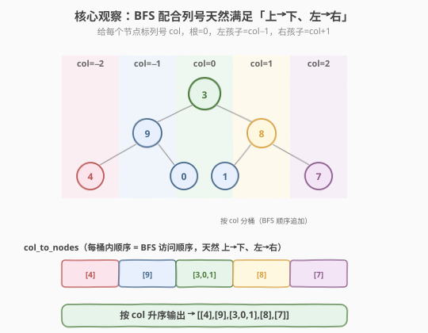
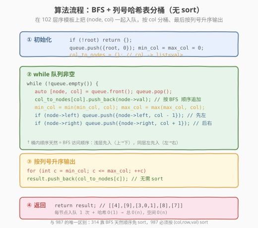
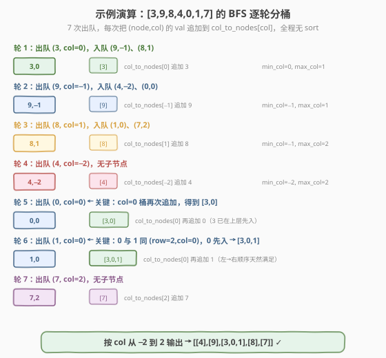

# 二叉树的垂直序遍历

- **题目名称**：二叉树的垂直序遍历
- **链接**：[314. Binary Tree Vertical Order Traversal](https://leetcode.cn/problems/binary-tree-vertical-order-traversal/)
- **难度**：中等
- **标签**：树、二叉树、广度优先搜索（BFS）、哈希表

## 1. 题目概述

给定一棵二叉树的根节点 `root`，返回其节点值的**垂直序遍历**（vertical order traversal）。

把根节点视作坐标 `(row=0, col=0)`，对每个节点 `node`：
- 其左孩子位于 `(row + 1, col - 1)`
- 其右孩子位于 `(row + 1, col + 1)`

遍历结果按**列号 `col` 从小到大**逐列输出；同一列内按**从上到下**（即 `row` 从小到大）排列；若多个节点处于**同一行同一列**，则按**从左到右**排列。

**示例 1**：

```text
输入：root = [3,9,20,null,null,15,7]
          3
         / \
        9  20
           / \
          15  7
输出：[[9],[3,15],[20],[7]]
解释：列 -1=[9]，列 0=[3,15]，列 1=[20]，列 2=[7]
```

**示例 2**：

```text
输入：root = [3,9,8,4,0,1,7]
          3
         / \
        9   8
       / \ / \
      4  0 1  7
输出：[[4],[9],[3,0,1],[8],[7]]
解释：列 -2=[4]，列 -1=[9]，列 0=[3,0,1]（同列同行：3 在上、0/1 在下层左→右），
      列 1=[8]，列 2=[7]
```

**示例 3**：

```text
输入：root = [3,9,8,4,0,1,7,null,null,null,2,5]
          3
         / \
        9   8
       / \ / \
      4  0 1  7
          | |
          2 5
输出：[[4],[9,5],[3,0,1],[8,2],[7]]
解释：节点 2 是 0 的右孩子（列 1），节点 5 是 1 的左孩子（列 -1）。
```

**约束条件**：

- 树中节点数目在范围 `[0, 100]` 内
- `0 <= Node.val <= 100`

> 💡 本题与 [987. 二叉树的垂序遍历](https://leetcode.cn/problems/vertical-order-traversal-of-a-binary-tree/) **题面相似但排序规则不同**：314 要求「同行同列按左右顺序」、不按节点值排序；987 要求「同行同列按节点值升序」。这一差异决定了 **314 用 BFS 天然满足排序，无需 sort**；而 987 必须显式 sort。面试中常把它们放在一起考察，用来检验你是否被「相似题」误导成照搬代码。

---

## 2. 解题思路

### 2.1 暴力思路：DFS 收集三元组后排序

最直觉的做法：DFS 遍历整棵树，对每个节点记录三元组 `(row, col, val)`，最后按自定义排序规则输出：

```text
dfs(node, row, col):
    if node == null: return
    triples.append((row, col, val))
    dfs(node.left,  row+1, col-1)
    dfs(node.right, row+1, col+1)

# 排序：先 col 升序，再 row 升序，最后 left_to_right（用 col 顺序无法表达同 row 同 col 的左右）
sort triples by (col, row, ???)
group by col -> output
```

DFS 能得到正确结果，但有两个痛点：

1. **「同行同列按左右顺序」无法用三元组直接表达**——`(row, col)` 完全相同的两个节点（如示例 3 中 0 的右孩子 2 与 1 的左孩子 5 在 `(row=2, col=1)` 处…等等，其实它们 col 不同），更典型的是示例 2 中 0 与 1 都在 `(row=2, col=0)`，左右关系需要额外编码（如记录入队次序）。
2. **排序成本 $O(n \log n)$**——但其实本题的顺序约束可以被遍历过程天然满足，不需要排序。

> ⚠️ DFS + sort 是 987 的标准解法（因为 987 要按 `val` 排序），但**直接套到 314 上是「过度解」**。314 的顺序约束（按列、按行、按左右）恰好是 **BFS 的天然访问顺序**——把 BFS 与列号绑定即可免去排序。

### 2.2 核心观察：BFS 天然满足「上→下、左→右」



把三种排序要求与 BFS 的性质对齐看：

| 排序要求 | BFS 是否天然满足？ | 原因 |
|----------|-------------------|------|
| 同列内 **上→下** | ✅ 满足 | BFS 按「层」从浅到深访问，浅层先入队先收集 |
| 同行同列 **左→右** | ✅ 满足 | BFS 在每个节点处**先入左孩子、再入右孩子**，同层内左节点先出队 |
| 列与列 **左→右** | ❌ 需整理 | BFS 按层而非按列输出；但只要把节点按 `col` 分桶存入哈希表，最后按列号升序输出即可 |

**关键洞察**：BFS 的访问顺序天然就是「先上层后下层、同层先左后右」——这与 314 对**单列内部**的排序要求**完全一致**。所以只需在 BFS 时多记一个 `col`，把节点值追加到 `col_to_nodes[col]` 末尾，**同一桶内的顺序即为所求**，无需任何 sort。

> ⚠️ 反观 987：它要求「同行同列按 `val` 升序」，BFS 的「左右顺序」与「`val` 大小」无关，所以 987 必须显式 sort。把这一区别想清楚，就能解释「为什么 314 用 BFS、987 用 DFS+sort」——不是风格偏好，而是排序约束本质不同。

### 2.3 算法流程图



维护变量：
- `queue`：BFS 队列，元素为 `(node, col)`
- `col_to_nodes`：哈希表 `col -> list[val]`，按 BFS 访问顺序追加
- `min_col / max_col`：记录出现过的最小/最大列号，用于最后按列输出

**主流程**：

1. 特判 `root == null`，返回空列表。
2. 初始化 `queue = [(root, 0)]`，`col_to_nodes = {}`，`min_col = max_col = 0`。
3. `while queue 非空`：
   1. `(node, col) = queue.pop_front()`
   2. `col_to_nodes[col].append(node.val)`（**按 BFS 顺序追加，桶内顺序天然正确**）
   3. 更新 `min_col = min(min_col, col)`、`max_col = max(max_col, col)`
   4. 若 `node.left` 非空：`queue.push_back((node.left, col - 1))`
   5. 若 `node.right` 非空：`queue.push_back((node.right, col + 1))`
4. 按 `col` 从 `min_col` 到 `max_col` 顺序，收集 `col_to_nodes[col]` 到结果列表返回。

> 💡 **入队顺序的硬要求**：必须**先左孩子、后右孩子**。若颠倒，同行同列的左右顺序就错了——因为同层中右节点会先入队先收集。BFS 模板的「左先于右」是本题正确性的根基，不能为了「优化」随意调换。

### 2.4 示例演算

以示例 2 的树 `[3,9,8,4,0,1,7]` 为例，BFS 逐层展开：



逐轮过程：

| 轮次 | 出队 `(node,col)` | 入队子节点 | `col_to_nodes` 变化 | min/max col |
|------|------------------|-----------|---------------------|-------------|
| 1 | `(3, 0)` | `(9,-1), (8,1)` | `0:[3]` | 0/0 → 0/1 |
| 2 | `(9, -1)` | `(4,-2), (0,0)` | `-1:[9]` | -1/1 |
| 3 | `(8, 1)` | `(1,0), (7,2)` | `1:[8]` | -1/2 |
| 4 | `(4, -2)` | （无） | `-2:[4]` | -2/2 |
| 5 | `(0, 0)` | （无） | `0:[3,0]`（追加 0） | -2/2 |
| 6 | `(1, 0)` | （无） | `0:[3,0,1]`（追加 1） | -2/2 |
| 7 | `(7, 2)` | （无） | `2:[7]` | -2/2 |

> ⚠️ **关键点看第 5、6 轮**：节点 `0` 和 `1` 都在 `(row=2, col=0)`。BFS 在第 2 轮先把 `(9,-1)` 出队并**先入左孩子 `(4,-2)` 再入右孩子 `(0,0)`**；第 3 轮把 `(8,1)` 出队并**先入 `(1,0)` 再入 `(7,2)`**。由于 `(9,-1)` 先于 `(8,1)` 出队，`(0,0)` 先于 `(1,0)` 入队，于是第 5 轮先收集 `0`、第 6 轮再收集 `1`——`col=0` 桶内得到 `[3, 0, 1]`，**左→右顺序天然满足**，无需任何 sort。

最终按 `col` 从 `-2` 到 `2` 收集：`[[4],[9],[3,0,1],[8],[7]]` ✓。

---

## 3. 参考代码

### C++（BFS + 哈希表分桶，$O(n)$ / $O(n)$）

```cpp
#include <vector>
#include <queue>
#include <unordered_map>
#include <algorithm>
using namespace std;

struct TreeNode {
    int val;
    TreeNode* left;
    TreeNode* right;
    TreeNode() : val(0), left(nullptr), right(nullptr) {}
    TreeNode(int x) : val(x), left(nullptr), right(nullptr) {}
    TreeNode(int x, TreeNode* l, TreeNode* r) : val(x), left(l), right(r) {}
};

class Solution {
  public:
    vector<vector<int>> verticalOrder(TreeNode* root) {
        vector<vector<int>> result;
        if (root == nullptr) return result;

        unordered_map<int, vector<int>> col_to_nodes;   // col -> 节点值列表
        queue<pair<TreeNode*, int>> q;                   // (node, col)
        q.push({root, 0});

        int min_col = 0, max_col = 0;

        while (!q.empty()) {
            auto [node, col] = q.front(); q.pop();
            col_to_nodes[col].push_back(node.val);      // 按 BFS 顺序追加，桶内天然有序
            min_col = min(min_col, col);
            max_col = max(max_col, col);
            if (node->left)  q.push({node->left,  col - 1});   // 先左
            if (node->right) q.push({node->right, col + 1});   // 后右
        }

        for (int c = min_col; c <= max_col; ++c)        // 按列号升序输出
            result.push_back(col_to_nodes[c]);
        return result;
    }
};
```

### Python

```python
from collections import deque, defaultdict


class Solution:
    def verticalOrder(self, root: TreeNode | None) -> list[list[int]]:
        result: list[list[int]] = []
        if not root:
            return result

        col_to_nodes: dict[int, list[int]] = defaultdict(list)
        queue: deque[tuple[TreeNode, int]] = deque([(root, 0)])
        min_col = max_col = 0

        while queue:
            node, col = queue.popleft()
            col_to_nodes[col].append(node.val)          # 按 BFS 顺序追加，桶内天然有序
            min_col = min(min_col, col)
            max_col = max(max_col, col)
            if node.left:
                queue.append((node.left, col - 1))      # 先左
            if node.right:
                queue.append((node.right, col + 1))     # 后右

        return [col_to_nodes[c] for c in range(min_col, max_col + 1)]
```

> 💡 两种写法几乎一一对应。C++ 用 `unordered_map<int, vector<int>>`，最后按 `min_col..max_col` 顺序遍历输出；Python 用 `defaultdict(list)` 更省一行。**不要**用 `dict` 且不预初始化，否则 `col_to_nodes[c]` 会抛 `KeyError`；`defaultdict` 或 `setdefault` 是规范做法。

---

## 4. 复杂度分析

| 维度 | 复杂度 | 说明 |
|------|--------|------|
| **时间复杂度** | $O(n)$ | 每个节点入队/出队各 1 次，哈希表插入 $O(1)$；最后按列号区间遍历，区间长度 $\le 2h+1 \le n$，总开销 $O(n)$。**无排序**是 $O(n)$ 的关键 |
| **空间复杂度** | $O(n)$ | 队列最多存一层节点（满二叉树最底层 $\approx n/2$）；哈希表存全部 $n$ 个值；结果数组同样 $n$ |

> ⚠️ 与 DFS+sort 的对比：DFS+sort 时间 $O(n \log n)$（排序主导）、空间 $O(n)$（三元组数组 + 递归栈）。本题用 BFS 把排序开销 $O(n \log n) \to O(n)$ 省下来，是「排序约束可被遍历顺序天然满足」时的典型优化范式。

---

## 5. 扩展：与 987 的对比与统一写法

314 与 987 题面几乎一致，唯一差异是「同行同列时如何排」：

| 题目 | 同行同列排序依据 | 是否可用 BFS 免 sort | 推荐解法 |
|------|------------------|----------------------|----------|
| **314** | **左右顺序**（左先于右） | ✅ BFS 天然满足 | BFS + 列号分桶 |
| **987** | **节点值升序** | ❌ BFS 左右与 `val` 无关 | DFS 收集 `(row, col, val)` + sort |

987 的标准写法：

```python
class Solution:
    def verticalTraversal(self, root: TreeNode | None) -> list[list[int]]:
        triples: list[tuple[int, int, int]] = []

        def dfs(node: TreeNode | None, row: int, col: int) -> None:
            if not node:
                return
            triples.append((col, row, node.val))
            dfs(node.left,  row + 1, col - 1)
            dfs(node.right, row + 1, col + 1)

        dfs(root, 0, 0)
        triples.sort()                       # (col, row, val) 字典序即为所求

        result: list[list[int]] = []
        cur_col = None
        for col, row, val in triples:
            if col != cur_col:
                result.append([])
                cur_col = col
            result[-1].append(val)
        return result
```

> 💡 **统一心法**：判断「能否用 BFS 免 sort」的判据是——**排序键里是否包含「遍历顺序能天然给出的量」之外的维度**。314 的排序键是 `(col, row, 左右顺序)`，三者都能被 BFS 的「层 + 入队次序」表达；987 多了 `val`，BFS 给不了，只能 sort。这一判据同样适用于其他「按某种坐标遍历」的题。

---

## 6. 面试要点

1. **314 和 987 的核心区别是什么？**

   - 314 要求「同行同列按**左右顺序**」，987 要求「按**节点值升序**」。前者可被 BFS 的访问顺序天然满足（同层先左后右），后者必须显式 sort。所以 314 是 $O(n)$，987 是 $O(n \log n)$。面试常把二者并列，用来检验你是否会被「相似题面」误导而照搬 987 的 sort 解法。

2. **为什么 BFS 能保证「同列内上→下」？**

   - BFS 是**逐层**访问的——浅层节点先入队先出队先收集。同一列中的节点必然分布在不同的层（同一列同行只可能是左右兄弟等少数情况），浅层的先被追加进桶，因此桶内顺序天然是 `row` 升序，即「上→下」。

3. **为什么必须「先入左孩子、再入右孩子」？**

   - 「同行同列左→右」的顺序正是靠入队次序保证的：同一层的兄弟节点 `(row, col)` 相同时，左孩子先入队则先被收集。若颠倒入队顺序，桶内左右顺序就反了。这是 BFS 模板的硬约定，不可为「优化」随意调整。

4. **不用哈希表行不行？比如用数组 + 偏移？**

   - 可以。先 DFS 一次求出 `min_col`，把列号偏移到 $\ge 0$ 后用 `vector<vector<int>> cols(2*h+1)` 替代哈希表。但哈希表更直观且 $O(1)$ 平均插入；数组法在列范围已知且紧凑时更省常数。面试中哈希表完全够用，数组偏移可作为追问时的「优化版」。

5. **如果树退化为链（全左子或全右子），复杂度会退化吗？**

   - 不会。时间仍是 $O(n)$——每个节点入队出队各一次。空间上队列最多存 1 个节点（链状树每层只有一个节点），哈希表存 $n$ 个值，总 $O(n)$。退化链反而是 BFS 空间最省的情况（满二叉树才最耗队列空间）。

> 💡 **一句话总结**：314 的灵魂是「**BFS 的天然顺序即所求顺序**」——把 `(node, col)` 一起入队、按列分桶、最后按列号升序输出，全程无 sort。能想清楚「为什么 314 不用 sort 而 987 必须 sort」，这道题就吃透了。

---

## 7. 同类练习题

- [987. 二叉树的垂序遍历](https://leetcode.cn/problems/vertical-order-traversal-of-a-binary-tree/)：题面几乎一致，但同行同列按 `val` 升序，必须 DFS+sort；对比理解「何时能免 sort」
- [102. 二叉树的层序遍历](https://leetcode.cn/problems/binary-tree-level-order-traversal/)（[题解](../0101-0200/102_二叉树的层序遍历.md)）：BFS 层序模板母题，本题在其骨架上多记一个 `col` 而已
- [103. 二叉树的锯齿形层序遍历](https://leetcode.cn/problems/binary-tree-zigzag-level-order-traversal/)（[题解](../0101-0200/103_二叉树的锯齿形层序遍历.md)）：BFS 模板的另一变体，对比「方向标志」与「列号分桶」两种对 BFS 的最小扩展
- [199. 二叉树的右视图](https://leetcode.cn/problems/binary-tree-right-side-view/)：BFS 每层只取最右节点，仍是同一骨架的「按层筛选」变体
- [662. 二叉树最大宽度](https://leetcode.cn/problems/maximum-width-of-binary-tree/)（[题解](../0601-0700/662_二叉树最大宽度.md)）：同样给每个节点编号（`col`），BFS 逐层算首尾编号差，与本题共用「节点带坐标入队」的思路
